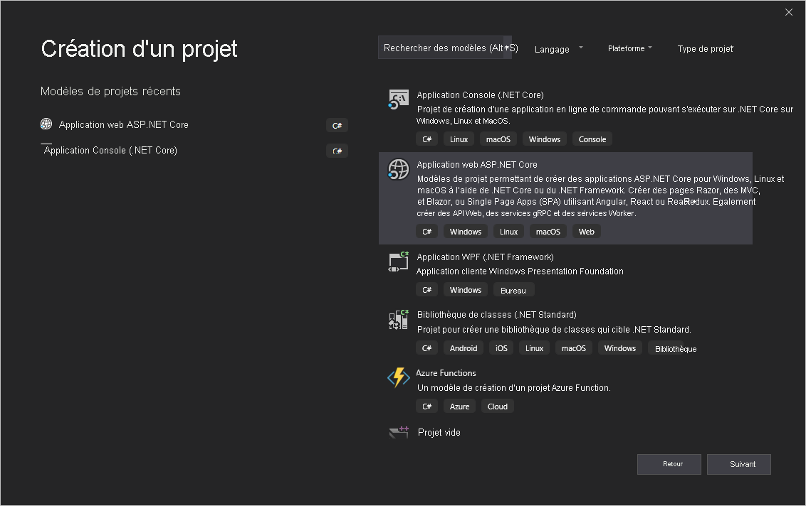
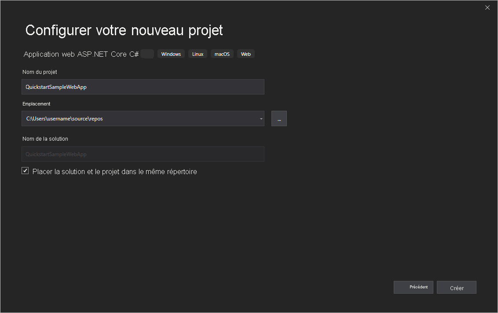
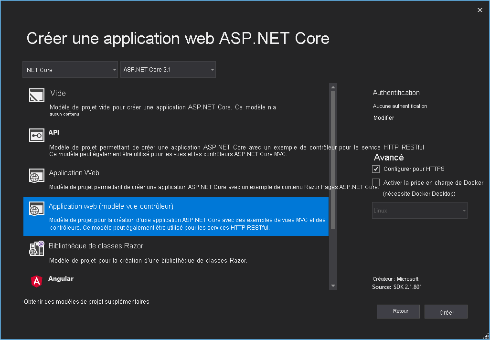
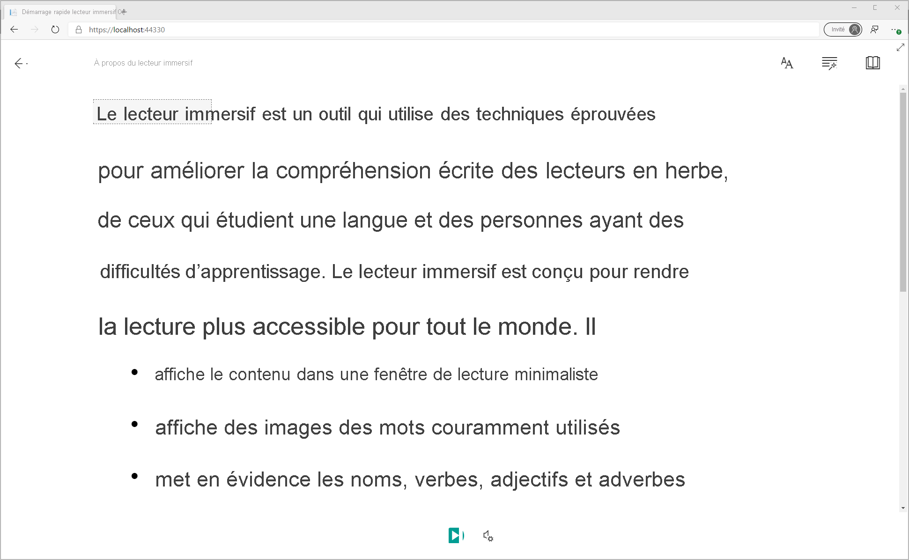

Le [Lecteur immersif](https://www.onenote.com/learningtools) est un outil qui permet d’implémenter des techniques éprouvées pour améliorer la compréhension dans le cadre de l’apprentissage de la lecture, l’apprentissage d’une langue et pour les personnes avec des difficultés d’apprentissage, comme la dyslexie. Vous pouvez utiliser le Lecteur immersif dans vos applications pour isoler du texte afin d’améliorer le focus, afficher des images pour les mots couramment utilisés, mettre en évidence des parties d’un discours, lire le texte sélectionné à voix haute, traduire des mots et des expressions en temps réel, etc.

Dans ce guide de démarrage rapide, vous allez créer une application web en partant de zéro et intégrer le Lecteur immersif à l’aide de la bibliothèque de client Lecteur immersif. Un exemple complet et fonctionnel de ce guide de démarrage rapide est disponible [sur GitHub](https://github.com/microsoft/immersive-reader-sdk/tree/master/js/samples/quickstart-csharp).

## <a name="prerequisites"></a>Prérequis

* Abonnement Azure - [En créer un gratuitement](https://azure.microsoft.com/free/cognitive-services)
* [Visual Studio 2019](https://visualstudio.microsoft.com/downloads)
* Une ressource Lecteur immersif configurée pour l’authentification Azure Active Directory. Suivez [ces instructions](../../how-to-create-immersive-reader.md) pour la configurer. Vous aurez besoin de certaines des valeurs créées ici lors de la configuration des propriétés de l’exemple de projet. Enregistrez la sortie de votre session dans un fichier texte pour référence ultérieure.

## <a name="create-a-web-app-project"></a>Créer un projet d’application web

Créez un projet dans Visual Studio à l’aide du modèle d’application web ASP.NET Core avec modèle-vue-contrôleur intégré, et ASP.NET Core 2.1. Nommez le projet « QuickstartSampleWebApp ».







## <a name="set-up-authentication"></a>Configurer l’authentification

### <a name="configure-authentication-values"></a>Configurer les valeurs d’authentification

Cliquez avec le bouton droit sur le projet dans _l’Explorateur de solutions_ et choisissez **Gérer les données secrètes de l’utilisateur**. Cela ouvrira un fichier appelé _secrets.json_. Ce fichier n’est pas archivé dans le contrôle de code source. En savoir plus [ici](/aspnet/core/security/app-secrets?tabs=windows). Remplacez le contenu du fichier _secrets.json_ par le code suivant, en indiquant les valeurs fournies au moment de la création de votre ressource Lecteur immersif.

```json
{
  "TenantId": "YOUR_TENANT_ID",
  "ClientId": "YOUR_CLIENT_ID",
  "ClientSecret": "YOUR_CLIENT_SECRET",
  "Subdomain": "YOUR_SUBDOMAIN"
}
```

### <a name="install-active-directory-nuget-package"></a>Installer un package NuGet Active Directory

Le code ci-dessous utilise des objets du package NuGet **Microsoft.IdentityModel.Clients.ActiveDirectory**. Vous devez donc ajouter une référence à ce package dans votre projet.

Ouvrez la console du Gestionnaire de package NuGet dans **Outils -> Gestionnaire de package NuGet -> Console du Gestionnaire de package** et exécutez cette commande :

```powershell
    Install-Package Microsoft.IdentityModel.Clients.ActiveDirectory -Version 5.2.0
```

### <a name="update-the-controller-to-acquire-the-token"></a>Mettre à jour le contrôleur pour obtenir le jeton 

Ouvrez _Controllers\HomeController.cs_, puis ajoutez le code suivant après les instructions _using_ en haut du fichier.

```csharp
using Microsoft.IdentityModel.Clients.ActiveDirectory;
```

Maintenant, nous allons configurer le contrôleur pour obtenir les valeurs Azure AD du fichier _secrets.json_. En haut de la classe _HomeController_, après ```public class HomeController : Controller {```, ajoutez le code suivant.

```csharp
private readonly string TenantId;     // Azure subscription TenantId
private readonly string ClientId;     // Azure AD ApplicationId
private readonly string ClientSecret; // Azure AD Application Service Principal password
private readonly string Subdomain;    // Immersive Reader resource subdomain (resource 'Name' if the resource was created in the Azure portal, or 'CustomSubDomain' option if the resource was created with Azure CLI Powershell. Check the Azure portal for the subdomain on the Endpoint in the resource Overview page, for example, 'https://[SUBDOMAIN].cognitiveservices.azure.com/')

public HomeController(Microsoft.Extensions.Configuration.IConfiguration configuration)
{
    TenantId = configuration["TenantId"];
    ClientId = configuration["ClientId"];
    ClientSecret = configuration["ClientSecret"];
    Subdomain = configuration["Subdomain"];

    if (string.IsNullOrWhiteSpace(TenantId))
    {
        throw new ArgumentNullException("TenantId is null! Did you add that info to secrets.json?");
    }

    if (string.IsNullOrWhiteSpace(ClientId))
    {
        throw new ArgumentNullException("ClientId is null! Did you add that info to secrets.json?");
    }

    if (string.IsNullOrWhiteSpace(ClientSecret))
    {
        throw new ArgumentNullException("ClientSecret is null! Did you add that info to secrets.json?");
    }

    if (string.IsNullOrWhiteSpace(Subdomain))
    {
        throw new ArgumentNullException("Subdomain is null! Did you add that info to secrets.json?");
    }
}

/// <summary>
/// Get an Azure AD authentication token
/// </summary>
private async Task<string> GetTokenAsync()
{
    string authority = $"https://login.windows.net/{TenantId}";
    const string resource = "https://cognitiveservices.azure.com/";

    AuthenticationContext authContext = new AuthenticationContext(authority);
    ClientCredential clientCredential = new ClientCredential(ClientId, ClientSecret);

    AuthenticationResult authResult = await authContext.AcquireTokenAsync(resource, clientCredential);

    return authResult.AccessToken;
}

[HttpGet]
public async Task<JsonResult> GetTokenAndSubdomain()
{
    try
    {
        string tokenResult = await GetTokenAsync();

        return new JsonResult(new { token = tokenResult, subdomain = Subdomain });
    }
    catch (Exception e)
    {
        string message = "Unable to acquire Azure AD token. Check the debugger for more information.";
        Debug.WriteLine(message, e);
        return new JsonResult(new { error = message });
    }
}
```

## <a name="add-sample-content"></a>Ajouter un contenu exemple
Tout d’abord, ouvrez _Views\Shared\Layout.cshtml_. Avant la ligne ```</head>```, ajoutez le code suivant :

```html
@RenderSection("Styles", required: false)
```

Maintenant, nous allons ajouter un exemple de contenu à cette application web. Ouvrez _Views\Home\Index.cshtml_ et remplacez tout le code généré automatiquement par cet exemple :

```html
@{
    ViewData["Title"] = "Immersive Reader C# Quickstart";
}

@section Styles {
    <style type="text/css">
        .immersive-reader-button {
            background-color: white;
            margin-top: 5px;
            border: 1px solid black;
            float: right;
        }
    </style>
}

<div class="container">
    <button class="immersive-reader-button" data-button-style="iconAndText" data-locale="en"></button>

    <h1 id="ir-title">About Immersive Reader</h1>
    <div id="ir-content" lang="en-us">
        <p>
            Immersive Reader is a tool that implements proven techniques to improve reading comprehension for emerging readers, language learners, and people with learning differences.
            The Immersive Reader is designed to make reading more accessible for everyone. The Immersive Reader
            <ul>
                <li>
                    Shows content in a minimal reading view
                </li>
                <li>
                    Displays pictures of commonly used words
                </li>
                <li>
                    Highlights nouns, verbs, adjectives, and adverbs
                </li>
                <li>
                    Reads your content out loud to you
                </li>
                <li>
                    Translates your content into another language
                </li>
                <li>
                    Breaks down words into syllables
                </li>
            </ul>
        </p>
        <h3>
            The Immersive Reader is available in many languages.
        </h3>
        <p lang="es-es">
            El Lector inmersivo está disponible en varios idiomas.
        </p>
        <p lang="zh-cn">
            沉浸式阅读器支持许多语言
        </p>
        <p lang="de-de">
            Der plastische Reader ist in vielen Sprachen verfügbar.
        </p>
        <p lang="ar-eg" dir="rtl" style="text-align:right">
            يتوفر \"القارئ الشامل\" في العديد من اللغات.
        </p>
    </div>
</div>
```

Notez que tout le texte a un attribut **lang** qui décrit les langues du texte. Cet attribut aide le Lecteur immersif à fournir des fonctionnalités de langue et de grammaire pertinentes.

## <a name="add-javascript-to-handle-launching-immersive-reader"></a>Ajouter JavaScript pour gérer le lancement du Lecteur immersif

La bibliothèque du Lecteur immersif fournit des fonctionnalités telles que le lancement du Lecteur immersif et l’affichage des boutons du Lecteur immersif. En savoir plus [ici](../../reference.md).

En bas du fichier _Views\Home\Index.cshtml_, ajoutez le code suivant :

```html
@section Scripts
{
    <script src="https://contentstorage.onenote.office.net/onenoteltir/immersivereadersdk/immersive-reader-sdk.1.0.0.js"></script>
    <script>
        function getTokenAndSubdomainAsync() {
            return new Promise(function (resolve, reject) {
                $.ajax({
                    url: "@Url.Action("GetTokenAndSubdomain", "Home")",
                    type: "GET",
                    success: function (data) {
                        if (data.error) {
                            reject(data.error);
                        } else {
                            resolve(data);
                        }
                    },
                    error: function (err) {
                        reject(err);
                    }
                });
            });
        }
    
        $(".immersive-reader-button").click(function () {
            handleLaunchImmersiveReader();
        });
    
        function handleLaunchImmersiveReader() {
            getTokenAndSubdomainAsync()
                .then(function (response) {
                    const token = response["token"];
                    const subdomain = response["subdomain"];
    
                    // Learn more about chunk usage and supported MIME types https://docs.microsoft.com/en-us/azure/cognitive-services/immersive-reader/reference#chunk
                    const data = {
                        title: $("#ir-title").text(),
                        chunks: [{
                            content: $("#ir-content").html(),
                            mimeType: "text/html"
                        }]
                    };
    
                    // Learn more about options https://docs.microsoft.com/en-us/azure/cognitive-services/immersive-reader/reference#options
                    const options = {
                        "onExit": exitCallback,
                        "uiZIndex": 2000
                    };
    
                    ImmersiveReader.launchAsync(token, subdomain, data, options)
                        .catch(function (error) {
                            alert("Error in launching the Immersive Reader. Check the console.");
                            console.log(error);
                        });
                })
                .catch(function (error) {
                    alert("Error in getting the Immersive Reader token and subdomain. Check the console.");
                    console.log(error);
                });
        }
    
        function exitCallback() {
            console.log("This is the callback function. It is executed when the Immersive Reader closes.");
        }
    </script>
}
```

## <a name="build-and-run-the-app"></a>Générer et exécuter l’application

Dans la barre de menus, sélectionnez **Déboguer > Démarrer le débogage**, ou appuyez sur **F5** pour démarrer l’application.

Dans votre navigateur, vous devriez voir :


## <a name="launch-the-immersive-reader"></a>Lancer le Lecteur immersif

Lorsque vous cliquez sur le bouton « Lecteur immersif », vous verrez le lecteur immersif lancé avec le contenu de la page.



## <a name="next-steps"></a>Étapes suivantes

> [!div class="nextstepaction"]
> [Créer une ressource et configurer AAD](../../how-to-create-immersive-reader.md)