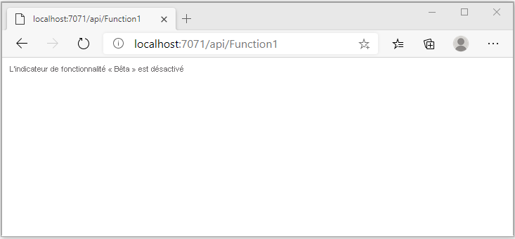
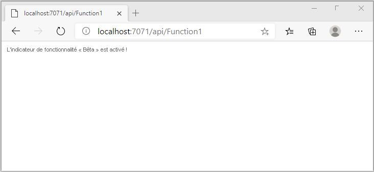

# <a name="quickstart-add-feature-flags-to-an-azure-functions-app"></a>Démarrage rapide : Ajouter des indicateurs de fonctionnalités à une application Azure Functions

Dans ce guide de démarrage rapide, vous allez créer une application Azure Functions et y ajouter des indicateurs de fonctionnalités. Vous utiliserez la gestion des fonctionnalités d’Azure App Configuration pour stocker de manière centralisée tous les indicateurs de fonctionnalités et contrôler leurs états.

Les bibliothèques de gestion des fonctionnalités .NET étendent le framework avec une prise en charge des indicateurs de fonctionnalités. Ces bibliothèques sont basées sur le système de configuration de .NET. Elles s’intègrent à App Configuration par le biais de son fournisseur de configuration .NET.

## <a name="prerequisites"></a>Prérequis

- Abonnement Azure : [créez-en un gratuitement](https://azure.microsoft.com/free/)
- [Visual Studio 2019](https://visualstudio.microsoft.com/vs) avec la charge de travail **Développement Azure**
- [Outils Azure Functions](../azure-functions/functions-develop-vs.md#check-your-tools-version)

## <a name="create-an-app-configuration-store"></a>Créer un magasin App Configuration

[!INCLUDE [azure-app-configuration-create](../../includes/azure-app-configuration-create.md)]

7. Sélectionnez **Gestionnaire de fonctionnalités** >  **+Ajouter** pour ajouter un indicateur de fonctionnalité appelé `Beta`.

    > [!div class="mx-imgBorder"]
    > 

    Laissez `label` et `Description` non définis pour le moment.

8. Sélectionnez **Appliquer** pour enregistrer le nouvel indicateur de fonctionnalité.

## <a name="create-a-functions-app"></a>Créer une application Functions

[!INCLUDE [Create a project using the Azure Functions template](../../includes/functions-vstools-create.md)]

## <a name="connect-to-an-app-configuration-store"></a>Se connecter à un magasin App Configuration

Ce projet utilise l’[injection de dépendances dans .NET Azure Functions](../azure-functions/functions-dotnet-dependency-injection.md). Il ajoute Azure App Configuration comme source de configuration supplémentaire où sont stockés vos indicateurs de fonctionnalités.

1. Cliquez avec le bouton droit sur votre projet, puis sélectionnez **Gérer les packages NuGet**. Sous l’onglet **Parcourir**, recherchez les packages NuGet suivants et ajoutez-les à votre projet.
   - [Microsoft.Extensions.Configuration.AzureAppConfiguration](https://www.nuget.org/packages/Microsoft.Extensions.Configuration.AzureAppConfiguration/) version 4.1.0 ou ultérieure
   - [Microsoft.FeatureManagement](https://www.nuget.org/packages/Microsoft.FeatureManagement/) version 2.2.0 ou ultérieure
   - [Microsoft.Azure.Functions.Extensions](https://www.nuget.org/packages/Microsoft.Azure.Functions.Extensions/) version 1.1.0 ou ultérieure 

2. Ajoutez un nouveau fichier, *Startup.cs*, avec le code suivant. Il définit une classe nommée `Startup` qui implémente la classe abstraite `FunctionsStartup`. Un attribut d’assembly est utilisé pour spécifier le nom du type utilisé durant le démarrage d’Azure Functions.

    ```csharp
    using System;
    using Microsoft.Azure.Functions.Extensions.DependencyInjection;
    using Microsoft.Extensions.Configuration;
    using Microsoft.FeatureManagement;

    [assembly: FunctionsStartup(typeof(FunctionApp.Startup))]

    namespace FunctionApp
    {
        class Startup : FunctionsStartup
        {
            public override void ConfigureAppConfiguration(IFunctionsConfigurationBuilder builder)
            {
            }

            public override void Configure(IFunctionsHostBuilder builder)
            {
            }
        }
    }
    ```


3. Mettez à jour la méthode `ConfigureAppConfiguration` et ajoutez le fournisseur Azure App Configuration comme source de configuration supplémentaire en appelant `AddAzureAppConfiguration()`. 

   La méthode `UseFeatureFlags()` indique au fournisseur de charger les indicateurs de fonctionnalités. Tous les indicateurs de fonctionnalités étant par défaut mis en cache pendant 30 secondes, les éventuelles modifications ne sont détectées qu’au terme de ce délai. Vous pouvez changer cet intervalle d’expiration en définissant la propriété `FeatureFlagsOptions.CacheExpirationInterval` passée à la méthode `UseFeatureFlags`. 

    ```csharp
    public override void ConfigureAppConfiguration(IFunctionsConfigurationBuilder builder)
    {
        builder.ConfigurationBuilder.AddAzureAppConfiguration(options =>
        {
            options.Connect(Environment.GetEnvironmentVariable("ConnectionString"))
                   .Select("_")
                   .UseFeatureFlags();
        });
    }
    ```
   > [!TIP]
   > Si vous souhaitez limiter les configurations chargées dans votre application aux indicateurs de fonctionnalités, vous pouvez appeler `Select("_")` pour charger uniquement une clé factice « _ » non existante. Par défaut, toutes les valeurs de clé de configuration dans votre magasin App Configuration sont chargées si aucune méthode `Select` n’est appelée.

4. Mettez à jour la méthode `Configure` pour rendre le gestionnaire de fonctionnalités et les services Azure App Configuration accessibles par le biais de l’injection de dépendances.

    ```csharp
    public override void Configure(IFunctionsHostBuilder builder)
    {
        builder.Services.AddAzureAppConfiguration();
        builder.Services.AddFeatureManagement();
    }
    ```

5. Ouvrez *Function1.cs* et ajoutez les espaces de noms suivants.

    ```csharp
    using System.Linq;
    using Microsoft.FeatureManagement;
    using Microsoft.Extensions.Configuration.AzureAppConfiguration;
    ```

   Ajoutez un constructeur utilisé pour obtenir des instances de `_featureManagerSnapshot` et `IConfigurationRefresherProvider` par le biais de l’injection de dépendances. Vous pouvez obtenir l’instance de `IConfigurationRefresher` à partir de `IConfigurationRefresherProvider`.

    ```csharp
    private readonly IFeatureManagerSnapshot _featureManagerSnapshot;
    private readonly IConfigurationRefresher _configurationRefresher;

    public Function1(IFeatureManagerSnapshot featureManagerSnapshot, IConfigurationRefresherProvider refresherProvider)
    {
        _featureManagerSnapshot = featureManagerSnapshot;
        _configurationRefresher = refresherProvider.Refreshers.First();
    }
    ```

6. Mettez à jour la méthode `Run` pour changer la valeur du message affiché en fonction de l’état de l’indicateur de fonctionnalité.

   La méthode `TryRefreshAsync` est appelée au début de l’appel Functions pour actualiser les indicateurs de fonctionnalités. Aucune opération n’est effectuée si la fenêtre de délai d’expiration du cache n’est pas atteinte. Supprimez l’opérateur `await` si vous préférez que les indicateurs de fonctionnalité soient actualisés sans bloquer l’appel Functions en cours. Dans ce cas, les appels Functions ultérieurs obtiendront une valeur mise à jour.

    ```csharp
    [FunctionName("Function1")]
    public async Task<IActionResult> Run(
        [HttpTrigger(AuthorizationLevel.Anonymous, "get", "post", Route = null)] HttpRequest req,
        ILogger log)
    {
        log.LogInformation("C# HTTP trigger function processed a request.");

        await _configurationRefresher.TryRefreshAsync();

        string message = await _featureManagerSnapshot.IsEnabledAsync("Beta")
                ? "The Feature Flag 'Beta' is turned ON"
                : "The Feature Flag 'Beta' is turned OFF";

        return (ActionResult)new OkObjectResult(message);
    }
    ```

## <a name="test-the-function-locally"></a>Tester la fonction en local

1. Définissez une variable d’environnement nommée **ConnectionString**, où la valeur est la chaîne de connexion que vous avez récupérée précédemment dans votre magasin App Configuration sous **Clés d’accès**. Si vous utilisez l’invite de commandes Windows, exécutez la commande suivante et redémarrez l’invite pour que la modification soit prise en compte :

    ```cmd
        setx ConnectionString "connection-string-of-your-app-configuration-store"
    ```

    Si vous utilisez Windows PowerShell, exécutez la commande suivante :

    ```azurepowershell
        $Env:ConnectionString = "connection-string-of-your-app-configuration-store"
    ```

    Si vous utilisez macOS ou Linux, exécutez la commande suivante :

    ```bash
        export ConnectionString='connection-string-of-your-app-configuration-store'
    ```

1. Appuyez sur F5 pour tester votre fonction. Si vous y êtes invité, acceptez la requête dans Visual Studio pour télécharger et installer **Azure Functions Core (CLI) Tools**. Vous devrez peut-être aussi activer une exception de pare-feu afin de permettre aux outils de prendre en charge les requêtes HTTP.

1. Copiez l’URL de votre fonction à partir de la sortie runtime Azure Functions.

    

1. Collez l’URL de la demande HTTP dans la barre d’adresses de votre navigateur. L’illustration suivante montre la réponse signalant que l’indicateur de fonctionnalité `Beta` est désactivé. 

    

1. Connectez-vous au [portail Azure](https://portal.azure.com). Sélectionnez **Toutes les ressources**, puis le magasin App Configuration que vous avez créé.

1. Sélectionnez **Gestionnaire de fonctionnalités**, puis remplacez l'état de la clé **Beta** par **Activé**.

1. Actualisez le navigateur à plusieurs reprises. Quand l’indicateur de fonctionnalité mis en cache expire au bout de 30 secondes, la page doit changer pour signaler que l’indicateur de fonctionnalité `Beta` est activé, comme dans l’image ci-dessous.
 
    

> [!NOTE]
> Vous pouvez télécharger l’exemple de code utilisé dans ce tutoriel à partir du [dépôt GitHub Azure App Configuration](https://github.com/Azure/AppConfiguration/tree/master/examples/DotNetCore/AzureFunction)

## <a name="clean-up-resources"></a>Nettoyer les ressources

[!INCLUDE [azure-app-configuration-cleanup](../../includes/azure-app-configuration-cleanup.md)]

## <a name="next-steps"></a>Étapes suivantes

Dans ce guide de démarrage rapide, vous avez créé un indicateur de fonctionnalité que vous avez utilisé avec une application Azure Functions par l’intermédiaire de la bibliothèque [Microsoft.FeatureManagement](/dotnet/api/microsoft.featuremanagement).

- En savoir plus sur la [gestion des fonctionnalités](./concept-feature-management.md)
- [Gérer les indicateurs de fonctionnalité](./manage-feature-flags.md)
- [Utiliser des indicateurs de fonctionnalité conditionnels](./howto-feature-filters-aspnet-core.md)
- [Activer le déploiement échelonné des fonctionnalités pour des audiences ciblées](./howto-targetingfilter-aspnet-core.md)
- [Utiliser la configuration dynamique dans une application Azure Functions](./enable-dynamic-configuration-azure-functions-csharp.md)