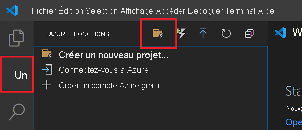

# Démarrage rapide : Créer une fonction dans Azure avec TypeScript à l’aide de Visual Studio Code

[!INCLUDE [functions-language-selector-quickstart-vs-code](../../includes/functions-language-selector-quickstart-vs-code.md)]

Dans cet article, vous allez utiliser Visual Studio Code pour créer une fonction TypeScript qui répond aux requêtes HTTP. Après avoir testé le code localement, vous le déployez dans l’environnement serverless d’Azure Functions.

Le fait de suivre ce guide de démarrage rapide entraîne une petite dépense de quelques cents USD tout au plus dans votre compte Azure. 

Il existe également une [version basée sur l’interface CLI](create-first-function-cli-typescript.md) de cet article.

## Configurer votre environnement

Avant de commencer, veillez à disposer des éléments suivants :

+ Compte Azure avec un abonnement actif. [Créez un compte gratuitement](https://azure.microsoft.com/free/?ref=microsoft.com&utm_source=microsoft.com&utm_medium=docs&utm_campaign=visualstudio).

+ [Node.js](https://nodejs.org/), Active LTS et Maintenance LTS (version 10.14.1 recommandée). Utilisez la commande `node --version` pour vérifier la version que vous utilisez.  

+ [Visual Studio Code](https://code.visualstudio.com/) sur l’une des [plateformes prises en charge](https://code.visualstudio.com/docs/supporting/requirements#_platforms).

+ [Extension Azure Functions](https://marketplace.visualstudio.com/items?itemName=ms-azuretools.vscode-azurefunctions) pour Visual Studio Code.

## Créer votre projet local

Dans cette section, vous utilisez Visual Studio Code pour créer un projet Azure Functions local en TypeScript. Plus loin dans cet article, vous allez publier votre code de fonction sur Azure. 

1. Choisissez l’icône Azure dans la barre d’activité, puis dans la zone **Azure : Fonctions**, sélectionnez l’icône **Créer un projet**.

    

1. Choisissez un emplacement de répertoire pour votre espace de travail de projet et optez pour **Sélectionner**.

    > [!NOTE]
    > Ces étapes ont été conçues pour être terminées en dehors d’un espace de travail. Dans ce cas, ne sélectionnez pas de dossier de projet qui fait partie d’un espace de travail.

1. Quand vous y êtes invité, indiquez les informations suivantes :

    + **Sélectionner un langage pour votre projet de fonction** : Choisissez `TypeScript`.

    + **Sélectionner un modèle pour la première fonction de votre projet** : Choisissez `HTTP trigger`.

    + **Fournir un nom de fonction** : Tapez `HttpExample`.

    + **Niveau d’autorisation** : Choisissez l’option `Anonymous`, qui permet à quiconque d’appeler le point de terminaison de votre fonction. Pour en savoir plus sur le niveau d’autorisation, consultez [Clés d’autorisation](functions-bindings-http-webhook-trigger.md#authorization-keys).

    + **Sélectionner la façon dont vous souhaitez ouvrir votre projet** : Choisissez `Add to workspace`.

1. À l’aide de ces informations, Visual Studio Code génère un projet Azure Functions avec un déclencheur HTTP. Vous pouvez voir les fichiers de projet locaux dans l’Explorateur. Pour en savoir plus sur les fichiers créés, consultez [Fichiers projet générés](functions-develop-vs-code.md#generated-project-files). 

[!INCLUDE [functions-run-function-test-local-vs-code](../../includes/functions-run-function-test-local-vs-code.md)]

Après avoir vérifié que la fonction s’exécute correctement sur votre ordinateur local, il est temps d’utiliser Visual Studio Code pour publier le projet directement sur Azure.

[!INCLUDE [functions-sign-in-vs-code](../../includes/functions-sign-in-vs-code.md)]

## Publication du projet sur Azure

Dans cette section, vous créez une application de fonction et les ressources associées dans votre abonnement Azure, puis vous déployez votre code.

> [!IMPORTANT]
> La publication sur une application de fonction existante remplace le contenu de cette application dans Azure. 

1. Choisissez l’icône Azure dans la barre d’activité, puis dans la zone **Azure : Fonctions**, choisissez le bouton **Déployer sur une application de fonction**.

    

1. Quand vous y êtes invité, indiquez les informations suivantes :

    + **Sélectionnez le dossier** : choisissez un dossier dans votre espace de travail ou accédez à un dossier qui contient votre application de fonction. Vous ne verrez pas ceci si vous avez déjà ouvert une application de fonction valide.

    + **Sélectionnez l’abonnement** : choisissez l’abonnement à utiliser. Vous ne verrez pas ceci si vous n’avez qu’un seul abonnement.

    + **Sélectionnez une application de fonction dans Azure** : Choisissez `+ Create new Function App`. (Ne choisissez pas l’option `Advanced`, qui n’est pas abordée dans cet article.)

    + **Entrer un nom global unique pour l’application de fonction** : Tapez un nom valide dans un chemin d’URL. Le système vérifie que le nom que vous tapez est unique dans Azure Functions. 

    + **Sélectionnez un runtime** : Choisissez la version de Node.js que vous avez exécutée localement. Vous pouvez utiliser la commande `node --version` pour vérifier votre version.

    + **Sélectionnez un emplacement pour les nouvelles ressources** :  Pour de meilleures performances, choisissez une [région](https://azure.microsoft.com/regions/) proche de vous.

    L’extension montre l’état des ressources individuelles au fur et à mesure de leur création dans Azure, au sein de la zone de notification.

    :::image type="content" source="../../includes/media/functions-publish-project-vscode/resource-notification.png" alt-text="Notification de création de ressources Azure":::

1. Quand vous avez terminé, les ressources Azure suivantes sont créées dans votre abonnement et leurs noms reposent sur le nom de votre application de fonction :

    [!INCLUDE [functions-vs-code-created-resources](../../includes/functions-vs-code-created-resources.md)]

    Une notification s’affiche après que votre application de fonction a été créée et que le package de déploiement a été appliqué. 

    [!INCLUDE [functions-vs-code-create-tip](../../includes/functions-vs-code-create-tip.md)]

4. Sélectionnez **Afficher la sortie de** dans cette notification pour afficher les résultats de la création et du déploiement, y compris les ressources Azure que vous avez créées. Si vous manquez la notification, sélectionnez l’icône de cloche dans le coin inférieur droit pour la voir de nouveau.

    

[!INCLUDE [functions-vs-code-run-remote](../../includes/functions-vs-code-run-remote.md)]

[!INCLUDE [functions-cleanup-resources-vs-code.md](../../includes/functions-cleanup-resources-vs-code.md)]

## Étapes suivantes

Vous avez utilisé [Visual Studio Code](functions-develop-vs-code.md?tabs=javascript) pour créer une application de fonction à l’aide d’une simple fonction déclenchée par HTTP. Dans le prochain article, vous allez développer cette fonction en vous connectant au service Stockage Azure. Pour en savoir plus sur la connexion à d’autres services Azure, consultez [Ajouter des liaisons à une fonction existante dans Azure Functions](add-bindings-existing-function.md?tabs=typescript).   

> [!div class="nextstepaction"]
> [Se connecter à une file d’attente Stockage Azure](functions-add-output-binding-storage-queue-vs-code.md?pivots=programming-language-typescript)

[Azure Functions Core Tools]: functions-run-local.md
[Azure Functions extension for Visual Studio Code]: https://marketplace.visualstudio.com/items?itemName=ms-azuretools.vscode-azurefunctions
