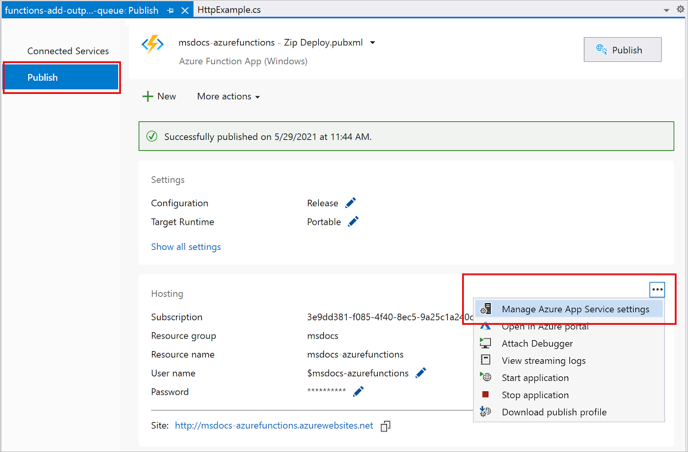

# <a name="connect-functions-to-azure-storage-using-visual-studio"></a>Connecter des fonctions à Stockage Azure avec Visual Studio

[!INCLUDE [functions-add-storage-binding-intro](../../includes/functions-add-storage-binding-intro.md)]

Cet article montre comment utiliser Visual Studio pour connecter à Stockage Azure la fonction que vous avez créée dans l’[article du guide de démarrage rapide précédent]. La liaison de sortie que vous ajoutez à cette fonction écrit des données provenant de la requête HTTP dans un message au sein de la file d’attente de Stockage File d’attente Azure. 

La plupart des liaisons requièrent une chaîne de connexion stockée que Functions utilise pour accéder au service lié. Pour simplifier, vous utilisez le compte de stockage que vous avez créé avec votre application de fonction. La connexion à ce compte est déjà stockée dans un paramètre d’application nommé `AzureWebJobsStorage`.  

## <a name="prerequisites"></a>Prérequis

Avant de commencer cet article : 

 - Effectuez la [partie 1 du guide de démarrage rapide de Visual Studio](./functions-create-your-first-function-visual-studio.md). 

- Connectez-vous à votre abonnement Azure à partir de Visual Studio.

## <a name="download-the-function-app-settings"></a>Télécharger les paramètres de l’application de fonction

Dans l’[article du guide de démarrage rapide précédent](./create-first-function-vs-code-csharp.md), vous avez créé une application de fonction dans Azure ainsi que le compte de stockage nécessaire. La chaîne de connexion pour ce compte est stockée de manière sécurisée dans les paramètres d’application au sein d’Azure. Dans cet article, vous allez écrire des messages dans une file d’attente de stockage au sein du même compte. Pour vous connecter à votre compte de stockage lors de l’exécution de la fonction en local, vous devez télécharger les paramètres de l’application dans le fichier *local.settings.json*. 

1. Dans **l’Explorateur de solutions**, cliquez avec le bouton droit sur le projet, puis sélectionnez **Publier**. 

1. Sous **Actions**, sélectionnez **Modifier les paramètres d’Azure App Service**. 

    

1. Sous **AzureWebJobsStorage**, copiez la valeur de chaîne **Distante** vers **Locale**, puis sélectionnez **OK**. 

La liaison de stockage qui utilise le paramètre `AzureWebJobsStorage` pour la connexion peut désormais se connecter à votre stockage File d’attente lors de l’exécution en local.

## <a name="register-binding-extensions"></a>Inscrire des extensions de liaison

Comme vous utilisez une liaison de sortie stockage de file d’attente, l’extension de liaisons de stockage doit être installée avant d’exécuter le projet. À l’exception des déclencheurs HTTP et de minuteur, les liaisons sont implémentées en tant que packages d’extension. 

1. Dans le menu **Outils**, sélectionnez **Gestionnaire de package NuGet** > **Console du Gestionnaire de package**. 

1. Dans la console, exécutez la commande [Install-Package](/nuget/tools/ps-ref-install-package) suivante pour installer les extensions de stockage :

    ```Command
    Install-Package Microsoft.Azure.WebJobs.Extensions.Storage -Version 3.0.6
    ````

Vous pouvez maintenant ajouter la liaison de sortie de stockage à votre projet.

## <a name="add-an-output-binding"></a>Ajouter une liaison de sortie

[!INCLUDE [functions-add-storage-binding-csharp-library](../../includes/functions-add-storage-binding-csharp-library.md)]

## <a name="add-code-that-uses-the-output-binding"></a>Ajouter le code qui utilise la liaison de sortie

Une fois que la liaison est définie, vous pouvez utiliser l’attribut `name` de la liaison pour y accéder en tant qu’attribut dans la signature de fonction. En utilisant une liaison de sortie, vous n’avez pas besoin de recourir au code du SDK Stockage Azure pour l’authentification, l’obtention d’une référence de file d’attente ou l’écriture de données. La liaison de sortie de file d’attente et le runtime Functions effectuent ces tâches.

[!INCLUDE [functions-add-storage-binding-csharp-library-code](../../includes/functions-add-storage-binding-csharp-library-code.md)]

## <a name="run-the-function-locally"></a>Exécuter la fonction localement

[!INCLUDE [functions-run-function-test-local-vs](../../includes/functions-run-function-test-local-vs.md)]

Une nouvelle file d’attente nommée `outqueue` est créée dans votre compte de stockage par le runtime Functions lors de la première utilisation de la liaison de sortie. Vous allez utiliser Cloud Explorer pour vérifier que la file d’attente a été créée ainsi que le nouveau message.

## <a name="examine-the-output-queue"></a>Analyser la file d’attente de sortie

1. Dans le menu **Affichage** de Visual Studio, sélectionnez **Cloud Explorer**.

1. Dans **Cloud Explorer**, développez votre abonnement Azure et **Comptes de stockage**, puis développez le compte de stockage que votre fonction utilise. Si vous ne vous souvenez pas du nom du compte de stockage, vérifiez le paramètre de chaîne de connexion `AzureWebJobsStorage` dans le fichier *local.settings.json*.  

1. Développez le nœud **Files d’attente**, puis double-cliquez sur la file d’attente nommée **outqueue** pour afficher le contenu de la file d’attente dans Visual Studio. 

   La file d’attente contient le message que la liaison de sortie de file d’attente a créé lors de l’exécution de la fonction déclenchée via HTTP. Si vous avez appelé la fonction avec la valeur `name` par défaut d'*Azure*, le message de la file d'attente est *Nom transmis à la fonction : Azure*.

    

1. Réexécutez la fonction et envoyez une autre demande : vous voyez alors apparaître un nouveau message dans la file d’attente.  

À présent, il est temps de republier sur Azure l’application de fonction mise à jour.

## <a name="redeploy-and-verify-the-updated-app"></a>Redéployer et tester l’application mise à jour

1. Dans l’**Explorateur de solutions**, cliquez avec le bouton droit sur le projet, sélectionnez **Publier**, puis choisissez **Publier** pour republier le projet sur Azure.

1. Une fois le déploiement terminé, vous pouvez à nouveau utiliser le navigateur pour tester la fonction redéployée. Comme précédemment, ajoutez la chaîne de requête `&name=<yourname>` à l’URL.

1. [Examinez à nouveau le message dans la file d’attente de stockage](#examine-the-output-queue) pour vérifier que la liaison de sortie regénère un nouveau message dans la file d’attente.

## <a name="clean-up-resources"></a>Nettoyer les ressources

[!INCLUDE [Clean-up resources](../../includes/functions-quickstart-cleanup.md)]

## <a name="next-steps"></a>Étapes suivantes

Vous avez mis à jour votre fonction déclenchée via HTTP pour écrire des données dans une file d’attente de stockage. Pour plus d’informations sur le développement de fonctions, voir [Développer des fonctions Azure Functions avec Visual Studio](functions-develop-vs.md).

Ensuite, vous devez activer la supervision Application Insights pour votre application de fonction :

> [!div class="nextstepaction"]
> [Activer l’intégration à Application Insights](configure-monitoring.md#add-to-an-existing-function-app)

[Azure Storage Explorer]: https://storageexplorer.com/
[article de démarrage rapide précédent]: functions-create-your-first-function-visual-studio.md