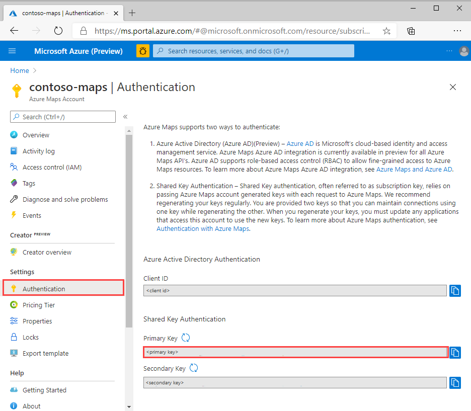
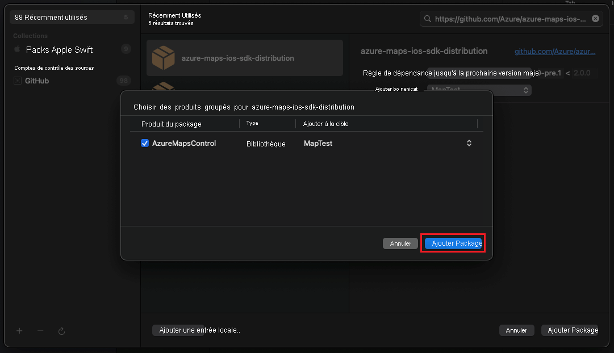
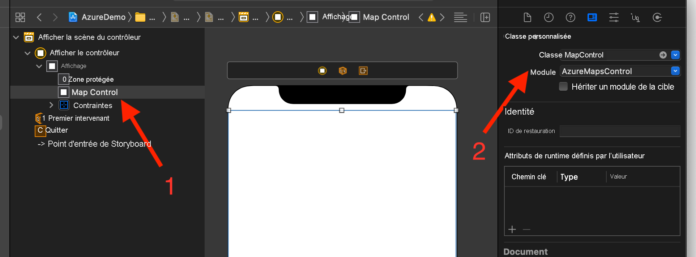

# Créer une application iOS (préversion publique)

Cet article vous montre comment ajouter Azure Maps à une application iOS. Il vous guide pas à pas durant ces étapes de base :

* Configurer votre environnement de développement.
* Créer votre propre compte Azure Maps.
* Récupérer votre clé Azure Maps primaire à utiliser dans l’application.
* Référencer les bibliothèques Azure Maps à partir du projet.
* Ajouter un contrôle Azure Maps à l’application.

## Prérequis

* Créez un compte Azure Maps en vous connectant au [portail Azure](https://portal.azure.com/). Si vous n’avez pas d’abonnement Azure, créez un [compte gratuit](https://azure.microsoft.com/free/) avant de commencer.
* [Créer un compte Azure Maps](quick-demo-map-app.md#create-an-azure-maps-account)
* [Obtenez une clé d’abonnement principale](quick-demo-map-app.md#get-the-primary-key-for-your-account), également appelée clé primaire ou clé d’abonnement. Pour plus d’informations sur l’authentification dans Azure Maps, consultez [Gérer l’authentification dans Azure Maps](how-to-manage-authentication.md).
* Téléchargez gratuitement [‎Xcode dans le Mac App Store](https://apps.apple.com/cz/app/xcode/id497799835?mt=12).

## Créer un compte Azure Maps

Créez un compte Azure Maps en effectuant les étapes suivantes :

1. Dans le coin supérieur gauche du [portail Azure](https://portal.azure.com/), sélectionnez **Créer une ressource**.

2. Dans la zone _Rechercher dans la Place de marché_, tapez **Azure Maps**.

3. Dans les _résultats_, sélectionnez **Azure Maps**, puis sélectionnez le bouton **Créer** qui apparaît sous la carte.

4. Sur la page **Créer un compte Maps**, entrez les valeurs suivantes :

   * _L’Abonnement_ à utiliser pour ce compte.
   * Le _Groupe de ressources_ pour ce compte. Vous pouvez choisir de _Créer_ ou d’utiliser un groupe de ressources _Existant_.
   * Le _Nom_ de votre nouveau compte.
   * Le _niveau tarifaire_ pour ce compte.
   * Lisez la _Licence_ et la _Déclaration de confidentialité_, puis cochez la case pour accepter les conditions.
   * Cliquez sur le bouton **Créer**.

    

## Obtenir la clé primaire de votre compte

Une fois le compte Maps créé, récupérez la clé principale qui vous permet d’interroger les API Maps.

1. Ouvrez votre compte Maps dans le portail.

2. Dans la section des paramètres, sélectionnez **Authentification**.

3. Copiez la **Clé primaire** dans le Presse-papiers. Enregistrez-la localement, vous l’utiliserez plus tard dans ce didacticiel.

>[!NOTE]
> Ce guide de démarrage rapide utilise l’approche basée sur l’authentification par [clé partagée](azure-maps-authentication.md#shared-key-authentication) à des fins de démonstration. Toutefois, l’approche recommandée pour tout environnement de production est celle de l’authentification [Azure Active Directory](azure-maps-authentication.md#azure-ad-authentication).
<!--
> If you use the Azure subscription key instead of the Azure Maps primary key, your map won't render properly. Also, for security purposes, it is recommended that you rotate between your primary and secondary keys. To rotate keys, update your app to use the secondary key, deploy, then press the cycle/refresh button beside the primary key to generate a new primary key. The old primary key will be disabled. For more information on key rotation, see [Set up Azure Key Vault with key rotation and auditing](/azure/key-vault/secrets/tutorial-rotation-dual)
-->

## Créer un projet dans Xcode

Tout d’abord, créez un nouveau projet d’application iOS. Suivez ces étapes pour créer un projet Xcode :

1. Sous **File (Fichier)** , sélectionnez **New (Nouveau)**  -> **Project (Projet)** .

2. Sous l’onglet **iOS**, sélectionnez **Application**, puis **Suivant**.

3. Entrez le nom de l’application, l’ID de bundle, puis sélectionnez **Suivant**.

Pour plus d’informations sur la création d’un nouveau projet, consultez [Creating an Xcode Project for an App](https://developer.apple.com/documentation/xcode/creating-an-xcode-project-for-an-app) (Création d’un projet Xcode pour une application).

## Installer le Kit de développement logiciel (SDK) iOS Azure Maps

L’étape suivante de la création de votre application consiste à installer le Kit de développement logiciel (SDK) iOS Azure Maps. Pour installer le Kit de développement logiciel (SDK), procédez comme suit :

1. Une fois le projet Xcode iOS souhaité sélectionné dans le **Project navigator** (Navigateur de projets), sélectionnez le bouton **+** pour **ajouter une dépendance de package**.

   

2. Entrez ce qui suit dans la boîte de dialogue qui s’affiche :
   * Entrez `https://github.com/Azure/azure-maps-ios-sdk-distribution.git` dans la barre de recherche qui apparaît dans le coin supérieur droit.
   * Sélectionnez `Up to Next Major Version` dans le champ **Dependency Rule** (Règle de dépendance).
   * Entrez `1.0.0-pre.1` dans le champ de version de la **règle de dépendance**.

   

3. Une fois que le package et ses dépendances sont résolus, sélectionnez le bouton **Add Package** (Ajouter un package) pour effectuer la configuration des dépendances.

   

## Ajouter un affichage MapControl

1. Ajoutez un `UIView` personnalisé au contrôleur d’affichage.

1. Sélectionnez une classe `MapControl` dans le module `AzureMapsControl`.

   

1. Dans le fichier **AppDelegate.swift** :

   * Ajouter l’instruction import pour le kit SDK Azure Maps
   * Définir vos informations d’authentification Azure Maps

Si vous définissez les informations d’authentification sur la classe AzureMaps de façon globale à l’aide des méthodes `AzureMaps.configure(subscriptionKey:)` ou `AzureMaps.configure(aadClient:aadAppId:aadTenant:)`, vous n’aurez pas besoin d’ajouter vos informations d’authentification à chaque affichage.

1. Sélectionnez le bouton d’exécution comme illustré dans le graphique suivant (ou appuyez sur les touches `CMD` + `R`) pour générer votre application.

   

Xcode prendra quelques secondes pour créer l’application. Une fois la création terminée, vous pouvez tester votre application dans l’appareil iOS simulé. La carte doit ressembler à ceci :

## Nettoyer les ressources

<!--
> [!WARNING]
> The tutorials listed in the [Next Steps](#next-steps) section detail how to use and configure Azure Maps with your account. Don't clean up the resources created in this quickstart if you plan to continue to the tutorials.
-->

Suivez les étapes ci-dessous pour nettoyer les ressources créées dans ce guide de démarrage rapide :

1. Fermez Xcode et supprimez le projet que vous avez créé.

2. Si vous avez testé l’application sur un appareil externe, désinstallez l’application de cet appareil.

Si vous n’envisagez pas de continuer à développer à l’aide du Kit de développement logiciel (SDK) iOS Azure Maps :

1. Accédez à la page du portail Azure. Sélectionnez **Toutes les ressources** dans la page principale du portail. Sinon, sélectionnez l’icône de menu dans le coin supérieur gauche, puis sélectionnez **Toutes les ressources**.

2. Sélectionnez votre compte Azure Maps. En haut de la page, sélectionnez **Supprimer**.

3. Si vous n’envisagez pas de poursuivre le développement d’applications iOS, désinstallez Xcode.

## Informations supplémentaires

Consultez les articles suivants pour obtenir des exemples de code supplémentaires :

* [Gérer l’authentification dans Azure Maps](how-to-manage-authentication.md)

<!--
## Additional information

See the following articles for additional code examples:

* [Manage authentication in Azure Maps](how-to-manage-authentication.md)
* [Change map styles in iOS maps](set-map-style-ios-sdk.md)
* [Add a symbol layer](add-symbol-layer-ios.md)
* [Add a line layer](add-line-layer-to-map-ios.md)
* [Add a polygon layer](add-polygon-layer-map-ios.md)

## Next steps

In this quickstart, you created your Azure Maps account and created a demo application. Take a look at the following tutorials to learn more about Azure Maps:

> [!div class="nextstepaction"]

> [Load GeoJSON data into Azure Maps](tutorial-load-geojson-file-ios.md)
-->
