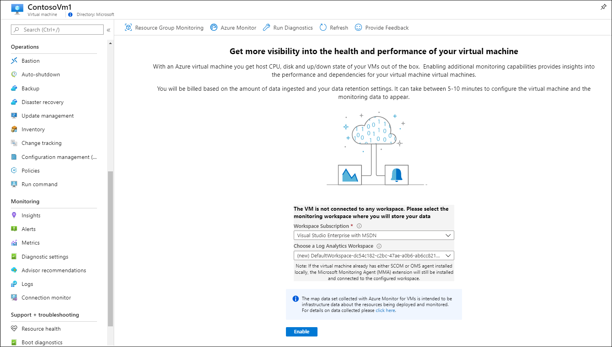
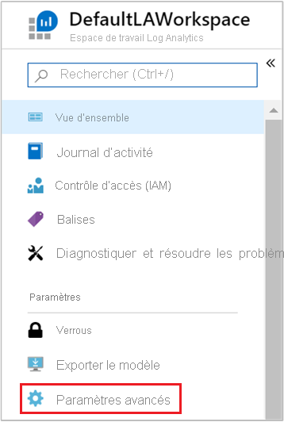
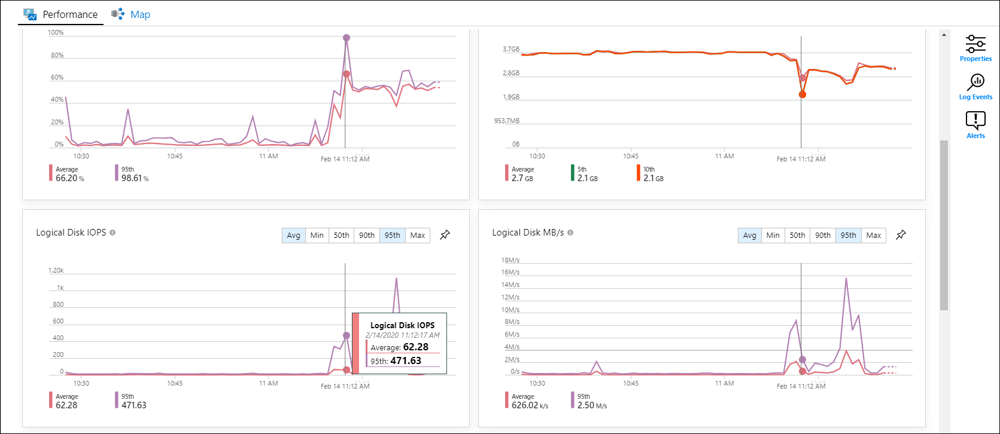
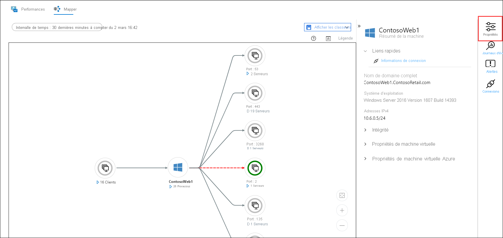
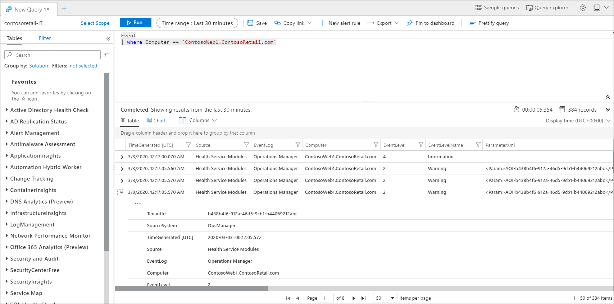

# Superviser une machine virtuelle Azure avec Azure Monitor.
[Azure Monitor](../overview.md) commence à collecter les données des machines virtuelles Azure dès leur création. Dans ce guide de démarrage rapide, vous allez découvrir brièvement comment les données sont collectées automatiquement pour une machine virtuelle Azure, et comment les voir dans le portail Azure. Vous allez ensuite activer [VM Insights](../vm/vminsights-overview.md) sur votre machine virtuelle, ce qui permet aux agents de la machine virtuelle de collecter et d’analyser les données du système d’exploitation invité, notamment les processus et leurs dépendances.

En suivant ce guide, vous êtes censé disposer d’une machine virtuelle Azure. Sinon, vous pouvez créer une [machine virtuelle Windows](../../virtual-machines/windows/quick-create-portal.md) ou une [machine virtuelle Linux](../../virtual-machines/linux/quick-create-cli.md) en suivant nos guides de démarrage rapide consacrés aux machines virtuelles.

Pour des descriptions plus détaillées des données de supervision collectées à partir des ressources Azure, consultez [Supervision des machines virtuelles Azure avec Azure Monitor](./monitor-vm-azure.md).

## Suivez le guide de démarrage rapide consacré à la supervision d’une ressource Azure.
Suivez le guide de démarrage rapide intitulé [Superviser une ressource Azure avec Azure Monitor](../essentials/quick-monitor-azure-resource.md) pour voir la page de vue d’ensemble, le journal d’activité ainsi que les métriques d’une machine virtuelle dans votre abonnement. Les machines virtuelles Azure collectent les mêmes données de supervision que les autres ressources Azure, mais seulement pour la machine virtuelle hôte. Le reste de ce guide de démarrage rapide se concentre sur la supervision du système d’exploitation invité et de ses charges de travail.

## Activer VM Insights
Dans la mesure où les métriques et les journaux d’activité sont collectés pour la machine virtuelle hôte, vous avez besoin d’un agent et d’une configuration particulière pour collecter et analyser les données de supervision du système d’exploitation invité et de ses charges de travail. VM Insights installe ces agents et fournit de puissantes fonctionnalités supplémentaires qui vous permettent de superviser vos machines virtuelles.

1. Accédez au menu de votre machine virtuelle.
2. Cliquez sur **Accéder aux insights** dans la vignette de la page **Vue d’ensemble**, ou cliquez sur **Insights** dans le menu **Supervision**.

    

3. Si VM Insights n’est pas encore activé pour la machine virtuelle, cliquez sur **Activer**. 

    

4. Si la machine virtuelle n’est pas déjà attachée à un espace de travail Log Analytics, vous êtes invité à le sélectionner ou à le créer. Sélectionnez la valeur par défaut, c’est-à-dire un espace de travail ayant un nom unique dans la même région que votre machine virtuelle.

    

5. L’intégration prend quelques minutes, le temps nécessaire à l’activation des extensions et à l’installation des agents sur votre machine virtuelle. Une fois l’opération effectuée, vous recevez un message indiquant que les insights ont été déployés correctement. Cliquez sur **Azure Monitor** pour ouvrir VM Insights.

    

6. Vous voyez votre machine virtuelle ainsi que toutes les autres machines virtuelles de votre abonnement qui sont intégrées. Sélectionnez l’onglet **Pas analysé** pour voir les machines virtuelles de votre abonnement qui ne sont pas intégrées.

    

## Configurer l’espace de travail
Quand vous créez un espace de travail Log Analytics, il doit être configuré pour collecter les journaux. Cette configuration doit être effectuée une seule fois, car elle est envoyée aux machines virtuelles qui se connectent à l’espace de travail.

1. Sélectionnez **Configuration de l’espace de travail**, puis sélectionnez votre espace de travail.

2. Sélectionnez **Paramètres avancés**

    

### Collecte de données à partir d’une machine virtuelle Windows

2. Sélectionnez **Données**, puis **Journaux des événements Windows**.

3. Ajoutez un journal des événements en tapant son nom.  Entrez **Système**, puis sélectionnez le signe plus **+** .

4. Dans le tableau, vérifiez les niveaux de gravité **Erreur** et **Avertissement**.

5. Sélectionnez **Enregistrer** en haut de la page pour enregistrer la configuration.

### Collecte de données à partir d’une machine virtuelle Linux

1. Sélectionnez **Données**, puis **Syslog**.

2. Ajoutez un journal des événements en tapant son nom.  Entrez **Syslog**, puis sélectionnez le signe plus **+** .  

3. Dans le tableau, décochez les niveaux de gravité **Info**, **Avis** et **Débogage**. 

4. Sélectionnez **Enregistrer** en haut de la page pour enregistrer la configuration.

## Afficher les données collectées

7. Cliquez sur votre machine virtuelle, puis sélectionnez l’onglet **Performances** qui se trouve sous le menu **Supervision**, vignette **Insights**. Cela entraîne l’affichage d’un groupe spécifique de compteurs de performances collectés à partir du système d’exploitation invité de votre machine virtuelle. Faites défiler l’affichage vers le bas pour voir plus de compteurs, et déplacez la souris sur un graphe pour voir la moyenne et les centiles à différents moments.

    

9. Sélectionnez **Carte** pour ouvrir la fonctionnalité relative aux cartes. Elle montre les processus en cours d’exécution et leurs dépendances sur la machine virtuelle. Sélectionnez **Propriétés** pour ouvrir le volet Propriétés, s’il n’est pas déjà ouvert.

    

11. Développez les processus de votre machine virtuelle. Sélectionnez l’un des processus pour voir ses détails et mettre en évidence ses dépendances.

    

12. Resélectionnez votre machine virtuelle, puis sélectionnez **Événements de journal**. 

    

13. Vous voyez une liste de tables qui sont stockées dans l’espace de travail Log Analytics de la machine virtuelle. Cette liste diffère selon que vous utilisez une machine virtuelle Windows ou Linux. Cliquez sur le tableau **Événement**. Cela inclut tous les événements du journal des événements Windows. Log Analytics s’ouvre avec une simple requête permettant de récupérer les entrées du journal des événements.

    

## Étapes suivantes
Dans ce guide de démarrage rapide, vous avez activé VM Insights pour une machine virtuelle et configuré l’espace de travail Log Analytics pour collecter les événements du système d’exploitation invité. Pour savoir comment consulter et analyser les données, passez au didacticiel suivant.

> [!div class="nextstepaction"]
> [Consulter ou analyser les données dans Log Analytics](../logs/log-analytics-tutorial.md)