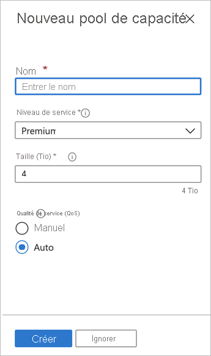

# Configurer un pool de capacité

Configurer un pool de capacité vous permet d’y créer des volumes.  

## Avant de commencer 

Vous devez avoir déjà créé un compte NetApp.   

[Créer un compte NetApp](azure-netapp-files-create-netapp-account.md)

## Étapes 

1. Accédez au panneau de gestion de votre compte NetApp, puis, dans le volet de navigation, cliquez sur **Pools de capacité**.  
    
    

2. Cliquez sur **+ Ajouter des pools** pour créer un nouveau pool de capacité.   
    La fenêtre Nouveau pool de capacité s’affiche.

3. Saisissez les informations suivantes pour le nouveau pool de capacité :  
   * **Nom**  
     Spécifiez le nom du pool de capacité.  
     Le nom du pool de capacité doit être unique à chaque compte NetApp.

   * **Niveau de service**   
     Ce champ affiche les performances cibles pour le pool de capacité.  
     Spécifiez le niveau de service du pool de capacité : [**Ultra**](azure-netapp-files-service-levels.md#Ultra), [**Premium**](azure-netapp-files-service-levels.md#Premium) ou [**Standard**](azure-netapp-files-service-levels.md#Standard).

    * **Taille**     
     Spécifiez la taille du pool de capacité que vous achetez.        
     La taille de pool de capacité minimale est de 4 Tio. Vous pouvez créer un pool avec une taille dont la valeur est un multiple de 4 Tio.   

   * **Qualité de service (QoS)**    
     Spécifiez si le pool de capacités doit utiliser le type de QoS **manuel** ou **automatique**.  

     Consultez la [hiérarchie de stockage](azure-netapp-files-understand-storage-hierarchy.md) et les [considérations relatives aux performances](azure-netapp-files-performance-considerations.md) pour comprendre les types de QoS.  

     > [!IMPORTANT] 
     > La définition du **type de QoS** sur **Manuel** est permanente. Vous ne pouvez pas convertir un pool de capacités de QoS manuelle pour utiliser la QoS automatique. Toutefois, vous pouvez convertir un pool de capacités de QoS automatique pour utiliser la QoS manuelle. Consultez [Modifier un pool de capacités pour utiliser la qualité de service (QoS) manuelle](manage-manual-qos-capacity-pool.md#change-to-qos).   

    

4. Cliquez sur **Créer**.

## Étapes suivantes 

- [Hiérarchie de stockage](azure-netapp-files-understand-storage-hierarchy.md) 
- [Niveaux de service pour Azure NetApp Files](azure-netapp-files-service-levels.md)
- [Tarification Azure NetApp Files](https://azure.microsoft.com/pricing/details/storage/netapp/)
- [Gérer un pool de capacités de QoS manuel](manage-manual-qos-capacity-pool.md)
- [Déléguer un sous-réseau à Azure NetApp Files](azure-netapp-files-delegate-subnet.md)
