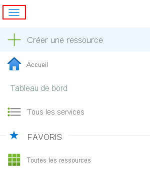
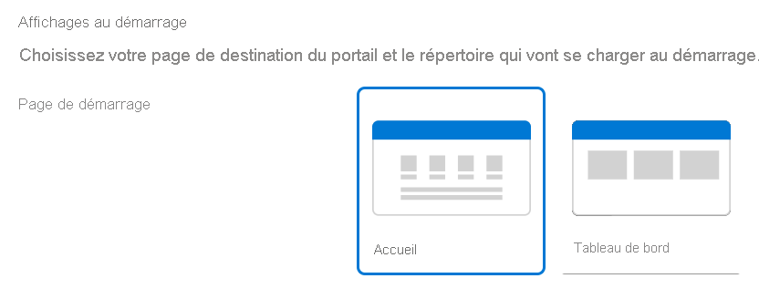
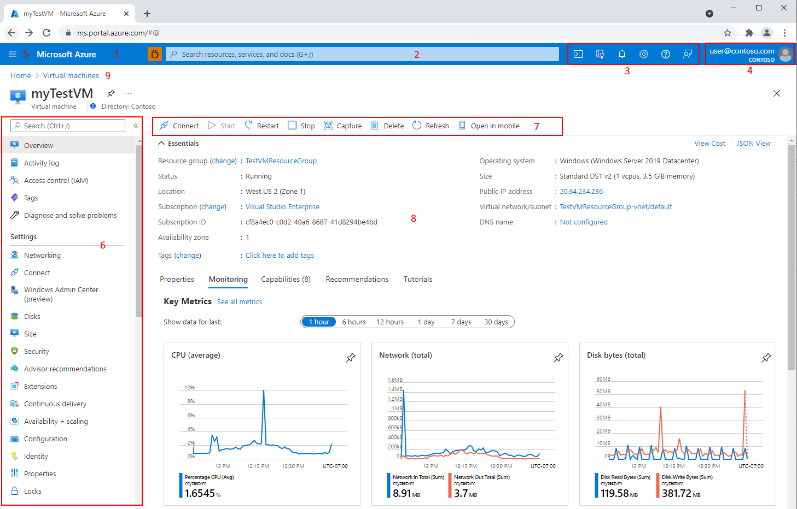
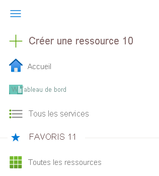

# Présentation du portail Azure

Cet article présente le portail Azure, identifie les éléments des pages du portail et vous aide à vous familiariser avec l’expérience de gestion sur le portail Azure.

## Qu’est-ce que le portail Azure ?

Le portail Azure est une console web unifiée qui offre une alternative aux outils en ligne de commande. Avec le portail Azure, vous pouvez gérer votre abonnement Azure via une interface graphique utilisateur. Vous pouvez créer, gérer et superviser tout ce que vous voulez, de simples applications web à des déploiements cloud complexes. Créez des tableaux de bord personnalisés pour une vue organisée des ressources. Configurez les options d’accessibilité pour une expérience optimale.

Le portail Azure est conçu pour assurer résilience et disponibilité continue. Il dispose d’une présence dans chaque centre de données Azure. Cette configuration rend le portail Azure résistant aux défaillances individuelles de centres de données et évite les ralentissements du réseau en étant proche des utilisateurs. Le portail Azure est mis à jour en permanence et les activités de maintenance ne nécessitent aucun temps d’arrêt.

## Menu du portail Azure

Vous pouvez choisir le mode par défaut pour le menu du portail. Il peut être ancré ou agir comme un panneau volant.

Lorsque le menu du portail est en mode volant, il est masqué jusqu’à ce que vous en ayez besoin. Sélectionnez l’icône de menu pour ouvrir ou fermer le menu.

Si vous choisissez le mode ancré pour le menu du portail, il sera toujours visible. Vous pouvez réduire le menu pour libérer davantage d’espace de travail.

## Accueil Azure

En tant que nouvel abonné aux services Azure, la première chose que vous voyez après vous être [connecté au portail](https://portal.azure.com) est la page **Accueil Azure**. Cette page compile les ressources qui vous aideront à tirer le meilleur parti de votre abonnement Azure. Nous avons inclus des liens vers des cours en ligne gratuits, de la documentation, des services essentiels et des sites utiles pour rester à jour et gérer les changements pour votre organisation. Pour un accès simple et rapide au travail en cours, nous montrons également la liste des ressources consultées en dernier. Vous ne pouvez pas personnaliser cette page, mais vous pouvez choisir de voir la page **Accueil Azure** ou **Tableau de bord Azure** comme vue par défaut. La première fois que vous vous connectez, une invite en haut de la page vous permet d’enregistrer votre préférence.

Le menu du portail Azure et l’affichage par défaut d’Azure peuvent être modifiés dans **Paramètres du portail**. Si vous modifiez votre sélection, la modification est immédiatement appliquée.

## Tableau de bord Azure

Les tableaux de bord fournissent une vue ciblée des ressources de votre abonnement qui vous intéressent le plus. Nous vous fournissons un tableau de bord par défaut pour vous aider à démarrer. Vous pouvez personnaliser ce tableau de bord pour avoir dans une même vue les ressources que vous utilisez fréquemment. Toutes les modifications que vous apportez à la vue par défaut affectent uniquement votre expérience. Toutefois, vous pouvez créer des tableaux de bord supplémentaires pour votre usage personnel, publier vos tableaux de bord personnalisés et les partager avec d’autres utilisateurs de votre organisation. Pour plus d’informations, consultez [Créer et partager des tableaux de bord dans le portail Azure](../azure-portal/azure-portal-dashboards.md).

## Visite guidée du portail

Il est utile de comprendre la disposition de base du portail et comment interagir avec lui. Ici, nous allons présenter les composants de l’interface utilisateur et certains éléments de la terminologie que nous utilisons pour donner des instructions. Pour une visite guidée plus détaillée du portail, consultez la leçon [Parcourir le portail](/learn/modules/tour-azure-portal/3-navigate-the-portal).

Le menu et l’en-tête de page du portail Azure sont des éléments globaux qui sont toujours présents. Ces fonctionnalités persistantes sont « l’interpréteur de commandes » de l’interface utilisateur associée à chaque service ou fonctionnalité, et l’en-tête permet d’accéder à des contrôles globaux. La page de configuration (parfois appelée « panneau ») d’une ressource peut également avoir un menu de ressources qui vous aidera à vous déplacer entre les fonctionnalités.

La figure ci-dessous étiquette les éléments de base du portail Azure, qui sont décrits individuellement dans le tableau suivant.

|Clé|Description
|:---:|---|
|1|En-tête de la page. Apparaît en haut de chaque page du portail et contient les éléments globaux.|
|2| Recherche globale. Utilisez la barre de recherche pour trouver rapidement une ressource spécifique, un service ou de la documentation.|
|3|Contrôles globaux. Comme tous les éléments globaux, ces fonctionnalités sont persistantes sur le portail et incluent : Cloud Shell, filtre d’abonnement, notifications, paramètres du portail, aide et support, et envoyez-nous vos commentaires.|
|4|Votre compte. Consultez les informations sur votre compte, changez d’annuaire, déconnectez-vous ou connectez-vous avec un autre compte.|
|5|Menu Portail. Le menu Portail est un élément global qui vous aide à naviguer entre les services. Parfois appelé barre latérale, le mode de menu du portail peut être modifié dans **Paramètres du portail**.|
|6|Le menu de ressources. De nombreux services incluent un menu dans le menu de ressources pour vous aider à gérer le service. Cet élément peut être désigné sous le nom de volet gauche.|
|7|Barre de commandes. Les contrôles de la barre de commandes sont contextuels et dépendent de vos actions.|
|8|Volet de travail.  Affiche les détails de la ressource à laquelle vous vous intéressez.|
|9|Barre de navigation. Vous pouvez utiliser les liens de la barre de navigation pour remonter d’un niveau dans votre workflow.|
|10|Contrôle principal pour créer une ressource dans l’abonnement actuel. Développez ou ouvrez le menu du portail pour rechercher **+ Créer une ressource**. Recherchez ou parcourez la Place de marché Azure pour trouver le type de ressource que vous souhaitez créer.|
|11|Votre liste de favoris. Consultez [Ajouter, supprimer et trier des favoris](../azure-portal/azure-portal-add-remove-sort-favorites.md) pour découvrir comment personnaliser la liste.|

## Prise en main des services

Si vous êtes un nouvel abonné, vous devez créer une ressource avant de pouvoir la gérer. Sélectionnez **+ Créer une ressource** pour voir les services disponibles dans la Place de marché Azure. Vous y trouverez des applications et des services provenant de centaines de fournisseurs, tous certifiés pour s’exécuter sur Azure.

Nous avons prérempli vos favoris dans la barre latérale avec des liens vers des services couramment utilisés.  Pour voir tous les services disponibles, sélectionnez **Tous les services** dans la barre latérale.

> [!TIP]
> La façon la plus rapide de rechercher une ressource, un service ou de la documentation consiste à utiliser *Recherche* dans l’en-tête global. Utilisez les liens de la barre de navigation pour revenir aux pages précédentes.
>
Regardez cette vidéo pour avoir une démonstration de l’utilisation de la recherche globale dans le portail Azure.

> [!VIDEO https://www.youtube.com/embed/nZ7WwTZcQbo]

[Guide pratique pour utiliser la recherche globale dans le portail Azure](https://www.youtube.com/watch?v=nZ7WwTZcQbo)

## Étapes suivantes

* Découvrez plus en détail où exécuter le portail Azure dans [Navigateurs et appareils pris en charge](../azure-portal/azure-portal-supported-browsers-devices.md)
* Restez connecté en déplacement avec l’[application mobile Azure](https://azure.microsoft.com/features/azure-portal/mobile-app/)
* Intégrez et configurez votre environnement cloud avec le [Centre de démarrage rapide Azure](../azure-portal/azure-portal-quickstart-center.md)