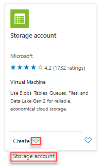
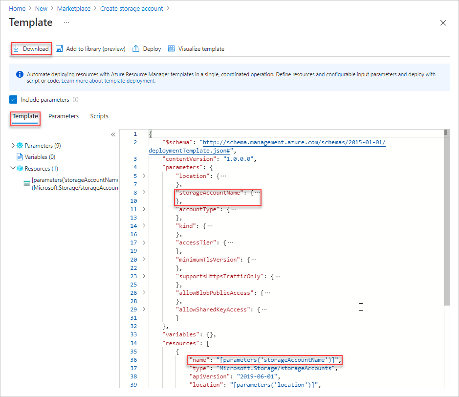

# <a name="quickstart-create-and-deploy-arm-templates-by-using-the-azure-portal"></a>Démarrage rapide : Créer et déployer des modèles ARM à l’aide du portail Azure

Découvrez comment générer un modèle ARM (Azure Resource Manager) à l’aide du portail Azure, ainsi que le processus de modification et de déploiement du modèle à partir du portail. Les modèles ARM sont des fichiers JSON qui définissent les ressources nécessaires au déploiement de votre solution. Pour comprendre les concepts associés au déploiement et à la gestion de vos solutions Azure, consultez [Vue d’ensemble du déploiement de modèles](overview.md).


Après avoir suivi le tutoriel, vous déployez un compte de Stockage Azure. Le même processus peut être utilisé pour déployer d’autres ressources Azure.

Si vous ne disposez pas d’abonnement Azure, créez un [compte gratuit](https://azure.microsoft.com/free/) avant de commencer.

## <a name="generate-a-template-using-the-portal"></a>Générer un modèle à l’aide du portail Azure

La création d’un modèle ARM à partir de zéro n’est pas une tâche facile, surtout si vous découvrez les déploiements Azure et le format JSON. Vous pouvez utiliser le portail Azure pour configurer une ressource, par exemple un compte de Stockage Azure. Avant de déployer la ressource, vous pouvez exporter votre configuration dans un modèle. Vous pouvez enregistrer le modèle et le réutiliser ultérieurement.

De nombreux développeurs de modèles expérimentés utilisent cette méthode pour générer des modèles quand ils tentent de déployer des ressources Azure qu’ils ne maîtrisent pas bien. Pour plus d’informations sur l’exportation de modèles par le biais du portail, consultez [Exporter des groupes de ressources dans des modèles](../management/manage-resource-groups-portal.md#export-resource-groups-to-templates). L’autre moyen de trouver un modèle opérationnel consiste à le rechercher à partir des [modèles de démarrage rapide Azure](https://azure.microsoft.com/resources/templates/).

1. Dans un navigateur web, accédez au [portail Azure](https://portal.azure.com) et connectez-vous à votre compte.
1. Dans le menu du Portail Azure, sélectionnez **Créer une ressource**.

    

1. Dans la zone de recherche, tapez **compte de stockage**, puis appuyez sur **[ENTRÉE]** .
1. Sélectionnez la flèche vers le bas en regard de **Créer**, puis sélectionnez **Compte de stockage**.

    

1. Entrez les informations suivantes :

    |Nom|Valeur|
    |----|----|
    |**Groupe de ressources**|Sélectionnez **Créer nouveau**, puis spécifiez un nom de groupe de ressources de votre choix. Sur la capture d’écran, le nom du groupe de ressources est *mystorage1016rg*. Un groupe de ressources est un conteneur pour les ressources Azure. Un groupe de ressources facilite la gestion des ressources Azure. |
    |**Nom**|attribuez un nom unique à votre compte de stockage. Le nom du compte de stockage doit être unique dans Azure, et ne contenir que des lettres minuscules et des chiffres. Le nom doit être compris entre 3 et 24 caractères. Si vous obtenez un message d’erreur indiquant que « le nom de compte de stockage 'mystorage1016' est déjà utilisé », essayez d’utiliser **&lt;votre nom>stockage&lt;Date du jour au format MMJJ>** , par exemple  **johndolestorage1016**. Pour plus d’informations, consultez la page [Règles et restrictions de nommage](/azure/architecture/best-practices/resource-naming).|

    Vous pouvez utiliser les valeurs par défaut pour les autres propriétés.

    

    > [!NOTE]
    > Certains modèles exportés nécessitent des modifications avant leur déploiement.

1. Sélectionnez **Vérifier + créer** au bas de l’écran. Ne sélectionnez pas **Créer** à l’étape suivante.
1. Sélectionnez **Télécharger un modèle pour l’automatisation** au bas de l’écran. Le portail affiche le modèle généré :

    

    Le volet principal affiche le modèle. Il s’agit d’un fichier JSON avec six éléments de niveau supérieur : `schema`, `contentVersion`, `parameters`, `variables`, `resources` et `output`. Pour plus d’informations, consultez [Comprendre la structure et la syntaxe des modèles ARM](./template-syntax.md)

    Neuf paramètres sont définis. Un d’eux est appelé **storageAccountName**. La deuxième partie en surbrillance dans la capture d’écran précédente montre comment référencer ce paramètre dans le modèle. Dans la section suivante, vous modifiez le modèle pour utiliser un nom généré pour le compte de stockage.

    Dans le modèle, une ressource Azure est définie. Le type est `Microsoft.Storage/storageAccounts`. Examinez la façon dont la ressource est définie, et la structure de la définition.
1. Sélectionnez **Télécharger** en haut de l’écran.
1. Ouvrez le fichier zip téléchargé, puis enregistrez **template.json** sur votre ordinateur. Dans la section suivante, vous utilisez un outil de déploiement de modèle pour modifier le modèle.
1. Sélectionnez l’onglet **Paramètre** pour afficher les valeurs que vous avez fournies pour les paramètres. Notez ces valeurs, vous en aurez besoin dans la section suivante lors du déploiement du modèle.

    

    À l’aide du fichier de modèle et du fichier de paramètres, vous pouvez créer une ressource, dans ce tutoriel, un compte de stockage Azure.

## <a name="edit-and-deploy-the-template"></a>Modifier et déployer le modèle

Le portail Azure peut être utilisé pour effectuer des modifications de base du modèle. Dans ce démarrage rapide, vous utilisez un outil du portail appelé *déploiement de modèle*. Cet outil *Déploiement de modèle* est utilisé dans ce tutoriel pour vous permettre de suivre la totalité du tutoriel à l’aide d’une seule interface : le portail Azure. Pour modifier un modèle plus complexe, envisagez d’utiliser [Visual Studio Code](quickstart-create-templates-use-visual-studio-code.md), qui offre plus de fonctionnalités d’édition.

> [!IMPORTANT]
> Le déploiement de modèle fournit une interface pour le test de modèles simples. Il n’est pas recommandé d’utiliser cette fonctionnalité en production. Au lieu de cela, stockez vos modèles dans un compte de stockage Azure ou un référentiel de code source, comme GitHub.

Azure requiert que chaque service Azure ait un nom unique. Le déploiement peut échouer si vous avez entré un nom de compte de stockage déjà existant. Pour éviter ce problème, modifiez le modèle pour utiliser un appel de fonction de modèle `uniquestring()` pour générer un nom de compte de stockage unique.

1. Dans le menu du portail Azure, dans la zone de recherche, tapez **déployer**, puis sélectionnez **Déployer un modèle personnalisé**.

    

1. Sélectionnez **Générer votre propre modèle dans l’éditeur**.
1. Sélectionnez **Charger le fichier**, puis suivez les instructions pour charger le fichier template.json téléchargé dans la section précédente.
1. Apportez les trois modifications suivantes au modèle :

    

   - Supprimez le paramètre **storageAccountName**, comme indiqué dans la capture d’écran précédente.
   - Ajoutez une variable appelée **storageAccountName**, comme illustré dans la capture d’écran précédente :

      ```json
      "storageAccountName": "[concat(uniqueString(subscription().subscriptionId), 'storage')]"
      ```

      Deux fonctions de modèles sont utilisées ici : `concat()` et `uniqueString()`.
   - Mettez à jour l’élément nom de la ressource **Microsoft.Storage/storageaccounts** pour utiliser la variable qui vient d’être définie au lieu du paramètre :

      ```json
      "name": "[variables('storageAccountName')]",
      ```

      Le modèle final doit ressembler à ce qui suit :

      ```json
      {
        "$schema": "http://schema.management.azure.com/schemas/2015-01-01/deploymentTemplate.json#",
        "contentVersion": "1.0.0.0",
        "parameters": {
          "location": {
            "type": "string"
          },
          "accountType": {
            "type": "string"
          },
          "kind": {
            "type": "string"
          },
          "accessTier": {
            "type": "string"
          },
          "minimumTlsVersion": {
            "type": "string"
          },
          "supportsHttpsTrafficOnly": {
            "type": "bool"
          },
          "allowBlobPublicAccess": {
            "type": "bool"
          },
          "allowSharedKeyAccess": {
            "type": "bool"
          }
        },
        "variables": {
          "storageAccountName": "[concat(uniqueString(subscription().subscriptionId), 'storage')]"
        },
        "resources": [
          {
            "name": "[variables('storageAccountName')]",
            "type": "Microsoft.Storage/storageAccounts",
            "apiVersion": "2019-06-01",
            "location": "[parameters('location')]",
            "properties": {
              "accessTier": "[parameters('accessTier')]",
              "minimumTlsVersion": "[parameters('minimumTlsVersion')]",
              "supportsHttpsTrafficOnly": "[parameters('supportsHttpsTrafficOnly')]",
              "allowBlobPublicAccess": "[parameters('allowBlobPublicAccess')]",
              "allowSharedKeyAccess": "[parameters('allowSharedKeyAccess')]"
            },
            "dependsOn": [],
            "sku": {
              "name": "[parameters('accountType')]"
            },
            "kind": "[parameters('kind')]",
            "tags": {}
          }
        ],
        "outputs": {}
      }
      ```

1. Sélectionnez **Enregistrer**.
1. Saisissez les valeurs suivantes :

    |Nom|Valeur|
    |----|----|
    |**Groupe de ressources**|Sélectionnez le nom du groupe de ressources que vous avez créé dans la dernière section. |
    |**Région**|Sélectionnez l’emplacement du groupe de ressources. Par exemple, **USA Centre**. |
    |**Lieu**|Sélectionnez un emplacement pour le compte de stockage. Par exemple, **USA Centre**. |
    |**Type de compte**|entrez **Standard_LRS** pour ce démarrage rapide. |
    |**Type**|entrez **StorageV2** pour ce démarrage rapide. |
    |**Niveau d’accès**|entrez **chaud** pour ce démarrage rapide. |
    |**Version TLS minimale**|Entrez **TLS1_0**. |
    |**Prend en charge le trafic HTTPS uniquement**| Pour ce guide de démarrage rapide, sélectionnez **true**. |
    |**Autoriser l’accès public aux objets blob**| Pour ce guide de démarrage rapide, sélectionnez **false**. |
    |**Autoriser l’accès à la clé partagée**| Pour ce guide de démarrage rapide, sélectionnez **true**. |

1. Sélectionnez **Revoir + créer**.
1. Sélectionnez **Create** (Créer).
1. Sélectionnez l’icône représentant une cloche (notifications) en haut de l’écran pour afficher l’état du déploiement. **Déploiement en cours** doit s’afficher. Attendez la fin du déploiement.

    

1. Sélectionnez **Accédez au groupe de ressources** à partir du volet de notification. Vous devriez voir un écran semblable à :

    

    L’état du déploiement vous montre qu’il a réussi, et il n’y a qu’un seul compte de stockage dans le groupe de ressources. Le nom de compte de stockage est une chaîne unique générée par le modèle. Pour plus d’informations sur l’utilisation des comptes de stockage Azure, consultez [Démarrage rapide : Charger, télécharger et lister des objets blob à l’aide du portail Azure](../../storage/blobs/storage-quickstart-blobs-portal.md).

## <a name="clean-up-resources"></a>Nettoyer les ressources

Lorsque vous n’en avez plus besoin, nettoyez les ressources Azure que vous avez déployées en supprimant le groupe de ressources.

1. Dans le portail Azure, sélectionnez **Groupe de ressources** dans le menu de gauche.
1. Entrez le nom du groupe de ressources dans le champ **Filtrer par nom**.
1. Sélectionnez le nom du groupe de ressources.  Vous devriez voir le compte de stockage dans le groupe de ressources.
1. Sélectionnez **Supprimer le groupe de ressources** dans le menu supérieur.

## <a name="next-steps"></a>Étapes suivantes

Ce tutoriel vous a appris à générer un modèle et à le déployer à partir du portail Azure. Le modèle utilisé dans ce démarrage rapide est un modèle simple disposant d’une seule ressource Azure. Lorsque le modèle est complexe, il est plus facile d’utiliser Visual Studio Code ou Visual Studio pour développer le modèle. Pour en savoir plus sur le développement de modèles, consultez notre nouvelle série de tutoriels pour les débutants :

> [!div class="nextstepaction"]
> [Tutoriels pour les débutants](./template-tutorial-create-first-template.md)
