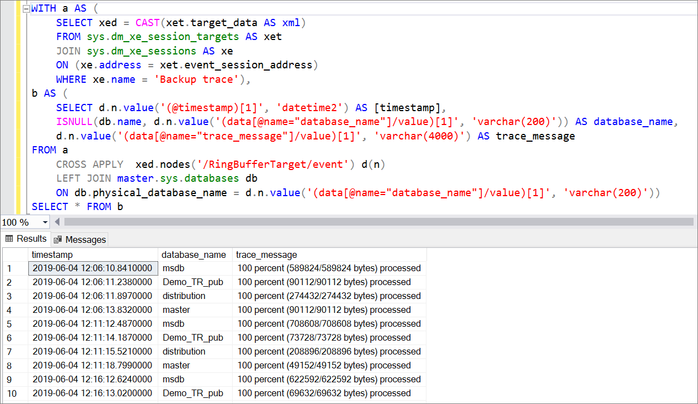

# <a name="monitor-backup-activity-for-azure-sql-managed-instance"></a>Surveiller l’activité de sauvegarde pour Azure SQL Managed Instance 
[!INCLUDE[appliesto-sqlmi](../includes/appliesto-sqlmi.md)]

Cet article vous apprend à configurer des sessions d’événements étendus (XEvent) afin de surveiller l’activité de sauvegarde pour [Azure SQL Managed Instance](sql-managed-instance-paas-overview.md). 

## <a name="overview"></a>Vue d’ensemble

Azure SQL Managed Instance émet des événements (également appelés [événements étendus ou XEvents](../database/xevent-db-diff-from-svr.md)) lors de l’activité de sauvegarde pour permettre la création de rapports. Configurez une session XEvent pour suivre des informations telles que l’état de la sauvegarde, le type de sauvegarde, la taille, l’heure et l’emplacement dans la base de données msdb. Ces informations peuvent être intégrées au logiciel de surveillance de sauvegarde et sont également utilisées à des fins d’audit d’entreprise. 

Les audits d’entreprise peuvent nécessiter la preuve de réussite de la sauvegarde, l’heure de la sauvegarde ainsi que sa durée.

## <a name="configure-xevent-session"></a>Configurer une session XEvent

Utilisez l’événement étendu `backup_restore_progress_trace` pour enregistrer la progression de votre sauvegarde SQL Managed Instance. Modifiez les sessions XEvent en fonction des besoins de suivi des informations qui vous intéressent. Ces extraits de code T-SQL stockent les sessions XEvent dans la mémoire tampon en anneau, mais il est également possible d’écrire dans le [Stockage Blob Azure](../database/xevent-code-event-file.md). Les sessions XEvent stockant les données dans la mémoire tampon en anneau présentent une limite d’environ 1 000 messages et sont donc à réserver au suivi de l’activité récente. En outre, les données de mémoire tampon en anneau sont perdues lors du basculement. Dès lors, pour un enregistrement d’historique des sauvegardes, écrivez plutôt dans un fichier d’événements. 

### <a name="simple-tracking"></a>Suivi simple

Configurez une session XEvent simple pour capturer des événements simples sur les sauvegardes complètes. Ce script collecte le nom de la base de données, le nombre total d’octets traités et l’heure à laquelle la sauvegarde a été effectuée.

Utilisez Transact-SQL (T-SQL) pour configurer la session XEvent simple : 


```sql
CREATE EVENT SESSION [Simple backup trace] ON SERVER
ADD EVENT sqlserver.backup_restore_progress_trace(
WHERE operation_type = 0
AND trace_message LIKE '%100 percent%')
ADD TARGET package0.ring_buffer
WITH(STARTUP_STATE=ON)
GO
ALTER EVENT SESSION [Simple backup trace] ON SERVER
STATE = start;
```


### <a name="verbose-tracking"></a>Suivi détaillé

Configurez une session XEvent détaillée pour suivre plus de détails sur votre activité de sauvegarde. Ce script capture le début et la fin des sauvegardes complètes, différentielles et de journaux. Ce script étant plus détaillé, il remplit la mémoire tampon en anneau plus rapidement et dès lors, les entrées peuvent être recyclées plus rapidement qu’avec le script simple. 

Utilisez Transact-SQL (T-SQL) pour configurer la session XEvent détaillée : 

```sql
CREATE EVENT SESSION [Verbose backup trace] ON SERVER 
ADD EVENT sqlserver.backup_restore_progress_trace(
    WHERE (
              [operation_type]=(0) AND (
              [trace_message] like '%100 percent%' OR 
              [trace_message] like '%BACKUP DATABASE%' OR [trace_message] like '%BACKUP LOG%'))
       )
ADD TARGET package0.ring_buffer
WITH (MAX_MEMORY=4096 KB,EVENT_RETENTION_MODE=ALLOW_SINGLE_EVENT_LOSS,
       MAX_DISPATCH_LATENCY=30 SECONDS,MAX_EVENT_SIZE=0 KB,MEMORY_PARTITION_MODE=NONE,
       TRACK_CAUSALITY=OFF,STARTUP_STATE=ON)

ALTER EVENT SESSION [Verbose backup trace] ON SERVER
STATE = start;

```

## <a name="monitor-backup-progress"></a>Surveiller la progression de la sauvegarde 

Après création de la session XEvent, vous pouvez utiliser Transact-SQL (T-SQL) pour interroger les résultats de la mémoire tampon en anneau et surveiller la progression de la sauvegarde. Après démarrage, XEvent collecte tous les événements de sauvegarde afin d’ajouter les entrées à la session toutes les 5 à 10 minutes environ.  

### <a name="simple-tracking"></a>Suivi simple

Le code Transact-SQL (T-SQL) suivant interroge la session XEvent simple et renvoie le nom de la base de données, le nombre total d’octets traités et l’heure de fin de la sauvegarde : 

```sql 
WITH
a AS (SELECT xed = CAST(xet.target_data AS xml)
FROM sys.dm_xe_session_targets AS xet
JOIN sys.dm_xe_sessions AS xe
ON (xe.address = xet.event_session_address)
WHERE xe.name = 'Backup trace'),
b AS(SELECT
d.n.value('(@timestamp)[1]', 'datetime2') AS [timestamp],
ISNULL(db.name, d.n.value('(data[@name="database_name"]/value)[1]', 'varchar(200)')) AS database_name,
d.n.value('(data[@name="trace_message"]/value)[1]', 'varchar(4000)') AS trace_message
FROM a
CROSS APPLY  xed.nodes('/RingBufferTarget/event') d(n)
LEFT JOIN master.sys.databases db
ON db.physical_database_name = d.n.value('(data[@name="database_name"]/value)[1]', 'varchar(200)'))
SELECT * FROM b
```

La capture d’écran suivante montre un exemple de sortie de la requête ci-dessus : 



Dans cet exemple, cinq bases de données ont été automatiquement sauvegardées pendant 2 heures et 30 minutes et la session XEvent compte 130 entrées. 

### <a name="verbose-tracking"></a>Suivi détaillé 

Le code Transact-SQL (T-SQL) suivant interroge la session XEvent détaillée et renvoie le nom de la base de données, ainsi que le début et la fin des sauvegardes complètes, différentielles et de journaux. 


```sql
WITH
a AS (SELECT xed = CAST(xet.target_data AS xml)
FROM sys.dm_xe_session_targets AS xet
JOIN sys.dm_xe_sessions AS xe
ON (xe.address = xet.event_session_address)
WHERE xe.name = 'Verbose backup trace'),
b AS(SELECT
d.n.value('(@timestamp)[1]', 'datetime2') AS [timestamp],
ISNULL(db.name, d.n.value('(data[@name="database_name"]/value)[1]', 'varchar(200)')) AS database_name,
d.n.value('(data[@name="trace_message"]/value)[1]', 'varchar(4000)') AS trace_message
FROM a
CROSS APPLY  xed.nodes('/RingBufferTarget/event') d(n)
LEFT JOIN master.sys.databases db
ON db.physical_database_name = d.n.value('(data[@name="database_name"]/value)[1]', 'varchar(200)'))
SELECT * FROM b
```

La capture d’écran suivante montre un exemple de sauvegarde complète dans la session XEvent :

:::image type="content" source="media/backup-activity-monitor/output-with-full.png" alt-text="Sortie XEvent montrant des sauvegardes complètes":::

La capture d’écran suivante montre un exemple de sortie de sauvegarde différentielle dans la session XEvent :

:::image type="content" source="media/backup-activity-monitor/output-with-differential.png" alt-text="Sortie XEvent montrant des sauvegardes différentielles":::


## <a name="next-steps"></a>Étapes suivantes

Une fois la sauvegarde terminée, vous pouvez [effectuer une restauration à un point dans le temps](point-in-time-restore.md) ou [configurer une stratégie de rétention à long terme](long-term-backup-retention-configure.md). 

Pour plus d’informations, consultez [Sauvegardes automatisées](../database/automated-backups-overview.md). 
