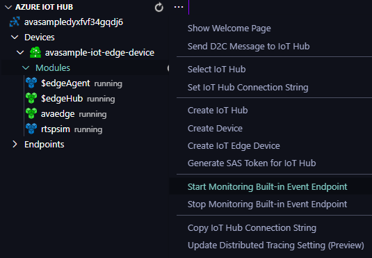

Vous allez utiliser le module Azure Video Analyzer pour détecter les mouvements dans le flux vidéo en direct entrant et envoyer des événements à IoT Hub. Pour voir ces événements, effectuez les étapes suivantes :

1. Ouvrez le volet Explorateur dans Visual Studio Code, puis recherchez Azure IoT Hub dans l’angle inférieur gauche.
1. Développez le nœud **Appareils**.
1. Cliquez avec le bouton droit sur **avasample-iot-edge-device**, puis sélectionnez **Démarrer la supervision du point de terminaison d’événements intégré**.

[!INCLUDE [provide-builtin-endpoint](../../common-includes/provide-builtin-endpoint.md)]
