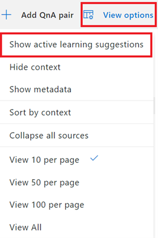

# Enrichir votre base de connaissances avec l’apprentissage actif

Ce tutoriel vous montre comment améliorer votre base de connaissances avec l’apprentissage actif. Vous remarquerez peut-être que les clients posent des questions qui ne font pas partie de votre base de connaissances. Il existe souvent des variantes de questions qui sont tournées différemment. 

Ces variantes, lorsqu’elles sont ajoutées en tant que questions alternatives à la paire question/réponse appropriée, aident à optimiser la base de connaissances pour répondre aux requêtes utilisateur réelles. Vous pouvez ajouter manuellement des questions alternatives aux paires question/réponse à l’aide de l’éditeur. Dans le même temps, vous pouvez également utiliser la fonctionnalité d’apprentissage actif pour générer des suggestions d’apprentissage actives sur la base des requêtes utilisateur. Toutefois, la fonctionnalité d’apprentissage actif requiert que la base de connaissances reçoive un trafic utilisateur normal pour générer des suggestions.

## Activer l’apprentissage actif
L’apprentissage actif est activé par défaut pour la fonctionnalité de réponse personnalisée aux questions. Toutefois, vous devez mettre à jour manuellement le paramètre d’apprentissage actif pour QnA Maker en disponibilité générale. Vous trouverez plus d’informations ici : [Activer l’apprentissage actif](../how-to/use-active-learning.md#turn-on-active-learning-for-alternate-questions).

Pour tester les suggestions d’apprentissage actif, vous pouvez importer le fichier suivant dans la base de connaissances : [SampleActiveLearning.tsv](https://github.com/Azure-Samples/cognitive-services-sample-data-files/blob/master/qna-maker/knowledge-bases/SampleActiveLearning.tsv). Pour plus d’informations sur l’importation de la base de connaissances, consultez [Importer la base de connaissances](migrate-knowledge-base.md).

## Afficher et ajouter/refuser des suggestions d’apprentissage actif
Une fois les suggestions d’apprentissage actif disponibles, elles peuvent être affichées à partir des **Options d’affichage** > **Afficher les suggestions d’apprentissage actif**.

> [!div class="mx-imgBorder"]
> 

En cliquant sur **Afficher les suggestions d’apprentissage actif**, vous pouvez choisir de filtrer les paires question/réponse qui ont des suggestions. Si l’apprentissage actif est désactivé ou s’il n’y a pas de suggestions, **Afficher les suggestions d’apprentissage actif** sera désactivé.

> [!div class="mx-imgBorder"]
> 

Nous pouvons choisir de filtrer uniquement les paires question/réponse qui sont des questions alternatives suggérées par l’apprentissage actif, de sorte que la liste filtrée de paires question/réponse s’affiche :

> [!div class="mx-imgBorder"]
> 

Nous pouvons maintenant accepter ces suggestions ou les refuser à l’aide d’une coche ou d’une croix. Vous pouvez effectuer cette opération individuellement, en accédant à chaque paire question/réponse ou en utilisant l’option **Accepter/Rejeter** en haut.

> [!div class="mx-imgBorder"]
> 

La base de connaissances ne change pas, sauf si vous choisissez d’ajouter ou de modifier les suggestions de l’apprentissage actif. Enfin, cliquez sur Enregistrer et effectuer l’apprentissage pour enregistrer les modifications.

> [!NOTE] 
> Pour vérifier les paramètres de version et de service de l’apprentissage actif, consultez l’article sur l’[utilisation de l’apprentissage actif](../how-to/use-active-learning.md)

## Ajouter des questions alternatives à l’aide de l’éditeur

Bien que l’apprentissage actif suggère automatiquement des questions alternatives sur la base des requêtes utilisateur accédant à la base de connaissances, nous pouvons également ajouter des variantes d’une question à l’aide de l’éditeur.
Sélectionnez la paire question/réponse dans laquelle une autre question doit être ajoutée et sélectionnez **Ajouter une autre formulation**

> [!div class="mx-imgBorder"]
> 

Les questions alternatives ajoutées à la paire question/réponse sont indiquées comme suit

> [!div class="mx-imgBorder"]
> 

En ajoutant d’autres questions avec l’apprentissage actif, nous enrichissons davantage la base de connaissances avec des variations d’une question qui permettent de fournir la même réponse à une requête utilisateur similaire.

> [!NOTE] 
> Les questions alternatives présentent de nombreux mots vides, et peuvent ne pas avoir d’impact sur la précision de la réponse attendue. Par conséquent, si la seule différence par rapport aux autres questions réside dans les mots vides, ces questions alternatives ne sont pas requises.

La liste de mots vides est disponible ici : liste de [mots vides](https://github.com/Azure-Samples/azure-search-sample-data/blob/master/STOPWORDS.md).

## Étapes suivantes

> [!div class="nextstepaction"]
> [Améliorer la qualité des réponses avec des synonymes](adding-synonyms.md)