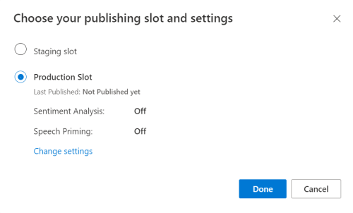
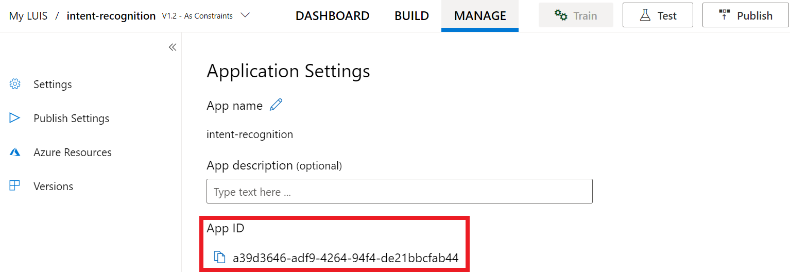

Pour terminer le démarrage rapide de reconnaissance de l’intention, vous devez créer un compte LUIS et un projet à partir de la préversion du portail LUIS. Ce guide de démarrage rapide nécessite un abonnement LUIS [dans une région où la reconnaissance d’intention est disponible](../../../regions.md#intent-recognition). Il n’est *pas* nécessaire de disposer d’un abonnement au service Speech.

La première chose à faire est de créer un compte et une application LUIS à partir de la préversion du portail LUIS. L’application LUIS que vous créez utilisera un domaine prédéfini pour la domotique, qui fournit des intentions, des entités et des exemples d’énoncés. À la fin du processus, vous disposerez d’un point de terminaison LUIS s’exécutant dans le cloud et que vous pourrez appeler à l’aide du kit SDK Speech. 

Pour créer votre application LUIS, suivez ces instructions :

* <a href="/azure/cognitive-services/luis/luis-get-started-create-app" target="_blank">Démarrage rapide : Générer une application de domaine prédéfinie</a>

Quand vous aurez terminé, vous aurez besoin de quatre éléments :

* Effectuer une republication avec **Préparation vocale** activé
* Votre **clé primaire** LUIS
* Votre **localisation** LUIS
* Votre **ID d’application** LUIS

Voici comment vous pouvez trouver ces informations sur la [préversion du portail LUI](https://preview.luis.ai/) :

1. À partir du portail LUIS en préversion, sélectionnez votre application, puis sélectionnez le bouton **Publier**.

2. Sélectionnez l’**emplacement de production**. Si vous utilisez `en-US`, sélectionnez **Modifier les paramètres**, puis passez l’option **Préparation vocale** à la position **Activé**. Cliquez ensuite sur le bouton **Publier**.

    > [!IMPORTANT]
    > La **Préparation vocale** est vivement recommandée, car elle améliore la précision de la reconnaissance vocale.

    > [!div class="mx-imgBorder"]
    > 

3. À partir de la préversion du portail LUIS, sélectionnez **Manage** (Gérer), puis sélectionnez **Azure Resources** (Ressources Azure). Sur cette page, vous trouverez votre clé LUIS ainsi que le lieu (parfois appelé _région_) correspondant à votre ressource de prédiction LUIS.

   > [!div class="mx-imgBorder"]
   > 

4. Après vous être procuré la clé et la localisation, vous aurez besoin de l’ID d’application. Sélectionnez **Paramètres**. L’ID d’application est disponible sur cette page.

   > [!div class="mx-imgBorder"]
   > 
