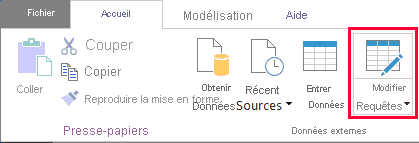
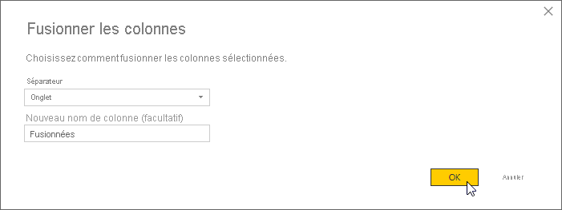
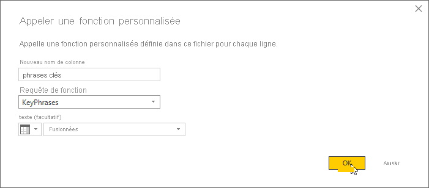
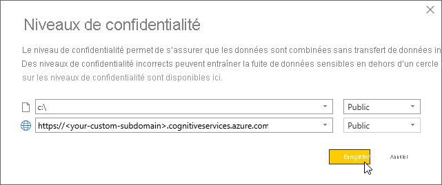
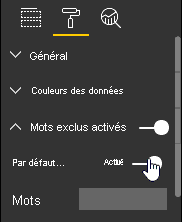
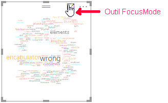
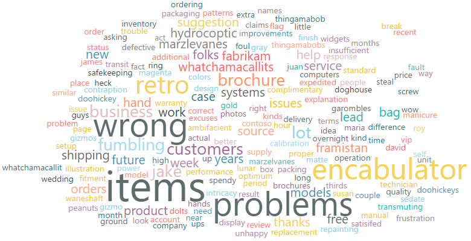

# <a name="tutorial-extract-key-phrases-from-text-stored-in-power-bi"></a>Didacticiel : Extraire les phrases clés de texte stocké dans Power BI

Microsoft Power BI Desktop est une application gratuite qui vous permet de vous connecter à vos données, de les transformer et de les visualiser. L’extraction de phrases clés, l’une des fonctionnalités d’Azure Cognitive Service for Language, permet le traitement en langage naturel. Dans un texte brut non structuré, il est capable d’extraire les phrases les plus importantes, d’analyser les sentiments et d’identifier les entités bien connues, telles que les marques. Utilisés conjointement, ces outils peuvent vous aider à identifier rapidement ce dont parlent vos clients, ainsi que leurs sentiments à ce sujet.

Ce didacticiel vous montre comment effectuer les opérations suivantes :

> [!div class="checklist"]
> * Utiliser Power BI Desktop pour importer et transformer des données
> * Créer une fonction personnalisée dans Power BI Desktop
> * Intégrez Power BI Desktop avec la fonctionnalité d’extraction de phrases clés d’Azure Cognitive Service for Language
> * Utilisez extraction de phrases clés pour obtenir les phrases les plus importantes des commentaires des clients
> * Créer un nuage de mots-clés à partir des commentaires clients

## <a name="prerequisites"></a>Prérequis

- Microsoft Power BI Desktop. [Téléchargez-le sans frais](https://powerbi.microsoft.com/get-started/).
- Un compte Microsoft Azure [Créez un compte gratuit](https://azure.microsoft.com/free/cognitive-services/) ou [connectez-vous](https://portal.azure.com/).
- Une ressource de langue. Si vous n’en avez pas, vous pouvez en [créer un](https://ms.portal.azure.com/#create/Microsoft.CognitiveServicesTextAnalytics).
- La [clé de ressource de langage](../../../cognitive-services-apis-create-account.md#get-the-keys-for-your-resource) générée pendant le processus d’inscription.
- Des commentaires de clients. Vous pouvez utiliser [nos exemples de données](https://aka.ms/cogsvc/ta) ou vos propres données. Ce tutoriel suppose que vous utilisez nos exemples de données.

## <a name="load-customer-data"></a>Charger des données client

Pour commencer, ouvrez Power BI Desktop et chargez le fichier CSV `FabrikamComments.csv` que vous avez téléchargé dans la section [Prérequis](#prerequisites). Ce fichier représente une journée d’activité hypothétique dans le forum de support d’une petite entreprise fictive.

> [!NOTE]
> Power BI peut utiliser les données issues d’une multitude de sources basées sur le web, telles que des bases de données SQL. Pour plus d’informations, consultez la [documentation de Power Query](/power-query/connectors/).

Dans la fenêtre principale de Power BI Desktop, sélectionnez le ruban **Accueil**. Dans le groupe **Données externes** du ruban, ouvrez le menu déroulant **Obtenir des données**, puis sélectionnez **Texte/CSV**.


La boîte de dialogue Ouvrir s’affiche. Accédez à votre dossier Téléchargements, ou au dossier dans lequel vous avez téléchargé le fichier `FabrikamComments.csv`. Cliquez sur `FabrikamComments.csv`, puis sur le bouton **Ouvrir**. La boîte de dialogue d’importation CSV s’affiche.


La boîte de dialogue d’importation CSV vous permet de vérifier que Power BI Desktop a correctement détecté le jeu de caractères, le délimiteur, les lignes d’en-tête et les types de colonnes. Ces informations sont toutes correctes. Vous pouvez donc cliquer sur **Charger**.

Pour visualiser les données chargées, cliquez sur le bouton **Vue de données** situé sur le bord gauche de l’espace de travail Power BI. Cette opération affiche une table contenant des données, comme dans Microsoft Excel.


## <a name="prepare-the-data"></a>Préparer les données

Vous pouvez avoir besoin de transformer vos données dans Power BI Desktop avant qu’elles ne soient prêtes à être traitées par l’extraction de phrases clés.

Les exemples de données contiennent une colonne `subject` et une colonne `comment`. Avec la fonction Fusionner les colonnes de Power BI Desktop, vous pouvez extraire des phrases clés à partir des données de ces deux colonnes, plutôt que de la colonne `comment` uniquement.

Dans Power BI Desktop, sélectionnez le ruban **Accueil**. Dans le groupe **Données externes**, cliquez sur **Modifier les requêtes**.



Sélectionnez `FabrikamComments` dans la liste **Requêtes** située sur le côté gauche de la fenêtre, si cette requête n’est pas encore sélectionnée.

À présent, sélectionnez à la fois la colonne `subject` et la colonne `comment` de la table. Vous devrez peut-être faire défiler l’écran horizontalement pour voir ces colonnes. Commencez par cliquer sur l’en-tête de la colonne `subject`, puis maintenez la touche CTRL enfoncée tout en cliquant sur l’en-tête de la colonne `comment`.


Sélectionnez le ruban **Transformer**. Dans le groupe **Colonne Texte** du ruban, cliquez sur **Fusionner les colonnes**. La boîte de dialogue Fusionner les colonnes s’affiche.



Dans la boîte de dialogue Fusionner les colonnes, choisissez `Tab` comme séparateur, puis cliquez sur **OK**.

Vous pouvez également envisager de filtrer les messages vides en utilisant le filtre Supprimer les éléments vides ou en supprimant les caractères non imprimables à l’aide de la transformation Nettoyer. Si vos données comportent une colonne comparable à la colonne `spamscore` de l’exemple de fichier, vous pouvez ignorer les commentaires « spam » à l’aide d’un filtre Nombre.

## <a name="understand-the-api"></a>Comprendre l’API

L’[extraction de phrases clés](https://westus.dev.cognitive.microsoft.com/docs/services/TextAnalytics-V3-1/operations/KeyPhrases) peut traiter jusqu’à mille documents texte par requête HTTP. Power BI traite généralement les enregistrements un par un. Par conséquent, dans ce tutoriel, chacun de vos appels à l’API ne contient qu’un seul document. Pour chaque document à traiter, l’API d’extraction de phrases clés nécessite les champs ci-dessous.

| Champ | Description |
| - | - |
| `id`  | Identificateur unique de ce document dans la requête. La réponse contient également ce champ. De cette façon, si vous traitez plusieurs documents, vous pouvez facilement associer les phrases clés extraites au document dont elles sont issues. Dans ce tutoriel, étant donné que vous ne traitez qu’un seul document par requête, vous pouvez coder en dur la valeur de `id` afin que celle-ci soit la même pour chaque requête.|
| `text`  | Texte à traiter. La valeur de ce champ provient de la colonne `Merged`que vous avez créée dans la [section précédente](#prepare-the-data), qui contient la combinaison de la ligne d’objet et du texte de commentaire. L’API d’extraction de phrases clés exige que ces données ne dépassent pas 5 120 caractères.|
| `language` | Code représentant le langage naturel dans lequel le document est écrit. Tous les messages des exemples de données sont en anglais. Vous pouvez donc coder en dur la valeur `en` pour ce champ.|

## <a name="create-a-custom-function"></a>Créer une fonction personnalisée

Vous êtes désormais prêt à créer la fonction personnalisée qui doit intégrer Power BI et l’extraction de phrases clés. La fonction reçoit le texte à traiter sous la forme d’un paramètre. Elle effectue des conversions de données vers et à partir du format JSON, et adresse la requête HTTP à l’API d’extraction des phrases clés. La fonction analyse alors la réponse de l’API et retourne une chaîne contenant une liste de phrases clés extraites, séparées par des virgules.

> [!NOTE]
> Les fonctions Power BI Desktop personnalisées sont écrites en [langage de formule M Power Query](/powerquery-m/power-query-m-reference), abrégé sous l’appellation « M ». M est un langage de programmation fonctionnel basé sur [F#](/dotnet/fsharp/). Toutefois, vous n’avez pas besoin d’être programmeur pour terminer ce didacticiel ; le code requis est inclus ci-après.

Dans Power BI Desktop, vérifiez que vous vous trouvez toujours dans la fenêtre Éditeur de requête. Si ce n’est pas le cas, sélectionnez le ruban **Accueil**, puis, dans le groupe **Données externes**, cliquez sur **Modifier les requêtes**.

Sur le ruban **Accueil**, dans le groupe **Nouvelle requête**, ouvrez le menu déroulant **Nouvelle source**, puis sélectionnez **Requête vide**. 

Une nouvelle requête, initialement nommée `Query1`, apparaît dans la liste Requêtes. Double-cliquez sur cette entrée et renommez-la `KeyPhrases`.

À présent, sur le ruban **Accueil**, dans le groupe **Requête**, cliquez sur **Éditeur avancé** pour ouvrir la fenêtre correspondante. Supprimez le code figurant déjà dans cette fenêtre, puis collez le code suivant. 

> [!NOTE]
> Remplacez l’exemple de point de terminaison ci-dessous (contenant `<your-custom-subdomain>`) par le point de terminaison généré pour votre ressource Language. Pour trouver ce point de terminaison, connectez-vous au [portail Azure](https://azure.microsoft.com/features/azure-portal/), accédez à votre ressource, puis sélectionnez **Clé et point de terminaison**.


```fsharp
// Returns key phrases from the text in a comma-separated list
(text) => let
    apikey      = "YOUR_API_KEY_HERE",
    endpoint    = "https://<your-custom-subdomain>.cognitiveservices.azure.com/text/analytics" & "/v3.0/keyPhrases",
    jsontext    = Text.FromBinary(Json.FromValue(Text.Start(Text.Trim(text), 5000))),
    jsonbody    = "{ documents: [ { language: ""en"", id: ""0"", text: " & jsontext & " } ] }",
    bytesbody   = Text.ToBinary(jsonbody),
    headers     = [#"Ocp-Apim-Subscription-Key" = apikey],
    bytesresp   = Web.Contents(endpoint, [Headers=headers, Content=bytesbody]),
    jsonresp    = Json.Document(bytesresp),
    keyphrases  = Text.Lower(Text.Combine(jsonresp[documents]{0}[keyPhrases], ", "))
in  keyphrases
```

Remplacez `YOUR_API_KEY_HERE` par votre clé de ressource Language. Vous pouvez aussi trouver cette clé en vous connectant au [portail Azure](https://azure.microsoft.com/features/azure-portal/), en accédant à votre ressource Langage, puis en sélectionnant la page **Clé et point de terminaison**. Veillez à conserver les guillemets situés avant et après la clé. Puis cliquez sur **Terminé**.

## <a name="use-the-custom-function"></a>Utiliser la fonction personnalisée

À présent, vous pouvez utiliser la fonction personnalisée pour obtenir les phrases clés figurant dans chacun des commentaires clients et pour les stocker dans une nouvelle colonne de la table. 

Dans Power BI Desktop, dans la fenêtre Éditeur de requête, revenez à la requête `FabrikamComments`. Sélectionnez le ruban **Ajouter une colonne**. Dans le groupe **Général**, cliquez sur **Appeler une fonction personnalisée**.

<br><br>

La boîte de dialogue Appeler une fonction personnalisée s’affiche. Dans **Nouveau nom de colonne**, entrez `keyphrases`. Dans **Requête de fonction**, sélectionnez la fonction personnalisée que vous avez créée (`KeyPhrases`).

Un nouveau champ s’affiche dans la boîte de dialogue : **Texte (facultatif)** . Dans ce champ, vous devez entrer la colonne que vous souhaitez utiliser dans le but de fournir des valeurs pour le paramètre `text` de l’API d’extraction de phrases clés. N’oubliez pas que vous avez déjà codé en dur les valeurs des paramètres `language` et `id`. Dans le menu déroulant, sélectionnez `Merged` (la colonne que vous avez créée [précédemment](#prepare-the-data) en fusionnant les champs d’objet et de message).



Pour finir, cliquez sur **OK**.

Si tout est prêt, Power BI appelle votre fonction personnalisée une fois pour chaque ligne de la table. Il envoie les requêtes à l’API d’extraction de phrases clés, et ajoute une colonne à la table pour stocker les résultats. Toutefois, avant l’exécution de ce processus, vous pouvez avoir besoin de spécifier les paramètres d’authentification et de confidentialité.

## <a name="authentication-and-privacy"></a>Authentification et confidentialité

Une fois que vous avez fermé la boîte de dialogue Appeler une fonction personnalisée, il est possible qu’une bannière s’affiche pour vous inviter à spécifier le mode de connexion à l’API d’extraction de phrases clés.


Cliquez sur **Modifier les informations d’identification**, vérifiez que `Anonymous` est sélectionné dans la boîte de dialogue, puis cliquez sur **Se connecter**. 

> [!NOTE]
> Vous devez sélectionner `Anonymous`, car ll’extraction de phrases clés authentifie les demandes à l’aide de votre clé d’accès. Par conséquent, Power BI n’a pas besoin de fournir d’informations d’identification pour la requête HTTP proprement dite.

> [!div class="mx-imgBorder"]
> 

Si la bannière Modifier les informations d’identification reste visible même après avoir choisi l’accès anonyme, il se peut que vous ayez oublié de coller votre clé de ressource Langage dans le code de la [fonction personnalisée](#create-a-custom-function) `KeyPhrases`.

Ensuite, une bannière peut vous inviter à fournir des informations sur la confidentialité de vos sources de données. 


Cliquez sur **Continuer**, puis choisissez `Public` pour chacune des sources de données de la boîte de dialogue. Ensuite, cliquez sur **Enregistrer**.



## <a name="create-the-word-cloud"></a>Créer le nuage de mots-clés

Une fois que vous avez géré les bannières qui s’affichent, cliquez sur **Fermer et appliquer** dans le ruban Accueil pour fermer l’Éditeur de requête.

Power BI Desktop consacre quelques minutes à l’exécution des requêtes HTTP nécessaires. Pour chaque ligne de la table, la nouvelle colonne `keyphrases` contient les expressions clés détectées dans le texte par l’API Expressions clés. 

Vous allez utiliser cette colonne pour générer un nuage de mots-clés. Pour commencer, cliquez sur le bouton **Rapport** dans la fenêtre principale de Power BI Desktop, à gauche de l’espace de travail.

> [!NOTE]
> Pourquoi utiliser les expressions clés extraites pour générer un nuage de mots, plutôt que le texte complet de chaque commentaire ? Les expressions clés nous précisent les mots *importants* des commentaires de nos clients, et non simplement les *mots les plus courants*. En outre, le dimensionnement des mots dans le nuage résultant n’est pas faussé par l’usage fréquent d’un mot dans un nombre de commentaires relativement faible.

Si vous n’avez pas encore installé l’objet visuel personnalisé Word Cloud, installez-le. Dans le panneau Visualisations à droite de l’espace de travail, cliquez sur les points de suspension ( **...** ) et choisissez **Import From Market** (Importer à partir du marché). Si le mot « cloud » ne figure pas parmi les outils de visualisation de la liste, vous pouvez rechercher « cloud », puis cliquer sur le bouton **Ajouter** en regard de l’objet visuel Cloud Word (Nuage de mots). Power BI installe le visuel Word Cloud et vous avertit lorsque l’installation est terminée.

<br><br>

Commencez par cliquer sur l’icône Word Cloud dans le panneau Visualisations.


Un nouveau rapport s’affiche dans l’espace de travail. Faites glisser le champ `keyphrases` du panneau Champs vers le champ Catégorie du volet Visualisations. Le nuage de mots apparaît à l’intérieur du rapport.

Passez maintenant à la page Format du panneau Visualisations. Dans la catégorie Mots vides, activez l’option **Mots vides par défaut** pour éliminer du nuage les mots courants courts tels que « de ». Toutefois, étant donné que nous visualisons des expressions clés, il est possible qu’elles ne contiennent pas de mots vides.



Un peu plus bas dans ce panneau, désactivez les options **Faire pivoter le texte** et **Titre**.



Cliquez sur l’outil Mode Focus dans le rapport pour améliorer l’aspect de votre nuage de mots. L’outil développe le nuage de mots afin qu’il remplisse la totalité de l’espace de travail, comme illustré ci-après.



## <a name="using-other-features"></a>Utilisation d’autres fonctionnalités

Azure Cognitive Service for Language fournit également une analyse des sentiments et une détection des langues. La détection de la langue se révèle particulièrement utile si les commentaires de vos clients ne sont pas tous en anglais.

Ces deux autres API sont très semblables à l’API d’extraction de phrases clés. Cela signifie que vous pouvez les intégrer à Power BI Desktop à l’aide de fonctions personnalisées qui sont presque identiques à celle que vous avez créée dans ce tutoriel. Il vous suffit de créer une requête vide et de coller le code approprié ci-après dans l’Éditeur avancé, comme vous l’avez fait précédemment. (N’oubliez pas votre clé d’accès !) Ensuite, comme auparavant, utilisez la fonction pour ajouter une nouvelle colonne à la table.

La fonction Analyse des sentiments ci-après retourne une étiquette évaluant le caractère positif du sentiment exprimé dans le texte.

```fsharp
// Returns the sentiment label of the text, for example, positive, negative or mixed.
(text) => let
    apikey = "YOUR_API_KEY_HERE",
    endpoint = "<your-custom-subdomain>.cognitiveservices.azure.com" & "/text/analytics/v3.1/sentiment",
    jsontext = Text.FromBinary(Json.FromValue(Text.Start(Text.Trim(text), 5000))),
    jsonbody = "{ documents: [ { language: ""en"", id: ""0"", text: " & jsontext & " } ] }",
    bytesbody = Text.ToBinary(jsonbody),
    headers = [#"Ocp-Apim-Subscription-Key" = apikey],
    bytesresp = Web.Contents(endpoint, [Headers=headers, Content=bytesbody]),
    jsonresp = Json.Document(bytesresp),
    sentiment   = jsonresp[documents]{0}[sentiment] 
    in sentiment
```

Voici deux versions d’une fonction Détection de langue. La première retourne le code de langue ISO (par exemple, `en` pour l’anglais), alors que la seconde retourne le nom « convivial » de la langue (par exemple, `English`). Vous pouvez constater que seule la dernière ligne du corps diffère entre les deux versions.

```fsharp
// Returns the two-letter language code (for example, 'en' for English) of the text
(text) => let
    apikey      = "YOUR_API_KEY_HERE",
    endpoint    = "https://<your-custom-subdomain>.cognitiveservices.azure.com" & "/text/analytics/v3.1/languages",
    jsontext    = Text.FromBinary(Json.FromValue(Text.Start(Text.Trim(text), 5000))),
    jsonbody    = "{ documents: [ { id: ""0"", text: " & jsontext & " } ] }",
    bytesbody   = Text.ToBinary(jsonbody),
    headers     = [#"Ocp-Apim-Subscription-Key" = apikey],
    bytesresp   = Web.Contents(endpoint, [Headers=headers, Content=bytesbody]),
    jsonresp    = Json.Document(bytesresp),
    language    = jsonresp [documents]{0}[detectedLanguage] [iso6391Name] in language 
```
```fsharp
// Returns the name (for example, 'English') of the language in which the text is written
(text) => let
    apikey      = "YOUR_API_KEY_HERE",
    endpoint    = "https://<your-custom-subdomain>.cognitiveservices.azure.com" & "/text/analytics/v3.1/languages",
    jsontext    = Text.FromBinary(Json.FromValue(Text.Start(Text.Trim(text), 5000))),
    jsonbody    = "{ documents: [ { id: ""0"", text: " & jsontext & " } ] }",
    bytesbody   = Text.ToBinary(jsonbody),
    headers     = [#"Ocp-Apim-Subscription-Key" = apikey],
    bytesresp   = Web.Contents(endpoint, [Headers=headers, Content=bytesbody]),
    jsonresp    = Json.Document(bytesresp),
    language    jsonresp [documents]{0}[detectedLanguage] [iso6391Name] in language 
```

Pour finir, voici une variante de la fonction Expressions clés déjà présentée qui renvoie les expressions sous la forme d’un objet de liste, plutôt qu’au moyen d’une chaîne unique d’expressions séparées par des virgules. 

> [!NOTE]
> Le renvoi d’une chaîne unique contribuait à simplifier notre exemple de nuage de mots. En revanche, une liste vous offre un surcroît de souplesse lorsque vous travaillez sur les expressions renvoyées dans Power BI. Vous pouvez manipuler les objets de liste dans Power BI Desktop à l’aide du groupe Colonne structurée dans le ruban Transformation de l’Éditeur de requête.

```fsharp
// Returns key phrases from the text as a list object
(text) => let
    apikey      = "YOUR_API_KEY_HERE",
    endpoint    = "https://<your-custom-subdomain>.cognitiveservices.azure.com" & "/text/analytics/v3.1/keyPhrases",
    jsontext    = Text.FromBinary(Json.FromValue(Text.Start(Text.Trim(text), 5000))),
    jsonbody    = "{ documents: [ { language: ""en"", id: ""0"", text: " & jsontext & " } ] }",
    bytesbody   = Text.ToBinary(jsonbody),
    headers     = [#"Ocp-Apim-Subscription-Key" = apikey],
    bytesresp   = Web.Contents(endpoint, [Headers=headers, Content=bytesbody]),
    jsonresp    = Json.Document(bytesresp),
    keyphrases  = jsonresp[documents]{0}[keyPhrases]
in  keyphrases
```

## <a name="next-steps"></a>Étapes suivantes

En savoir plus sur Azure Cognitive Service for Language, le langage de formule Power Query M ou Power BI.

* [Vue d’ensemble d’Azure Cognitive Service for Language](../../overview.md)
* [Informations de référence sur le langage M Power Query](/powerquery-m/power-query-m-reference)
* [Documentation Power BI](https://powerbi.microsoft.com/documentation/powerbi-landing-page/)
