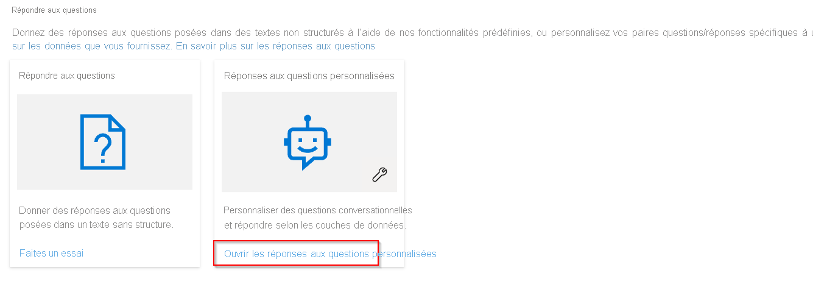
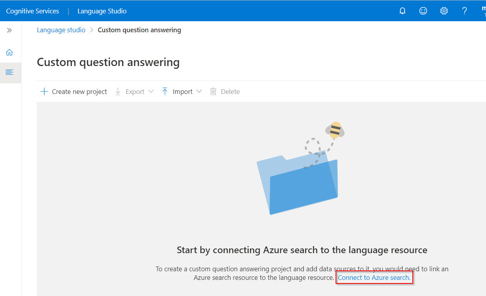
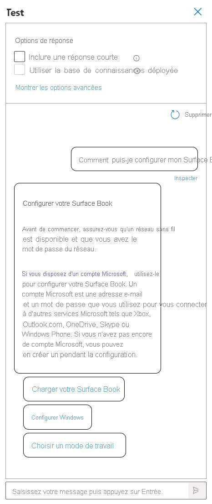
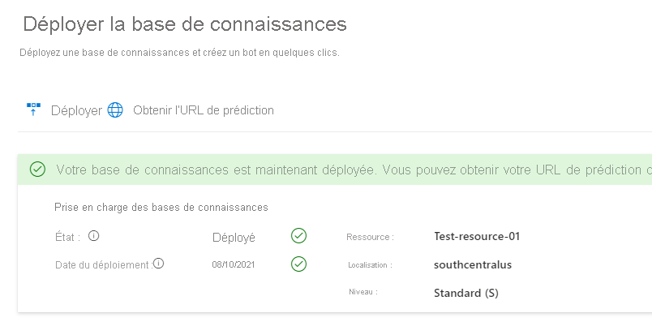

Vous pouvez créer un projet de réponse aux questions à partir de votre propre contenu, tel que des FAQ ou des manuels de produit. Cet article contient un exemple de création de projet de réponse aux questions à partir d’un manuel de produit, pour répondre à des questions.

## Prérequis

> [!div class="checklist"]
> * Si vous n’avez pas d’abonnement Azure, créez un [compte gratuit](https://azure.microsoft.com/free/cognitive-services/) avant de commencer.
> * Une [ressource de langage](https://aka.ms/create-language-resource) avec la fonctionnalité Réponse aux questions personnalisée activée. Rappelez-vous l’ID Azure Active Directory, l’abonnement et le nom de ressource de langage que vous avez sélectionnés au moment de créer la ressource.

## Créer votre premier projet de réponse aux questions

1. Connectez-vous à [Language Studio](https://language.azure.com/) avec vos informations d’identification Azure.

2. Faites défiler jusqu’à la section **Answer questions** et sélectionnez **Open custom question answering**.

    > [!div class="mx-imgBorder"]
    > 

3. Si votre ressource n’est pas encore connectée à Recherche Azure, sélectionnez **Connect to Azure Search**. Un nouvel onglet de navigateur s’ouvre dans le volet **Fonctionnalités** de votre ressource dans le portail Azure.

    > [!div class="mx-imgBorder"]
    > 

4. Sélectionnez **Enable custom question answering**, choisissez la ressource Recherche Azure à lier, puis sélectionnez **Appliquer**.

    > [!div class="mx-imgBorder"]
    > 

5. Revenez à l’onglet Language Studio. Vous devrez peut-être actualiser cette page pour qu’elle affiche la modification apportée à votre ressource. Sélectionnez **Create new project**.

6. Choisissez l’option **I want to set the language for all projects created in this resource** > sélectionnez **English** > **Next**.

7. Entrez le nom de projet **Exemple-de-projet**, la description **Mon premier projet de réponses aux questions** et laissez la réponse par défaut avec le paramètre **No answer found**.

8. Passez en revue vos choix, puis sélectionnez **Create project**.

9. Dans la page **Manage sources**, sélectionnez **Add source** > **URLS**.

10. Sélectionnez **Add url**, entrez les valeurs suivantes, puis sélectionnez **Add all** :

    |Nom de l’URL|Valeur de l’URL|
    |--------|---------|
    |Guide de l’utilisateur Surface Book |https://download.microsoft.com/download/7/B/1/7B10C82E-F520-4080-8516-5CF0D803EEE0/surface-book-user-guide-EN.pdf |

    Le processus d’extraction prend quelques minutes pour lire le document et identifier les questions et réponses.

    Après avoir ajouté la source, vous pouvez modifier son contenu pour ajouter d’autres jeux de réponses aux questions personnalisées.

## Tester votre projet

1. Sélectionnez le lien vers votre source pour ouvrir la page de modification de la base de connaissances.

2. Sélectionnez **Test** dans la barre de menus > Entrez la question **Comment faire pour configurer mon Surface Book ?** . Une réponse sera générée en fonction des paires de réponses aux questions qui ont été automatiquement identifiées et extraites de votre URL source :

    > [!div class="mx-imgBorder"]
    > 

    Si vous cochez la case pour **inclure une réponse brève**, vous verrez également une réponse précise, si elle est disponible, ainsi que le passage de la réponse dans le volet test lorsque vous posez une question.

3. Sélectionnez **Inspect** pour examiner la réponse plus en détail. La fenêtre de test est utilisée pour tester vos modifications apportées à votre projet avant de déployer votre projet.

    > [!div class="mx-imgBorder"]
    > 

    À partir de l’interface **Inspect**, vous pouvez voir le niveau de confiance de cette réponse à la question, et modifier directement une paire de réponse question/réponse.

## Déployez votre projet

1. Sélectionnez l’icône Déployer la base de connaissances pour accéder au menu de déploiement de la base de connaissances.

    > [!div class="mx-imgBorder"]
    > 

    Lorsque vous déployez un projet, le contenu de votre projet passe de l’index `test` à un index `prod` dans Recherche Azure.

2. Sélectionnez **Deploy** > et, à l’invite, sélectionnez à nouveau **Déployer**.

    > [!div class="mx-imgBorder"]
    > 

    Votre projet a été déployé avec succès. Vous pouvez utiliser le point de terminaison pour répondre aux questions dans votre propre application personnalisée ou dans un bot.
