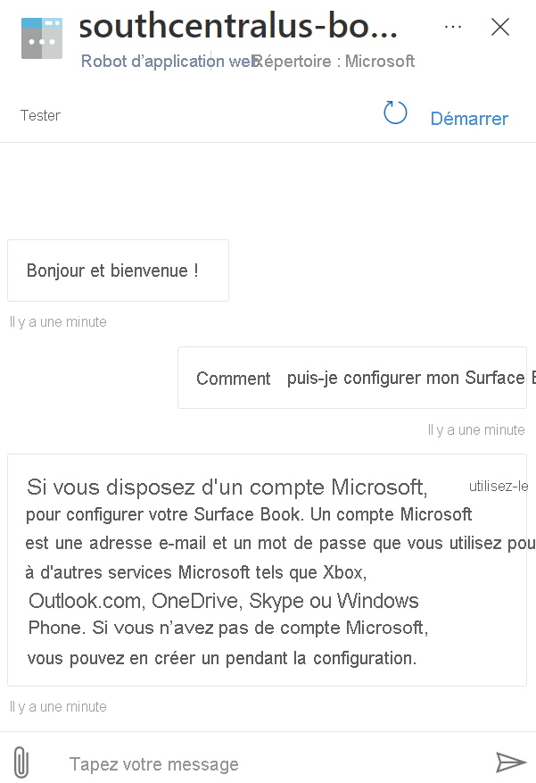
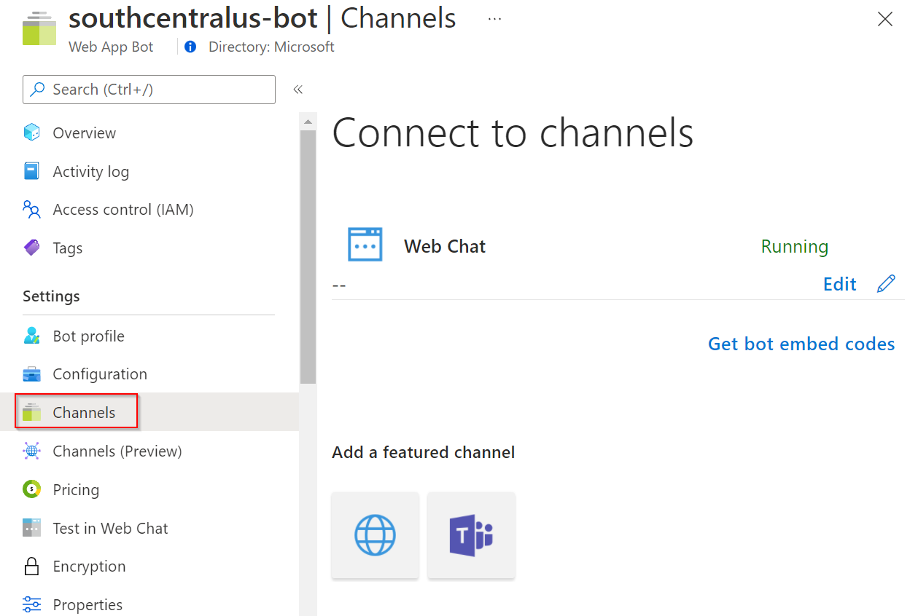

# Tutoriel : Créer un bot de FAQ

Tutoriel : Créer un bot de FAQ avec les réponses aux questions et [Azure Bot Service](https://azure.microsoft.com/services/bot-service/) sans code.

Dans ce tutoriel, vous allez apprendre à :

<!-- green checkmark -->
> [!div class="checklist"]
> * Lier un projet de réponses aux questions/base de connaissances à une instance Azure Bot Service
> * Déployer un bot
> * Converser avec le bot dans un webchat
> * Activer le bot dans les canaux pris en charge

## Créer et publier une base de connaissances

Suivez l’[article de prise en main](../how-to/create-test-deploy.md). Une fois que la base de connaissances a été déployée avec succès, vous êtes prêt à commencer à suivre cet article.

## Créer un bot

Après avoir déployé votre projet/base de connaissances, vous pouvez créer un bot à partir de la page **Déployer la base de connaissances** :

* Vous pouvez créer plusieurs bots rapidement, tous pointant vers la même base de connaissances pour différentes régions ou différents plans tarifaires pour les bots individuels.

* Quand vous apportez des modifications à la base de connaissances et que vous redéployez, aucune autre action n’est nécessaire avec le bot. Il est déjà configuré pour fonctionner avec la base de connaissances et il fonctionne avec toutes les modifications futures de la base de connaissances. Chaque fois que vous publiez une base de connaissances, tous les bots qui y sont connectés sont automatiquement mis à jour.

1. Dans le portail Language Studio, sur la page **Déployer la base de connaissances** des réponses aux questions, sélectionnez **Créer un bot**.

    > [!div class="mx-imgBorder"]
    > 

1. Un nouvel onglet de navigateur s’ouvre pour le portail Azure, avec la page de création d’Azure Bot Service. Configurez le service bot Azure.

    |Paramètre |Valeur|
    |----------|---------|
    | Descripteur du bot| Identificateur unique du bot. Cette valeur doit être différente du nom de votre application |
    | Abonnement | Sélectionnez votre abonnement |
    | Resource group | Sélectionnez un groupe de ressources existant ou créez-en un |
    | Location | Sélectionnez votre emplacement souhaité |
    | Niveau tarifaire | Sélection du niveau tarifaire |
    |Nom de l’application | Nom du service d’application pour votre bot |
    |Langage du SDK | C# ou Node.js. Une fois le bot créé, vous pouvez télécharger le code dans votre environnement de développement local et poursuivre le processus de développement. |
    | Clé d’authentification QnA | Cette clé est automatiquement renseignée pour le projet de réponses aux questions/base de connaissances déployé |
    | Plan App Service/Emplacement | Cette valeur est automatiquement remplie, ne la modifiez pas |

1. Une fois le bot créé, ouvrez la ressource **Service Bot**.
1. Sous **Paramètres**, sélectionnez **Tester dans Chat Web**.

    > [!div class="mx-imgBorder"]
    > 

1. À l’invite de chat **Tapez votre message**, entrez :

    `How do I setup my surface book?`

    Le chatbot répond avec une réponse provenant de votre base de connaissances.

    > [!div class="mx-imgBorder"]
    > 

## Intégrer le bot à des canaux

Sélectionnez **Canaux** dans la ressource Bot Service que vous avez créée. Vous pouvez activer le bot dans des [canaux supplémentaires pris en charge](/azure/bot-service/bot-service-manage-channels).

   >[!div class="mx-imgBorder"]
   >

## Nettoyer les ressources

Si vous n’envisagez pas de continuer à utiliser cette application, supprimez les ressources de service bot et de réponses aux questions associées.

## Étapes suivantes

Passez à l’article suivant pour découvrir comment personnaliser votre bot de FAQ avec des invites multitours.
> [!div class="nextstepaction"]
> [Invites multitours](guided-conversations.md)
