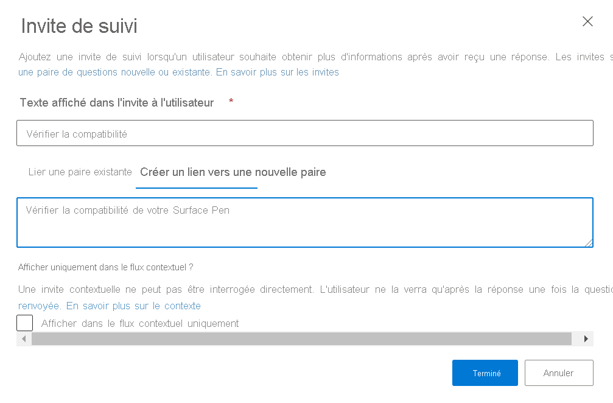
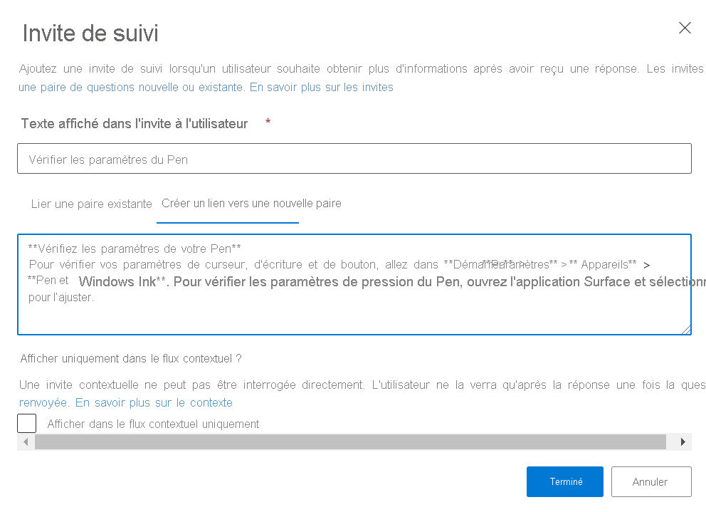
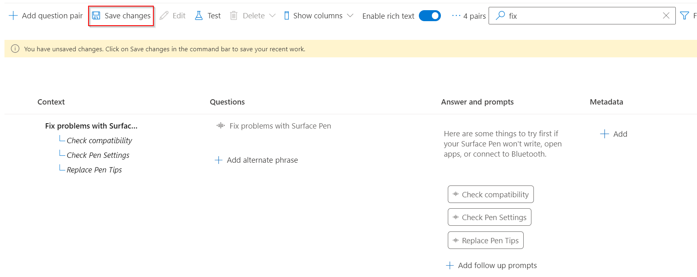
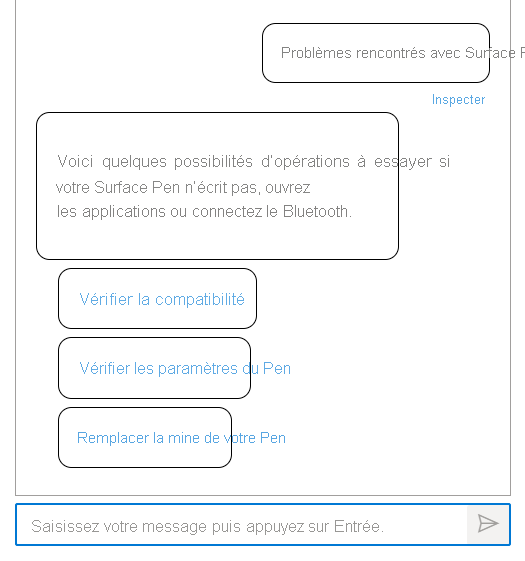

# Ajouter des conversations guidées avec des invites multitours

Dans ce tutoriel, vous allez apprendre à :

> [!div class="checklist"]
> * Ajouter de nouvelles paires de questions/réponses à votre projet existant
> * Ajouter des invites de suivi pour créer des conversations guidées
> * Tester vos invites multitours

## Prérequis

 Dans ce tutoriel, nous utilisons la [FAQ relative au stylet Surface](https://support.microsoft.com/surface/how-to-use-your-surface-pen-8a403519-cd1f-15b2-c9df-faa5aa924e98) pour créer une base de connaissances.

Si vous n’avez jamais créé de projet de réponses aux questions, nous vous recommandons de commencer par l’article de [prise en main](../how-to/create-test-deploy.md), qui vous guidera pas à pas dans le processus.

## Afficher le contexte de la paire réponse/question

Pour cet exemple, supposons que les utilisateurs demandent des détails supplémentaires sur le stylet Surface, en particulier comment résoudre les problèmes liés à leur stylet, mais qu’ils n’obtiennent pas les bonnes réponses. Nous ajoutons donc des invites pour prendre en charge d’autres scénarios et guider les utilisateurs vers les bonnes réponses à l’aide d’invites multitours.

Vous pouvez afficher les invites multitours associées aux paires de questions et réponses en sélectionnant **Afficher les colonnes** > **Contexte**. Par défaut, ceci doit déjà être activé dans la page **Modifier la base de connaissances** dans l’interface de réponses aux questions Language Studio.

> [!div class="mx-imgBorder"]
> 

Ceci affiche l’arborescence de contexte dans laquelle toutes les invites de suivi associées à une paire question/réponse sont affichées : 

> [!div class="mx-imgBorder"]
> 

## Ajouter une paire de questions avec des invites de suivi

Pour aider les utilisateurs à résoudre les problèmes liés à leur stylet Surface, nous ajoutons des invites de suivi :

- Ajoutez une nouvelle paire question/réponse avec deux invites de suivi.
- Ajoutez une invite de suivi à l’une des invites récemment ajoutées.

1. Ajoutez une nouvelle paire question/réponse avec deux invites de suivi **Vérifiez la compatibilité** et **Vérifiez les paramètres du stylet**. À l’aide de l’éditeur, nous ajoutons une nouvelle paire question/réponse avec une invite de suivi en cliquant sur **Ajouter une paire question/réponse**.

    > [!div class="mx-imgBorder"]
    > 
    
    Une nouvelle ligne dans **Éditorial** est créée, dans laquelle nous entrons la paire question/réponse comme indiqué ci-dessous :
    
    |Champ|Valeur|
    |-----|----|
    |Questions | Résoudre les problèmes rencontrés avec Surface |
    |Réponses et invites | Voici quelques éléments à essayer en premier si votre stylet Surface n’écrit pas, n’ouvre pas d’applications ou ne se connecte pas au Bluetooth.|
    
2. Nous ajoutons ensuite une invite de suivi à la paire question/réponse nouvellement créée en choisissant **Ajouter une invite de suivi**. Renseignez les détails de l’invite comme indiqué ci-dessous :
    
    > [!div class="mx-imgBorder"]
    > 
    
    Nous proposons **Vérifiez la compatibilité** comme « Texte d’affichage » pour l’invite et essayons de la lier à une question/réponse. Puisqu’aucune paire question/réponse n’est disponible pour être liée à l’invite, lorsque nous recherchons « Vérifiez la compatibilité de votre stylet Surface », nous créons une nouvelle paire question/réponse en cliquant sur **Créer un lien vers une nouvelle paire** et sélectionnons **Terminé**. Sélectionnez ensuite **Enregistrer les modifications**.
    
    > [!div class="mx-imgBorder"]
    > 
    
3. De même, nous ajoutons un autre invite **Vérifiez les paramètres du stylet** pour aider l’utilisateur à résoudre les problèmes liés à son stylet et y ajoutons une paire question/réponse.
    
    > [!div class="mx-imgBorder"]
    > 

4. Ajoutez une autre invite de suivi à l’invite qui vient d’être créée. Nous ajoutons maintenant « Remplacez la pointe du stylet » comme invite de suivi à l’invite « Vérifiez les paramètres du stylet » précédemment créée.

    > [!div class="mx-imgBorder"]
    > 
    
5. Enfin, nous enregistrons les modifications et testons ces invites dans le volet de **test** :
    
    > [!div class="mx-imgBorder"]
    > 
    
    Pour une requête de l’utilisateur intitulée **Problèmes avec le stylet Surface**, le système renvoie une réponse et présente les nouvelles invites à l’utilisateur. L’utilisateur sélectionne ensuite l’une des invites, **Vérifiez les paramètres du stylet**, et la réponse associée est renvoyée à l’utilisateur avec une autre invite, **Remplacez la pointe du stylet**, qui, lorsqu’elle est sélectionnée, fournit plus d’informations à l’utilisateur. Par conséquent, le multitour est utilisé pour aider et guider l’utilisateur vers la réponse souhaitée.
    
    > [!div class="mx-imgBorder"]
    > 

## Étapes suivantes

> [!div class="nextstepaction"]
> [Enrichir votre base de connaissances avec l’apprentissage actif](active-learning.md)
