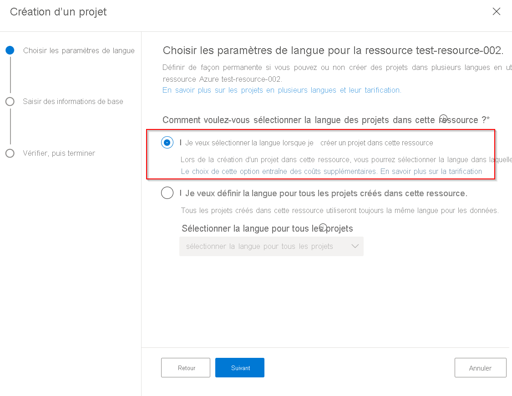

# Créer des projets dans plusieurs langues

Dans ce tutoriel, vous allez apprendre à :

<!-- green checkmark -->
> [!div class="checklist"]
> * Créer un projet qui prend en charge l’anglais.
> * Créer un projet qui prend en charge l’allemand.

Ce tutoriel vous guide tout au long du processus de création de projets/bases de connaissances dans plusieurs langues. Nous utilisons l’URL de la [FAQ relative au stylet Surface](https://support.microsoft.com/surface/how-to-use-your-surface-pen-8a403519-cd1f-15b2-c9df-faa5aa924e98) pour créer des projets en allemand et en anglais. Nous déployons ensuite le projet et utilisons l’API REST de réponse aux questions pour interroger et obtenir des réponses aux questions fréquentes dans la langue souhaitée.

## Créer un projet en allemand

Pour pouvoir créer un projet en plusieurs langues, le paramètre de langue multiple doit être défini lors de la création du premier projet associé à la ressource de langue.

> [!div class="mx-imgBorder"]
> 

1. Dans la page d’accueil de [Language Studio](https://aka.ms/languageStudio), sélectionnez les réponses aux questions personnalisées. Sélectionnez **Create new project** > **I want to select the language when I create a project in this resource** > **Next**.

2. Renseignez la page Enter basic information et sélectionnez **Next** > **Create project**.

    |Paramètre| Valeur|
    |---|----|
    |Nom | Nom unique de votre projet|
    |Description | Description unique pour aider à identifier le projet |
    |Langue source | Pour ce tutoriel, sélectionnez German |
    |Réponse par défaut | Réponse par défaut quand aucune réponse n’est retournée |

    > [!div class="mx-imgBorder"]
    > 

3. **Add source** > **URLs** > **Add url** > **Add all**.

    |Paramètre| Value |
    |----|------|
    | Nom de l’URL | Stylet Surface allemand |
    | URL | https://support.microsoft.com/de-de/surface/how-to-use-your-surface-pen-8a403519-cd1f-15b2-c9df-faa5aa924e98 |
    | Classifier la structure des fichiers | Détection automatique |
    
    La fonctionnalité de réponses aux questions lit le document et extrait les paires question/réponse à partir de l’URL source pour créer la base de connaissances ou le projet en allemand. Si vous sélectionnez le lien vers la source, la page de base de connaissances s’ouvre et vous permet de modifier le contenu.
    
    > [!div class="mx-imgBorder"]
    > 
    
## Créer un projet en anglais

Nous répétons maintenant les étapes ci-dessus mais cette fois, sélectionnez anglais et fournissez une URL en anglais comme source.

1. Dans [Language Studio](https://aka.ms/languageStudio), ouvrez la page de réponse aux questions > **Create new project**.

2. Renseignez la page Enter basic information et sélectionnez **Next** > **Create project**.

    |Paramètre| Valeur|
    |---|----|
    |Nom | Nom unique de votre projet|
    |Description | Description unique pour aider à identifier le projet |
    |Langue source | Pour ce tutoriel, sélectionnez English |
    |Réponse par défaut | Réponse par défaut quand aucune réponse n’est retournée |

3. **Add source** > **URLs** > **Add url** > **Add all**.

    |Paramètre| Value |
    |-----|-----|
    | Nom de l’URL | Stylet Surface allemand |
    | URL | https://support.microsoft.com/en-us/surface/how-to-use-your-surface-pen-8a403519-cd1f-15b2-c9df-faa5aa924e98 |
    | Classifier la structure des fichiers | Détection automatique |

## Déployer et interroger la base de connaissances

Nous sommes maintenant prêts à déployer les deux projets/bases de connaissances et à les interroger dans la langue de votre choix à l’aide de l’API REST de réponses aux questions. Une fois qu’un projet est publié, la page suivante s’affiche et fournit les détails pour interroger la base de connaissances.

> [!div class="mx-imgBorder"]
> 

La langue de la requête entrante de l’utilisateur peut être détectée grâce à l’[API Détection de langue](../../language-detection/how-to/call-api.md) et l’utilisateur peut appeler le point de terminaison et la base de connaissances appropriés en fonction de la langue détectée.
