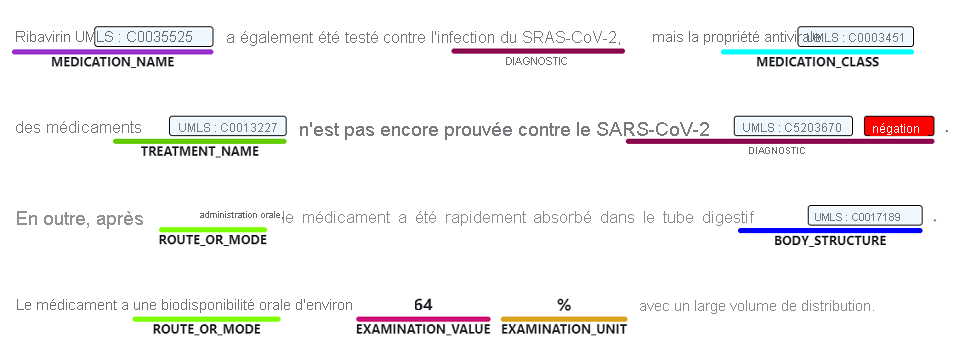
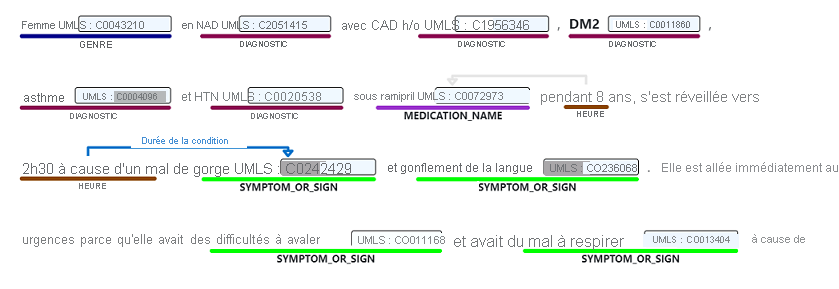

# [Reconnaissance d’entité nommée](#tab/ner)

La Reconnaissance d’entité nommée détecte les mots et les expressions mentionnés dans du texte non structuré qui peuvent être associés à un ou plusieurs types sémantiques, tels que le diagnostic, le nom de médicaments, le symptôme/le signe ou l’âge.

> [!div class="mx-imgBorder"]
> 

# [Extraction de relations](#tab/relation-extraction)

L’extraction de relations identifie les connexions pertinentes entre les concepts mentionnés dans le texte. Par exemple, une relation « temps de la condition » est trouvée en associant un nom de condition à un temps ou entre une abréviation et la description complète.  

> [!div class="mx-imgBorder"]
> 

# [Entity Linking](#tab/entity-linking)

La liaison d’entités distingue des entités distinctes en associant des entités nommées mentionnées dans du texte à des concepts trouvés dans une base de données de concepts prédéfinie, dont le système de langage médical unifié (UMLS). Les concepts médicaux reçoivent également un nom préféré comme forme de normalisation supplémentaire.

> [!div class="mx-imgBorder"]
> 

L’Analyse de texte pour la santé prend en charge la liaison avec le vocabulaire médical et biomédical figurant dans la source de connaissances Metathesaurus de l’[UMLS](https://www.nlm.nih.gov/research/umls/sourcereleasedocs/index.html) (Unified Medical Language System).

# [Détection d’assertion](#tab/assertion-detection) 

La signification du contenu médical est fortement affectée par les modificateurs, tels que la négation et les assertions conditionnelles, qui peuvent avoir une incidence critique en cas de mauvaise interprétation. L’analyse de texte pour la santé prend en charge trois catégories de détection d’assertion pour les entités dans le texte : 

* Certainty
* Logique conditionnelle
* Association

> [!div class="mx-imgBorder"]
> 

---
