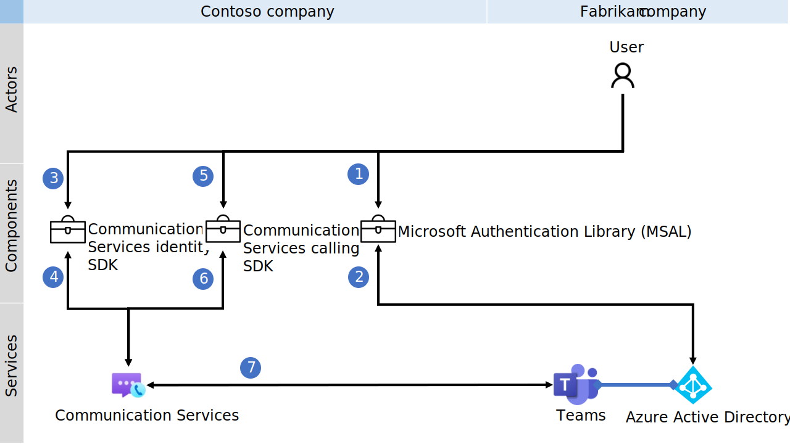

# Créer un point de terminaison personnalisé Teams

> [!IMPORTANT]
> Pour activer ou désactiver l’expérience de point de terminaison personnalisé Teams, [complétez et envoyez ce formulaire](https://forms.office.com/r/B8p5KqCH19).

Azure Communication Services permet de créer des points de terminaison personnalisés Teams afin de communiquer avec le client Microsoft Teams ou d’autres points de terminaison personnalisés Teams. Avec le point de terminaison personnalisé Teams, vous pouvez personnaliser la voix, la vidéo, la conversation et l’expérience de partage d’écran pour les utilisateurs Teams.

Vous pouvez utiliser le Kit de développement logiciel (SDK) Azure Communication Services Identity pour échanger des jetons d’accès Azure Active Directory (Azure AD) des utilisateurs Teams contre des jetons d’accès Communication Identity. Les diagrammes des sections suivantes illustrent les cas d’utilisation multi-locataire, où la société fictive Fabrikam est le client de la société fictive Contoso.

## Appel 

Les fonctionnalités de voix, vidéo et partage d’écran sont fournies via les kits de développement logiciel (SDK) Azure Communication Services Calling. Le diagramme suivant présente une vue d’ensemble du processus à suivre lorsque vous intégrez vos expériences d’appel à des points de terminaison personnalisés Teams.

## Conversation

Vous pouvez également utiliser des points de terminaison personnalisés Teams pour intégrer des fonctionnalités de conversation à l’aide d’API Graph. Pour plus d’informations sur l’API Graph, consultez la documentation sur le [type de ressource de conversation](/graph/api/channel-post-messages). 

## Autorisations Azure Communication Services

### Autorisations déléguées

|   Autorisation    |  Chaîne d'affichage   |  Description | Consentement de l'administrateur requis | Compte Microsoft pris en charge |
|:--- |:--- |:--- |:--- |:--- |
| _`https://auth.msft.communication.azure.com/VoIP`_ | Gérer les appels dans Teams | Démarrez, joignez, transférez ou quittez des appels Teams et mettez à jour les propriétés d’appel. | Non | Non |

### Autorisations de l’application

Aucune.

### Rôles pour l’octroi du consentement pour le compte d’une société

- Administrateur général
- Administrateur d’application (uniquement en version préliminaire privée)
- Administrateur d’application cloud (uniquement en version préliminaire privée)

## Étapes suivantes

> [!div class="nextstepaction"]
> [Émettre un jeton d’accès Teams](../quickstarts/manage-teams-identity.md)

En savoir plus sur [l’interopérabilité Teams](./teams-interop.md).
