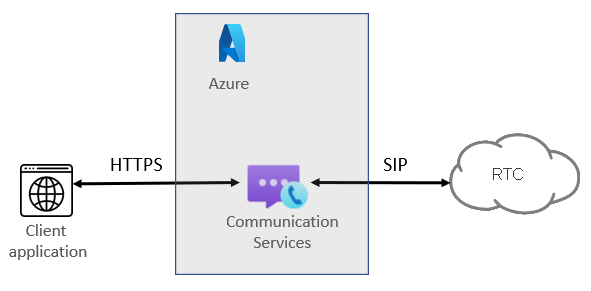
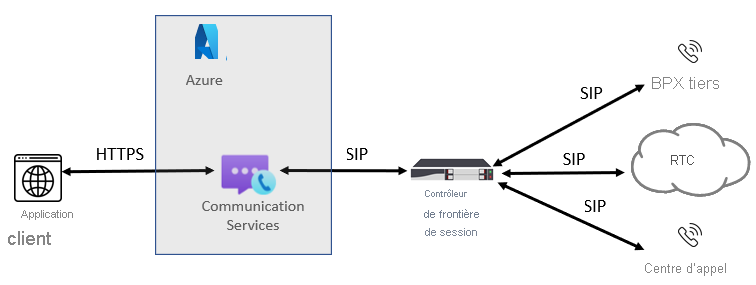

# Concepts de la téléphonie

[!INCLUDE [Regional Availability Notice](../../includes/regional-availability-include.md)]

Les kits SDK Appel Azure Communication Services peuvent être utilisés pour ajouter la téléphonie et le RTC à vos applications. Cette page récapitule les concepts et les fonctionnalités clés de la téléphonie. Pour plus d’informations sur les langages et les fonctionnalités spécifiques du kit SDK, consultez [bibliothèque d’appel](../../quickstarts/voice-video-calling/calling-client-samples.md).

## Vue d’ensemble de la téléphonie
Chaque fois que vos utilisateurs interagissent avec un numéro de téléphone traditionnel, les appels sont facilités par les appels vocaux RTCP (réseau téléphonique commuté public). Pour émettre et recevoir des appels RTPC, vous devez ajouter des fonctionnalités de téléphonie à votre ressource Azure Communication Services. Dans ce cas, la signalisation et le contenu multimédia utilisent une combinaison de technologies basées sur IP et RTPC pour connecter vos utilisateurs. Communication Services offre deux moyens discrets d’atteindre le réseau RTC : les appels vocaux (RTC) et le routage direct Azure.

### Appels vocaux (RTC)

Un moyen simple d’ajouter une connectivité RTCP à votre application ou service ; dans ce cas, Microsoft est votre fournisseur de télécommunication. Vous pouvez acheter des numéros directement auprès de Microsoft. Azure Cloud Calling est une solution de téléphonie entièrement cloud pour les services de communication. C’est l’option la plus simple qui connecte ACS au RTCP pour permettre les appels aux réseaux filaires et aux téléphones portables dans le monde entier. Avec cette option, Microsoft agit comme opérateur RTCP, comme le montre le diagramme suivant :

Si vous répondez « oui » à ce qui suit, les appels vocaux (RTC) sont la bonne solution pour vous :
- Les appels vocaux (RTC) sont disponibles dans votre région.
- Vous n’avez pas besoin de conserver votre opérateur RTCP actuel.
- Vous voulez utiliser l’accès géré par Microsoft au RTCP.

Avec cette option :
- Vous recevez des numéros directement de Microsoft et vous pouvez appeler des téléphones dans le monde entier.
- Vous n’avez pas besoin de déploiement ou de maintenance d’un déploiement local, car les appels vocaux (RTC) fonctionnent à partir d’Azure Communication Services.
- Remarque : Si nécessaire, vous pouvez choisir de connecter un SBC pris en charge via le routage direct Azure pour l’interopérabilité avec des PABX de tiers, des appareils analogiques et d’autres équipements de téléphonie de tiers pris en charge par le SBC.

Cette option nécessite une connexion sans interruptions à Azure Communication Services.

### Routage direct Azure

[!INCLUDE [Private Preview Notice](../../includes/private-preview-include.md)]

Avec cette option, vous pouvez connecter la téléphonie locale héritée et l’opérateur de votre choix à Azure Communication Services. Elle fournit des fonctionnalités d’appel RTC à vos applications ACS, même les appels vocaux (RTC) ne sont pas disponibles dans votre pays/région. 

Si vous répondez « oui » à une des questions suivantes, le routage direct Azure est la bonne solution pour vous :

- Vous voulez utiliser ACS avec des fonctionnalités d’appel RTCP.
- Vous devez conserver votre opérateur RTCP actuel.
- Vous voulez combiner le routage, avec certains appels passant par la technologie des appels vocaux (RTC) et d’autres passant par votre opérateur.
- Vous devez interagir avec des PABX et/ou des équipements de tiers, comme des haut-parleurs de plafond, des appareils analogiques, etc.

Avec cette option :

- Vous connectez vos propres SBC pris en charge à Azure Communication Services sans avoir besoin de logiciels locaux supplémentaires.
- Vous pouvez utiliser absolument n’importe quel opérateur de téléphonie avec ACS.
- Vous pouvez choisir de configurer et de gérer cette option, ou bien elle peut être configurée et gérée par votre opérateur ou votre partenaire (demandez si votre opérateur ou votre partenaire fournit cette option).
- Vous pouvez configurer l’interopérabilité entre votre équipement de téléphonie, par exemple un PABX et des appareils analogiques de tiers, et ACS.

Cette option nécessite les conditions suivantes :

- Une connexion sans interruptions à Azure.
- Le déploiement et la maintenance d’un SBC pris en charge.
- Un contrat avec un opérateur tiers. (Sauf s’ils sont déployés en tant qu’option pour fournir une connexion à un PABX de tiers, à des appareils analogiques ou à d’autres équipements de téléphonie pour des utilisateurs qui sont sur Communication Services.)

## Étapes suivantes

### Documentation conceptuelle

- [Types de numéros de téléphone dans Azure Communication Services](./plan-solution.md)
- [Planifier le routage direct Azure](./sip-interface-infrastructure.md)
- [Tarification](../pricing.md)

### Démarrages rapides

- [Obtenir un numéro de téléphone](../../quickstarts/telephony-sms/get-phone-number.md)
- [Appel à un téléphone](../../quickstarts/voice-video-calling/pstn-call.md)
