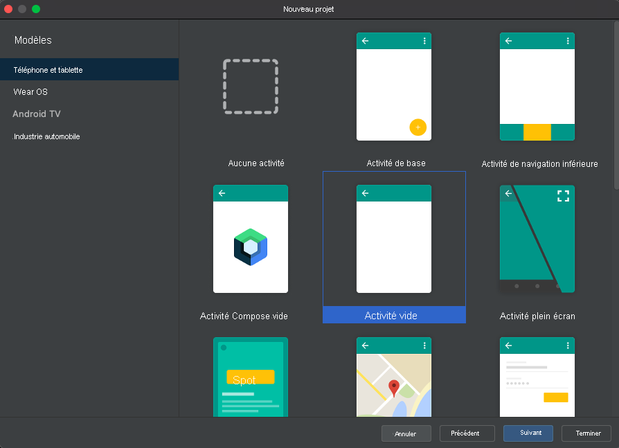
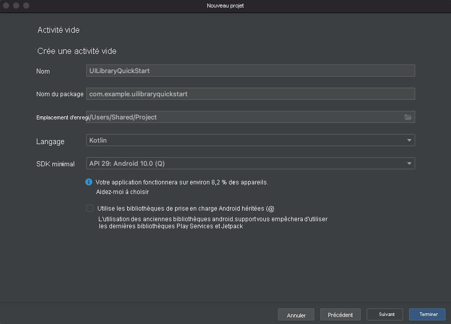

## <a name="prerequisites"></a>Prérequis

- Compte Azure avec un abonnement actif. [Créez un compte gratuitement](https://azure.microsoft.com/free/?WT.mc_id=A261C142F).
- Un OS exécutant [Android Studio](https://developer.android.com/studio).
- Une ressource Communication Services déployée. [Créez une ressource Communication Services](../../../create-communication-resource.md).
- Jeton Azure Communication Services. Consultez l’[exemple](../../../identity/quick-create-identity.md) 

## <a name="setting-up"></a>Configuration

### <a name="creating-an-android-app-with-an-empty-activity"></a>Création d’une application Android avec une activité vide

Dans Android Studio, créez un projet et sélectionnez le fichier `Empty Activity`.



Cliquez sur le bouton `Next`, nommez le projet `UILibraryQuickStart`, affectez au langage la valeur `Java/Kotlin`, puis sélectionnez le kit SDK minimal « API 23 : Android 6.0 (Marshmallow) » ou une version ultérieure.



Cliquez sur `Finish`.

## <a name="maven-repository-credentials"></a>Informations d’identification du dépôt Maven

- Vous devez fournir votre jeton d’accès personnel pour lequel l’étendue read:packages est sélectionnée.
- Vous devrez peut-être activer l’authentification SSO pour ce jeton PAT.
- Vérifiez également que votre utilisateur GitHub a accès à https://github.com/Azure/communication-preview
- Le jeton d’accès personnel peut être généré : [ici](https://github.com/settings/tokens

## <a name="install-the-packages"></a>Installer les packages

Au niveau de l’application (**dossier d’application**) `build.gradle`, ajoutez les lignes suivantes aux sections dependencies et android.

```groovy
android {
    ...
    packagingOptions {
        pickFirst  'META-INF/*'
    }
    ...
}
```

```groovy
dependencies {
    ...
    implementation 'com.azure.android:azure-communication-ui:1.0.0-alpha.1'
    ...
}
```

Au niveau des paramètres de projet (**dossier d’application**) `settings.gradle`, ajoutez les lignes suivantes aux dépôts.

```groovy
dependencyResolutionManagement {
    repositoriesMode.set(RepositoriesMode.FAIL_ON_PROJECT_REPOS)
    repositories {
        ...
        maven {
            url "https://pkgs.dev.azure.com/MicrosoftDeviceSDK/DuoSDK-Public/_packaging/Duo-SDK-Feed/maven/v1"
        }
        maven {
            name='github'
            url = 'https://maven.pkg.github.com/Azure/communication-preview'
            credentials {
                username '<your GitHub user name>'
                password '<your personal access token>'
            }
        }
        ...
    }
}
```
Synchronisez le projet avec les fichiers gradle. (Android Studio -> File (Fichier) -> Sync Project with Gradle Files (Synchroniser le projet avec les fichiers Gradle))

## <a name="add-a-button-to-the-activity_main"></a>Ajouter un bouton à activity_main

Accédez au fichier de disposition (`app/src/main/res/layout/activity_main.xml`). Ici, nous allons placer le code suivant pour créer un bouton permettant de démarrer le composite.

```xml
<?xml version="1.0" encoding="utf-8"?>
<androidx.constraintlayout.widget.ConstraintLayout xmlns:android="http://schemas.android.com/apk/res/android"
    xmlns:app="http://schemas.android.com/apk/res-auto"
    xmlns:tools="http://schemas.android.com/tools"
    android:layout_width="match_parent"
    android:layout_height="match_parent"
    tools:context=".MainActivity">

    <Button
        android:id="@+id/startButton"
        android:layout_width="wrap_content"
        android:layout_height="wrap_content"
        android:text="Launch"
        app:layout_constraintBottom_toBottomOf="parent"
        app:layout_constraintLeft_toLeftOf="parent"
        app:layout_constraintRight_toRightOf="parent"
        app:layout_constraintTop_toTopOf="parent" />

</androidx.constraintlayout.widget.ConstraintLayout>
```

## <a name="initialize-composite"></a>Initialiser le composite 

Atteindre `MainActivity`. Ici, nous allons placer le code suivant afin d’initialiser nos composants composites pour l’appel. Remplacez `"GROUP_CALL_ID"` par votre ID de groupe pour l’appel, `"DISPLAY_NAME"` par votre nom et `"<USER_ACCESS_TOKEN>"` par votre jeton.

#### <a name="kotlin"></a>[Kotlin](#tab/kotlin)

```kotlin
package com.example.uilibraryquickstart

import androidx.appcompat.app.AppCompatActivity
import android.os.Bundle
import android.widget.Button
import com.azure.android.communication.common.CommunicationTokenCredential
import com.azure.android.communication.common.CommunicationTokenRefreshOptions
import com.azure.android.communication.ui.CallCompositeBuilder
import com.azure.android.communication.ui.CallComposite
import com.azure.android.communication.ui.GroupCallOptions
import java.util.UUID

class MainActivity : AppCompatActivity() {
    override fun onCreate(savedInstanceState: Bundle?) {
        super.onCreate(savedInstanceState)
        setContentView(R.layout.activity_main)
        
        val startButton: Button = findViewById(R.id.startButton)
        startButton.setOnClickListener { l -> startCallComposite() }
    }

    private fun startCallComposite() {
        val communicationTokenRefreshOptions = CommunicationTokenRefreshOptions({ fetchToken() }, true)
        val communicationTokenCredential = CommunicationTokenCredential(communicationTokenRefreshOptions)
        val options = GroupCallOptions(
            this,
            communicationTokenCredential,
            "DISPLAY_NAME",
            UUID.fromString("GROUP_CALL_ID")
        )

        val callComposite: CallComposite = CallCompositeBuilder().build()
        callComposite.launch(options)
    }

    private fun fetchToken(): String? {
        return "USER_ACCESS_TOKEN"
    }
}
```

#### <a name="java"></a>[Java](#tab/java)

```java
package com.example.uilibraryquickstart;

import androidx.appcompat.app.AppCompatActivity;
import android.os.Bundle;
import android.widget.Button;
import com.azure.android.communication.common.CommunicationTokenCredential;
import com.azure.android.communication.common.CommunicationTokenRefreshOptions;
import com.azure.android.communication.ui.CallCompositeBuilder;
import com.azure.android.communication.ui.CallComposite;
import com.azure.android.communication.ui.GroupCallOptions;
import java.util.UUID;

public class MainActivity extends AppCompatActivity {

    @Override
    protected void onCreate(Bundle savedInstanceState) {
        super.onCreate(savedInstanceState);
        setContentView(R.layout.activity_main);

        Button startButton = findViewById(R.id.startButton);

        startButton.setOnClickListener(l -> {
            startCallComposite();
        });
    }

    private void startCallComposite() {
        CallComposite callComposite = new CallCompositeBuilder().build();

        CommunicationTokenRefreshOptions communicationTokenRefreshOptions =
                new CommunicationTokenRefreshOptions(this::fetchToken, true);
        CommunicationTokenCredential communicationTokenCredential = new CommunicationTokenCredential(communicationTokenRefreshOptions);

        GroupCallOptions options = new GroupCallOptions(this,
                communicationTokenCredential,
                "DISPLAY_NAME",
                UUID.fromString("GROUP_CALL_ID"));

        callComposite.launch(options);
    }

    private String fetchToken() {
        return "USER_ACCESS_TOKEN";
    }
}
```

-----
## <a name="run-the-code"></a>Exécuter le code

Générez et démarrez l’application à partir d’Android Studio.

- Cliquez sur `Launch`.
- Acceptez les autorisations audio, puis sélectionnez les paramètres de l’appareil, du micro et de la vidéo.
- Cliquez sur `Join Call`.


## <a name="object-model"></a>Modèle objet

Les classes et interfaces suivantes prennent en charge certaines des fonctionnalités principales de l’IU d’Azure Communication Services pour Android :

| Nom                                                               | Description                                                                                  |
| ------------------------------------------------------------------ | -------------------------------------------------------------------------------------------- |
| [CallComposite](#create-call-composite)                            | Composant composite qui affiche une expérience d’appel avec une galerie de participants et des contrôles.    |
| [CallCompositeBuilder](#create-call-composite)                     | Générateur permettant de générer CallComposite avec des options.                                                 |
| [GroupCallOptions](#group-call)                                    | Passée au lancement de CallComposite pour permettre le démarrage de l’appel de groupe.                                          |
| [TeamsMeetingOptions](#teams-meeting)                              | Passée au lancement de CallComposite pour permettre de rejoindre la réunion Teams.                                |
| [ThemeConfiguration](#apply-theme-configuration)                   | Injectée de manière facultative dans CallCompositeBuilder pour permettre le changement de la couleur principale du composite.           |

## <a name="create-call-composite"></a>Créer un composite d’appel

Initialisez une instance de `CallCompositeBuilder` et une instance de `CallComposite` dans la fonction `startCallComposite`.

#### <a name="kotlin"></a>[Kotlin](#tab/kotlin)

```kotlin
val callComposite: CallComposite = CallCompositeBuilder().build()
```
#### <a name="java"></a>[Java](#tab/java)

```java
CallComposite callComposite = new CallCompositeBuilder().build();
```

-----
### <a name="create-communicationtokencredential"></a>Créez `CommunicationTokenCredential`.

Initialisez une instance de `CommunicationTokenCredential` dans la fonction `startCallComposite`. Remplacez `"<USER_ACCESS_TOKEN>"` par votre jeton.

#### <a name="kotlin"></a>[Kotlin](#tab/kotlin)

```kotlin
val callComposite: CallComposite = CallCompositeBuilder().build()

val communicationTokenRefreshOptions = CommunicationTokenRefreshOptions(this::fetchToken, true)

val communicationTokenCredential = CommunicationTokenCredential(communicationTokenRefreshOptions)
```

#### <a name="java"></a>[Java](#tab/java)

```java
CallComposite callComposite = new CallCompositeBuilder().build();

CommunicationTokenRefreshOptions communicationTokenRefreshOptions =
                new CommunicationTokenRefreshOptions(this::fetchToken, true);

CommunicationTokenCredential communicationTokenCredential = new CommunicationTokenCredential(communicationTokenRefreshOptions);

```

Consultez la documentation sur les [jetons d’accès utilisateur](../../../identity/quick-create-identity.md) si vous n’avez pas encore de jeton disponible.

-----
## <a name="setup-group-call-or-teams-meeting-options"></a>Configurer les options d’appel de groupe ou de réunion Teams

Selon le type d’appel/de réunion que vous souhaitez configurer, utilisez l’objet d’options approprié.

### <a name="group-call"></a>Appel de groupe

Initialisez une instance de `GroupCallOptions` dans la fonction `startCallComposite`.

Remplacez `"GROUP_CALL_ID"` par votre ID de groupe pour l’appel.

Remplacez `"DISPLAY_NAME"` par votre nom.

#### <a name="kotlin"></a>[Kotlin](#tab/kotlin)

```kotlin
val options = GroupCallOptions(
            this,
            communicationTokenCredential,
            "DISPLAY_NAME",
            UUID.fromString("GROUP_CALL_ID")
        )
```

#### <a name="java"></a>[Java](#tab/java)

```java
GroupCallOptions options = new GroupCallOptions(
    this,
    communicationTokenCredential,
    "DISPLAY_NAME",
    UUID.fromString("GROUP_CALL_ID")
);
```
-----
### <a name="teams-meeting"></a>Réunion Teams

Initialisez une instance de `TeamsMeetingOptions` dans la fonction `startCallComposite`.
Remplacez `"TEAMS_MEETING_LINK"` par votre ID de groupe pour l’appel.

Remplacez `"DISPLAY_NAME"` par votre nom.

#### <a name="kotlin"></a>[Kotlin](#tab/kotlin)

```kotlin
val options = TeamsMeetingOptions(
            this,
            communicationTokenCredential,
            "DISPLAY_NAME",
           "TEAMS_MEETING_LINK"
        )
```

#### <a name="java"></a>[Java](#tab/java)

```java
TeamsMeetingOptions options = new TeamsMeetingOptions(
    this,
    communicationTokenCredential,
    "DISPLAY_NAME",
    "TEAMS_MEETING_LINK"
);
```

-----
### <a name="get-a-microsoft-teams-meeting-link"></a>Obtenir un lien de réunion Microsoft Teams

Un lien de réunion Microsoft Teams peut être récupéré par le biais des API Graph. Ce processus est détaillé dans la [documentation de Graph](https://docs.microsoft.com/graph/api/onlinemeeting-createorget?tabs=http&view=graph-rest-beta&preserve-view=true).

Le kit SDK d’appels Communication Services accepte un lien de réunion Microsoft Teams complet. Ce lien est retourné comme faisant partie de la ressource `onlineMeeting`, accessible sous la [propriété `joinWebUrl`](https://docs.microsoft.com/graph/api/resources/onlinemeeting?view=graph-rest-beta&preserve-view=true). Vous pouvez également récupérer les informations de réunion nécessaires à partir de l’URL **Rejoindre la réunion** dans l’invite de réunion Teams elle-même.

## <a name="launch"></a>Lancer

Appelez `launch` sur l’instance de `CallComposite` dans la fonction `startCallComposite`

#### <a name="kotlin"></a>[Kotlin](#tab/kotlin)

```kotlin
callComposite.launch(options)
```

#### <a name="java"></a>[Java](#tab/java)

```java
callComposite.launch(options);
```

-----

## <a name="subscribe-on-events-from-callcomposite"></a>S’abonner aux événements de `CallComposite`

Pour recevoir des événements, injectez un gestionnaire dans `CallCompositeBuilder`.

#### <a name="kotlin"></a>[Kotlin](#tab/kotlin)

```kotlin
val communicationCallComposite: CallComposite =
            CallCompositeBuilder()
                .callCompositeEventsHandler(ApplicationCallCompositeEventsHandler())
                .build()

...

class ApplicationCallCompositeEventsHandler : CallCompositeEventsHandler {
    override fun onException(eventArgs: OnExceptionEventArgs) {
        //...
    }
}
```

#### <a name="java"></a>[Java](#tab/java)

```java
CallComposite communicationCallComposite =
                new CallCompositeBuilder()
                        .callCompositeEventsHandler(new ApplicationCallCompositeEventsHandler())
                        .build();
...

class ApplicationCallCompositeEventsHandler implements CallCompositeEventsHandler {
    @Override
    public void onException(@NonNull OnExceptionEventArgs eventArgs) {
        //...
    }
}
```

-----

## <a name="apply-theme-configuration"></a>Appliquer la configuration du thème

Pour changer la couleur principale du composite, créez un style de thème dans `src/main/res/values/themes.xml` et `src/main/res/values-night/themes.xml` en prenant en compte `AzureCommunicationUI.Theme.Calling` comme thème parent. Pour appliquer le thème, injectez l’ID du thème dans `CallCompositeBuilder`.

```xml
<style name="MyCompany.CallComposite" parent="AzureCommunicationUI.Theme.Calling">
    <item name="azure_communication_ui_calling_primary_color">@color/purple_500</item>
</style>
```

#### <a name="kotlin"></a>[Kotlin](#tab/kotlin)

```kotlin
val communicationCallComposite: CallComposite =
        CallCompositeBuilder()
            .theme(ThemeConfiguration(R.style.MyCompany_CallComposite))
            .build()
```

#### <a name="java"></a>[Java](#tab/java)

```java
CallComposite callComposite = 
    new CallCompositeBuilder()
        .theme(new ThemeConfiguration(R.style.MyCompany_CallComposite))
        .build();
```