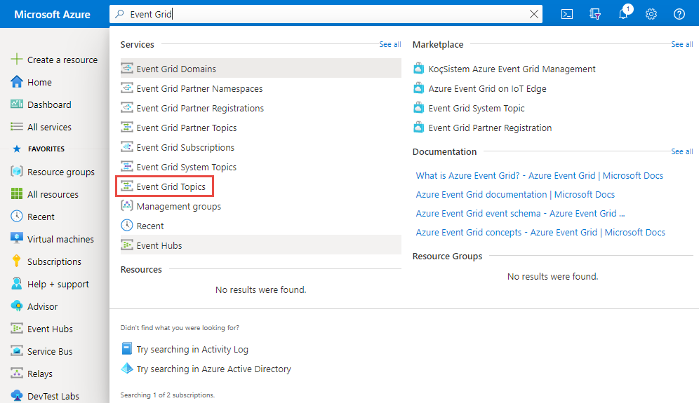
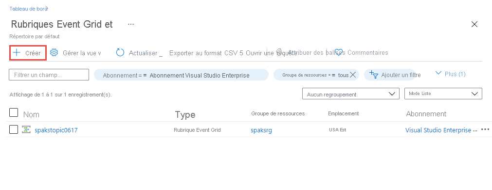
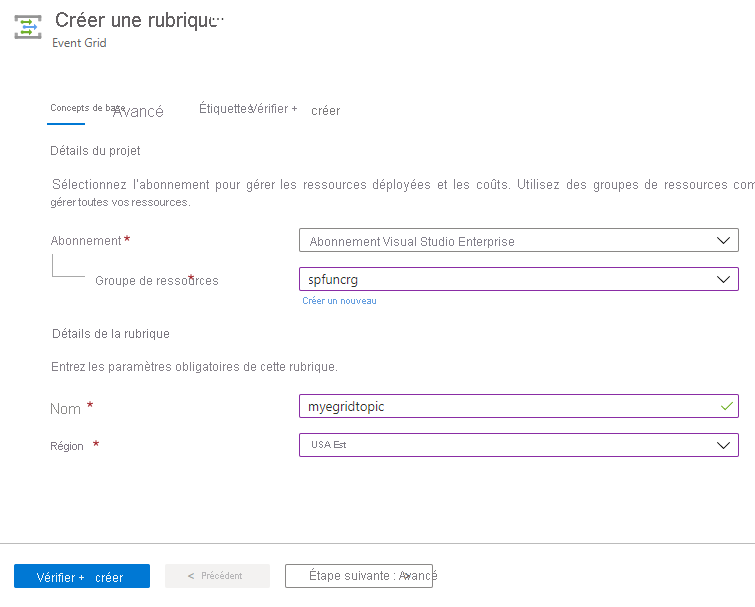
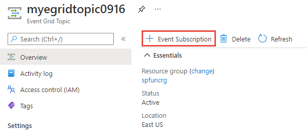
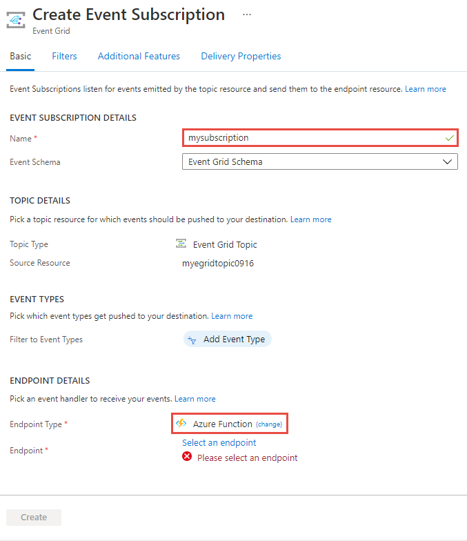
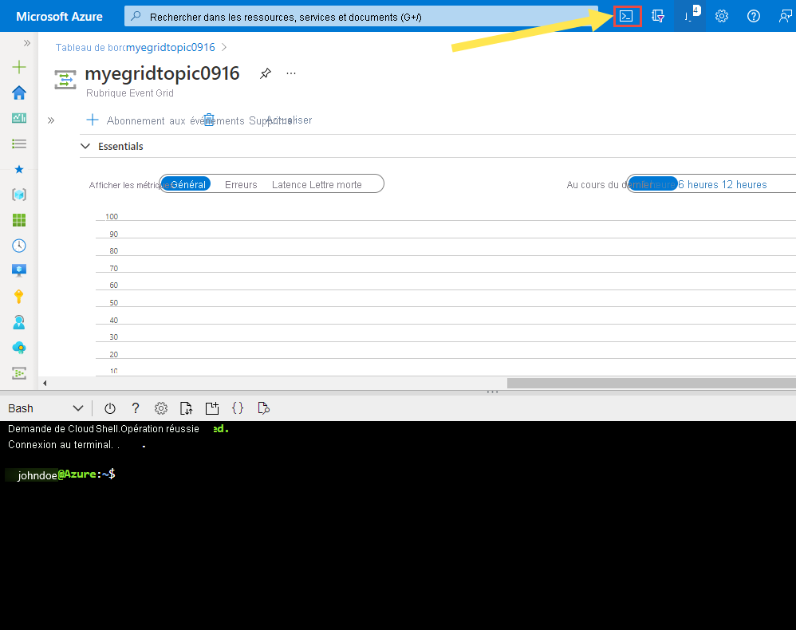

# <a name="quickstart-route-custom-events-to-an-azure-function-with-event-grid"></a>Démarrage rapide : Router des événements personnalisés vers une fonction Azure avec Event Grid

Azure Event Grid est un service de gestion d’événements pour le cloud. Azure Functions est l’un des gestionnaires d’événements pris en charge. Dans cet article, vous utilisez le Portail Azure pour créer une rubrique personnalisée, vous abonner à cette rubrique et déclencher l’événement pour afficher le résultat. Vous envoyez les événements à une fonction Azure.

[!INCLUDE [quickstarts-free-trial-note.md](../../includes/quickstarts-free-trial-note.md)]

## <a name="create-azure-function"></a>Créer une fonction Azure
Avant de nous abonner à la rubrique personnalisée, créez une fonction pour gérer les événements. 

1. Créez une application de fonction à l’aide des instructions indiquées dans [Créer une application de fonction](../azure-functions/functions-get-started.md).
2. Créez une fonction à l’aide du **déclencheur Event Grid**. Si vous utilisez ce déclencheur pour la première fois, vous devrez peut-être cliquer sur Installer pour installer l’extension.
    1. Dans la page **Application de fonction**, sélectionnez **Fonctions** dans le menu de gauche, recherchez **Event Grid** dans les modèles, puis sélectionnez **Déclencheur Azure Event Grid**. 

        :::image type="content" source="./media/custom-event-to-function/function-event-grid-trigger.png" alt-text="Sélectionner le déclencheur Event Grid":::
3. Dans la page **Nouvelle fonction**, entrez un nom pour la fonction, puis sélectionnez **Créer une fonction**.

    :::image type="content" source="./media/custom-event-to-function/new-function-page.png" alt-text="Page Nouvelle fonction":::
4. Utilisez la page **Code + test** pour voir le code existant de la fonction et le mettre à jour. 

[!INCLUDE [event-grid-register-provider-portal.md](../../includes/event-grid-register-provider-portal.md)]

## <a name="create-a-custom-topic"></a>Créer une rubrique personnalisée

Une rubrique de grille d’événement fournit un point de terminaison défini par l’utilisateur vers lequel vous envoyez vos événements. 

1. Connectez-vous au [portail Azure](https://portal.azure.com/).
2. Sélectionnez **Tous les services** dans le menu de navigation gauche, recherchez **Event Grid**, puis sélectionnez **Rubriques Event Grid**. 

    
3. Dans la page **Rubriques Event Grid**, sélectionnez **+ Ajouter** dans la barre d’outils. 

    

4. Dans la page **Créer une rubrique**, procédez comme suit :

    1. Donnez un **nom** unique à la rubrique personnalisée. Le nom de la rubrique doit être unique, car elle est représentée par une entrée DNS. N’utilisez pas le nom indiqué dans l’image. Au lieu de cela, créez votre propre nom : il doit comprendre entre 3 et 50 caractères, et contenir uniquement des valeurs a-z, A-Z, 0-9 et « - ».
    2. Sélectionnez votre **abonnement** Azure.
    3. Sélectionnez le même groupe de ressources que celui des étapes précédentes.
    4. Sélectionnez un **emplacement** pour la rubrique Event Grid.
    5. Conservez la valeur par défaut **Schéma Event Grid** pour le champ **Schéma d’événement**. 

       
    6. Sélectionnez **Create** (Créer). 

5. Une fois la rubrique personnalisée créée, vous voyez la notification de réussite. Sélectionnez **Accéder au groupe de ressources**. 

   

6. Dans la page **Groupe de ressources**, sélectionnez la rubrique Event Grid. 

   

7. La page **Rubrique Event Grid** associée à votre grille d’événement apparaît. Ne fermez pas cette page. Vous l’utiliserez plus loin dans le guide de démarrage rapide. 

    

## <a name="subscribe-to-custom-topic"></a>S’abonner à une rubrique personnalisée

Vous vous abonnez à une rubrique Event Grid pour indiquer à Event Grid les événements qui vous intéressent, et où les envoyer.

1. Maintenant, dans la page **Rubrique Event Grid** de votre rubrique personnalisée, sélectionnez **+ Abonnement aux événements** sur la barre d’outils.

   

2. Dans la page **Créer un abonnement aux événements**, effectuez les étapes suivantes :
    1. Entrez un **nom** pour l’abonnement aux événements.
    3. Sélectionnez **Fonction Azure** pour le **Type de point de terminaison**. 
    4. Choisissez **Sélectionner un point de terminaison**. 

       

    5. Pour le point de terminaison de la fonction, sélectionnez l’abonnement Azure et le groupe de ressources dans lequel se trouve votre application de fonction, puis sélectionnez cette dernière, ainsi que la fonction que vous avez créée précédemment. Sélectionnez **Confirmer la sélection**.

       
    6. Cette étape est facultative, mais recommandée pour les scénarios de production. Dans la page **Créer un abonnement aux événements**, basculez vers l’onglet **fonctionnalités avancées** et définissez des valeurs pour **Nb max. d’événements par lot** et **Taille de lot par défaut en kilo-octets**. 
    
        Le traitement par lot peut vous offrir un débit élevé. Pour **Nb max. d’événements par lot**, définissez le nombre maximal d’événements qu’un abonnement doit inclure dans un lot. La taille de lot par défaut définit la limite supérieure par défaut de la taille de lot en kilo-octets, mais peut être dépassée si un seul événement est supérieur à ce seuil.
    
        :::image type="content" source="./media/custom-event-to-function/enable-batching.png" alt-text="Activer le traitement par lot":::
    6. Dans la page **Créer un abonnement aux événements**, sélectionnez **Créer**.

## <a name="send-an-event-to-your-topic"></a>Envoyer un événement à votre rubrique

Nous allons maintenant déclencher un événement pour voir comment Event Grid distribue le message à votre point de terminaison. Utilisez Azure CLI ou PowerShell pour envoyer un événement de test à votre rubrique personnalisée. En règle générale, une application ou un service Azure envoie les données d’événements.

Le premier exemple utilise Azure CLI. Il obtient l’URL et la clé de la rubrique personnalisée, ainsi que les exemples de données d’événements. Utilisez le nom de votre rubrique personnalisée pour `<topic name>`. Des exemples de données d’événement sont créés. L’élément `data` du fichier JSON est la charge utile de l’événement. N’importe quel fichier JSON bien construit peut être placé dans ce champ. Vous pouvez aussi utiliser le champ objet pour un routage et un filtrage avancés. CURL est un utilitaire qui envoie des requêtes HTTP.


### <a name="azure-cli"></a>Azure CLI
1. Dans le portail Azure, sélectionnez **Cloud Shell**. Sélectionnez **Bash** dans l’angle supérieur gauche de la fenêtre Cloud Shell. 

    
1. Exécutez la commande suivante afin d’obtenir le **point de terminaison** pour la rubrique : Après avoir copié et collé la commande, et avant de l’exécuter, mettez à jour le **nom de la rubrique** et le **nom du groupe de ressources**. 

    ```azurecli
    endpoint=$(az eventgrid topic show --name <topic name> -g <resource group name> --query "endpoint" --output tsv)
    ```
2. Exécutez la commande suivante afin d’obtenir la **clé** pour la rubrique personnalisée  : Après avoir copié et collé la commande, et avant de l’exécuter, mettez à jour le **nom de la rubrique** et le nom du **groupe de ressources**. 

    ```azurecli
    key=$(az eventgrid topic key list --name <topic name> -g <resource group name> --query "key1" --output tsv)
    ```
3. Copiez l’instruction suivante avec la définition de l’événement, puis appuyez sur **Entrée**. 

    ```json
    event='[ {"id": "'"$RANDOM"'", "eventType": "recordInserted", "subject": "myapp/vehicles/motorcycles", "eventTime": "'`date +%Y-%m-%dT%H:%M:%S%z`'", "data":{ "make": "Ducati", "model": "Monster"},"dataVersion": "1.0"} ]'
    ```
4. Exécutez la commande **Curl** suivante pour publier l’événement :

    ```
    curl -X POST -H "aeg-sas-key: $key" -d "$event" $endpoint
    ```

### <a name="azure-powershell"></a>Azure PowerShell
Le deuxième exemple utilise PowerShell pour effectuer des étapes similaires.

1. Dans le portail Azure, sélectionnez **Cloud Shell** (ou accédez à `https://shell.azure.com/`). Sélectionnez **PowerShell** en haut à gauche de la fenêtre Cloud Shell. Consultez l’exemple d’image de fenêtre **Cloud Shell** dans la section Azure CLI.
2. Définissez les variables suivantes. Après avoir copié et collé la commande, et avant de l’exécuter, mettez à jour le **nom de la rubrique** et le **nom du groupe de ressources** :

    ```powershell
    $resourceGroupName = <resource group name>
    $topicName = <topic name>
    ```
3. Exécutez les commandes suivantes afin d’obtenir le **point de terminaison** et les **clés** pour la rubrique :

    ```powershell
    $endpoint = (Get-AzEventGridTopic -ResourceGroupName $resourceGroupName -Name $topicName).Endpoint
    $keys = Get-AzEventGridTopicKey -ResourceGroupName $resourceGroupName -Name $topicName
    ```
4. Préparez l’événement. Copiez et exécutez les instructions dans la fenêtre Cloud Shell. 

    ```powershell
    $eventID = Get-Random 99999

    #Date format should be SortableDateTimePattern (ISO 8601)
    $eventDate = Get-Date -Format s

    #Construct body using Hashtable
    $htbody = @{
        id= $eventID
        eventType="recordInserted"
        subject="myapp/vehicles/motorcycles"
        eventTime= $eventDate   
        data= @{
            make="Ducati"
            model="Monster"
        }
        dataVersion="1.0"
    }
    
    #Use ConvertTo-Json to convert event body from Hashtable to JSON Object
    #Append square brackets to the converted JSON payload since they are expected in the event's JSON payload syntax
    $body = "["+(ConvertTo-Json $htbody)+"]"
    ```
5. Utilisez l’applet de commande **Invoke-WebRequest** pour envoyer l’événement. 

    ```powershell
    Invoke-WebRequest -Uri $endpoint -Method POST -Body $body -Headers @{"aeg-sas-key" = $keys.Key1}
    ```

### <a name="verify-in-the-event-grid-viewer"></a>Vérifier dans la visionneuse Event Grid
Vous avez déclenché l’événement, et Event Grid a envoyé le message au point de terminaison configuré lors de l’abonnement. Accédez à la fonction déclenchée par Event Grid et ouvrez les journaux. Vous devez voir une copie de la charge utile de données de l’événement dans les journaux. Si vous n’ouvrez pas d’abord la fenêtre Journaux, ou si vous n’appuyez pas sur Reconnexion, essayez à nouveau d’envoyer un événement de test.


## <a name="clean-up-resources"></a>Nettoyer les ressources
Si vous envisagez de continuer à utiliser cet événement, ne supprimez pas les ressources créées dans cet article. Dans le cas contraire, supprimez les ressources créées avec cet article.

1. Sélectionnez **Groupes de ressources** dans le menu de gauche. Si vous ne voyez pas cette option dans le menu de gauche, sélectionnez **Tous les services** dans ce menu, puis sélectionnez **Groupes de ressources**. 
2. Sélectionnez le groupe de ressources pour lancer la page **Groupe de ressources**. 
3. Sélectionnez **Supprimer le groupe de ressources** sur la barre d’outils. 
4. Confirmez la suppression en entrant le nom du groupe de ressources, puis sélectionnez **Supprimer**. 

    

    L’autre groupe de ressources que vous voyez dans l’image a été créé et utilisé par la fenêtre Cloud Shell. Supprimez-le si vous n’envisagez pas d’utiliser la fenêtre Cloud Shell. 

## <a name="next-steps"></a>Étapes suivantes

Maintenant que vous savez créer des rubriques et des abonnements d’événements, vous pouvez en apprendre davantage sur Event Grid et ce qu’il peut vous offrir :

- [À propos d’Event Grid](overview.md)
- [Acheminer des événements de stockage Blob Azure vers un point de terminaison Web personnalisé ](../storage/blobs/storage-blob-event-quickstart.md?toc=%2fazure%2fevent-grid%2ftoc.json)
- [Surveiller les modifications d’une machine virtuelle avec Azure Event Grid et Azure Logic Apps](monitor-virtual-machine-changes-event-grid-logic-app.md)
- [Diffuser en continu des Big Data dans un entrepôt de données](event-grid-event-hubs-integration.md)
