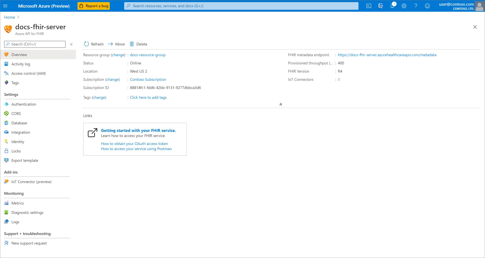
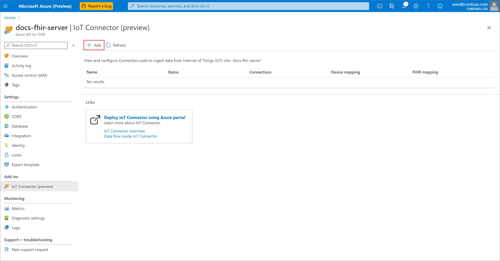
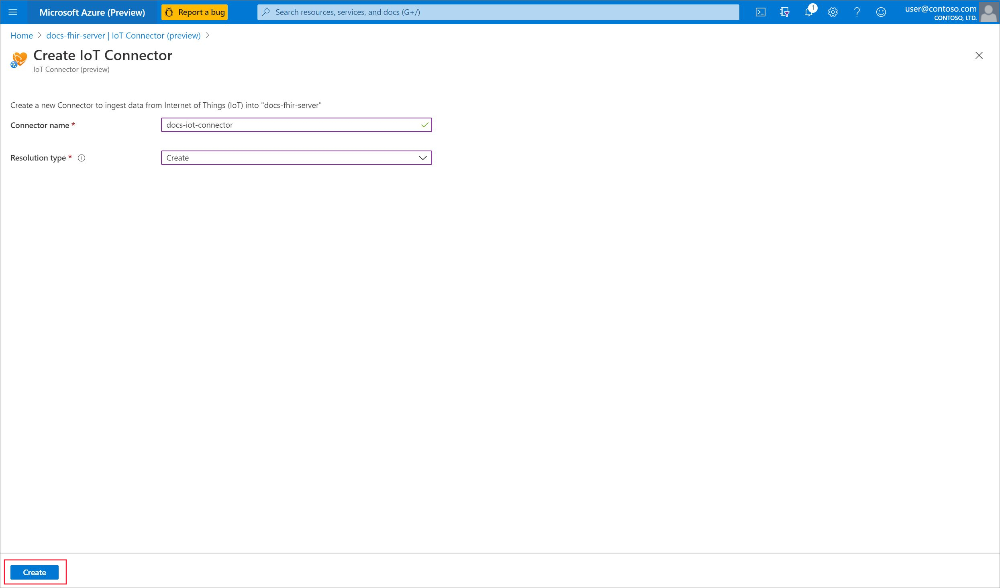

# <a name="quickstart-deploy-azure-iot-connector-for-fhir-preview-using-azure-portal"></a>Démarrage rapide : Déployer le connecteur Azure IoT pour FHIR (préversion) à l’aide du portail Azure

Le Connecteur Azure IoT pour Fast Healthcare Interoperability Resources (FHIR&#174;)* est une fonctionnalité facultative de l’API Azure pour FHIR qui offre la possibilité d’ingérer des données à partir d’appareils de l’Internet des objets médicaux (IoMT, Internet of Medical Things). Pendant la phase de préversion, la fonctionnalité Connecteur Azure IoT pour FHIR est disponible gratuitement. Dans ce guide de démarrage rapide, vous apprenez à :
- déployer et configurer la fonctionnalité Connecteur Azure IoT pour FHIR à l’aide du portail Azure ;
- utiliser un appareil simulé pour envoyer des données à la fonctionnalité Connecteur Azure IoT pour FHIR ;
- afficher les ressources créées par la fonctionnalité Connecteur Azure IoT pour FHIR pour l’API Azure pour FHIR.

## <a name="prerequisites"></a>Prérequis

- Un abonnement Azure actif - [En créer un gratuitement](https://azure.microsoft.com/free/?WT.mc_id=A261C142F)
- API Azure pour FHIR : [déployer API Azure pour FHIR à l’aide du portail Azure](fhir-paas-portal-quickstart.md)

## <a name="go-to-azure-api-for-fhir-resource"></a>Accéder à la ressource API Azure pour FHIR

Ouvrez le [portail Azure](https://portal.azure.com) et accédez à la ressource **API Azure pour FHIR** pour laquelle vous souhaitez créer la fonctionnalité Connecteur Azure IoT pour FHIR.

[](media/quickstart-iot-fhir-portal/portal-azure-api-fhir.jpg#lightbox)

Dans le menu de navigation de gauche, cliquez sur **Connecteur IoT (préversion)** dans la section **Compléments** pour ouvrir la page **Connecteurs IoT**.

[](media/quickstart-iot-fhir-portal/portal-iot-connectors.jpg#lightbox)

## <a name="create-new-azure-iot-connector-for-fhir-preview"></a>Créer une fonctionnalité Connecteur Azure IoT pour FHIR (préversion)

Cliquez sur le bouton **Ajouter** pour ouvrir la page **Créer un connecteur IoT**.

[](media/quickstart-iot-fhir-portal/portal-iot-connectors-add.jpg#lightbox)

Entrez les paramètres pour la nouvelle fonctionnalité Connecteur Azure IoT pour FHIR. Cliquez sur le bouton **Créer** et attendez le déploiement de la fonctionnalité Connecteur Azure IoT pour FHIR.

> [!NOTE]
> Vous devez sélectionner **Créer** dans la liste déroulante **Type de résolution** pour cette installation. 

[](media/quickstart-iot-fhir-portal/portal-iot-connector-create.jpg#lightbox)

|Paramètre|Valeur|Description |
|---|---|---|
|Nom du connecteur|Un nom unique|Entrez un nom pour identifier votre fonctionnalité Connecteur Azure IoT pour FHIR. Ce nom doit être unique au sein d’une ressource API Azure pour FHIR. Le nom peut uniquement contenir des lettres minuscules, des chiffres et le caractère de trait d’union (-). Il doit commencer et se terminer par une lettre ou un chiffre et comprendre entre 3 et 24 caractères.|
|Type de résolution|Rechercher ou Créer|Sélectionnez **Rechercher** si vous disposez d’un processus hors bande pour créer des ressources FHIR [Appareil](https://www.hl7.org/fhir/device.html) et [Patient](https://www.hl7.org/fhir/patient.html) dans votre API Azure pour FHIR. La fonctionnalité Connecteur Azure IoT pour FHIR utilise la référence à ces ressources lors de la création d’une ressource FHIR [Observation](https://www.hl7.org/fhir/observation.html) pour représenter les données d’appareil. Sélectionnez **Créer** quand vous souhaitez que la fonctionnalité Connecteur Azure IoT pour FHIR crée des ressources simples Appareil et Patient dans votre API Azure pour FHIR en utilisant des valeurs d’identificateurs respectives présentes dans les données de l’appareil.|

Une fois l’installation terminée, la fonctionnalité Connecteur Azure IoT pour FHIR ainsi créée apparaît dans la page **Connecteurs IoT**.

[](media/quickstart-iot-fhir-portal/portal-iot-connector-created.jpg#lightbox)

## <a name="configure-azure-iot-connector-for-fhir-preview"></a>Configurer la fonctionnalité Connecteur Azure IoT pour FHIR (préversion)

La fonctionnalité Connecteur Azure IoT pour FHIR a besoin de deux modèles de mappage pour transformer des messages d’appareil en ressource(s) Observation basées sur FHIR : **mappage d’appareil** et **mappage FHIR**. Votre fonctionnalité Connecteur Azure IoT pour FHIR n’est pas entièrement opérationnelle tant que ces mappages n’ont pas été chargés.

[](media/quickstart-iot-fhir-portal/portal-iot-connector-missing-mappings.jpg#lightbox)

Pour charger des modèles de mappage, cliquez sur la fonctionnalité Connecteur Azure IoT pour FHIR qui vient d’être déployée afin d’accéder à la page **Connecteur IoT**.

[](media/quickstart-iot-fhir-portal/portal-iot-connector-click.jpg#lightbox)

#### <a name="device-mapping"></a>Mappage d’appareil

Le modèle de mappage d’appareil transforme les données de l’appareil en schéma normalisé. Dans la page **Connecteur IoT**, cliquez sur le bouton **Configurer le mappage d’appareil** pour accéder à la page **Mappage d’appareil**. 

[](media/quickstart-iot-fhir-portal/portal-iot-connector-click-device-mapping.jpg#lightbox)

Dans la page **Mappage des appareils**, ajoutez le script suivant à l’éditeur JSON, puis cliquez sur **Enregistrer**.

```json
{
  "templateType": "CollectionContent",
  "template": [
    {
      "templateType": "IotJsonPathContent",
      "template": {
        "typeName": "heartrate",
        "typeMatchExpression": "$..[?(@Body.telemetry.HeartRate)]",
        "patientIdExpression": "$.Properties.iotcentral-device-id",
        "values": [
          {
            "required": "true",
            "valueExpression": "$.Body.telemetry.HeartRate",
            "valueName": "hr"
          }
        ]
      }
    }
  ]
}
```

[](media/quickstart-iot-fhir-portal/portal-iot-device-mapping.jpg#lightbox)

#### <a name="fhir-mapping"></a>Mappage FHIR

Le modèle de mappage FHIR transforme un message normalisé en ressource d’observation basée sur FHIR. Dans la page **Connecteur IoT**, cliquez sur le bouton **Configurer le mappage FHIR** pour accéder à la page **Mappage FHIR**.  

[](media/quickstart-iot-fhir-portal/portal-iot-connector-click-fhir-mapping.jpg#lightbox)

Dans la page **Mappage FHIR**, ajoutez le script suivant à l’éditeur JSON, puis cliquez sur **Enregistrer**.

```json
{
  "templateType": "CollectionFhir",
  "template": [
    {
      "templateType": "CodeValueFhir",
      "template": {
        "codes": [
          {
            "code": "8867-4",
            "system": "http://loinc.org",
            "display": "Heart rate"
          }
        ],
        "periodInterval": 0,
        "typeName": "heartrate",
        "value": {
          "unit": "count/min",
          "valueName": "hr",
          "valueType": "Quantity"
        }
      }
    }
  ]
}
```

[](media/quickstart-iot-fhir-portal/portal-iot-fhir-mapping.jpg#lightbox)

## <a name="generate-a-connection-string"></a>Générer une chaîne de connexion

L’appareil IoMT a besoin d’une chaîne de connexion pour se connecter et envoyer des messages à la fonctionnalité Connecteur Azure IoT pour FHIR. Dans la page **Connecteur IoT** pour la fonctionnalité Connecteur Azure IoT pour FHIR nouvellement déployée, sélectionnez le bouton **Gérer les connexions client**. 

[](media/quickstart-iot-fhir-portal/portal-iot-connector-click-client-connections.jpg#lightbox)

Une fois dans la page **Connexions**, cliquez sur le bouton **Ajouter** pour créer une connexion. 

[](media/quickstart-iot-fhir-portal/portal-iot-connections.jpg#lightbox)

Fournissez un nom convivial pour cette connexion dans la fenêtre superposée et sélectionnez le bouton **Créer**.

[](media/quickstart-iot-fhir-portal/portal-iot-new-connection.jpg#lightbox)

Sélectionnez la connexion créée dans la page **Connexions**, puis copiez la valeur du champ **Chaîne de connexion principale** à partir de la fenêtre superposée à droite.

[](media/quickstart-iot-fhir-portal/portal-iot-connection-string.jpg#lightbox)

Conservez cette chaîne de connexion, qui sera utilisée à une étape ultérieure. 

## <a name="connect-your-devices-to-iot"></a>Connecter vos appareils à IoT

Azure offre une suite complète de produits IoT pour la connexion et la gestion de vos appareils IoT. Vous pouvez créer votre propre solution basée sur PaaS à l’aide d’Azure IoT Hub ou démarrer avec une plateforme de gestion d’applications IoT avec Azure IoT Central. Pour ce tutoriel, nous allons tirer parti d’Azure IoT Central, qui dispose de modèles de solution sectoriels pour nous aider à démarrer.

Déployez le [modèle d’application de surveillance continue des patients](../../iot-central/healthcare/tutorial-continuous-patient-monitoring.md#create-continuous-patient-monitoring-application). Ce modèle comprend deux appareils simulés qui produisent des données en temps réel pour vous aider à démarrer : **Smart Vitals Patch** et **Smart Knee Brace**.

> [!NOTE]
> Chaque fois que vos appareils réels sont prêts, vous pouvez utiliser la même application IoT Central pour [intégrer vos appareils](../../iot-central/core/howto-set-up-template.md) et remplacer les simulateurs d’appareils. En outre, les données de vos appareils commencent automatiquement à circuler vers FHIR. 

## <a name="connect-your-iot-data-with-the-azure-iot-connector-for-fhir-preview"></a>Connecter vos données IoT à l’aide de la fonctionnalité Connecteur Azure IoT pour FHIR (préversion)

Une fois que vous avez déployé votre application IoT Central, vos deux appareils simulés prêts à l’emploi commencent à générer des données de télémétrie. Pour ce tutoriel, nous allons ingérer les données de télémétrie du simulateur *Smart Vitals Patch* dans FHIR via la fonctionnalité Connecteur Azure IoT pour FHIR. Pour exporter vos données IoT vers la fonctionnalité Connecteur Azure IoT pour FHIR, nous souhaitons [configurer une exportation de données continue au sein d’IoT Central](../../iot-central/core/howto-export-data.md). Nous devons tout d’abord créer une connexion à la destination, puis créer une tâche d’exportation de données pour qu’elle s’exécute en continu : 

> [!NOTE]
> Vous pouvez sélectionner l' **exportation de données** et l' **exportation de données (héritée)** dans le IOT central paramètres d’application pour cette section.

[](media/quickstart-iot-fhir-portal/iot-central-data-export-dashboard.png#lightbox)

Créer une nouvelle destination :
- Accédez à l’onglet **destinations** et créez une nouvelle destination.
- Commencez par donner un nom unique à votre destination.
- Choisissez *Azure Event hubs* comme type de destination.
- fournissez Azure IoT connecteur pour la chaîne de connexion de FHIR obtenue à l’étape précédente pour le champ de **chaîne de connexion** .

Créer une exportation de données :
- Une fois que vous avez créé votre destination, accédez à l’onglet **exportations** et créez une nouvelle exportation de données. 
- Commencez par lui donner un nom unique pour l’exportation des données.
- Sous **données** , sélectionnez *télémétrie* comme *type de données à exporter*.
- Sous **destination** , sélectionnez le nom de destination que vous avez créé dans le nom précédent.

## <a name="view-device-data-in-azure-api-for-fhir"></a>Voir les données d’appareil dans l’API Azure pour FHIR

Vous pouvez voir les ressources Observation basées sur FHIR créées par la fonctionnalité Connecteur Azure IoT pour FHIR sur l’API Azure pour FHIR à l’aide de Postman. Pour plus d’informations, consultez [accéder au service FHIR à l’aide](./../use-postman.md) de l’affranchissement et effectuer une `GET` requête pour `https://your-fhir-server-url/Observation?code=http://loinc.org|8867-4` afficher les ressources FHIR d’observation avec une valeur de fréquence cardiaque. 

> [!TIP]
> Vérifiez que votre utilisateur dispose de l’accès approprié au plan de données de l’API Azure pour FHIR. Utilisez le [contrôle d’accès en fonction du rôle Azure](configure-azure-rbac.md) (RBAC Azure) pour attribuer les rôles de plan de données nécessaires.

## <a name="clean-up-resources"></a>Nettoyer les ressources

Quand vous n’en avez plus besoin, vous pouvez supprimer une instance de la fonctionnalité Connecteur Azure IoT pour FHIR en supprimant le groupe de ressources associé, le service API Azure pour FHIR associé ou l’instance FHIR elle-même. 

Pour supprimer directement une instance de la fonctionnalité Connecteur Azure IoT pour FHIR, sélectionnez-la dans la page **Connecteurs IoT** pour accéder à la page **Connecteur IoT**, puis cliquez sur le bouton **Supprimer**. Quand vous êtes invité à confirmer l’opération, sélectionnez **Oui**. 

[](media/quickstart-iot-fhir-portal/portal-iot-connector-delete.jpg#lightbox)

## <a name="next-steps"></a>Étapes suivantes

Dans ce guide de démarrage rapide, vous avez déployé la fonctionnalité Connecteur Azure IoT pour FHIR dans votre ressource API Azure pour FHIR. Pour en savoir plus sur le fonctionnalité Connecteur Azure IoT pour FHIR, sélectionnez l’une des étapes suivantes :

Appréhendez les différentes étapes du workflow dans le Connecteur Azure IoT pour FHIR.

>[!div class="nextstepaction"]
>[Flux de données du Connecteur Azure IoT pour FHIR](iot-data-flow.md)

Découvrez comment configurer le connecteur IoT à l’aide de modèles de mappage d’appareil et FHIR.

>[!div class="nextstepaction"]
>[Modèles de mappage du Connecteur Azure IoT pour FHIR](iot-mapping-templates.md)

*Sur le Portail Azure, le Connecteur Azure IoT pour FHIR est appelé Connecteur IoT (préversion). Le sigle FHIR est une marque déposée de HL7 et est utilisé avec l’autorisation de HL7.
