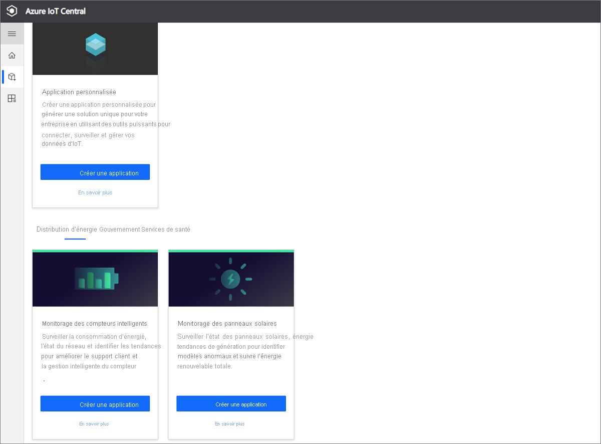
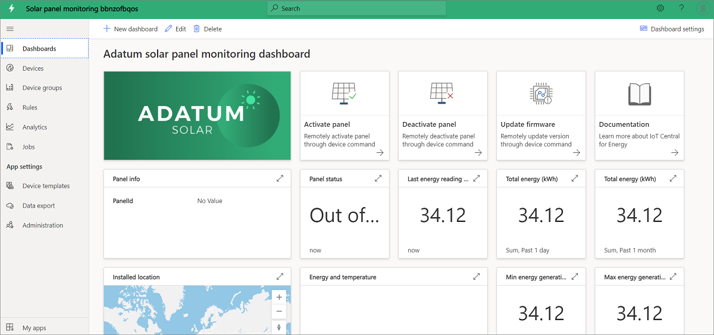
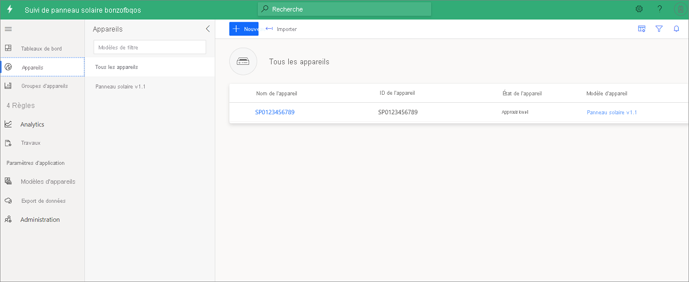
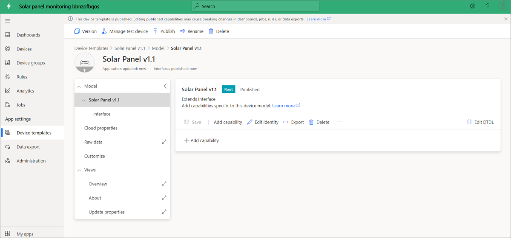
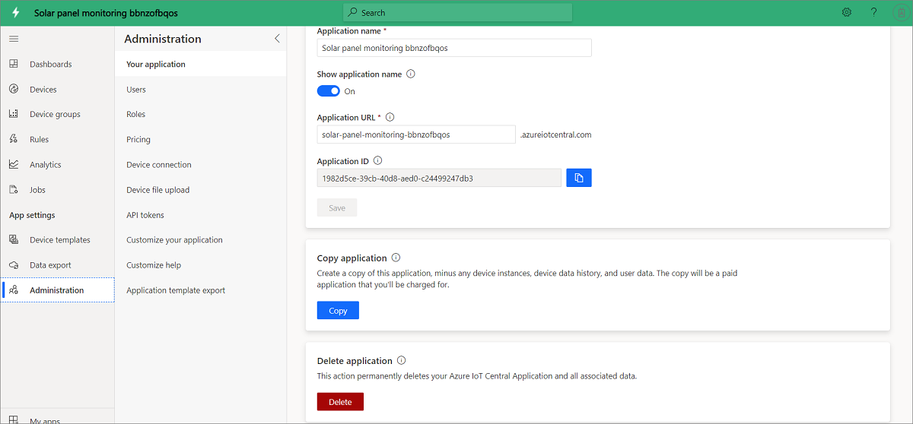

# Tutoriel : Créer et découvrir le modèle d’application de suivi des panneaux solaires 

Ce tutoriel vous guide tout au long du processus de création d’une application de suivi des panneaux solaires, qui comprend un exemple de modèle d’appareil avec des données simulées. Ce didacticiel vous montre comment effectuer les opérations suivantes :

> [!div class="checklist"]
> * Créer gratuitement une application de suivi des panneaux solaires
> * examiner l’application
> * Nettoyer les ressources

Si vous n’avez pas d’abonnement, [créez un compte d’essai gratuit](https://azure.microsoft.com/free).

## Prérequis

Il n’existe aucun prérequis pour suivre ce tutoriel. Un abonnement à Azure est recommandé, mais pas obligatoire.

## Créer une application de suivi de panneaux solaires 

Vous pouvez créer cette application en trois étapes simples :

1. Accédez à [Azure IoT Central](https://apps.azureiotcentral.com). Pour créer une application, sélectionnez **+ Générer**. 

1. Sélectionnez l’onglet **Énergie**. Sous **Suivi des panneaux solaires**, sélectionnez **Créer une application**. 

    > [!div class="mx-imgBorder"]
    > 
  
1. Dans la boîte de dialogue **Nouvelle application**, renseignez les détails demandés, puis sélectionnez **Créer** :
    * **Nom de l'application** : Choisissez un nom pour votre application Azure IoT Central. 
    * **URL** : Choisissez une URL Azure IoT Central. La plateforme vérifie son unicité.
    * **Plan tarifaire** : Si vous avez déjà un abonnement Azure, le paramètre par défaut est recommandé. Si vous n’avez pas d’abonnement Azure, commencez avec la version d’essai gratuite.
    * **Informations de facturation** : l'application proprement dite est gratuite. Les champs Annuaire, Abonnement Azure et Région doivent obligatoirement être renseignés pour le provisionnement des ressources de votre application.
        
        
        

### Vérifier l'application et les données simulées

Vous pouvez modifier votre nouvelle application de suivi des panneaux solaires à tout moment. Avant de modifier l’application, vérifions pour le moment qu’elle est déployée et qu’elle fonctionne comme prévu.

Pour vérifier la création de l'application et la simulation des données, accédez au **Tableau de bord**. Si vous voyez les vignettes et les données qu'elles contiennent, cela signifie que le déploiement de votre application a abouti. La simulation peut prendre quelques minutes pour générer les données. 

## Découvrir l'application pas à pas
Une fois que vous avez correctement déployé le modèle d’application, vous allez examiner l’application de plus près. Remarquez qu’elle est fournie avec un exemple de compteur intelligent, un modèle d’appareil et un tableau de bord.

Adatum est un fournisseur d’énergie fictif qui assure le suivi et la gestion de panneaux solaires. Le tableau de bord de suivi des panneaux solaires contient des propriétés, des données et des exemples de commandes. Ce tableau de bord vous permet, à vous ou à votre équipe de support, d’effectuer les activités suivantes de manière proactive, avant toute opération de support technique supplémentaire visant à résoudre un problème :
* Consulter les dernières informations relatives à un panneau et l’emplacement où celui-ci est installé sur la carte.
* Vérifier l’état du panneau et l’état de la connexion.
* Examiner les tendances en matière de production d’énergie et de température pour détecter d’éventuelles anomalies.
* Suivre la production totale d’énergie à des fins de planification et de facturation.
* Activer un panneau et mettre à jour la version du microprogramme, si nécessaire. Dans le modèle, les boutons de commande montrent les fonctionnalités possibles, mais n’envoient pas de commandes réelles.

> [!div class="mx-imgBorder"]
> 

### Appareils
L'application est fournie avec un exemple de panneau solaire. Pour voir les détails de l’appareil, sélectionnez **Appareils**.

> [!div class="mx-imgBorder"]
> 

Sélectionnez l’exemple d’appareil, **SP0123456789**. Sous l’onglet **Update Properties** (Mettre à jour les propriétés), vous pouvez mettre à jour les propriétés accessibles en écriture de l’appareil et voir les valeurs mises à jour sur le tableau de bord. 

> [!div class="mx-imgBorder"]
> 

### Modèle d’appareil
Pour voir le modèle de panneau solaire, sélectionnez l’onglet **Modèles d’appareil**. Le modèle a des interfaces prédéfinies pour les données, les propriétés, les commandes et les vues.

> [!div class="mx-imgBorder"]
> 

## Nettoyer les ressources
Si vous décidez de ne pas continuer à utiliser cette application, supprimez-la en effectuant les étapes suivantes :

1. Dans le volet gauche, sélectionnez **Administration**.
1. Sélectionnez **Paramètres d’application** > **Supprimer**. 

    > [!div class="mx-imgBorder"]
    > 

## Étapes suivantes
 
> [!div class="nextstepaction"]
> [Azure IoT Central - Architecture d’application pour panneau solaire](./concept-iot-central-solar-panel-app.md)

