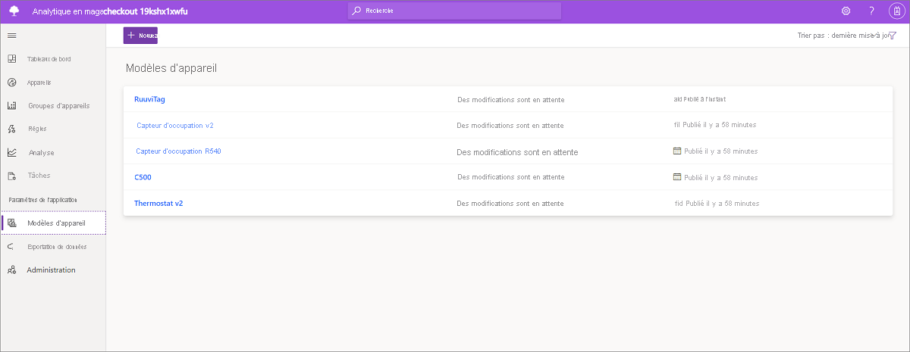
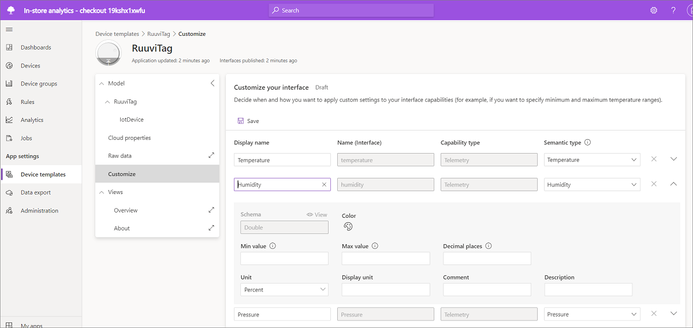
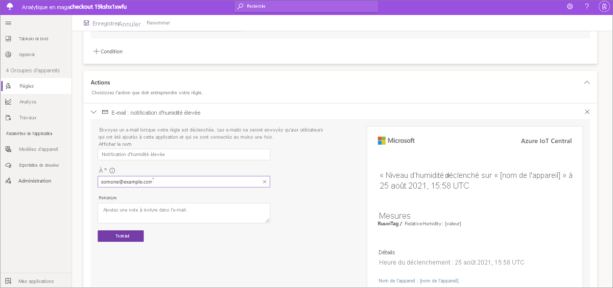

# Tutoriel : Créer une application d’analytique en magasin dans Azure IoT Central

Le tutoriel vous montre comment créer une application d’analytique en magasin Azure IoT Central. L’exemple d’application est destiné à un magasin de vente au détail. Il s’agit d’une solution aux besoins courants des entreprises pour surveiller et s’adapter au taux de présence et aux conditions environnementales.

L’exemple d’application que vous créez comprend trois appareils réels : une passerelle Rigado Cascade 500 et deux capteurs RuuviTag. Ce tutoriel montre également comment utiliser la simulation du capteur de présence incluse dans le modèle d’application à des fins de test. La passerelle Rigado C500 sert de hub de communication dans votre application. Il communique avec les capteurs de votre magasin et gère leurs connexions au cloud. Le RuuviTag est un capteur environnemental qui fournit des données de télémétrie, notamment la température, l’humidité et la pression. La simulation du capteur de présence permet de suivre le mouvement et la présence de la clientèle dans les zones de caisse d’un magasin. 

Ce tutoriel comprend des instructions pour connecter les appareils Rigado et RuuviTag à votre application. Si vous disposez d’une autre passerelle et d’autres capteurs, vous pouvez tout de même suivre les étapes pour générer votre application. Ce tutoriel montre également comment créer des simulations de capteurs RuuviTag. Les simulations de capteurs vous permettent de générer l’application si vous n’avez pas d’appareils réels. 

Vous développez la solution de supervision des caisses et des conditions en trois parties :

* Créer l’application et connecter des appareils pour surveiller les conditions
* Personnaliser le tableau de bord pour permettre aux opérateurs de surveiller et gérer les appareils
* Configurer l’exportation des données pour permettre aux responsables de magasin d’exécuter des analytiques et de visualiser les informations

Dans ce tutoriel, vous allez apprendre à :
> [!div class="checklist"]
> * Utiliser le modèle **Analytique en magasin – caisse** Azure IoT Central pour créer une application de magasin de vente au détail
> * Vérifier les paramètres d’application
> * Créer et personnaliser des modèles d’appareil IoT
> * Connecter des appareils à votre application
> * Ajouter des règles et des actions pour surveiller les conditions

## Prérequis

Pour réaliser cette série de tutoriels, vous avez besoin des éléments suivants :
* Un abonnement Azure est recommandé. Vous pouvez éventuellement utiliser une version d’évaluation gratuite de 7 jours. Si vous n’avez pas d’abonnement Azure, vous pouvez en créer un sur la [page d’inscription à Azure](https://aka.ms/createazuresubscription).
* Un accès à un appareil de passerelle et à deux capteurs environnementaux (vous pouvez éventuellement utiliser des appareils simulés comme décrit dans le tutoriel).
* Des modèles d’appareil pour les appareils que vous utilisez (des modèles sont fournis pour tous les appareils utilisés dans le tutoriel).

## Créer une application
Dans cette section, vous créerez une application Azure IoT Central à partir d’un modèle. Vous utiliserez cette application tout au long de la série de tutoriels pour générer une solution complète.

Pour créer une nouvelle application Azure IoT Central :

1. Accédez au site web du [gestionnaire d’applications d’Azure IoT Central](https://aka.ms/iotcentral).

1. Si vous disposez d’un abonnement Azure, connectez-vous avec les informations d’identification que vous utilisez pour y accéder. Sinon, connectez-vous à l’aide d’un compte Microsoft :

    

1. Pour commencer à créer une application Azure IoT Central, sélectionnez **Nouvelle application**.

1. Sélectionnez **Distribution**.  La page de vente au détail affiche plusieurs modèles d’application de vente au détail.

Pour créer une application d’analytique en magasin pour les caisses :  

1. Sélectionnez le modèle d’application **Analytique en magasin – caisse**. Ce modèle comprend des modèles d’appareil pour tous les appareils utilisés dans le tutoriel, à l’exception des capteurs RuuviTag. Le modèle fournit également un tableau de bord d’opérateur permettant de surveiller les caisses et les conditions environnementales, ainsi que l’état des appareils. 

1. Si vous le souhaitez, choisissez un **nom d’application** convivial. Cette application est basée sur un magasin fictif de vente au détail nommé Contoso. Le tutoriel utilise le **nom d’application** *Caisse Contoso*. Le modèle d’application est basé sur la société fictive Northwind. Dans ce tutoriel, vous utilisez Contoso pour apprendre à personnaliser l’application.

    > [!NOTE]
    > Si vous utilisez un **nom d’application** convivial, vous devez toujours utiliser une valeur unique pour l’**URL** de l’application.

1. Si vous disposez d’un abonnement Azure, entrez vos informations *Répertoire, Abonnement Azure et Région*. Si vous n’avez pas d’abonnement, vous pouvez activer une **version d’évaluation gratuite de 7 jours** et remplir les coordonnées requises.  

1. Sélectionnez **Create** (Créer).

    

    

## Personnaliser les paramètres d’application

En tant que réalisateur de logiciel, vous pouvez modifier plusieurs paramètres pour personnaliser l’expérience utilisateur dans votre application. Dans cette section, vous sélectionnerez un thème d’application prédéfini. Si vous le souhaitez, vous apprendrez à créer un thème personnalisé et à mettre à jour l’image de l’application. Un thème personnalisé vous permet de définir les couleurs du navigateur de l’application, l’icône du navigateur et le logo de l’application qui s’affiche dans le titre.

Pour sélectionner un thème d’application prédéfini :

1. Sélectionnez **Paramètres** dans le titre.

    

2. Sélectionnez un nouveau **Thème**.

3. Sélectionnez **Enregistrer**.

Au lieu d’utiliser un thème prédéfini, vous pouvez créer un thème personnalisé. Si vous souhaitez utiliser un ensemble d’exemples d’images pour personnaliser l’application et suivre le tutoriel, téléchargez les [exemples d’images Contoso](https://github.com/Azure-Samples/iot-central-docs-samples/tree/master/retail).

Pour créer un thème personnalisé :

1. Développez le volet gauche, s’il n’est pas déjà développé.

    

1. Sélectionnez **Administration > Personnaliser votre application**.

1. Utilisez le bouton **Modifier** pour choisir une image à télécharger en tant que **Logo de l’application**. Si vous le souhaitez, spécifiez une valeur pour **Texte de remplacement du logo**. 

1. Utilisez le bouton **Modifier** pour choisir l’image de l’**icône du navigateur** qui apparaîtra dans les onglets du navigateur.

1. Si vous le souhaitez, remplacez les **couleurs du navigateur** par défaut en ajoutant des codes couleurs hexadécimaux HTML. Pour l’**en-tête**, ajouter *#008575*.  Pour l’**accentuation**, ajoutez *#A1F3EA*. 

1. Sélectionnez **Enregistrer**. 

    

    Une fois que vous avez enregistré, l’application met à jour les couleurs du navigateur, le logo dans le titre et l’icône du navigateur. 

    

Pour mettre à jour l’image de l’application :

1. Sélectionnez **Administration > Paramètres d’application**.

1. Utilisez le bouton **Sélectionner une image** pour choisir une image à télécharger en tant qu’image de l’application. Cette image apparaît sur la vignette de l’application dans la page **Mes applications** du gestionnaire d’applications IoT Central.

1. Sélectionnez **Enregistrer**.

1. Si vous le souhaitez, accédez à l’affichage **Mes applications** sur le site web du [gestionnaire d’applications d’Azure IoT Central](https://aka.ms/iotcentral). La vignette de l’application affiche l’image de l’application mise à jour.

    

## Créer des modèles d’appareils
En tant que réalisateur de logiciel, vous pouvez créer des modèles d’appareil qui vous permettent, à vous et aux opérateurs de l’application, de configurer et de gérer des appareils. Vous créez un modèle en générant un modèle personnalisé, en important un fichier modèle existant ou en important un modèle à partir du catalogue d’appareils Azure IoT. Une fois que vous avez créé et personnalisé un modèle d’appareil, utilisez-le pour connecter des appareils réels à votre application. Si vous le souhaitez, utilisez un modèle d’appareil pour générer des appareils simulés à des fins de test.

Le modèle d’application **Analytique en magasin – caisse** possède des modèles d’appareil pour plusieurs appareils.  Il existe des modèles d’appareil pour deux des trois appareils que vous utilisez dans l’application. Le modèle d’appareil RuuviTag n’est pas inclus dans le modèle d’application **Analytique en magasin – caisse**. Dans cette section, vous ajouterez un modèle d’appareil pour les capteurs RuuviTag à votre application.

Pour ajouter un modèle d’appareil RuuviTag à votre application :

1. Sélectionnez **Modèles d’appareil** dans le volet gauche.

1. Sélectionnez **+ Nouveau** pour créer un modèle d’appareil.

1. Recherchez et sélectionnez le modèle d’appareil du capteur **RuuviTag** dans le catalogue d’appareils Azure IoT. 

1. Sélectionnez **Suivant : Personnaliser**.

    

1. Sélectionnez **Create** (Créer). L’application ajoute le modèle d’appareil RuuviTag.

1. Sélectionnez **Modèles d’appareil** dans le volet gauche. La page affiche tous les modèles d’appareil inclus dans le modèle d’application, ainsi que le modèle d’appareil RuuviTag que vous venez d’ajouter.

    

## Personnaliser des modèles d’appareil
Vous pouvez personnaliser les modèles d’appareil dans votre application de trois façons. Premièrement, vous personnalisez les interfaces natives intégrées de vos appareils en modifiant les fonctionnalités de l’appareil. Par exemple, avec un capteur de température, vous pouvez modifier des détails tels que le nom d’affichage de l’interface de température, le type de données, les unités de mesure et les plages de fonctionnement minimale et maximale. 

Deuxièmement, personnalisez vos modèles d’appareil en ajoutant des propriétés cloud. Les propriétés cloud ne font pas partie des fonctionnalités intégrées de l’appareil. Elles sont des données personnalisées que votre application Azure IoT Central crée, stocke et associe à vos appareils. Un exemple de propriété cloud peut être une valeur calculée ou des métadonnées telles qu’un emplacement que vous souhaitez associer à un ensemble d’appareils. 

Troisièmement, personnalisez les modèles d’appareil en créant des affichages personnalisés. Les affichages permettent aux opérateurs de visualiser les données de télémétrie et les métadonnées de vos appareils, telles que les métriques et l’intégrité des appareils.

Ici, vous utiliserez les deux premières méthodes pour personnaliser le modèle d’appareil destiné à vos capteurs RuuviTag. Pour plus d’informations sur la création d’affichages pour vos capteurs, consultez le guide de démarrage rapide [Ajouter un appareil simulé à votre application IoT Central](../core/quick-create-simulated-device.md).

Pour personnaliser les interfaces intégrées du modèle d’appareil RuuviTag :

1. Sélectionnez **Modèles d’appareil** dans le volet gauche. 

1. Sélectionnez le modèle pour les capteurs RuuviTag. 

1. Masquez le volet gauche. L’affichage récapitulatif du modèle affiche les fonctionnalités de l’appareil.

    

1. Sélectionnez **Personnaliser** dans le menu du modèle d’appareil RuuviTag. 

1. Faites défiler la liste des fonctionnalités et recherchez le type de données de télémétrie `humidity`. Il s’agit de l’élément de ligne avec la valeur **Nom d’affichage** modifiable d’*humidité*.

Dans les étapes suivantes, vous personnaliserez le type de télémétrie `humidity` pour les capteurs RuuviTag. Si vous le souhaitez, personnalisez certains des autres types de télémétrie.

Pour le type de télémétrie `humidity`, apportez les modifications suivantes :

1. Sélectionnez le contrôle **Développer** pour développer les détails du schéma de la ligne.

1. Remplacez la valeur **Nom d’affichage** de l’*humidité* par une valeur personnalisée telle que *Humidité relative*.

1. Pour l’option **Type sémantique**, remplacez la valeur *Aucun* par *Humidité*.  Si vous le souhaitez, définissez des valeurs de schéma pour le type de télémétrie Humidité dans l’affichage de schéma développé. Les paramètres de schéma vous permettent de créer des exigences de validation détaillées pour les données que vos capteurs suivent. Par exemple, vous pouvez définir des valeurs de plage de fonctionnement minimale et maximale pour une interface donnée.

1. Cliquez sur **Enregistrer** pour enregistrer vos modifications.

    

Pour ajouter une propriété cloud à un modèle d’appareil dans votre application :

1. Sélectionnez **Propriétés cloud** dans le menu du modèle d’appareil RuuviTag.

1. Sélectionnez **Ajouter une propriété cloud**. 

Spécifiez les valeurs suivantes pour créer une propriété personnalisée et stocker ainsi l’emplacement de chaque appareil :

1. Entrez la valeur *Emplacement* pour le **Nom d’affichage**. Cette valeur est copiée automatiquement dans le champ **Nom**, qui est un nom convivial pour la propriété. Vous pouvez utiliser la valeur copiée ou la modifier.

1. Sélectionnez *Chaîne* dans la liste déroulante **Schéma**. Un type de chaîne vous permet d’associer une chaîne de nom d’emplacement à n’importe quel appareil basé sur le modèle. Par exemple, vous pouvez associer une zone dans un magasin à chaque appareil. Si vous le souhaitez, vous pouvez définir le **Type sémantique** de votre propriété sur *Emplacement*, ce qui définit automatiquement le **Schéma** sur *Point géographique*. Vous pouvez alors associer des coordonnées GPS à un appareil. 

1. Définissez **Longueur minimale** sur *2*. 

1. Définissez **Espace blanc de découpage** sur **Activé**.

1. Sélectionnez **Enregistrer** pour enregistrer votre propriété cloud personnalisée.

    

1. Sélectionnez **Publier**. 

    La publication d’un modèle d’appareil le rend visible aux opérateurs d’application. Après avoir publié un modèle, utilisez-le pour générer des appareils simulés à des fins de test ou pour connecter des appareils réels à votre application. Si vous avez déjà des appareils connectés à votre application, la publication d’un modèle personnalisé applique les modifications sur les appareils.

## Ajouter des appareils
Une fois que vous avez créé et personnalisé des modèles d’appareil, il est temps d’ajouter des appareils. 

Pour ce tutoriel, vous utiliserez l’ensemble suivant d’appareils réels et simulés pour générer l’application :
- Une passerelle Rigado C500 réelle
- Deux capteurs RuuviTag réels
- Un capteur **Présence** simulé. Le capteur simulé est inclus dans le modèle d’application, vous n’avez donc pas besoin de le créer. 

> [!NOTE]
> Si vous n’avez pas de vrais appareils, vous pouvez tout de même suivre ce tutoriel en créant des capteurs RuuviTag simulés. Les instructions suivantes incluent les étapes à suivre pour créer un RuuviTag simulé. Vous n’avez pas besoin de créer une passerelle simulée.

Suivez les étapes décrites dans les deux articles suivants pour connecter une passerelle Rigado réelle et des capteurs RuuviTag. Quand vous avez terminé, revenez à ce tutoriel. Étant donné que vous avez déjà créé des modèles d’appareil dans ce tutoriel, vous n’avez pas besoin de les recréer dans les instructions suivantes.

- Pour connecter une passerelle Rigado, consultez [Connecter une Rigado Cascade 500 à votre application Azure IoT Central](../core/howto-connect-rigado-cascade-500.md).
- Pour connecter des capteurs RuuviTag, consultez [Connecter un capteur RuuviTag à votre application Azure IoT Central](../core/howto-connect-ruuvi.md). Vous pouvez également utiliser ces instructions pour créer deux capteurs simulés, si nécessaire.

## Ajouter des règles et des actions
Dans le cadre de l’utilisation de capteurs dans votre application Azure IoT Central pour surveiller des conditions, vous pouvez créer des règles pour exécuter des actions lorsque certaines conditions sont remplies. Une règle est associée à un modèle d’appareil et à un ou plusieurs appareils ; elle contient des conditions qui doivent être satisfaites en fonction des données de télémétrie de l’appareil ou des événements. Une règle a également une ou plusieurs actions associées. Les actions peuvent inclure l’envoi de notifications par e-mail ou le déclenchement d’une action de webhook pour envoyer des données à d’autres services. Le modèle d’application **Analytique en magasin – caisse** contient quelques règles prédéfinies pour les appareils de l’application.

Dans cette section, vous créerez une règle qui vérifie le taux d’humidité relatif maximal en fonction des données de télémétrie du capteur RuuviTag. Vous ajouterez une action à la règle, de sorte que si l’humidité dépasse la valeur maximale, l’application envoie un e-mail. 

Pour créer une règle : 

1. Développez le volet gauche.

1. Sélectionnez **Règles**.

1. Sélectionnez **+Nouveau**.

1. Entrez *Taux d’humidité* comme nom de la règle. 

1. Choisissez le modèle d’appareil RuuviTag dans **Étendues**. La règle que vous définissez s’appliquera à tous les capteurs basés sur ce modèle. Si vous le souhaitez, vous pouvez créer un filtre qui applique la règle uniquement à un sous-ensemble défini des capteurs. 

1. Choisissez `Relative humidity` comme **Données de télémétrie**. Il s’agit de la fonctionnalité de l’appareil que vous avez personnalisée à l’étape précédente.

1. Choisissez `Is greater than` comme **Opérateur**. 

1. Entrez un taux d’humidité intérieure typique de la plage supérieure pour votre environnement comme **Valeur**. Par exemple, entrez *65*. Vous avez défini une condition pour votre règle qui se produit lorsque l’humidité relative dans un capteur RuuviTag réel ou simulé dépasse cette valeur. Vous devrez peut-être ajuster la valeur en fonction de la plage d’humidité normale dans votre environnement.  

   

Pour ajouter une action à la règle :

1. Sélectionnez **+ E-mail**. 

1. Entrez *Notification d’humidité élevée* comme **Nom d’affichage** convivial pour l’action. 

1. Entrez l’adresse e-mail associée à votre compte dans **À**. Si vous utilisez un autre e-mail, l’adresse que vous utilisez doit être celle d’un utilisateur qui a été ajouté à l’application. L’utilisateur doit également se connecter et se déconnecter au moins une fois.

1. Si vous le souhaitez, entrez une note à inclure dans le texte de l’e-mail.

1. Sélectionnez **Terminé** pour terminer l’action.

   

1. Sélectionnez **Enregistrer** pour enregistrer et activer la nouvelle règle. 

    En quelques minutes, le compte de messagerie spécifié doit commencer à recevoir des e-mails. L’application envoie un e-mail chaque fois qu’un capteur indique que le taux d’humidité a dépassé la valeur de votre condition.

## Nettoyer les ressources

[!INCLUDE [iot-central-clean-up-resources](../../../includes/iot-central-clean-up-resources.md)]

## Étapes suivantes

Dans ce didacticiel, vous avez appris à :

* Utiliser le modèle **Analytique en magasin – caisse** Azure IoT Central pour créer une application de magasin de vente au détail
* Vérifier les paramètres d’application
* Créer et personnaliser des modèles d’appareil IoT
* Connecter des appareils à votre application
* Ajouter des règles et des actions pour surveiller les conditions

Maintenant que vous avez créé une application de surveillance des conditions Azure IoT Central, nous vous suggérons de réaliser l’étape suivante :

> [!div class="nextstepaction"]
> [Personnaliser le tableau de bord de l’opérateur](./tutorial-in-store-analytics-customize-dashboard.md)
