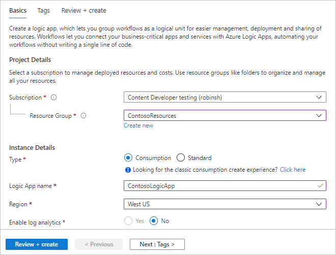
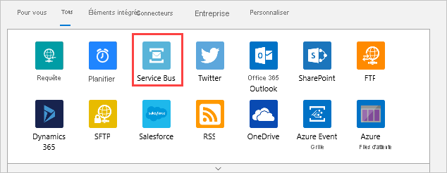
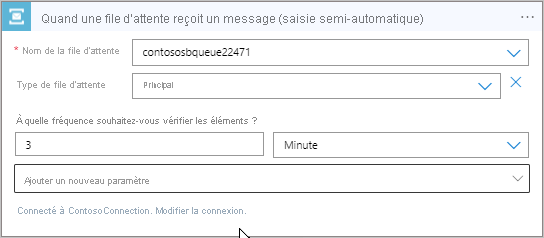
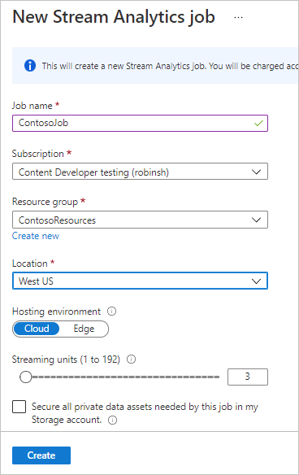
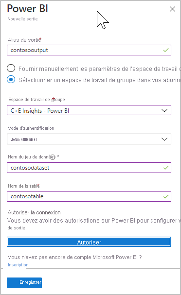
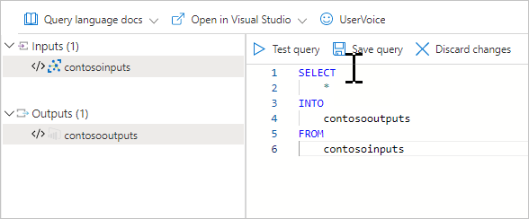
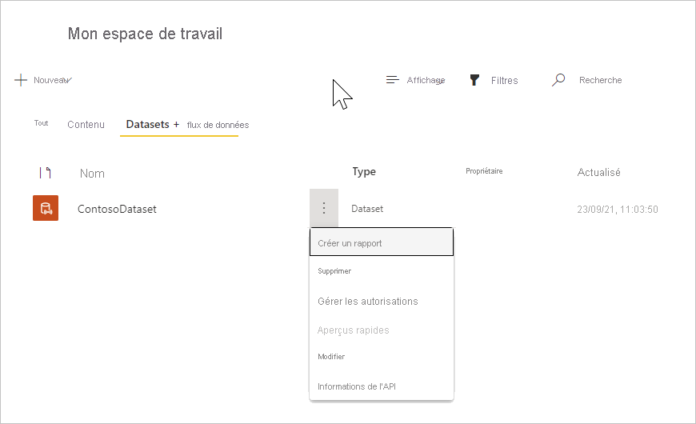

# <a name="tutorial-part-2---view-the-routed-messages"></a>Tutoriel : Partie 2 : Visualiser les messages routés

[!INCLUDE [iot-hub-include-routing-intro](../../includes/iot-hub-include-routing-intro.md)]

[!INCLUDE [updated-for-az](../../includes/updated-for-az.md)]

## <a name="rules-for-routing-the-messages"></a>Règles de routage des messages

Voici les règles de routage des messages qui ont été configurées dans la 1re partie de ce tutoriel. Vous allez les voir à l’œuvre dans cette deuxième partie.

|Valeur |Résultats|
|------|------|
|level="storage" |Écrire dans Stockage Azure.|
|level="critical" |Écrire dans une file d’attente Service Bus. Une application logique extrait le message de 
 la file d’attente et utilise Office 365 pour envoyer le message par e-mail.|
|default |Afficher ces données à l’aide de Power BI.|

Vous créez maintenant les ressources vers lesquelles les messages seront routés, vous exécutez une application pour envoyer des messages au hub et vous voyez le routage en action.

## <a name="create-a-logic-app"></a>Créer une application logique  

La file d’attente Service Bus doit être utilisée pour recevoir des messages indiqués comme étant critiques. Configurez une application logique pour surveiller la file d’attente Service Bus et envoyer un e-mail lors de l’ajout d’un message à la file d’attente.

1. Dans le [portail Azure](https://portal.azure.com), sélectionnez **+ Créer une ressource**. Tapez **application logique** dans la zone de recherche, puis sélectionnez Entrée. Dans les résultats de la recherche affichés, sélectionnez Application logique, puis sélectionnez **Créer** pour passer au volet **Créer une application logique**. Renseignez les champs.

   **Abonnement**: Sélectionnez votre abonnement Azure.

   **Groupe de ressources** : sélectionnez **Créer** sous le champ Groupe de ressources. Spécifiez **ContosoResources** comme nom du groupe de ressources. 

   **Détails de l’instance**
   **Type** : sélectionnez **Consommation** comme type d’instance. 

   Renseignez le champ **Nom de l’application logique**. Ce didacticiel utilise **ContosoLogicApp**. 

   **Région** : utilisez l’emplacement du centre de données le plus proche. Ce didacticiel utilise **USA Ouest**.

   **Activer l’analytique des journaux** : définissez ce bouton bascule pour ne pas activer l’analytique des journaux. 

   

   Sélectionnez **Vérifier + créer**. Le déploiement de l’application peut prendre quelques minutes. Quand vous avez terminé, un écran vous donne une vue d’ensemble du déploiement. 

2. Accédez à l’application logique. Si vous êtes toujours dans la page de déploiement, vous pouvez sélectionner **Accéder à la ressource**. Sinon, vous pouvez sélectionner **Groupe de ressources**, votre groupe de ressources (**ContosoResources** dans ce tutoriel), puis l’application logique dans la liste des ressources. 

    Faites défiler vers le bas jusqu’à ce qu’une vignette presque vide indiquant **Application logique vide +** apparaisse et sélectionnez-la. L’onglet par défaut de l’écran est « Pour vous ». Si ce volet est vide, sélectionnez **Tous** pour voir les connecteurs et les déclencheurs disponibles.

3. Sélectionnez **Service Bus** dans la liste des connecteurs.

   

4. Cette capture d’écran montre une liste de déclencheurs. Sélectionnez celui indiquant **Quand une file d’attente reçoit un message (saisie semi-automatique)** .

   

5. Renseignez les champs sur l’écran suivant avec les informations de connexion.

   **Nom de la connexion** : ContosoConnection
   
   Sélectionnez l’espace de noms Service Bus. Ce didacticiel utilise **ContosoSBNamespace**. Le nom de la clé (RootManageSharedAccessKey) et les droits (écouter, gérer, envoyer) sont récupérés et chargés. Sélectionnez **RootManageSharedAccessKey**. Le bouton **Créer** devient bleu (actif). Sélectionnez-le pour afficher l’écran de sélection de la file d’attente.  

6. Vous êtes ensuite invité à fournir des informations sur la file d’attente.  

   

   **Nom de la file d’attente :** ce champ est le nom de la file d’attente à partir de laquelle le message est envoyé. Cliquez sur cette liste déroulante et sélectionnez le nom de la file d’attente défini précédemment dans les étapes de configuration. Ce didacticiel utilise **contososbqueue**.

   **Type de file d’attente :** type de la file d’attente. Sélectionnez **Principal** dans la liste déroulante.

   Conservez les valeurs par défaut pour autres champs. Sélectionnez **Enregistrer** pour enregistrer la configuration du concepteur d’application logique.

7. Sélectionnez **+ Nouvelle étape**. Le volet **Choisir une opération** s’affiche. Sélectionnez **Office 365 Outlook**. Dans la liste, recherchez et sélectionnez **Envoyer un e-mail (V2)** . Connectez-vous à votre compte Office 365.   

8. Renseignez les champs à utiliser lors de l’envoi d’un e-mail relatif au message dans la file d’attente. 

    

   **À** : entrez l’adresse e-mail à laquelle l’avertissement doit être envoyé.

   **Objet** : entrez l’objet de l’e-mail.

   **Corps** : entrez le texte du corps de l’e-mail. Cliquez sur **Ajouter du contenu dynamique** pour voir les champs de l’e-mail que vous pouvez inclure. Si vous ne voyez rien, sélectionnez **Voir plus** pour afficher plus d’options. Sélectionnez **Contenu** pour afficher le corps de l’e-mail dans le message d’erreur.

9. Cliquez sur **Enregistrer** pour enregistrer vos modifications. Fermez le concepteur d’application logique. 

## <a name="set-up-azure-stream-analytics"></a>Configurer Azure Stream Analytics

Pour afficher les données dans une visualisation Power BI, commencez par configurer un travail Stream Analytics pour récupérer les données. N’oubliez pas que seuls les messages pour lesquels la propriété **level** est définie sur **normal** sont envoyés au point de terminaison par défaut et seront récupérés par le travail Stream Analytics pour la visualisation Power BI.

### <a name="create-the-stream-analytics-job"></a>Créer la tâche Stream Analytics

1. Indiquez **travaux** **stream** **analytics** dans la zone de recherche du [portail Azure](https://portal.azure.com) et sélectionnez **Entrée**. Sélectionnez **Créer** pour accéder à l’écran Travaux Stream Analytics, puis sélectionnez à nouveau **Créer** pour accéder à l’écran de création. 

2. Saisissez les informations ci-après concernant le travail.

   **Nom du travail** : Nom du travail. Le nom doit être globalement unique. Ce didacticiel utilise **contosoJob**.

   **Abonnement**: Abonnement Azure que vous utilisez pour le tutoriel.

   **Groupe de ressources** : utilisez le même groupe de ressources que celui de votre hub IoT. Ce didacticiel utilise **ContosoResources**.

   **Emplacement** : utilisez le même emplacement que celui utilisé dans le script de configuration. Ce didacticiel utilise **USA Ouest**.

   

3. Sélectionnez **Créer** pour créer le travail. Le déploiement peut prendre quelques minutes.

    Pour revenir à la tâche, sélectionnez **Accéder à la ressource**. Vous pouvez également sélectionner **Groupes de ressources**. Ce didacticiel utilise **ContosoResources**. Sélectionnez ensuite le groupe de ressources, puis la tâche Stream Analytics dans la liste des ressources.

### <a name="add-an-input-to-the-stream-analytics-job"></a>Ajouter une entrée à la tâche Stream Analytics

1. Sous **Topologie de la tâche**, sélectionnez **Entrées**.

2. Dans le volet **Entrées**, sélectionnez **Ajouter une entrée de flux** et sélectionnez IoT Hub. Dans l’écran qui s’affiche, renseignez les champs suivants :

   **Alias d’entrée** : Ce didacticiel utilise **contosoinputs**.

   Sélectionnez **Sélectionner un hub IoT dans vos abonnements**, puis sélectionnez votre abonnement dans la liste déroulante.
   
   **Hub IoT** : Sélectionnez le hub IoT. Ce didacticiel utilise **ContosoTestHub**.

   **Groupe de consommateurs** : Sélectionnez le groupe de consommateurs configuré dans la 1re partie de ce tutoriel. Ce didacticiel utilise **contosoconsumers**.

   **Nom de la stratégie d'accès partagé** : Sélectionnez **service**. Le portail renseigne la clé de la stratégie d’accès partagé pour vous.

   **Point de terminaison** : sélectionnez **Messagerie**. (Si vous sélectionnez Surveillance des opérations, vous obtenez les données de télémétrie sur l’IoT Hub, plutôt que les données que vous envoyez.) 

   Pour les autres champs, acceptez les valeurs par défaut. 

   

3. Sélectionnez **Enregistrer**.

### <a name="add-an-output-to-the-stream-analytics-job"></a>Ajouter une sortie à la tâche Stream Analytics

1. Sous **Topologie de la tâche**, sélectionnez **Sorties**.

2. Dans le volet **Sorties**, sélectionnez **Ajouter**, puis **Power BI**. Dans l’écran qui s’affiche, renseignez les champs suivants :

   **Alias de sortie** : alias unique de la sortie. Ce didacticiel utilise **contosooutputs**. 

   Sélectionnez **Sélectionner un espace de travail de groupe dans vos abonnements**. Dans **Espace de travail de groupe**, spécifiez **Mon espace de travail**.

   **Mode d’authentification** : sélectionnez **Jeton utilisateur**. 

   **Nom du jeu de données** : nom du jeu de données à utiliser dans Power BI. Ce didacticiel utilise **contosodataset**. 

   **Nom de la table** : nom de la table à utiliser dans Power BI. Ce didacticiel utilise **contosotable**.

3. Sélectionnez **Autoriser** et connectez-vous à votre compte Power BI. (Plusieurs tentatives de connexion peuvent s’avérer nécessaires.)

   

4. Sélectionnez **Enregistrer**.

### <a name="configure-the-query-of-the-stream-analytics-job"></a>Configurer la requête de la tâche Stream Analytics

1. Sous **Topologie de la tâche**, sélectionnez **Requête**.

2. Remplacez `[YourInputAlias]` par l’alias d’entrée du travail. Ce didacticiel utilise **contosoinputs**.

3. Remplacez `[YourOutputAlias]` par l’alias de sortie du travail. Ce didacticiel utilise **contosooutputs**.

   

4. Sélectionnez **Enregistrer**.

5. Fermez le volet Requête. Vous revenez à la vue des ressources dans le groupe de ressources. Sélectionnez la tâche Stream Analytics. Ce tutoriel l’appelle **contosoJob**.

### <a name="run-the-stream-analytics-job"></a>Exécuter la tâche Stream Analytics

Dans la tâche Stream Analytics, sélectionnez **Démarrer** > **Maintenant** > **Démarrer**. Une fois la tâche lancée, l’état correspondant passe de **Arrêté** à **Exécution**.

Pour configurer le rapport Power BI, vous avez besoin de données. Vous allez donc configurer Power BI après la création de l’appareil et exécuter l’application de simulation d’appareil pour générer des données.

## <a name="run-simulated-device-app"></a>Exécuter l’application d’appareil simulé

Dans la 1re partie de ce tutoriel, vous avez configuré un appareil pour simuler l’utilisation d’un appareil IoT. Si vous ne l’avez pas encore fait, téléchargez l’application console .NET qui simule l’appareil envoyant des messages appareil-à-cloud à un hub IoT.

Cette application envoie des messages pour chacune des différentes méthodes de routage des messages. Le téléchargement contient aussi un dossier où se trouvent le modèle et le fichier de paramètres complets Azure Resource Manager ainsi que les scripts Azure CLI et PowerShell.

Si vous n’avez pas téléchargé les fichiers depuis le dépôt au cours de la 1re partie de ce tutoriel, faites-le maintenant à partir de la [simulation d’appareil IoT](https://github.com/Azure-Samples/azure-iot-samples-csharp/archive/main.zip). La sélection de ce lien télécharge un dépôt contenant plusieurs applications. La solution que vous recherchez se trouve à l’emplacement iot-hub/Tutorials/Routing/IoT_SimulatedDevice.sln. 

Double-cliquez sur le fichier de solution (IoT_SimulatedDevice.sln) pour ouvrir le code dans Visual Studio, puis ouvrez Program.cs. Remplacez `{your hub name}` par le nom d’hôte IoT Hub. Le format du nom d’hôte IoT Hub est **{iot-hub-name}.azure-devices.net**. Pour ce didacticiel, le nom d’hôte IoT Hub est **ContosoTestHub.azure-devices.net**. Ensuite, remplacez `{your device key}` par la clé de l’appareil enregistrée précédemment lorsque vous avez configuré l’appareil simulé. 

   ```csharp
        static string s_myDeviceId = "Contoso-Test-Device";
        static string s_iotHubUri = "ContosoTestHub.azure-devices.net";
        // This is the primary key for the device. This is in the portal. 
        // Find your IoT hub in the portal > IoT devices > select your device > copy the key. 
        static string s_deviceKey = "{your device key}";
   ```

## <a name="run-and-test"></a>Exécuter et tester

Exécutez l’application console. Patientez quelques minutes. Vous pouvez voir les messages envoyés sur l’écran de la console de l’application.

L’application envoie un nouveau message appareil-à-cloud à l’IoT Hub toutes les secondes. Le message contient un objet sérialisé JSON avec l’ID d’appareil, la température, l’humidité et le niveau du message, qui est défini par défaut sur `normal`. Un niveau de `critical` ou `storage` est attribué de façon aléatoire, ce qui permet au message d’être acheminé vers le compte de stockage ou la file d’attente Service Bus (qui déclenche votre application logique pour envoyer un e-mail). Vous pouvez afficher les lectures par défaut (`normal`) dans un rapport BI. 

À ce stade, si tout est configuré correctement, vous devez voir les résultats suivants :

1. Vous commencez à recevoir des e-mails sur les messages critiques.

   

   Ce résultat signifie que les affirmations suivantes sont vraies. 

   * Que le routage vers la file d’attente Service Bus fonctionne correctement.
   * Que l’application logique qui récupère le message dans la file d’attente Service Bus fonctionne correctement.
   * Que le connecteur de l’application logique pour Outlook fonctionne correctement. 

2. Dans le [portail Azure](https://portal.azure.com), sélectionnez **Groupes de ressources**, puis votre groupe de ressources. Ce didacticiel utilise **ContosoResources**. 

    Sélectionnez le compte de stockage, **Conteneurs**, puis le conteneur qui stocke vos résultats. Ce didacticiel utilise **contosoresults**. Vous devez voir un dossier, et vous pouvez explorer les répertoires jusqu’à voir un ou plusieurs fichiers. Ouvrez l’un de ces fichiers ; ils contiennent les entrées acheminées vers le compte de stockage. 

   

Ce résultat signifie que l’affirmation suivante est vraie.

   * Que le routage vers le compte de stockage fonctionne correctement.

L’application étant en cours d’exécution, configurez la visualisation Power BI pour voir les messages provenant du point de terminaison par défaut.

## <a name="set-up-the-power-bi-visualizations"></a>Configurer les visualisations Power BI

1. Connectez-vous à votre compte [Power BI](https://powerbi.microsoft.com/).

2. Sélectionnez **Mon espace de travail**. Vous devriez voir au moins un jeu de données créé. Si vous ne voyez rien, exécutez l’**application d’appareil simulé** 5 à 10 minutes de plus pour diffuser plus de données. Quand l’espace de travail apparaît, il doit avoir un jeu de données appelé ContosoDataset. Cliquez avec le bouton droit sur les trois points verticaux à droite du nom du jeu de données. Dans la liste déroulante, sélectionnez **Créer un rapport**.

     

3. Examinez la section **Visualisations** à droite, puis sélectionnez **Graphique en courbes** pour sélectionner un graphique en courbes dans la page de rapport BI. Faites glisser le graphique pour qu’il remplisse l’espace horizontalement. Maintenant, dans la section **Champs** à droite, ouvrez ContosoTable. Sélectionnez **EventEnqueuedUtcTime**. Il doit être placé sur l’axe X. Sélectionnez **temperature** et faites-le glisser dans le champ **Valeurs**. Les températures sont ajoutées au graphique. Votre graphique doit alors ressembler à ce qui suit :

     

4. Cliquez dans la partie inférieure de la zone de graphique. Sélectionnez de nouveau **Graphique en courbes**. Un graphique est créé sous le premier.

5. Dans la table, sélectionnez **EventQueuedTime**. Il est placé dans le champ Axe. Faites glisser **humidity** dans le champ Valeurs. Vous pouvez maintenant voir les deux graphiques.

     

   Vous avez envoyé des messages du point de terminaison par défaut du hub IoT à Azure Stream Analytics. Vous avez ensuite ajouté un rapport Power BI composé de deux graphiques (température et humidité) pour présenter les données. 

7. Sélectionnez **Fichier > Enregistrer** pour enregistrer le rapport. Entrez un nom de rapport à l’invite. Enregistrez votre rapport dans votre espace de travail.

Vous devriez voir les données sur les deux graphiques. Ce résultat signifie que les affirmations suivantes sont vraies :

   * Que le routage vers le point de terminaison par défaut fonctionne correctement.
   * Que le travail Azure Stream Analytics est correctement diffusé en continu.
   * Que la visualisation Power BI est correctement configurée.

Vous pouvez actualiser les graphiques pour afficher les données les plus récentes en sélectionnant le bouton Actualiser en haut de la fenêtre Power BI. 

## <a name="clean-up-resources"></a>Nettoyer les ressources 

Si vous souhaitez supprimer toutes les ressources Azure que vous avez créées au cours des deux parties de ce tutoriel, supprimez le groupe de ressources. Cette opération supprime toutes les ressources contenues dans le groupe. Dans ce cas, l’IoT Hub, l’espace de noms et la file d’attente Service Bus, l’application logique, le compte de stockage et le groupe de ressources lui-même sont supprimés. Vous pouvez également supprimer les ressources Power BI et effacer les e-mails envoyés durant le tutoriel.

### <a name="clean-up-resources-in-the-power-bi-visualization"></a>Supprimer des ressources dans la visualisation Power BI

Connectez-vous à votre compte [Power BI](https://powerbi.microsoft.com/). Accédez à votre espace de travail. Ce didacticiel utilise **My Workspace**. Pour supprimer la visualisation Power BI, accédez à Jeux de données, puis sélectionnez l’icône de corbeille pour supprimer le jeu de données. Ce didacticiel utilise **contosodataset**. Lorsque vous supprimez le jeu de données, le rapport est également supprimé.

### <a name="use-the-azure-cli-to-clean-up-resources"></a>Utiliser Azure CLI pour nettoyer des ressources

Pour supprimer le groupe de ressources, utilisez la commande [az group delete](/cli/azure/group#az_group_delete). `$resourceGroup` a été défini sur **ContosoResources** au début de ce tutoriel.

```azurecli-interactive
az group delete --name $resourceGroup
```

### <a name="use-powershell-to-clean-up-resources"></a>Utiliser PowerShell pour nettoyer les ressources

Pour supprimer le groupe de ressources, utilisez la commande [Remove-AzResourceGroup](/powershell/module/az.resources/remove-azresourcegroup). `$resourceGroup` a été défini sur **ContosoResources** au début de ce tutoriel.

```azurepowershell-interactive
Remove-AzResourceGroup -Name $resourceGroup
```

### <a name="clean-up-test-emails"></a>Nettoyer les e-mails de test

Vous pouvez également supprimer les e-mails de votre boîte de réception, qui ont été générés via l’application logique durant l’exécution de l’application d’appareil.

## <a name="next-steps"></a>Étapes suivantes

Dans ce tutoriel en deux parties, vous avez appris à utiliser le routage des messages pour router des messages IoT Hub vers différentes destinations en effectuant les tâches suivantes.  

**Partie I : Créer des ressources, configurer le routage des messages**
> [!div class="checklist"]
> * Créer les ressources : un hub IoT, un compte de stockage, une file d’attente Service Bus et un appareil simulé.
> * Configurez les points de terminaison et les routes des messages dans IoT Hub pour le compte de stockage et la file d’attente Service Bus.

**Partie II : Envoyer les messages au hub, visualiser les résultats routés**
> [!div class="checklist"]
> * Créer une application logique qui est déclenchée et qui envoie un e-mail lors de l’ajout d’un message à la file d’attente Service Bus.
> * Télécharger et exécuter une application qui simule l’envoi de messages par un appareil IoT au Hub pour les différentes options de routage.
>
> * Créer une visualisation Power BI pour les données envoyées au point de terminaison par défaut.
>
> * Afficher les résultats...
> * ... dans la file d’attente Service Bus et les e-mails.
> * ... dans le compte de stockage.
> * ... dans la visualisation Power BI.


Passez au didacticiel suivant pour découvrir comment gérer l’état d’un appareil IoT. 

> [!div class="nextstepaction"]
> [Configurer et utiliser des métriques et des diagnostics avec un hub IoT](tutorial-use-metrics-and-diags.md)
