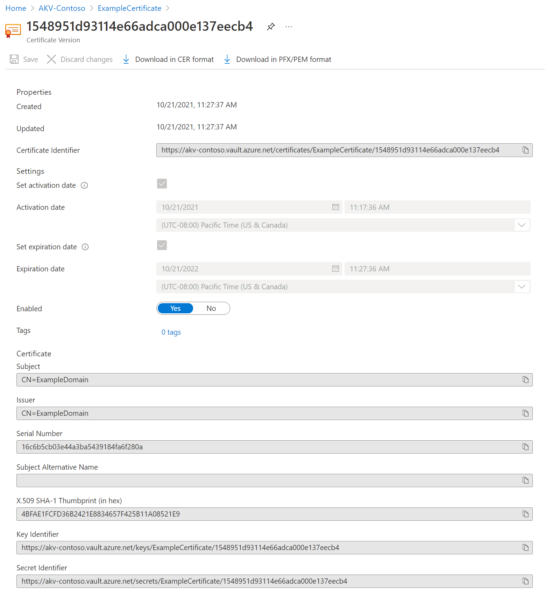

# Démarrage rapide : Définir et récupérer un certificat dans Azure Key Vault à l’aide du portail Azure

Azure Key Vault est un service cloud qui fonctionne comme un magasin sécurisé contenant des secrets. Vous pouvez stocker des clés, des mots de passe, des certificats et d’autres secrets en toute sécurité. Vous pouvez créer et gérer des coffres de clés Azure grâce au portail Azure. Dans ce guide de démarrage rapide, vous créez un coffre de clés, puis l’utilisez pour stocker un certificat. Pour plus d’informations sur Key Vault, consultez la [présentation](../general/overview.md).

Si vous n’avez pas d’abonnement Azure, créez un [compte gratuit](https://azure.microsoft.com/free/?WT.mc_id=A261C142F) avant de commencer.

## Connexion à Azure

Connectez-vous au portail Azure sur https://portal.azure.com.

## Création d'un coffre

1. Dans le menu du Portail Azure ou dans la page **Accueil**, sélectionnez **Créer une ressource**.
2. Dans la zone de recherche, entrez **Key Vault**.
3. Dans la liste des résultats, choisissez **Key Vault**.
4. Dans la section Key Vault, choisissez **Créer**.
5. Dans la section **Créer un coffre de clés**, renseignez les informations suivantes :
    - **Name** : un nom unique est obligatoire. Pour ce guide de démarrage rapide, nous utilisons **Example-Vault**. 
    - **Abonnement**: Choisissez un abonnement.
    - Sous **Groupe de ressources**, choisissez **Créer** et entrez le nom du groupe de ressources.
    - Dans le menu déroulant **Emplacement**, choisissez un emplacement.
    - Conservez les valeurs par défaut des autres options.
6. Après avoir renseigné les informations ci-dessus, sélectionnez **Créer**.

Notez les deux propriétés ci-dessous :

* **Nom du coffre** : dans l’exemple, il s’agit d’**Example-Vault**. Vous allez utiliser ce nom pour les autres étapes.
* **URI du coffre** : dans l’exemple, il s’agit de `https://example-vault.vault.azure.net/`. Les applications qui utilisent votre coffre via son API REST doivent utiliser cet URI.

À ce stade, votre compte Azure est le seul autorisé à effectuer des opérations sur ce nouveau coffre.

## Ajouter un certificat à Key Vault

Pour ajouter un certificat au coffre, vous devez effectuer deux autres opérations. Dans ce cas, nous ajoutons un certificat auto-signé qui peut être utilisé par une application. Le certificat est appelé **ExampleCertificate**.

1. Dans les pages des propriétés Key Vault, sélectionnez **Certificats**.
2. Cliquez sur **Generate/Import (Générer/Importer)** .
3. Dans l’écran **Créer un certificat**, choisissez les valeurs suivantes :
    - **Méthode de création de certificat** : Générer.
    - **Nom du certificat** : ExampleCertificate.
    - **Objet** : CN=ExampleDomain
    - Conservez les valeurs par défaut des autres options. (par défaut, si vous ne spécifiez rien dans la stratégie Avancée, cela sera utilisé comme un certificat d’authentification client)
 4. Cliquez sur **Créer**.

Lorsque vous recevez le message confirmant la création du certificat, vous pouvez cliquer dessus dans la liste. Certaines propriétés s’affichent. Si vous cliquez sur la version actuelle, vous voyez la valeur que vous avez spécifiée à l’étape précédente.

## Exporter un certificat à partir de Key Vault
En cliquant sur le bouton « Télécharger au format CER » ou « Télécharger au format PFX/PEM », vous pouvez télécharger le certificat. 

## Nettoyer les ressources

D’autres démarrages rapides et didacticiels sur les coffres de clés reposent sur ce démarrage rapide. Si vous prévoyez d’utiliser d’autres démarrages rapides et didacticiels, il peut être utile de conserver ces ressources.
Si vous n’en avez plus besoin, supprimez le groupe de ressources. Ce faisant, vous supprimez le coffre de clés et les ressources associées. Pour supprimer le groupe de ressources à l’aide du portail :

1. Entrez le nom de votre groupe de ressources dans la zone Recherche en haut du portail. Lorsque vous voyez le groupe de ressources utilisé dans ce démarrage rapide dans les résultats de recherche, sélectionnez-le.
2. Sélectionnez **Supprimer le groupe de ressources**.
3. Dans le champ **TYPE THE RESOURCE GROUP NAME: (TAPER LE NOM DU GROUPE DE RESSOURCES :)** , tapez le nom du groupe de ressources et sélectionnez **Supprimer**.

## Étapes suivantes

Dans ce guide de démarrage rapide, vous avez créé un coffre de clés et vous y avez stocké un certificat. Pour en savoir plus sur Key Vault et sur la manière de l’intégrer à vos applications, consultez les articles ci-dessous.

- Lire la [vue d’ensemble Azure Key Vault](../general/overview.md)
- Consulter le [Guide du développeur Azure Key Vault](../general/developers-guide.md)
- Passer en revue la [Vue d’ensemble de la sécurité de Key Vault](../general/security-overview.md)
