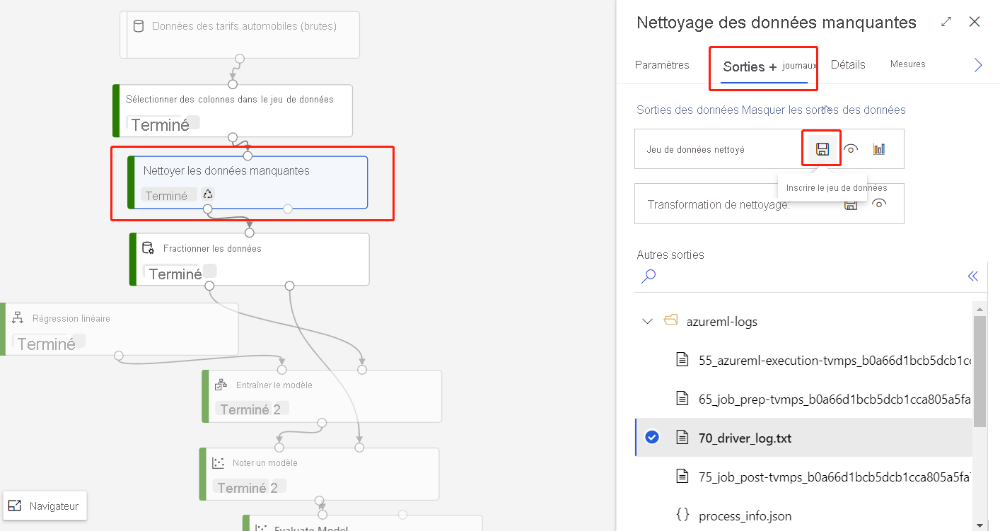
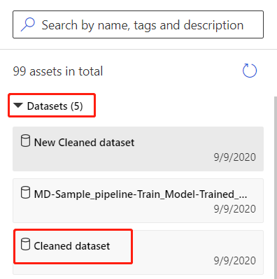

# Importer des données dans le concepteur Azure Machine Learning

Dans cet article, vous allez apprendre à importer vos propres données dans le concepteur afin de créer des solutions personnalisées. Vous pouvez importer des données dans le concepteur de deux manières : 

* **Jeux de données Azure Machine Learning** - Inscrivez des [jeux de données](concept-data.md#datasets) dans Azure Machine Learning pour activer les fonctionnalités avancées qui vous aident à gérer vos données.
* **Module Importer des données** - Utilisez le module [Importer des données](algorithm-module-reference/import-data.md) pour accéder directement aux données à partir de sources de données en ligne.

[!INCLUDE [machine-learning-missing-ui](../../includes/machine-learning-missing-ui.md)]

## Utiliser des jeux de données Azure Machine Learning

Nous vous recommandons d’utiliser des [jeux de données](concept-data.md#datasets) pour importer des données dans le concepteur. En inscrivant un jeu de données, vous pouvez tirer pleinement parti des fonctionnalités de données avancées, telles que le [contrôle de version](how-to-version-track-datasets.md) et la [supervision des données](how-to-monitor-datasets.md).

### Inscrire un jeu de données

Vous pouvez inscrire des jeux de données existants [par programmation avec le kit de développement logiciel (SDK)](how-to-create-register-datasets.md#datasets-sdk) ou [visuellement dans Azure Machine Learning Studio](how-to-connect-data-ui.md#create-datasets).

Vous pouvez également inscrire la sortie de n’importe quel module du concepteur sous forme de jeu de données.

1. Sélectionnez le module qui génère les données que vous souhaitez inscrire.

1. Dans le volet de propriétés, sélectionnez **Sorties + journaux** > **Inscrire le jeu de données**.

    

Si les données de sortie du module sont dans un format tabulaire, vous devez choisir d’enregistrer la sortie sous la forme d’un **jeu de données de fichier** ou d’un **jeu de données tabulaire**.

 - Un **jeu de données de fichier** inscrit le dossier de sortie du module en tant que jeu de données de fichier. Le dossier de sortie contient un fichier de données et des méta-fichiers utilisés en interne par le concepteur. Sélectionnez cette option si vous souhaitez continuer à utiliser le jeu de données inscrit dans le concepteur. 

 - Le **jeu de données tabulaire** inscrit uniquement le fichier de données de sortie du module sous la forme d’un jeu de données tabulaire. Ce format est facilement utilisé par d’autres outils, par exemple dans le Machine Learning automatisé ou le Kit de développement logiciel (SDK) Python. Sélectionnez cette option si vous envisagez d’utiliser le jeu de données enregistré en dehors du concepteur.  
 

### Utiliser un jeu de données

Vos jeux de données inscrits se trouvent dans la palette de modules, sous **Jeux de données**. Pour utiliser un jeu de données, faites-le glisser et déposez-le sur le canevas du pipeline. Ensuite, connectez le port de sortie du jeu de données à d’autres modules du canevas. 

Si vous inscrivez un jeu de données de fichiers, le type de port de sortie du jeu de données est **AnyDirectory**. Si vous inscrivez un jeu de données tabulaire, le type de port de sortie du jeu de données est **DataFrameDirectory**. Notez que si vous connectez le port de sortie du jeu de données à d’autres modules dans le concepteur, le type de port des jeux de données et des modules doit être aligné.

> [!NOTE]
> Le concepteur prend en charge le [contrôle de version de jeu de données](how-to-version-track-datasets.md). Spécifiez la version du jeu de données dans le volet des propriétés du module de jeu de données.

### Limites 

- Actuellement, vous pouvez visualiser uniquement le jeu de données tabulaire dans le concepteur. Si vous inscrivez un jeu de données de fichiers en dehors du concepteur, vous ne pouvez pas le visualiser dans le canevas du concepteur.
- Votre jeu de données est stocké dans un réseau virtuel (VNet). Si vous souhaitez le visualiser, vous devez activer l’identité managée de l’espace de travail du magasin de données.
    1. Accédez au magasin de données connexe, puis cliquez sur **Mettre à jour les informations d’identification**
    :::image type="content" source="./media/resource-known-issues/datastore-update-credential.png" alt-text="Mettre à jour les informations d’identification":::.
    1. Sélectionnez **Oui** pour activer l’identité managée de l’espace de travail.
    :::image type="content" source="./media/resource-known-issues/enable-workspace-managed-identity.png" alt-text="Activer l’identité managée de l’espace de travail":::

## Importer des données à l’aide du module Importer des données

Bien que nous recommandions l'utilisation de jeux de données pour importer des données, vous pouvez également utiliser le module [Importer des données](algorithm-module-reference/import-data.md). Le module Importer des données ignore l’inscription de votre jeu de données dans Azure Machine Learning et importe les données directement depuis un [magasin de données](concept-data.md#datastores) ou une URL HTTP.

Pour plus d’informations sur l’utilisation du module Importer des données, consultez la [page de référence Importer des données](algorithm-module-reference/import-data.md).

> [!NOTE]
> Si votre jeu de données contient trop de colonnes, vous pouvez obtenir l’erreur suivante : « Échec de la validation en raison d’une limitation de taille ». Pour éviter cela, [inscrivez le jeu de données dans l’interface des jeux de données](how-to-connect-data-ui.md#create-datasets).

## Sources prises en charge

Cette section répertorie les sources de données prises en charge par le concepteur. Les données accèdent au concepteur depuis un magasin de données ou un [jeu de données tabulaires](how-to-create-register-datasets.md#dataset-types).

### Sources de magasin de données
Pour obtenir la liste des sources de magasin de données prises en charge, consultez [Accéder aux données dans les services de stockage Azure](how-to-access-data.md#supported-data-storage-service-types).

### Sources du jeu de données tabulaire

Le concepteur prend en charge les jeux de données tabulaires créés à partir des sources suivantes :
 * Fichiers délimités
 * Fichiers JSON
 * Fichiers Parquet
 * Requêtes SQL

## Types de données

Le concepteur reconnaît en interne les types de données suivants :

* String
* Integer
* Decimal
* Boolean
* Date

Le concepteur utilise un type de données interne appelé pour transmettre des données entre les modules. Vous pouvez convertir de manière explicite vos données dans un format de table de données à l’aide du module [Convertir en jeu de données](algorithm-module-reference/convert-to-dataset.md). Tout module qui accepte des formats autres que le format interne convertit silencieusement les données avant de les transmettre au module suivant.

## Contraintes de données

Les modules du concepteur sont limités par la taille de la cible de calcul. En présence de jeux de données plus volumineux, vous devez utiliser une plus grande ressource de calcul Azure Machine Learning. Pour plus d’informations sur le calcul Azure Machine Learning, consultez [Qu’est-ce qu’une cible de calcul dans Azure Machine Learning ?](concept-compute-target.md#azure-machine-learning-compute-managed)

## Accéder à des données dans un réseau virtuel

Si votre espace de travail se trouve dans un réseau virtuel, vous devez effectuer des étapes de configuration supplémentaires pour visualiser les données dans le concepteur. Pour plus d’informations sur l’utilisation des magasins de données et des jeux de données sur un réseau virtuel, consultez [Utiliser Azure Machine Learning Studio dans un réseau virtuel Azure](how-to-enable-studio-virtual-network.md).

## Étapes suivantes

Découvrez les notions de base du concepteur grâce à ce [tutoriel : Prédire le prix de voitures avec le concepteur](tutorial-designer-automobile-price-train-score.md).
