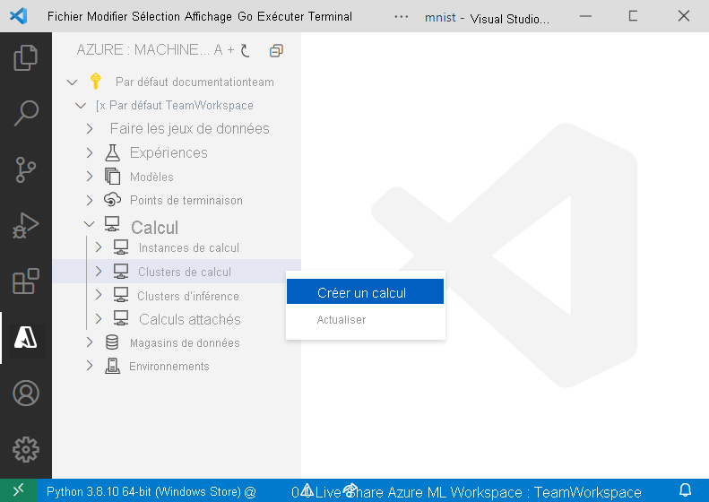
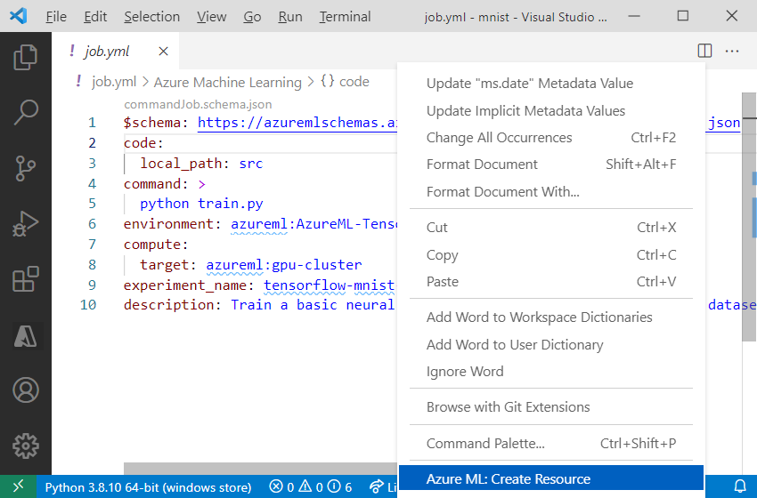

# <a name="train-an-image-classification-tensorflow-model-using-the-azure-machine-learning-visual-studio-code-extension-preview"></a>Entraîner un modèle de classification d’images TensorFlow en utilisant l’extension Visual Studio Code d’Azure Machine Learning (préversion)

Découvrez comment entraîner un modèle de classification d’images pour reconnaître des chiffres écrits à la main à l’aide de TensorFlow et de l’extension Azure Machine Learning de Visual Studio Code.

Dans ce tutoriel, vous allez apprendre à effectuer les tâches suivantes :

> [!div class="checklist"]
> * Comprendre le code
> * Créer un espace de travail
> * Créer un cluster GPU pour l’entraînement
> * Effectuer l’apprentissage d’un modèle

## <a name="prerequisites"></a>Prérequis

- Abonnement Azure. Si vous n’en avez pas, inscrivez-vous ou essayez la [version gratuite ou payante d’Azure Machine Learning](https://azure.microsoft.com/free/t.com/free/)
- Installez [Visual Studio Code](https://code.visualstudio.com/docs/setup/setup-overview), éditeur de code léger et multiplateforme
- Extension Azure Machine Learning de Visual Studio Code. Pour obtenir des instructions d’installation, consultez le guide [Configurer l’extension Visual Studio Code d’Azure Machine Learning](./how-to-setup-vs-code.md)
- CLI (v2) (préversion). Pour obtenir des instructions d’installation, consultez [Installer, configurer et utiliser l’interface CLI (v2) (préversion)](how-to-configure-cli.md)

## <a name="understand-the-code"></a>Comprendre le code

Le code de ce tutoriel utilise TensorFlow pour entraîner un modèle Machine Learning de classification d’images qui classe les chiffres manuscrits de 0 à 9. Pour ce faire, il crée un réseau neuronal qui prend les valeurs de pixel d’une image 28 px x 28 px comme entrée, et génère une liste de 10 probabilités, une pour chacun des chiffres classifiés. Vous trouverez ci-dessous un exemple de ce à quoi ressemblent les données.  


Pour obtenir le code de ce tutoriel, téléchargez et décompressez le [dépôt d’exemples Azure ML](https://github.com/Azure/azureml-examples/archive/refs/heads/main.zip) n’importe où sur votre ordinateur.

## <a name="create-a-workspace"></a>Créer un espace de travail

La première chose à faire pour générer une application dans Azure Machine Learning consiste à créer un espace de travail. Un espace de travail contient les ressources nécessaires pour entraîner des modèles ainsi que les modèles entraînés proprement dits. Pour plus d’informations, consultez [Qu’est-ce qu’un espace de travail ?](./concept-workspace.md).

1. Ouvrez le répertoire *azureml-examples-main/cli/jobs/train/tensorflow/mnist* dans Visual Studio Code.
1. Dans la barre d’activité Visual Studio Code, sélectionnez l’icône **Azure** pour ouvrir la vue Azure Machine Learning.
1. Dans la vue Azure Machine Learning, cliquez avec le bouton droit sur le nœud de votre abonnement et sélectionnez **Créer un espace de travail**.

    > [!div class="mx-imgBorder"]
    > 

1. Un fichier de spécifications apparaît. Configurez le fichier de spécifications avec les options suivantes. 

    ```yml
    $schema: https://azuremlschemas.azureedge.net/latest/workspace.schema.json
    name: TeamWorkspace
    location: WestUS2
    friendly_name: team-ml-workspace
    description: A workspace for training machine learning models
    tags:
      purpose: training
      team: ml-team
    ```

    Le fichier de spécification crée un espace de travail appelé `TeamWorkspace` dans la région `WestUS2`. Le reste des options définies dans le fichier de spécification fournissent un nom convivial, des descriptions et des étiquettes pour l’espace de travail.

1. Cliquez avec le bouton droit sur le fichier de spécification et sélectionnez **Azure ML : Créer une ressource**. La création d’une ressource utilise les options de configuration définies dans le fichier de spécifications YAML et envoie un travail en utilisant l’interface CLI (v2). À ce stade, une demande est envoyée à Azure pour créer un nouvel espace de travail et ses ressources dépendantes dans votre compte. Après quelques minutes, le nouvel espace de travail apparaît dans votre nœud d’abonnement.
1. Définissez `TeamWorkspace` comme votre espace de travail par défaut. Cela place les ressources et les travaux que vous créez dans l’espace de travail par défaut. Sélectionnez le bouton **Définir l’espace de travail Azure ML** dans la barre d’état de Visual Studio Code, puis suivez les invites pour définir `TeamWorkspace` comme votre espace de travail par défaut.

Pour plus d’informations sur les espaces de travail, consultez [Comment gérer des ressources dans VS Code](how-to-manage-resources-vscode.md).

## <a name="create-a-gpu-cluster-for-training"></a>Créer un cluster GPU pour l’entraînement

Une cible de calcul est la ressource ou l’environnement informatique où vous exécutez des travaux d’entraînement. Pour plus d’informations, consultez la [documentation sur les cibles de calcul Azure Machine Learning](./concept-compute-target.md).

1. Dans la vue Azure Machine Learning, développez le nœud de votre espace de travail.
1. Cliquez avec le bouton droit sur le nœud **Clusters de calcul** à l’intérieur du nœud **Calcul** de votre espace de travail, puis sélectionnez **Créer un calcul**.

    > [!div class="mx-imgBorder"]
    > 

1. Un fichier de spécifications apparaît. Configurez le fichier de spécifications avec les options suivantes.

    ```yml
    $schema: https://azuremlschemas.azureedge.net/latest/compute.schema.json
    name: gpu-cluster
    type: amlcompute
    size: Standard_NC12
    
    min_instances: 0
    max_instances: 3
    idle_time_before_scale_down: 120
    ```

    Le fichier de spécification crée un cluster GPU appelé `gpu-cluster`, avec au plus 3 nœuds de machines virtuelles Standard_NC12 qui font automatiquement l’objet d’un scale-down à 0 nœud après 120 secondes d’inactivité.

    Pour plus d’informations sur les tailles de machine virtuelle, consultez [Tailles des machines virtuelles Linux dans Azure](../virtual-machines/sizes.md).

1. Cliquez avec le bouton droit sur le fichier de spécification et sélectionnez **Azure ML : Créer une ressource**.

Après quelques minutes, la nouvelle cible de calcul apparaît dans le nœud *Calcul > Clusters de calcul* de votre espace de travail.

## <a name="train-image-classification-model"></a><a name="train-the-model"></a> Entraîner un modèle de classification d’images

Lors du processus d’entraînement, un modèle TensorFlow est entraîné en traitant les données d’entraînement et les patterns d’entraînement incorporés pour chacun des chiffres classifiés.

Comme les espaces de travail et les cibles de calcul, les travaux d’entraînement sont définis avec des modèles de ressources. Pour cet exemple, la spécification est définie dans le fichier *job.yml* qui se présente de la façon suivante :

```yml
$schema: https://azuremlschemas.azureedge.net/latest/commandJob.schema.json
code: 
    local_path: src
command: >
    python train.py
environment: azureml:AzureML-TensorFlow2.4-Cuda11-OpenMpi4.1.0-py36:1
compute:
    target: azureml:gpu-cluster
experiment_name: tensorflow-mnist-example
description: Train a basic neural network with TensorFlow on the MNIST dataset.
```

Ce fichier de spécification soumet un travail d’entraînement appelé `tensorflow-mnist-example` à la cible de calcul `gpu-cluster` récemment créée qui exécute le code dans le script Python *train.py*. L’environnement utilisé est un des environnements organisés fournis par Azure Machine Learning qui contient TensorFlow et d’autres dépendances logicielles nécessaires pour exécuter le script d’entraînement. Pour plus d’informations sur les environnements organisés, consultez [Environnements organisés Azure Machine Learning](resource-curated-environments.md).

Pour soumettre le travail d’entraînement :

1. Ouvrez le fichier *job.yml*.
1. Cliquez avec le bouton droit sur le fichier dans l’éditeur de texte et sélectionnez **Azure ML : Créer une ressource**.

> [!div class="mx-imgBorder"]
> 

À ce stade, une demande est envoyée à Azure pour exécuter votre expérience sur la cible de calcul sélectionnée dans votre espace de travail. Cette opération prend plusieurs minutes. La durée d’exécution du travail d’entraînement est influencée par plusieurs facteurs tels que le type de calcul et la taille des données d’entraînement. Pour suivre la progression de votre expérience, cliquez avec le bouton droit sur le nœud d’exécution actif et sélectionnez **Afficher l’exécution dans le portail Azure**.

Quand la boîte de dialogue vous invitant à ouvrir un site web externe s’affiche, sélectionnez **Ouvrir**.

> [!div class="mx-imgBorder"]
> 

Une fois l’entraînement du modèle terminé, l’étiquette d’état en regard du nœud d’exécution est mise à jour avec la valeur « Terminé ».

## <a name="next-steps"></a>Étapes suivantes

Dans ce tutoriel, vous allez apprendre à effectuer les tâches suivantes :

> [!div class="checklist"]
> * Comprendre le code
> * Créer un espace de travail
> * Créer un cluster GPU pour l’entraînement
> * Effectuer l’apprentissage d’un modèle

Pour les étapes suivantes, consultez :

* [Créer et gérer des ressources Azure Machine Learning en utilisant Visual Studio Code](how-to-set-up-vs-code-remote.md).
* [Connectez Visual Studio Code à une instance de calcul](how-to-set-up-vs-code-remote.md) pour bénéficier d’une expérience de développement complète.
* Pour une procédure détaillée sur la modification, l’exécution et le débogage de code localement, consultez le [tutoriel Python Hello World](https://code.visualstudio.com/docs/Python/Python-tutorial).
* [Exécutez des notebooks Jupyter dans Visual Studio Code](how-to-manage-resources-vscode.md) en utilisant un serveur Jupyter distant.
* Pour une procédure détaillée sur l’apprentissage automatique avec Azure Machine Learning en dehors de Visual Studio Code, consultez le [tutoriel : Former des modèles avec Azure Machine Learning](tutorial-train-models-with-aml.md).