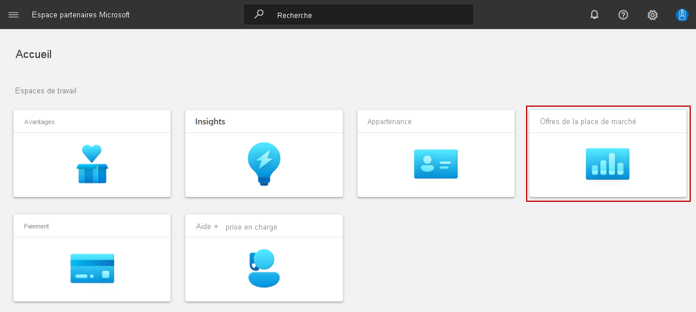

# Créer une offre de service managé pour la place de marché commerciale

Cet article explique comment créer une offre de service managé sur la Place de marché commerciale de Microsoft à l’aide d’Espace partenaires.

Pour publier une offre de service managé, vous devez avoir acquis une compétence Microsoft Gold ou Silver dans la plateforme cloud. Si vous ne l’avez pas déjà fait, lisez [Planifier une offre de service managé pour la Place de marché commerciale](./plan-managed-service-offer.md). Cela vous aidera à préparer les ressources nécessaires lorsque vous créez l’offre dans Espace partenaires.

## Créer une offre

[!INCLUDE [Workspaces view note](./includes/preview-interface.md)]

#### [Vue des espaces de travail](#tab/workspaces-view)

1. Connectez-vous à l’[Espace partenaires](https://go.microsoft.com/fwlink/?linkid=2166002).

1. Sur la page d’accueil, sélectionnez la vignette **Offres de la Place de marché**.

    

1. Sur la page Offres de la Place de marché, sélectionnez **+ Nouvelle offre** > **Service géré**.

    

1. Dans la boîte de dialogue **Nouveau service géré**, entrez l’**ID de l’offre**. Il s’agit d’un identificateur unique par offre dans votre compte. Cet ID est visible dans l’URL du référencement de la place de marché commercial et des modèles Azure Resource Manager, le cas échéant. Par exemple, si vous entrez test-offer-1 dans cette zone, l’adresse web de l’offre sera `https://azuremarketplace.microsoft.com/marketplace/../test-offer-1`.

    - Chaque offre au sein de votre compte doit avoir un ID d’offre unique.
    - Utilisez uniquement des lettres minuscules et des chiffres. Il peut inclure des traits d’union et des traits de soulignement, mais pas d’espaces, et est limité à 50 caractères.
    - L’ID d’offre ne peut pas être changé une fois que vous avez sélectionné **Créer**.

1. Entrez un **Alias d’offre**. Il s’agit du nom attribué à l’offre dans l’Espace partenaires. Il n’est pas visible dans les magasins en ligne et est différent du nom de l’offre présenté aux clients.
1. Pour générer l’offre et continuer, sélectionnez **Créer**.

#### [Affichage actuel](#tab/current-view)

1. Connectez-vous à l’[Espace partenaires](https://partner.microsoft.com/dashboard/home).
1. Dans le menu de navigation de gauche, sélectionnez **Place de marché commerciale** > **Vue d’ensemble**.
1. Dans l’onglet Vue d’ensemble, sélectionnez **+ Nouvelle offre** > **Service géré**.

    :::image type="content" source="./media/new-offer-managed-service.png" alt-text="Illustre le menu de navigation de gauche.":::

1. Dans la boîte de dialogue **Nouvelle offre**, entrez l’**ID de l’offre**. Il s’agit d’un identificateur unique par offre dans votre compte. Cet ID est visible dans l’URL du référencement de la place de marché commercial et des modèles Azure Resource Manager, le cas échéant. Par exemple, si vous entrez test-offer-1 dans cette zone, l’adresse web de l’offre sera `https://azuremarketplace.microsoft.com/marketplace/../test-offer-1`.

    - Chaque offre au sein de votre compte doit avoir un ID d’offre unique.
    - Utilisez uniquement des lettres minuscules et des chiffres. Il peut inclure des traits d’union et des traits de soulignement, mais pas d’espaces, et est limité à 50 caractères.
    - L’ID d’offre ne peut pas être changé une fois que vous avez sélectionné **Créer**.

1. Entrez un **Alias d’offre**. Il s’agit du nom attribué à l’offre dans l’Espace partenaires. Il n’est pas visible dans les magasins en ligne et est différent du nom de l’offre présenté aux clients.
1. Pour générer l’offre et continuer, sélectionnez **Créer**.

---

## Détails de la configuration

Cette section ne s’applique pas à ce type d’offre.

## Prospects

Connectez votre système de Gestion des relations avec la clientèle (CRM) à votre offre de marketplace commercial pour recevoir les coordonnées d’un client qui exprime son intérêt pour votre service de conseil. Vous pouvez modifier cette connexion à tout moment pendant ou après la création de l’offre. Pour obtenir des instructions détaillées, consultez [Prospects de votre offre de marketplace commercial](./partner-center-portal/commercial-marketplace-get-customer-leads.md).

Pour configurer la gestion des prospects dans Espace partenaires :

1. Dans Espace partenaires, accédez à l’onglet **Configuration de l’offre**.
2. Sous **Prospects**, sélectionnez le lien **Se connecter**.
3. Dans la boîte de dialogue **Détails de la connexion**, sélectionnez une destination de prospect dans la liste.
4. Renseignez les champs qui s’affichent. Pour des instructions détaillées, consultez les articles suivants :

    - [Configurer votre offre pour envoyer des prospects à la table Azure](./partner-center-portal/commercial-marketplace-lead-management-instructions-azure-table.md#configure-your-offer-to-send-leads-to-the-azure-table)
    - [Configurer votre offre pour envoyer des prospects à Dynamics 365 Customer Engagement](./partner-center-portal/commercial-marketplace-lead-management-instructions-dynamics.md#configure-your-offer-to-send-leads-to-dynamics-365-customer-engagement) (anciennement Dynamics CRM en ligne)
    - [Configurer votre offre pour l’envoi des prospects au point de terminaison HTTPS](./partner-center-portal/commercial-marketplace-lead-management-instructions-https.md#configure-your-offer-to-send-leads-to-the-https-endpoint)
    - [Configurer votre offre pour envoyer des prospects à Marketo](./partner-center-portal/commercial-marketplace-lead-management-instructions-marketo.md#configure-your-offer-to-send-leads-to-marketo)
    - [Configurer votre offre pour envoyer des prospects à Salesforce](./partner-center-portal/commercial-marketplace-lead-management-instructions-salesforce.md#configure-your-offer-to-send-leads-to-salesforce)

5. Pour valider la configuration que vous avez fournie, sélectionnez le lien **Valider**.
6. Une fois que vous avez configuré les détails de la connexion, sélectionnez **Connexion**.
7. Sélectionnez **Enregistrer le brouillon**.

Une fois que vous avez envoyé votre offre dans Espace partenaires en vue de sa publication, nous validons la connexion et vous envoyons un prospect de test. Quand vous visualisez l’offre avant son lancement, testez votre connexion de prospect en essayant d’acheter vous-même l’offre dans l’environnement de préversion.

> [!TIP]
> Assurez-vous que la connexion à la destination de prospect reste à jour afin de ne perdre aucun prospect.

Avant de passer à l’onglet suivant, sélectionnez **Enregistrer le brouillon**, **Propriétés**.

## Étape suivante

- Configurer les [propriétés](create-managed-service-offer-properties.md) de l’offre
