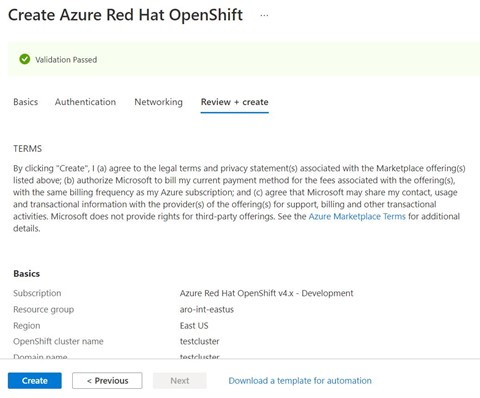

# Démarrage rapide : Déployer un cluster Azure Red Hat OpenShift (ARO) en utilisant le portail Azure

Azure Red Hat OpenShift (ARO) est un service OpenShift managé qui vous permet de déployer et gérer rapidement des clusters. Dans ce guide de démarrage rapide, vous déployez un cluster ARO à partir du portail Azure.

## Prérequis
Connectez-vous au [portail Azure](https://portal.azure.com).

## Créer un cluster ARO
1.  Dans le menu du Portail Azure ou dans la page **Accueil**, sélectionnez **Créer une ressource**.
2.  Sélectionnez **Conteneurs** > **Azure Red Hat OpenShift**.
3.  Sur la page **Bases**, configurez les options suivantes :
    * **Détails du projet** :
        *   Sélectionnez un **Abonnement Azure**.
        *   Sélectionnez ou créez un **Groupe de ressources Azure**, par exemple, *myResourceGroup*.
    * **Détails du cluster** :
        * Sélectionnez une **Région** pour le cluster ARO.
        *   Entrez un **nom de cluster** OpenShift, par exemple, *myAROCluster*.
        *   Entrez un **Nom de domaine**.
        *   Sélectionnez la **Taille de la machine virtuelle maître** et la **Taille de la machine virtuelle worker**.

4.  Dans la page **Authentification**, configurez les options suivantes :
    1) Choisissez **Sélectionner existant** dans le sélecteur de type de principal de service (s’il est déjà présélectionné, aucune action n’est nécessaire et vous pouvez passer aux étapes suivantes).
    2) Recherchez Azure Red Hat open Shift RP et sélectionnez-le. 

>[!NOTE]
>Ignorez le bouton « Créer » et les autres champs facultatifs.

5.  Sous l’onglet **Réseau**, veillez à configurer :
    * Réseau virtuel
    * Sous-réseau maître
    * Sous-réseau worker
    * Visibilité du serveur d’API
    * Visibilité de l’entrée

6.  Dans la section **Étiquettes**, ajoutez des étiquettes pour organiser vos ressources.

 
7.  Cliquez sur **Vérifier + créer**, puis **Créer** lorsque la validation est terminée.

 
8.  La création du cluster ARO prend environ 35-45 minutes. Une fois votre déploiement terminé, accédez à votre ressource en procédant une des façons suivantes :
    *   En cliquant sur **Accéder à la ressource**, ou
    *   Accédez au groupe de ressources du cluster ARO et sélectionnez la ressource ARO.
        *   Par exemple, pour le tableau de bord de cluster ci-dessous : accédez à *myResourceGroup* et sélectionnez la ressource *myAROCluster*.
