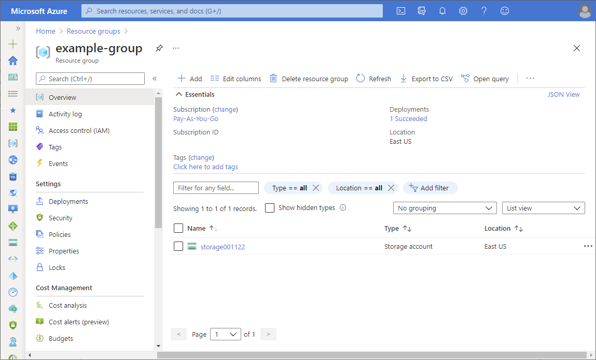

# Attribuer des rôles Azure à l’aide du portail Azure

[!INCLUDE [Azure RBAC definition grant access](../../includes/role-based-access-control/definition-grant.md)] Cet article explique comment attribuer des rôles à l’aide du portail Azure.

Si vous devez attribuer des rôles d’administrateur dans Azure Active Directory, consultez [Afficher et attribuer des rôles d’administrateur dans Azure Active Directory](../active-directory/roles/manage-roles-portal.md).

## Prérequis

[!INCLUDE [Azure role assignment prerequisites](../../includes/role-based-access-control/prerequisites-role-assignments.md)]

## Étape 1 : Identifier l’étendue nécessaire

[!INCLUDE [Scope for Azure RBAC introduction](../../includes/role-based-access-control/scope-intro.md)]

[!INCLUDE [Scope for Azure RBAC least privilege](../../includes/role-based-access-control/scope-least.md)] Pour plus d’informations sur l’étendue, consultez [Comprendre l’étendue](scope-overview.md).

1. Connectez-vous au [portail Azure](https://portal.azure.com).

1. Dans la zone de recherche située en haut, recherchez l’étendue à laquelle vous souhaitez accorder l’accès. Par exemple, recherchez **Groupes d’administration**, **Abonnements**, **Groupes de ressources**, ou une ressource spécifique.

    

1. Cliquez sur la ressource spécifique pour cette étendue.

    Voici l’illustration d’un exemple de groupe de ressources.

    

## Étape 2 : Ouvrir le volet Ajouter une attribution de rôle

La page **Contrôle d’accès (IAM)** vous permet généralement d’attribuer des rôles afin d’accorder l’accès aux ressources Azure. Elle est également connue sous le nom de gestion des identités et des accès (IAM) et apparaît à plusieurs endroits du portail Azure.

1. Cliquez sur **Contrôle d’accès (IAM)**.

    Voici un exemple de la page Contrôle d’accès (IAM) pour un groupe de ressources.

    

1. Cliquez sur l’onglet **Attributions de rôles** afin d’afficher les attributions de rôles pour cette étendue.

1. Cliquez sur **Ajouter** > **Ajouter une attribution de rôle**.
   Si vous n’avez pas les autorisations pour attribuer des rôles, l’option Ajouter une attribution de rôle sera désactivée.

   

    Le volet Ajouter une attribution de rôle s’ouvre.

   

## Étape 3 : Sélectionner le rôle approprié

1. Dans la liste **Rôle**, recherchez le rôle que vous souhaitez affecter, ou faites-le défiler.

    Pour vous aider à déterminer le rôle approprié, vous pouvez pointer sur l’icône d’informations afin d’afficher une description du rôle. Pour plus d’informations, consultez l’article [Rôles intégrés Azure](built-in-roles.md).

   

1. Cliquez ici pour sélectionner le rôle.

## Étape 4 : Sélectionner les utilisateurs qui ont besoin d’un accès

1. Dans la liste **Attribuer l’accès à**, sélectionnez le type de principal de sécurité auquel attribuer l’accès.

    | Type | Description |
    | --- | --- |
    | **Utilisateur, groupe ou principal de service** | Si vous souhaitez attribuer le rôle à un utilisateur, un groupe ou un principal de service (application), sélectionnez ce type. |
    | **Identité managée affectée par l’utilisateur** | Si vous souhaitez affecter le rôle à une [identité managée affectée par l’utilisateur](../active-directory/managed-identities-azure-resources/overview.md), sélectionnez ce type. |
    | *Identité managée affectée par le système* | Si vous souhaitez affecter le rôle à une [identité managée affectée par le système](../active-directory/managed-identities-azure-resources/overview.md), sélectionnez l’instance de service Azure où se trouve l’identité managée. |

   

1. Si vous avez sélectionné une identité managée affectée par l’utilisateur ou une identité managée affectée par le système, sélectionnez l’**abonnement** où se trouve l’identité managée.

1. Dans la section **Sélectionner**, recherchez le principal de sécurité en entrant une chaîne ou en faisant défiler la liste.

   

1. Cliquez sur le principal de sécurité trouvé pour le sélectionner.

## Étape 5 : Affecter le rôle

1. Pour attribuer le rôle, cliquez sur **Enregistrer**.

   Après quelques instants, le principal de sécurité est attribué au rôle dans l’étendue sélectionnée.

1. Dans l’onglet **Attributions de rôle**, vérifiez que vous voyez l’attribution de rôle dans la liste.

    

## Étapes suivantes

- [Attribuer à un utilisateur le rôle d’administrateur d’un abonnement Azure](role-assignments-portal-subscription-admin.md)
- [Supprimer des attributions de rôles Azure](role-assignments-remove.md)
- [Résoudre les problèmes liés à Azure RBAC](troubleshooting.md)
