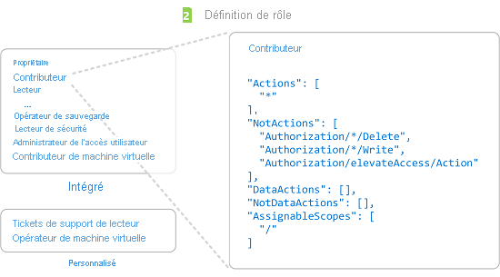
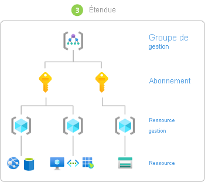

# Procédure d’attribution d’un rôle Azure

[!INCLUDE [Azure RBAC definition grant access](../../includes/role-based-access-control/definition-grant.md)] Cet article décrit les étapes principales visant à attribuer des rôles Azure à l’aide du [portail Azure](role-assignments-portal.md), d’[Azure PowerShell](role-assignments-powershell.md), d’[Azure CLI](role-assignments-cli.md) ou de l’[API REST](role-assignments-rest.md).

## Étape 1 : Déterminer qui a besoin d’un accès

Vous devez d’abord déterminer qui a besoin d’un accès. Vous pouvez attribuer un rôle à un utilisateur, à un groupe, à un principal de service ou à une identité managée. C’est également ce qu’on appelle un *principal de sécurité*.

- Utilisateur : personne disposant d’un profil dans Azure Active Directory. Vous pouvez également attribuer des rôles aux utilisateurs dans les autres locataires. Pour plus d’informations sur les utilisateurs des autres organisations, consultez [Azure Active Directory B2B](../active-directory/external-identities/what-is-b2b.md).
- Groupe : ensemble d’utilisateurs créés dans Azure Active Directory. Lorsque vous attribuez un rôle à un groupe, vous l’attribuez également à tous les utilisateurs de ce groupe. 
- Principal de service : identité de sécurité utilisée par des applications ou des services permettant d’accéder aux ressources Azure spécifiques. Vous pouvez la considérer comme une *identité utilisateur* (nom d’utilisateur, mot de passe ou certificat) pour une application.
- Identité managée : identité dans Azure Active Directory qui est managée automatiquement par Azure. Vous utilisez généralement des [identités managées](../active-directory/managed-identities-azure-resources/overview.md) lors du développement d’applications cloud afin de gérer les informations d’identification pour l’authentification auprès des services Azure.

## Étape 2 : Sélectionner le rôle approprié

Les autorisations sont regroupées en *définition de rôle*. Elle est généralement simplement appelée *rôle*. Vous pouvez opérer une sélection dans une liste de plusieurs rôles intégrés. Si les rôles intégrés ne répondent pas aux besoins spécifiques de votre organisation, vous pouvez créer vos propres rôles personnalisés.

Voici les quatre rôles fondamentaux intégrés : Les trois premiers s’appliquent à tous les types de ressources.

- [Propriétaire](built-in-roles.md#owner) : dispose d’un accès total à toutes les ressources, ainsi que le droit de déléguer l’accès à d’autres personnes.
- [Contributeur](built-in-roles.md#contributor) : peut créer et gérer tous les types de ressource Azure mais ne peut pas octroyer l’accès à d’autres personnes.
- [Lecteur](built-in-roles.md#reader) : peut consulter les ressources Azure existantes.
- [Administrateur de l’accès utilisateur](built-in-roles.md#user-access-administrator) : vous permet de gérer l’accès des utilisateurs aux ressources Azure.

Les autres rôles intégrés permettent de gérer des ressources Azure spécifiques. Par exemple, le rôle de [contributeur de machine virtuelle](built-in-roles.md#virtual-machine-contributor) permet à l’utilisateur de créer et gérer des machines virtuelles.

1. Commencez avec l’article exhaustif [Rôles intégrés Azure](built-in-roles.md). Le tableau situé en haut de l’article est un index des détails figurant plus loin dans cet article.

1. Dans cet article, accédez à la catégorie de service (par exemple, calcul, stockage et bases de données) pour la ressource à laquelle vous souhaitez accorder des autorisations. Le moyen le plus simple de trouver ce que vous cherchez est généralement de rechercher dans la page un mot clé pertinent, comme « blob », « machine virtuelle », et ainsi de suite.

1. Passez en revue les rôles répertoriés pour la catégorie de service et identifiez les opérations spécifiques dont vous avez besoin. Là encore, commencez toujours par le rôle le plus restrictif.

    Par exemple, si un principal de sécurité doit lire des blobs dans un compte de stockage Azure, mais n’a pas besoin d’un accès en écriture, choisissez [Lecteur des données Blob du stockage](built-in-roles.md#storage-blob-data-reader) plutôt que [Contributeur aux données Blob du stockage](built-in-roles.md#storage-blob-data-contributor) (et absolument pas le rôle [Propriétaire des données Blob du stockage](built-in-roles.md#storage-blob-data-owner) de niveau administrateur). Vous pouvez toujours mettre à jour les attributions de rôles ultérieurement, le cas échéant.

1. Si vous ne trouvez pas de rôle approprié, vous pouvez créer un [rôle personnalisé](custom-roles.md).

## Étape 3 : Identifier l’étendue nécessaire

*Étendue* représente l’ensemble des ressources auxquelles l’accès s’applique. Dans Azure, vous pouvez spécifier une étendue à quatre niveaux : [groupe d’administration](../governance/management-groups/overview.md), abonnement, [groupe de ressources](../azure-resource-manager/management/overview.md#resource-groups) et ressource. Les étendues sont structurées dans une relation parent-enfant. Chaque niveau de hiérarchie rend l’étendue plus spécifique. Vous pouvez attribuer des rôles à n’importe de ces niveaux d’étendue. Le niveau que vous sélectionnez détermine la portée d’application du rôle. Les niveaux inférieurs héritent des autorisations de rôle des niveaux supérieurs. 

Lorsque vous attribuez un rôle à une étendue parente, ces autorisations sont héritées par les étendues enfant. Par exemple :

- Si vous attribuez le rôle [Lecteur](built-in-roles.md#reader) à un utilisateur au niveau de l’étendue de groupe d’administration, cet utilisateur peut lire tous les éléments de tous les abonnements dans le groupe d’administration.
- Si vous attribuez le rôle [Lecteur de facturation](built-in-roles.md#billing-reader) à un groupe au niveau de l’étendue d’abonnement, les membres de ce groupe peuvent lire les données de facturation de chaque groupe de ressources et de chaque ressource dans l’abonnement.
- Si vous affectez le rôle de [contributeur](built-in-roles.md#contributor) à une application au niveau du groupe de ressources, il peut gérer tous les types de ressources dans ce groupe de ressources, mais aucun groupe de ressources dans l’abonnement.

 Pour plus d’informations, consultez [Comprendre l’étendue](scope-overview.md).

## Étape 4. Vérifier les conditions préalables

Pour attribuer des rôles, vous devez être connecté avec un utilisateur auquel est attribué un rôle disposant d’une autorisation d’écriture sur les attributions de rôles, par exemple [Propriétaire](built-in-roles.md#owner) ou [Administrateur de l’accès utilisateur](built-in-roles.md#user-access-administrator) au niveau de l’étendue à laquelle vous tentez d’attribuer le rôle. De même, pour supprimer une attribution de rôle, vous devez disposer de l’autorisation de suppression d’attributions de rôles.

- `Microsoft.Authorization/roleAssignments/write`
- `Microsoft.Authorization/roleAssignments/delete`

Si votre compte d’utilisateur ne dispose pas d’autorisations pour attribuer un rôle au sein de votre abonnement, un message d’erreur vous indiquera que votre compte « n’est pas autorisé à effectuer l’action "Microsoft.Authorization/roleAssignments/write" ». Dans ce cas, contactez les administrateurs de votre abonnement, car ils peuvent attribuer les autorisations à votre place.

Si vous utilisez un principal de service pour attribuer des rôles, il se peut que le message d’erreur « Privilèges insuffisants pour effectuer l’opération » s’affiche. Cette erreur est probablement due au fait qu’Azure tente de rechercher l’identité de la personne responsable dans Azure Active Directory (Azure AD) et que le principal de service ne peut pas lire Azure AD par défaut. Dans ce cas, vous devez accorder au principal de service les autorisations nécessaires pour lire les données dans l’annuaire. Si vous utilisez Azure CLI, vous pouvez également créer l’attribution de rôle à l’aide de l’ID d’objet affecté pour ignorer la recherche Azure AD. Pour plus d’informations, consultez [Résoudre les problèmes liés à RBAC Azure](troubleshooting.md).

## Étape 5. Affecter le rôle

Une fois que vous connaissez le principal de sécurité, le rôle et l’étendue, vous pouvez attribuer le rôle. Vous pouvez attribuer des rôles en utilisant le portail Azure, Azure PowerShell, Azure CLI, des Kits de développement logiciel (SDK) Azure ou des API REST. Vous pouvez avoir jusqu’à **2 000** attributions de rôles dans chaque abonnement. Cette limite comprend les attributions de rôles au niveau de l’abonnement, du groupe de ressources et des étendues de ressources. Vous pouvez avoir jusqu’à **500** attributions de rôles dans chaque groupe d'administration.

Consultez les articles suivants pour obtenir la procédure détaillée d’attribution de rôles.

- [Attribuer des rôles Azure à l’aide du portail Azure](role-assignments-portal.md)
- [Attribuer des rôles Azure à l’aide d’Azure PowerShell](role-assignments-powershell.md)
- [Attribuer des rôles Azure à l’aide d’Azure CLI](role-assignments-cli.md)
- [Attribuer des rôles Azure à l’aide de l’API REST](role-assignments-rest.md)

## Étapes suivantes

- [Tutoriel : Accorder un accès utilisateur aux ressources Azure à l’aide du portail Azure](quickstart-assign-role-user-portal.md)