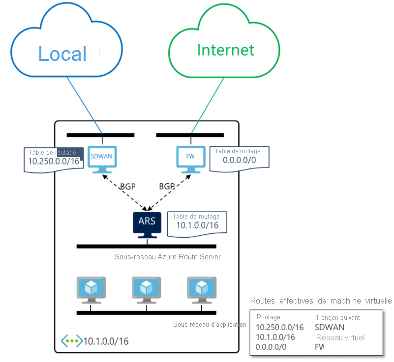

# Présentation d’Azure Route Server (préversion) 

Azure Route Server simplifie le routage dynamique entre votre appliance virtuelle réseau (NVA) et votre réseau virtuel. Il vous permet d’échanger des informations de routage directement par le biais du protocole de routage BGP (Border Gateway Protocol) entre n’importe quelle NVA qui prend en charge ce protocole et le SDN (Software Defined Network) Azure dans le réseau virtuel Azure sans devoir configurer ou gérer de tables de routage manuellement. Azure Route Server est un service complètement managé qui est configuré avec une haute disponibilité.

> [!IMPORTANT]
> Azure Route Server (préversion) est en préversion publique.
> Cette préversion est fournie sans contrat de niveau de service et n’est pas recommandée pour les charges de travail de production. Certaines fonctionnalités peuvent être limitées ou non prises en charge.
> Pour plus d’informations, consultez [Conditions d’Utilisation Supplémentaires relatives aux Évaluations Microsoft Azure](https://azure.microsoft.com/support/legal/preview-supplemental-terms/).

## Comment cela fonctionne-t-il ?

Le diagramme suivant illustre le fonctionnement d’Azure Route Server avec une NVA SDWAN et une NVA de sécurité dans un réseau virtuel. Une fois que vous avez établi le peering BGP, Azure Route Server reçoit une route locale (10.250.0.0/16) de l’appliance SDWAN et une route par défaut (0.0.0.0/0) du pare-feu. Ces routes sont ensuite automatiquement configurées sur les machines virtuelles dans le réseau virtuel. Ainsi, tout le trafic destiné au réseau local est envoyé à l’appliance SDWAN. Parallèlement, tout le trafic Internet est envoyé au pare-feu. Dans le sens inverse, Azure Route Server envoie l’adresse de réseau virtuel (10.1.0.0/16) aux deux NVA. L’appliance SDWAN peut la propager plus loin sur le réseau local.

## Principaux avantages 

Azure Route Server simplifie la configuration, la gestion et le déploiement de votre NVA dans votre réseau virtuel.  

* Vous n’avez plus besoin de mettre à jour manuellement la table de routage sur votre NVA chaque fois que vos adresses de réseau virtuel sont mises à jour. 

* Vous n’avez plus besoin de mettre à jour les [routes définies par l’utilisateur](../virtual-network/virtual-networks-udr-overview.md) manuellement, ni de supprimer les anciennes, dès lors que votre NVA en annonce de nouvelles. 

* Vous n’avez plus besoin de configurer un équilibreur de charge devant votre NVA à des fins de résilience ou de performances. Quand vous appairez plusieurs instances de votre NVA avec Azure Route Server, vous pouvez configurer les attributs BGP dans votre NVA. Ces attributs BGP permettent à Azure Route Server de décider quelle instance de NVA doit être active ou passive. 

* L’interface entre la NVA et Azure Route Server est basée sur un protocole standard commun. Tant que votre NVA prend en charge le protocole BGP, vous pouvez l’appairer avec Azure Route Server. Pour plus d’informations, consultez [Protocoles de routage pris en charge par Route Server](route-server-faq.md#protocol).

* Vous pouvez déployer Azure Route Server sur n’importe quel réseau virtuel nouveau ou existant. 

## Questions fréquentes (FAQ)

Pour découvrir les questions fréquemment posées sur Azure Route Server, consultez le [Forum aux questions sur Azure Route Server](route-server-faq.md).

## Étapes suivantes

- [Découvrez comment configurer Azure Route Server.](quickstart-configure-route-server-portal.md)
- [Découvrez comment Azure Route Server fonctionne avec Azure ExpressRoute et Azure VPN.](expressroute-vpn-support.md)
