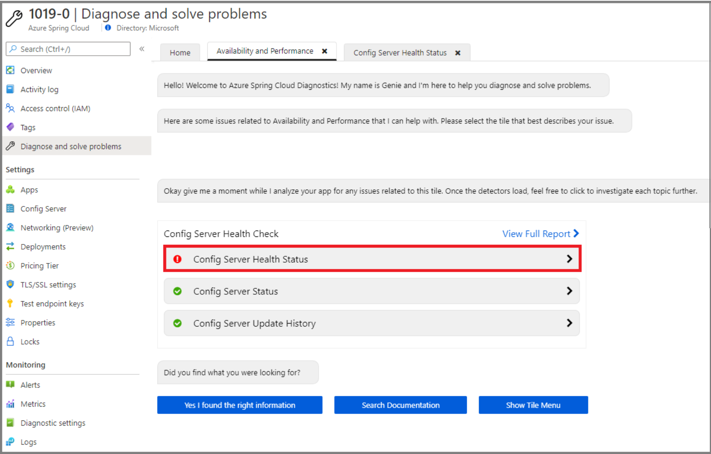

# <a name="quickstart-set-up-azure-spring-cloud-config-server"></a>Démarrage rapide : Configurer Azure Spring Cloud Config Server

Azure Spring Cloud Config Server est un service de configuration centralisé pour les systèmes distribués. Il utilise une couche de dépôt enfichable qui prend actuellement en charge le stockage local, Git et Subversion. Dans ce guide de démarrage rapide, vous allez configurer Config Server pour obtenir des données à partir d’un dépôt Git.

::: zone pivot="programming-language-csharp"

## <a name="prerequisites"></a>Prérequis

* Suivez ce guide de démarrage rapide précédent de la série : [Provisionner le service Azure Spring Cloud](./quickstart-provision-service-instance.md).

## <a name="azure-spring-cloud-config-server-procedures"></a>Procédures Azure Spring Cloud Config Server

Configurez Config Server avec l’emplacement du dépôt Git du projet en exécutant la commande suivante. Remplacez *\<service instance name>* par le nom du service que vous avez créé précédemment. La valeur par défaut du nom de l’instance de service que vous avez définie dans le guide de démarrage rapide précédent ne fonctionne pas avec cette commande.

```azurecli
az spring-cloud config-server git set -n <service instance name> --uri https://github.com/Azure-Samples/Azure-Spring-Cloud-Samples --search-paths steeltoe-sample/config
```

Cette commande demande à Config Server de trouver les données de configuration dans le dossier [steeltoe-sample/config](https://github.com/Azure-Samples/Azure-Spring-Cloud-Samples/tree/master/steeltoe-sample/config) du dépôt de l’exemple d’application. Étant donné que le nom de l’application qui obtiendra les données de configuration est `planet-weather-provider`, le fichier qui sera utilisé est [planet-weather-provider.yml](https://github.com/Azure-Samples/Azure-Spring-Cloud-Samples/blob/master/steeltoe-sample/config/planet-weather-provider.yml).

::: zone-end

::: zone pivot="programming-language-java"
Azure Spring Cloud Config Server est un service de configuration centralisé pour les systèmes distribués. Il utilise une couche de dépôt enfichable qui prend actuellement en charge le stockage local, Git et Subversion.  Configurez Config Server pour déployer des applications de microservice sur Azure Spring Cloud.

## <a name="prerequisites"></a>Prérequis

* [Installez JDK 8 ou JDK 11](/azure/developer/java/fundamentals/java-jdk-install)
* [Souscrire à un abonnement Azure](https://azure.microsoft.com/free/)
* (Facultatif) [Installez Azure CLI version 2.0.67 ou ultérieure](/cli/azure/install-azure-cli) et installez l’extension Azure Spring Cloud avec la commande : `az extension add --name spring-cloud`
* (Facultatif) [Installez Azure Toolkit for IntelliJ](https://plugins.jetbrains.com/plugin/8053-azure-toolkit-for-intellij/) et [connectez-vous](/azure/developer/java/toolkit-for-intellij/create-hello-world-web-app#installation-and-sign-in).

## <a name="azure-spring-cloud-config-server-procedures"></a>Procédures Azure Spring Cloud Config Server

#### <a name="portal"></a>[Portail](#tab/Azure-portal)

La procédure suivante configure Config Server en utilisant le portail Azure pour déployer l’[exemple PetClinic](https://github.com/azure-samples/spring-petclinic-microservices).

1. Accédez à la page **Vue d’ensemble** du service, puis sélectionnez **Serveur de configuration**.

2. Dans la section **Dépôt par défaut**, définissez **URI** sur « https://github.com/azure-samples/spring-petclinic-microservices-config  ».

3. Sélectionnez **Valider**.

    

4. Une fois la validation effectuée, sélectionnez **Appliquer** pour enregistrer vos modifications.

    

5. La mise à jour de la configuration peut prendre quelques minutes.

    

6. Une fois la configuration terminée, vous devriez recevoir une notification.

#### <a name="cli"></a>[INTERFACE DE LIGNE DE COMMANDE](#tab/Azure-CLI)

La procédure suivante utilise Azure CLI pour configurer Config Server afin de déployer l’[exemple PetClinic](https://github.com/azure-samples/spring-petclinic-microservices).

Exécutez la commande suivante pour définir le dépôt par défaut.

```azurecli
az spring-cloud config-server git set -n <service instance name> --uri https://github.com/azure-samples/spring-petclinic-microservices-config
```

::: zone-end

> [!TIP]
> Si vous utilisez un dépôt privé pour Config Server, reportez-vous à notre [tutoriel sur la configuration de l’authentification](./how-to-config-server.md).

## <a name="troubleshooting-of-azure-spring-cloud-config-server"></a>Résolution des problèmes liés à Azure Spring Cloud Config Server

La procédure suivante explique comment résoudre les problèmes liés aux paramètres de Config Server.

1. Dans le portail Azure, accédez à la page **Vue d’ensemble** du service, puis sélectionnez **Journaux**.
1. Sélectionnez **Requêtes** et **Afficher les journaux des applications qui contiennent les termes « erreur » ou « exceptions »** .
1. Sélectionnez **Exécuter**.
1. Si vous trouvez l’erreur **java.lang.illegalStateException** dans les journaux, cela indique que le service Spring Cloud ne peut pas localiser les propriétés provenant de Config Server.

    [  ](media/spring-cloud-quickstart-setup-config-server/setup-config-server-query.png)

1. Allez à la page **Vue d’ensemble** du service.
1. Sélectionnez **Diagnostiquer et résoudre les problèmes**.
1. Sélectionnez le détecteur **Config Server**.

    [  ](media/spring-cloud-quickstart-setup-config-server/setup-config-server-diagnose.png)

1. Sélectionnez **Contrôle d’intégrité de Config Server**.

    [  ](media/spring-cloud-quickstart-setup-config-server/setup-config-server-genie.png)

1. Sélectionnez **État de Config Server** pour afficher plus de détails du détecteur.

    [  ](media/spring-cloud-quickstart-setup-config-server/setup-config-server-health-status.png)

## <a name="next-steps"></a>Étapes suivantes

Dans ce guide de démarrage rapide, vous avez créé des ressources Azure qui continueront de générer des frais tant qu’elles resteront dans votre abonnement. Si vous n’avez pas prévu de passer au guide de démarrage rapide suivant, consultez [Nettoyer les ressources](./quickstart-logs-metrics-tracing.md#clean-up-resources). Dans le cas contraire, passez au guide de démarrage rapide suivant :

> [!div class="nextstepaction"]
> [Créer et déployer des applications](./quickstart-deploy-apps.md)
