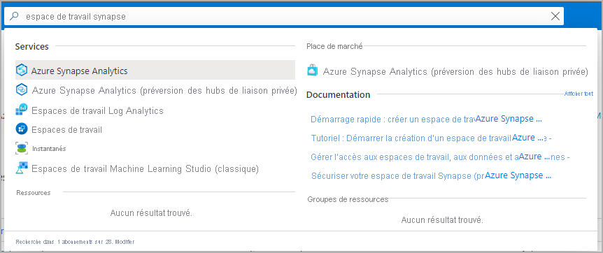
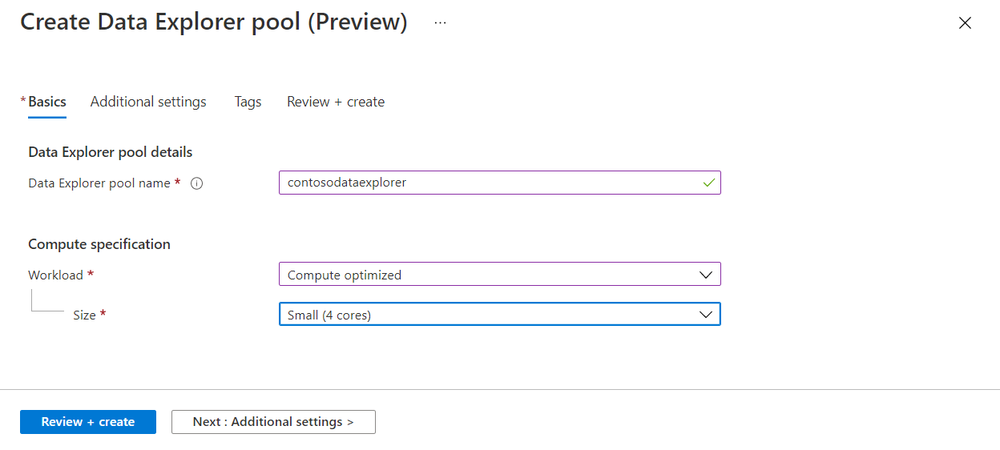
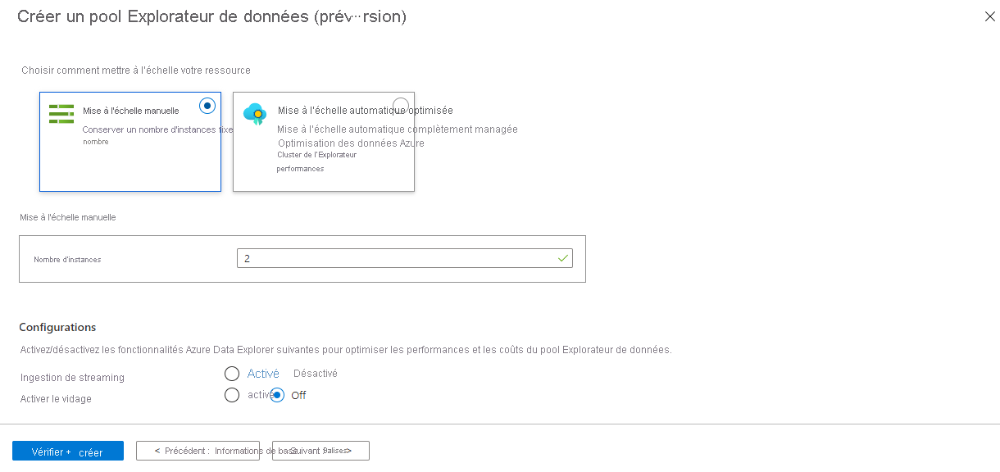

# Démarrage rapide : Créer un pool Explorateur de données à l’aide du portail Azure (préversion)

Azure Synapse Data Explorer est un service d'analyse de données rapide et entièrement géré permettant d'analyser en temps réel de gros volumes de données en continu à partir d'applications, de sites Web, de dispositifs IoT, etc. Pour utiliser Data Explorer, vous devez d'abord créer un pool Data Explorer.

Cet article décrit les étapes à suivre pour créer un pool Explorateur de données dans un espace de travail Synapse à l’aide du portail Azure.

> [!IMPORTANT]
> La facturation des instances de Data Explorer est calculée au prorata de la minute, que vous les utilisiez ou non. Veillez à fermer votre instance de Data Explorer lorsque vous avez fini de l'utiliser, ou définissez un court délai d'attente. Pour plus d’informations, consultez **Nettoyer les ressources**.

Si vous n’avez pas d’abonnement Azure, [créez un compte gratuit avant de commencer](https://azure.microsoft.com/free/).

## Prérequis

- Abonnement Azure : [créez-en un gratuitement](https://azure.microsoft.com/free/)
- [Espace de travail Synapse](../quickstart-create-workspace.md)

## Connectez-vous au portail Azure.

Connectez-vous au [portail Azure](https://portal.azure.com/)

## Accéder à l’espace de travail Synapse

1. Naviguez vers l'espace de travail Synapse où le pool Data Explorer sera créé en tapant le nom du service (ou le nom de la ressource directement) dans la barre de recherche.

    

1. Dans la liste des espaces de travail, saisissez le nom (ou une partie du nom) de l’espace de travail à ouvrir. Pour cet exemple, nous allons utiliser un espace de travail nommé **contosoanalytics**.

    

## Créer un nouveau pool Data Explorer

1. Dans l’espace de travail Synapse où vous souhaitez créer le pool Explorateur de données, sélectionnez **Nouveau pool Explorateur de données**.

    

1. Sous l’onglet **Général**, entrez les informations suivantes :

    | Paramètre | Valeur suggérée | Description |
    |--|--|--|
    | Nom du pool Data Explorer | contosodataexplorer | Il s'agit du nom que portera le pool Data Explorer. |
    | Charge de travail | Optimisé pour le calcul | Cette charge de travail offre un ratio plus élevé entre le CPU et le stockage SSD. |
    | Taille du nœud | Petite (4 cœurs) | Définissez ce paramètre sur la plus petite taille pour réduire les coûts de ce guide de démarrage rapide. |

    

    > [!IMPORTANT]
    > Notez qu'il existe des limitations spécifiques concernant les noms que les pools Data Explorer peuvent utiliser. Les noms ne doivent contenir que des lettres minuscules et des chiffres. Ils doivent comporter entre 4 et 15 caractères, et commencer par une lettre.

1. Sélectionnez **Suivant : Paramètres supplémentaires**. Utilisez les paramètres suivants et laissez les valeurs par défaut pour les autres paramètres.

    | Paramètre | Valeur suggérée | Description |
    |--|--|--|
    | Mise à l'échelle | Mise à l’échelle manuelle | Ce guide de démarrage rapide ne nécessite pas de mise à l’échelle automatique |
    | Nombre de numéros | 2 | Définissez ce paramètre sur la plus petite taille pour réduire les coûts de ce guide de démarrage rapide. |

    

1. Sélectionnez **Suivant : étiquettes**. N’ajoutez aucune étiquette.
1. Sélectionnez **Revoir + créer**.
1. Passez en revue les détails en vous assurant qu’ils sont corrects, puis sélectionnez **Créer**.

    Le pool Data Explorer commencera le processus de provisionnement.

    

1. Une fois l’approvisionnement terminé, revenez à la page **Vue d’ensemble** de l’espace de travail et vérifiez que la page d’accueil du nouveau pool Explorateur de données s’affiche.

    

## Nettoyer les ressources du pool Explorateur de données à l’aide du portail Azure

Suivez les étapes suivantes pour supprimer le pool Explorateur de données de l’espace de travail à l’aide du portail Azure.

> [!WARNING]
> La suppression d'un pool d'explorateurs de données entraîne la suppression du moteur d'analyse de l'espace de travail. Il ne sera plus possible de se connecter au pool, et toutes les requêtes, pipelines et notebooks qui utilisent le pool supprimé ne fonctionneront plus.

### Supprimer le pool d’Explorateur de données

1. Naviguez vers les pools de l'Explorateur de données dans l'espace de travail.
1. Pour supprimer le pool d’Explorateur de données (dans ce cas, **contosodataexplorer**), sélectionnez **plus [...]**  > **Supprimer**.

    

1. Pour confirmer la suppression, saisissez le nom du pool à supprimer, puis sélectionnez **Supprimer**.

    

1. Une fois le processus terminé avec succès, vérifiez que le pool n'apparaît plus dans la liste.

## Étapes suivantes

- [Vue d’ensemble de l’ingestion](ingest-data/data-explorer-ingest-data-overview.md)
- [Analyser avec Data Explorer](../get-started-analyze-data-explorer.md)
- [Monitorer les pools Data Explorer](data-explorer-monitor-pools.md)
