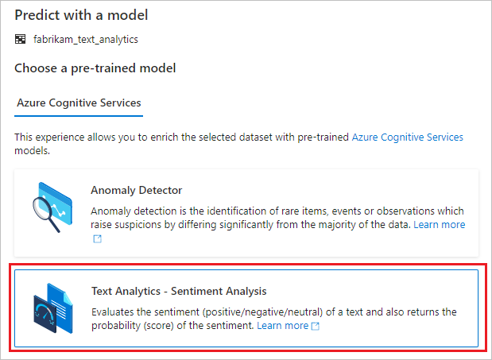
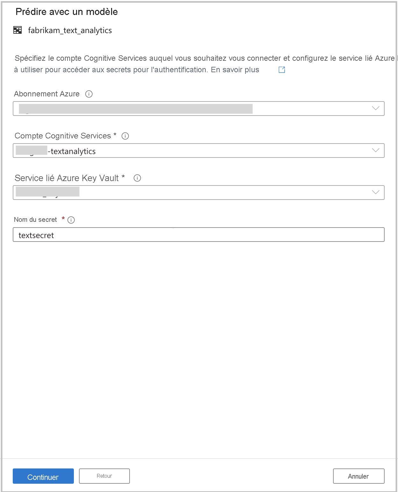
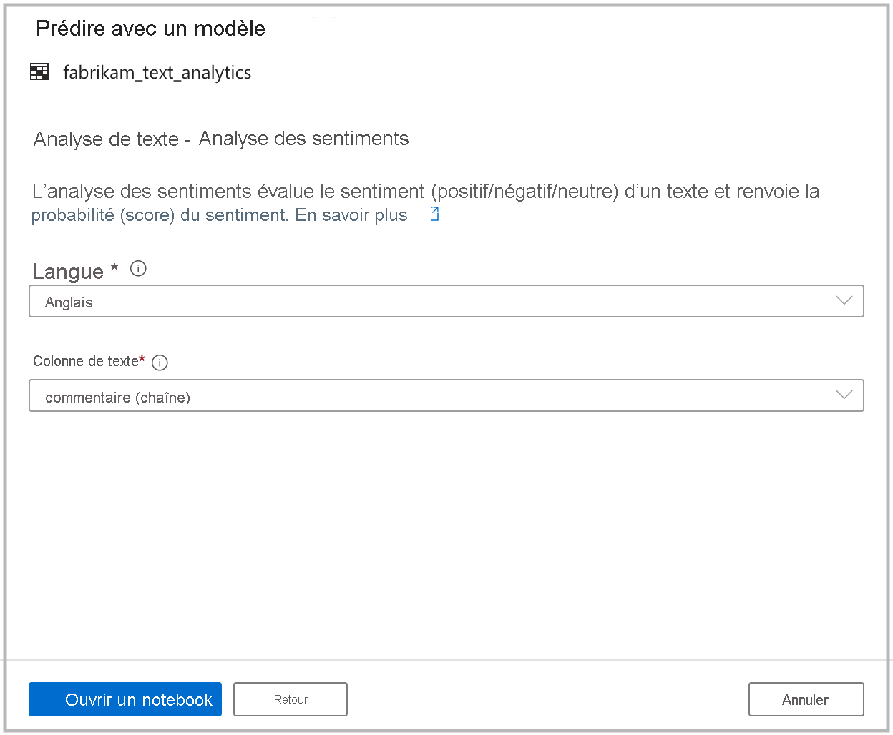

# <a name="tutorial-sentiment-analysis-with-cognitive-services-preview"></a>Tutoriel : Analyse des sentiments avec Cognitive Services (préversion)

Dans ce tutoriel, vous allez apprendre à enrichir facilement vos données dans Azure Synapse Analytics avec [Azure Cognitive Services](../../cognitive-services/index.yml). Vous allez utiliser les fonctionnalités de l’[Analyse de texte](../../cognitive-services/text-analytics/index.yml) pour effectuer une analyse des sentiments. 

Dans Azure Synapse, un utilisateur peut simplement sélectionner une table qui contient une colonne de texte à enrichir avec des sentiments. Ces sentiments peuvent être positifs, négatifs, mixtes ou neutres. Une probabilité est également retournée.

Ce didacticiel contient les sections suivantes :

> [!div class="checklist"]
> - Étapes à effectuer pour obtenir un jeu de données de table Spark qui contient une colonne de texte pour l’analyse des sentiments.
> - Utilisation d’une expérience d’assistant dans Azure Synapse pour enrichir les données en utilisant l’Analyse de texte dans Cognitive Services.

Si vous n’avez pas d’abonnement Azure, [créez un compte gratuit avant de commencer](https://azure.microsoft.com/free/).

## <a name="prerequisites"></a>Prérequis

- [Espace de travail Azure Synapse Analytics](../get-started-create-workspace.md) avec un compte de stockage Azure Data Lake Storage Gen2 configuré comme stockage par défaut. Vous devez être le *contributeur aux données Blob du stockage* du système de fichiers Data Lake Storage Gen2 que vous utilisez.
- Pool Spark dans votre espace de travail Azure Synapse Analytics. Pour plus d’informations, consultez [Créer un pool Spark dans Azure Synapse](../quickstart-create-sql-pool-studio.md).
- Avoir effectué les étapes de pré-configuration décrites dans le tutoriel [Configurer Cognitive Services dans Azure Synapse](tutorial-configure-cognitive-services-synapse.md).

## <a name="sign-in-to-the-azure-portal"></a>Connectez-vous au portail Azure.

Connectez-vous au [portail Azure](https://portal.azure.com/).

## <a name="create-a-spark-table"></a>Créer une table Spark

Vous aurez besoin d’une table Spark pour ce tutoriel.

1. Téléchargez le fichier [FabrikamComments.csv](https://github.com/Kaiqb/KaiqbRepo0731190208/blob/master/CognitiveServices/TextAnalytics/FabrikamComments.csv), qui contient un jeu de données pour l’analyse de texte. 

1. Chargez le fichier sur votre compte de stockage Azure Synapse dans Data Lake Storage Gen2.
  
   

1. Créez une table Spark à partir du fichier .csv en cliquant avec le bouton droit sur le fichier, puis en sélectionnant **Nouveau notebook** > **Créer une table Spark**.

   

1. Nommez la table dans la cellule de code, puis exécutez le notebook sur un pool Spark. Pensez à définir `header=True`.

   

   ```python
   %%pyspark
   df = spark.read.load('abfss://default@azuresynapsesa.dfs.core.windows.net/data/FabrikamComments.csv', format='csv'
   ## If a header exists, uncomment the line below
   , header=True
   )
   df.write.mode("overwrite").saveAsTable("default.YourTableName")
   ```

## <a name="open-the-cognitive-services-wizard"></a>Ouvrir l’Assistant Cognitive Services

1. Cliquez avec le bouton droit sur la table Spark créée dans la procédure précédente. Sélectionnez **Machine Learning** > **Enrichir avec un modèle existant** pour ouvrir l’Assistant.

   

2. Un panneau de configuration s’affiche et vous êtes invité à sélectionner un modèle Cognitive Services. Sélectionnez **Analyse de texte - Analyse des sentiments**.

   

## <a name="provide-authentication-details"></a>Fournir des informations d’authentification

Pour vous authentifier auprès de Cognitive Services, vous devez référencer le secret pour votre coffre de clés. Les entrées suivantes dépendent des [étapes préalables](tutorial-configure-cognitive-services-synapse.md) que vous devez avoir effectuées avant cette étape.

- **Abonnement Azure** : Sélectionnez l’abonnement auquel appartient votre coffre de clés.
- **Compte Cognitive Services** : entrez la ressource Analyse de texte à laquelle vous allez vous connecter.
- **Service lié Azure Key Vault** : dans le cadre des étapes préalables, vous avez créé un service lié à votre ressource Analyse de texte. Sélectionnez-le ici.
- **Nom du secret** : entrez le nom du secret dans votre coffre de clés contenant la clé qui permet de vous authentifier auprès de votre ressource Cognitive Services.



## <a name="configure-sentiment-analysis"></a>Configurer l’analyse des sentiments

Ensuite, configurez l’analyse des sentiments. Sélectionnez les informations suivantes :
- **Langue** : Sélectionnez **Anglais** comme langue du texte sur lequel vous souhaitez effectuer une analyse des sentiments.
- **Colonne de texte** : Sélectionnez **comment (chaîne)** comme colonne de texte de votre jeu de données que vous voulez analyser pour déterminer le sentiment.

Quand vous avez terminé, sélectionnez **Ouvrir le notebook**. Cette opération génère automatiquement un notebook avec le code PySpark qui effectue l’analyse des sentiments avec Azure Cognitive Services.



## <a name="run-the-notebook"></a>Exécuter le bloc-notes

Le notebook que vous venez d’ouvrir utilise la [bibliothèque mmlspark](https://github.com/Azure/mmlspark) pour se connecter à Cognitive Services. Les détails Azure Key Vault que vous avez fournis vous permettent de référencer vos secrets de manière sécurisée à partir de cette expérience sans les divulguer.

Vous pouvez maintenant exécuter toutes les cellules pour enrichir vos données avec des sentiments. Sélectionnez **Exécuter tout**. 

Les sentiments sont retournés comme étant **positifs**, **négatifs**, **neutres** ou **mixtes**. Vous recevez également des probabilités par sentiment. [Découvrez-en plus sur l’analyse des sentiments dans Cognitive Services](../../cognitive-services/text-analytics/how-tos/text-analytics-how-to-sentiment-analysis.md).


## <a name="next-steps"></a>Étapes suivantes
- [Tutoriel : Détection d’anomalie avec Azure Cognitive Services](tutorial-cognitive-services-anomaly.md)
- [Tutoriel : Scoring de modèle Machine Learning dans des pools SQL dédiés Azure Synapse](tutorial-sql-pool-model-scoring-wizard.md)
- [Fonctionnalités de Machine Learning dans Azure Synapse Analytics](what-is-machine-learning.md)
