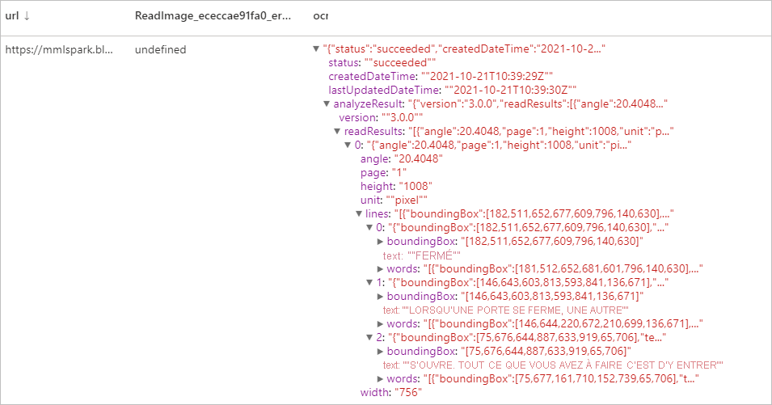
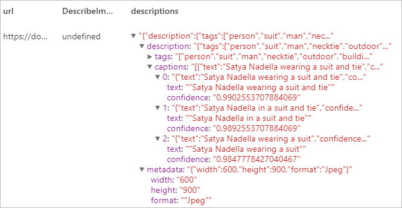

# <a name="tutorial-computer-vision-with-cognitive-service"></a>Tutoriel : Vision par ordinateur avec service cognitif

[Vision par ordinateur](../../cognitive-services/computer-vision/index.yml) est un [service cognitive Azure](../../cognitive-services/index.yml) qui vous permet de traiter des images et de retourner des informations basées sur les fonctionnalités visuelles. Dans ce tutoriel, vous apprendrez à utiliser la [Vision par ordinateur](../../cognitive-services/computer-vision/index.yml) pour analyser des images sur Azure Synapse Analytics.

Ce tutoriel montre comment utiliser l’analyse de texte avec [SynapseML](https://github.com/microsoft/SynapseML) pour :

> [!div class="checklist"]
> - Extraire des fonctionnalités visuelles du contenu de l’image
> - Reconnaître les caractères des images (OCR)
> - Analyser le contenu de l’image et générer une miniature
> - Détecter et identifier le contenu spécifique à un domaine dans une image
> - Générer des balises associées à une image
> - Générer une description d'une image entière dans un langage lisible par l'homme


## <a name="analyze-image"></a>Analyser l’image
Extrait un riche ensemble de caractéristiques visuelles basées sur le contenu de l'image, comme les objets, les visages, le contenu adulte et les descriptions textuelles générées automatiquement. 
### <a name="example-input"></a>Exemple d’entrée


```python
# Create a dataframe with the image URLs
df = spark.createDataFrame([
        ("<replace with your file path>/dog.jpg", )
    ], ["image", ])

# Run the Computer Vision service. Analyze Image extracts infortmation from/about the images.
analysis = (AnalyzeImage()
    .setLinkedService(cognitive_service_name)
    .setVisualFeatures(["Categories","Color","Description","Faces","Objects","Tags"])
    .setOutputCol("analysis_results")
    .setImageUrlCol("image")
    .setErrorCol("error"))

# Show the results of what you wanted to pull out of the images.
display(analysis.transform(df).select("image", "analysis_results.description.tags"))

```
### <a name="expected-results"></a>Résultats attendus

```json
["dog","outdoor","fence","wooden","small","brown","building","sitting","front","bench","standing","table","walking","board","beach","holding","bridge"]
```

## <a name="optical-character-recognition-ocr"></a>Reconnaissance optique de caractères
Extrayez du texte imprimé, du texte manuscrit, des chiffres et des symboles monétaires à partir d'images, telles que des photos de panneaux de signalisation et de produits, ainsi que de documents (factures, rapports financiers, articles, etc.). Elle est optimisée pour extraire le texte d’images à forte composante textuelle et de documents PDF multipages en langue mixte. Elle prend en charge la détection de texte imprimé et manuscrit dans la même image ou le même document.

### <a name="example-input"></a>Exemple d’entrée


```python
df = spark.createDataFrame([
        ("<replace with your file path>/ocr.jpg", )
    ], ["url", ])

ri = (ReadImage()
    .setLinkedService(cognitive_service_name)
    .setImageUrlCol("url")
    .setOutputCol("ocr"))

display(ri.transform(df))
```
### <a name="expected-results"></a>Résultats attendus


## <a name="generate-thumbnails"></a>Génération de miniatures
Analyser le contenu d’une image pour en générer une miniature. Le service Vision par ordinateur commence par générer une miniature de haute qualité, puis analyse les objets contenus dans l’image pour déterminer la zone d’intérêt. Il rogne ensuite l’image pour conserver uniquement la zone d’intérêt. La miniature générée peut être présentée à l’aide de proportions différentes de celles de l’image d’origine selon les besoins de chacun.

### <a name="example-input"></a>Exemple d’entrée


```python
df = spark.createDataFrame([
        ("<replace with your file path>/satya.jpeg", )
    ], ["url", ])

gt =  (GenerateThumbnails()
    .setLinkedService(cognitive_service_name)
    .setHeight(50)
    .setWidth(50)
    .setSmartCropping(True)
    .setImageUrlCol("url")
    .setOutputCol("thumbnails"))

thumbnails = gt.transform(df).select("thumbnails").toJSON().first()

import json
img = json.loads(thumbnails)["thumbnails"]

displayHTML("")

```

### <a name="expected-results"></a>Résultats attendus


## <a name="tag-image"></a>Image de balise
Cette opération génère une liste de mots, ou balises, qui sont pertinents pour le contenu de l’image fournie. Les balises sont retournées en fonction de milliers d’objets reconnaissables, d’êtres vivants, de scènes ou d’actions trouvés dans des images. Les étiquettes peuvent contenir des indices pour éviter toute ambiguïté ou fournir un contexte, par exemple l'étiquette "ascomycète" peut être accompagnée de l'indice "fungus".

Nous allons continuer à utiliser l’image de Satya comme exemple.

```python
df = spark.createDataFrame([
        ("<replace with your file path>/satya.jpeg", )
    ], ["url", ])

ti = (TagImage()
    .setLinkedService(cognitive_service_name)
    .setImageUrlCol("url")
    .setOutputCol("tags"))

display(ti.transform(df))
```

### <a name="expected-result"></a>Résultat attendu


## <a name="describe-image"></a>Décrire l’image
Générer une description de l’intégralité d’une image dans un langage lisible utilisant des phrases complètes. Les algorithmes du service Vision par ordinateur génèrent différentes descriptions selon les objets identifiés dans l’image. Chacune des descriptions est évaluée, et un score de confiance est généré. Une liste est ensuite renvoyée, classée du score de confiance plus élevé au plus bas.

Nous allons continuer à utiliser l’image de Satya comme exemple.

```python
df = spark.createDataFrame([
        ("<replace with your file path>/satya.jpeg", )
    ], ["url", ])

di = (DescribeImage()
    .setLinkedService(cognitive_service_name)
    .setMaxCandidates(3)
    .setImageUrlCol("url")
    .setOutputCol("descriptions"))

display(di.transform(df))
```
### <a name="expected-result"></a>Résultat attendu


## <a name="recognize-domain-specific-content"></a>Reconnaître le contenu spécifique à un domaine.
Utiliser des modèles de domaine pour détecter et identifier le contenu spécifique à un domaine dans une image, notamment pour reconnaître des célébrités ou des éléments géographiques. Par exemple, si une image contient des célébrités, le service Vision par ordinateur peut utiliser un modèle de domaine pour célébrités afin de déterminer si les personnes détectées dans l’image correspondent à des célébrités connues.

Nous allons continuer à utiliser l’image de Satya comme exemple.

```python

df = spark.createDataFrame([
        ("<replace with your file path>/satya.jpeg", )
    ], ["url", ])

celeb =  (RecognizeDomainSpecificContent()
    .setLinkedService(cognitive_service_name)
    .setModel("celebrities")
    .setImageUrlCol("url")
    .setOutputCol("celebs"))

display(celeb.transform(df))
```

### <a name="expected-result"></a>Résultat attendu


## <a name="clean-up-resources"></a>Nettoyer les ressources
Pour vous assurer que l’instance Spark est arrêtée, mettez fin aux sessions connectées (notebooks). Le pool s’arrête quand la **durée d’inactivité** spécifiée dans le pool Apache Spark est atteinte. Vous pouvez également sélectionner **Arrêter la session** dans la barre d’état en haut à droite du notebook.


## <a name="next-steps"></a>Étapes suivantes

* [Consultez les exemples de notebooks Synapse](https://github.com/Azure-Samples/Synapse/tree/main/MachineLearning) 
* [Dépôt GitHub SynapseML](https://github.com/Azure/mmlspark)
