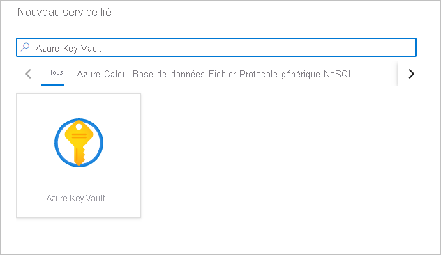

# Tutoriel : Prérequis de l’utilisation de Cognitive Services dans Azure Synapse

Dans ce tutoriel, vous allez apprendre à configurer les prérequis de l’exploitation sécurisée de Cognitive Services dans Azure Synapse.

Ce didacticiel contient les sections suivantes :
> [!div class="checklist"]
> - Créer une ressource Cognitive Services. Par exemple, l’Analyse de texte ou le Détecteur d’anomalies.
> - Stocker la clé d’authentification auprès des ressources Cognitive Services sous la forme de secrets dans Azure Key Vault et configurer l’accès pour l’espace de travail Azure Synapse.
> - Créer le service lié Azure Key Vault dans votre espace de travail Azure Synapse Analytics.

Si vous n’avez pas d’abonnement Azure, [créez un compte gratuit avant de commencer](https://azure.microsoft.com/free/).

## Prérequis

- [Espace de travail Azure Synapse Analytics](../get-started-create-workspace.md) avec un compte de stockage ADLS Gen2 configuré comme stockage par défaut. Vous devez être le **contributeur de données Blob du stockage** du système de fichiers ADLS Gen2 que vous utilisez.

## Connectez-vous au portail Azure.

Connectez-vous au [portail Azure](https://portal.azure.com/)

## Créer une ressource Cognitive Services

[Azure Cognitive Services](../../cognitive-services/index.yml) inclut de nombreux types de services différents. Vous trouverez ci-dessous quelques exemples qui sont utilisés dans les tutoriels Synapse.

### Créer une ressource Détecteur d’anomalies
Créez un [Détecteur d’anomalies](https://ms.portal.azure.com/#create/Microsoft.CognitiveServicesTextAnalytics) dans le portail Azure.

### Créer une ressource Analyse de texte
Créez une ressource [Analyse de texte](https://ms.portal.azure.com/#create/Microsoft.CognitiveServicesTextAnalytics) dans le portail Azure.

## Créer un coffre de clés et configurer des secrets et l’accès

1. Créez un [coffre de clés](https://ms.portal.azure.com/#create/Microsoft.KeyVault) dans le portail Azure.
2. Accédez à **Coffre de clés -> Stratégies d’accès**, puis accordez à l’[Identité de service managée (MSI) de l’espace de travail Azure Synapse](../security/synapse-workspace-managed-identity.md) des autorisations pour lire des secrets à partir d’Azure Key Vault.

>Vérifiez que les changements de stratégie sont enregistrés. Il est facile d’oublier cette étape.

3. Accédez à votre ressource Cognitive Services, par exemple **Détecteur d’anomalies -> Clés et point de terminaison**, puis copiez l’une des deux clés dans le Presse-papiers.

4. Accédez à **Coffre de clés -> Secret** pour créer un secret. Spécifiez le nom du secret, puis collez la clé de l’étape précédente dans le champ « Valeur ». Pour finir, cliquez sur **Créer**.

> Veillez à mémoriser ou à noter le nom de ce secret. Vous l’utiliserez ultérieurement quand vous vous connecterez à Cognitive Services à partir d’Azure Synapse Studio.

## Créer un service lié Azure Key Vault dans Azure Synapse

1. Ouvrez votre espace de travail dans Azure Synapse Studio. Accédez à **Gérer -> Services liés**. Créez un service lié « Azure Key Vault » pointant vers le coffre de clés que nous venons de créer. Vérifiez ensuite la connexion en cliquant sur le bouton « Tester la connexion », puis en vérifiant si elle s’affiche en vert. Si tout fonctionne bien, cliquez d’abord sur « Créer », puis sur « Publier tout » pour enregistrer le changement apporté.

Vous êtes maintenant prêt à passer à l’un des tutoriels concernant l’utilisation de l’expérience Azure Cognitive Services dans Azure Synapse Studio.

## Étapes suivantes

- [Tutoriel : Analyse des sentiments avec Azure Cognitive Services](tutorial-cognitive-services-sentiment.md)
- [Tutoriel : Détection d’anomalie avec Azure Cognitive Services](tutorial-cognitive-services-sentiment.md)
- [Tutoriel : Scoring de modèle Machine Learning dans des pools SQL dédiés Azure Synapse](tutorial-sql-pool-model-scoring-wizard.md).
- [Fonctionnalités de Machine Learning dans Azure Synapse Analytics](what-is-machine-learning.md)