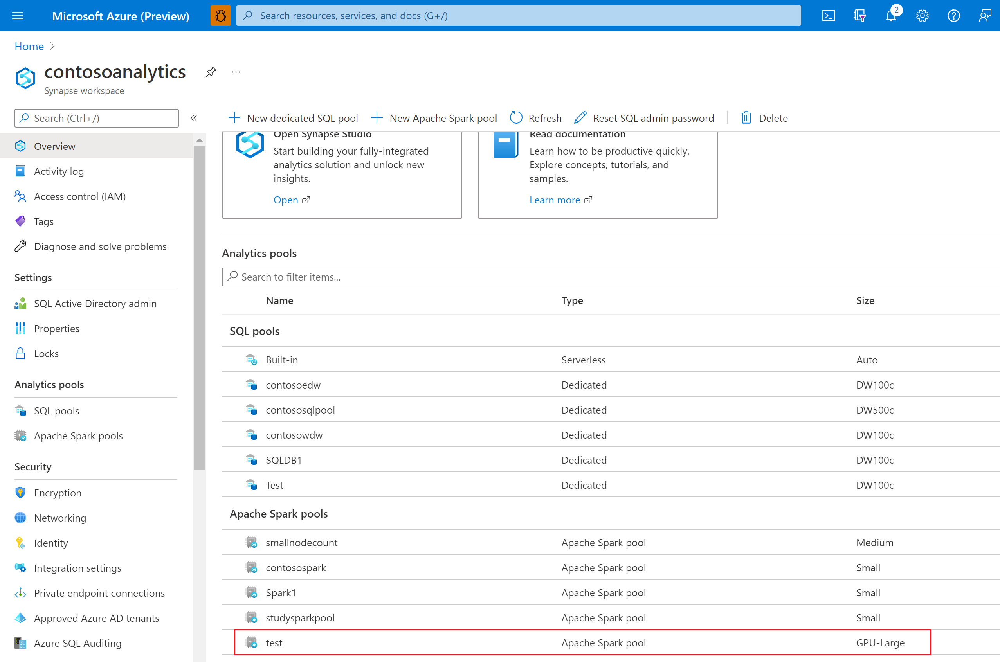

# Démarrage rapide : Créer un pool compatible GPU Apache Spark dans Azure Synapse Analytics avec le portail Azure

Un pool Apache Spark fournit des fonctionnalités de calcul de Big Data open source, où les données peuvent être chargées, modélisées, traitées et distribuées pour obtenir un insight analytique plus rapide. Synapse offre maintenant la possibilité de créer des pools Apache Spark qui utilisent des GPU sur le back-end afin d’exécuter vos charges de travail Spark sur des GPU pour un traitement accéléré.

Dans ce guide de démarrage rapide, vous allez apprendre à utiliser le portail Azure pour créer un pool compatible GPU Apache Spark dans un espace de travail Azure Synapse Analytics.

> [!NOTE]
> Les pools compatibles GPU Azure Synapse sont actuellement en préversion publique.

Si vous n’avez pas d’abonnement Azure, [créez un compte gratuit avant de commencer](https://azure.microsoft.com/free/).

## Prérequis

- Abonnement Azure : [créez-en un gratuitement](https://azure.microsoft.com/free/)
- [Espace de travail Synapse Analytics](quickstart-create-workspace.md)

## Connectez-vous au portail Azure.

Connectez-vous au [portail Azure](https://portal.azure.com/)

## Accéder à l’espace de travail Synapse 
1. Accédez à l’espace de travail Synapse dans lequel vous allez créer le pool Apache Spark en saisissant le nom du service (ou directement le nom de la ressource) dans la barre de recherche.

2. Dans la liste des espaces de travail, saisissez le nom (ou une partie du nom) de l’espace de travail à ouvrir. Pour cet exemple, nous allons utiliser un espace de travail nommé **contosoanalytics**.

## Créer un pool compatible GPU Azure Synapse

1. Dans l’espace de travail Synapse où vous souhaitez créer le pool Apache Spark, sélectionnez **Nouveau pool Apache Spark**.
    
2. Sous l’onglet **Général**, entrez les informations suivantes :

    |Paramètre | Valeur suggérée | Description |
    | :------ | :-------------- | :---------- |
    | **Nom du pool Apache Spark** | Nom de pool valide | Il s’agit du nom du pool Apache Spark. |
    | **Famille de tailles de nœud** | Accélération matérielle | Choisissez Accélération matérielle dans le menu déroulant |
    | **Taille du nœud** | Grand (16 processeurs virtuels/110 Go/1 GPU) | Définissez ce paramètre sur la plus petite taille pour réduire les coûts de ce guide de démarrage rapide. |
    | **Autoscale** | Désactivé | Ce démarrage rapide ne nécessite pas de mise à l’échelle automatique |
    | **Nombre de nœuds** | 3 | Utilisez une petite taille pour limiter les coûts de ce démarrage rapide |

    
    > [!IMPORTANT]
    > Notez que les noms que vous pouvez attribuer aux pools Apache Spark sont soumis à des limitations spécifiques. Les noms doivent contenir uniquement des lettres ou des chiffres, ne doivent pas comporter plus de 15 caractères, doivent commencer par une lettre, ne pas contenir de mots réservés et être uniques dans l’espace de travail.

3. Sélectionnez **Suivant : Paramètres supplémentaires** et passez en revue les paramètres par défaut. Ne modifiez pas les paramètres par défaut. Notez que les pools compatibles GPU peuvent **être créés avec Apache Spark 3.1 uniquement**.
    

4. Sélectionnez **Suivant : étiquettes**. N’ajoutez aucune étiquette.

    

5. Sélectionnez **Revoir + créer**.

6. Vérifiez que les informations reflètent bien ce que vous avez entré, puis sélectionnez **Créer**.
    

7. À ce stade, le flux de provisionnement des ressources démarre et vous avertit quand l’opération est terminée.
    

8. Une fois le provisionnement terminé, une nouvelle entrée apparaît pour le pool compatible GPU Azure Synapse qui vient d’être créé quand vous revenez à l’espace de travail.
    

9. À ce stade, aucune ressource n’est en cours d’exécution, rien n’est facturé pour Spark ; vous avez créé les métadonnées sur les instances Spark que vous souhaitez créer.

## Nettoyer les ressources

Effectuez les étapes ci-dessous pour supprimer le pool Apache Spark de l’espace de travail.
> [!WARNING]
> La suppression d’un pool Apache Spark supprime le moteur d’analytique de l’espace de travail. Il n’est plus possible de se connecter au pool, et l’ensemble des requêtes, pipelines et notebooks qui utilisent ce pool Apache Spark ne fonctionnent plus.

Si vous souhaitez supprimer le pool Apache Spark, procédez comme suit :

1. Accédez au panneau des pools Apache Spark dans l’espace de travail.
2. Sélectionnez le pool Apache Spark à supprimer (dans ce cas, **contosospark**).
3. Appuyez sur la touche **Supprimer**.

 

4. Confirmez la suppression, puis appuyez sur le bouton **Supprimer**.

 

5. Une fois le processus terminé, le pool Apache Spark ne figure plus dans la liste des ressources de l’espace de travail.

## Étapes suivantes

- Consultez [Démarrage rapide : Créer un notebook Apache Spark à exécuter sur un pool GPU](spark/apache-spark-rapids-gpu.md).
