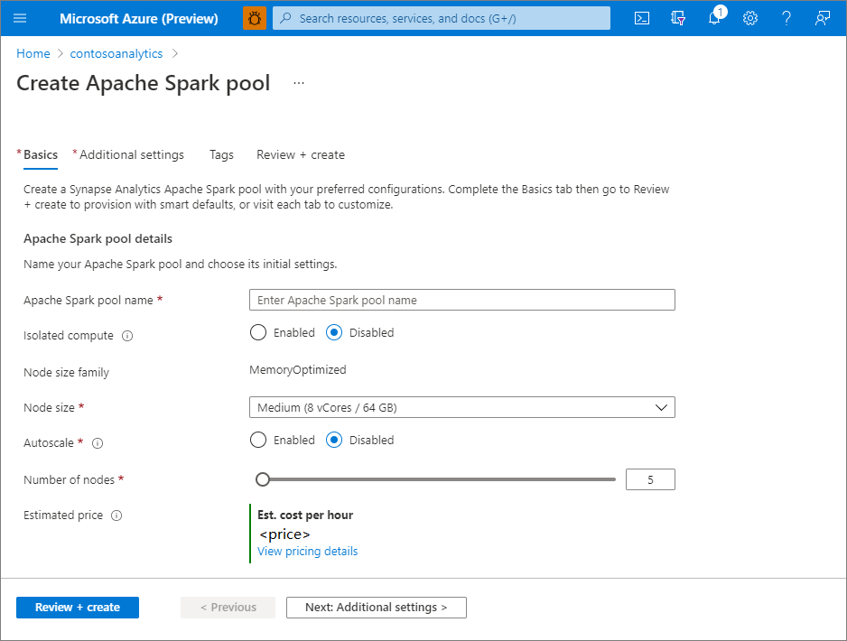
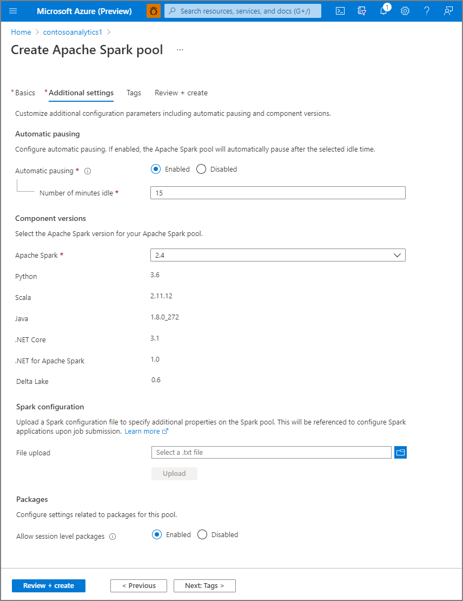
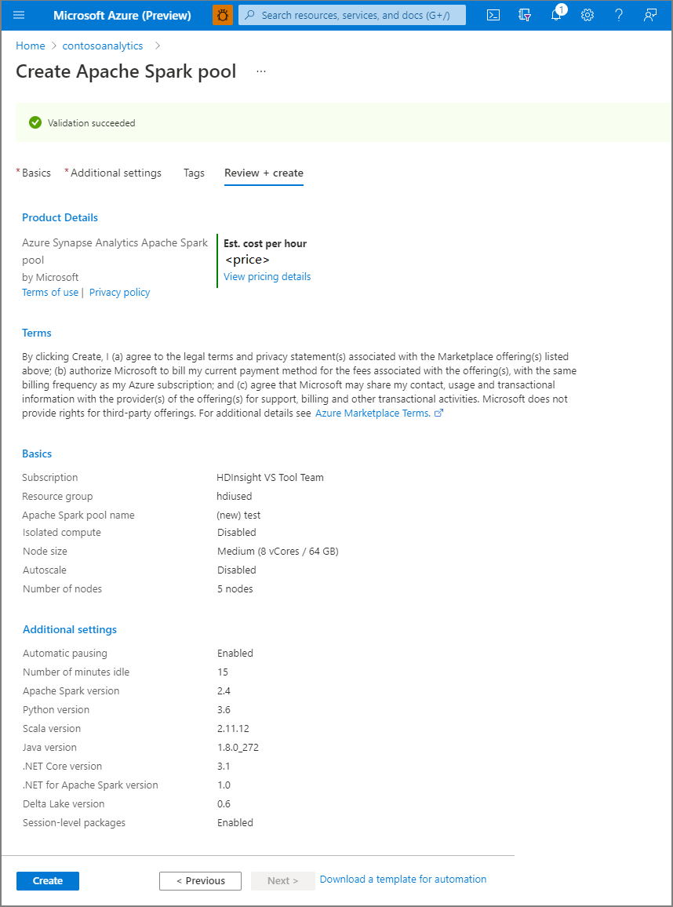

# Démarrage rapide : Créer un pool Apache Spark serverless avec le portail Azure

Azure Synapse Analytics propose différents moteurs d’analytique pour vous aider à ingérer, transformer, modéliser, analyser et distribuer vos données. Un pool Apache Spark fournit des fonctionnalités de calcul Big Data open source. Après avoir créé un pool Apache Spark dans votre espace de travail Synapse, vous pouvez charger, modéliser, traiter et distribuer les données pour obtenir plus rapidement des insights.

Dans ce guide de démarrage rapide, vous allez apprendre à utiliser le portail Azure pour créer un pool Apache Spark dans un espace de travail Synapse.

> [!IMPORTANT]
> La facturation des instances Spark est calculée au prorata des minutes écoulées, que vous les utilisiez ou non. Veillez à arrêter votre instance Spark une fois que vous avez fini de l’utiliser, ou définissez un délai d’expiration court. Pour plus d’informations, consultez la section **Nettoyer les ressources** de cet article.

Si vous n’avez pas d’abonnement Azure, [créez un compte gratuit avant de commencer](https://azure.microsoft.com/free/).

## Prérequis

- Abonnement Azure : [créez-en un gratuitement](https://azure.microsoft.com/free/)
- [Espace de travail Synapse Analytics](quickstart-create-workspace.md)

## Connectez-vous au portail Azure.

Connectez-vous au [portail Azure](https://portal.azure.com/)

## Accéder à l’espace de travail Synapse 
1. Accédez à l’espace de travail Synapse dans lequel vous allez créer le pool Apache Spark en saisissant le nom du service (ou directement le nom de la ressource) dans la barre de recherche.

    

2. Dans la liste des espaces de travail, saisissez le nom (ou une partie du nom) de l’espace de travail à ouvrir. Pour cet exemple, nous allons utiliser un espace de travail nommé **contosoanalytics**.
    

## Créer un pool Apache Spark

1. Dans l’espace de travail Synapse où vous souhaitez créer le pool Apache Spark, sélectionnez **Nouveau pool Apache Spark**.
    
2. Sous l’onglet **Général**, entrez les informations suivantes :

    |Paramètre | Valeur suggérée | Description |
    | :------ | :-------------- | :---------- |
    | **Nom du pool Apache Spark** | Nom de pool valide | Il s’agit du nom du pool Apache Spark. |
    | **Taille du nœud** | Petite (4 processeurs virtuels/32 Go) | Définissez ce paramètre sur la plus petite taille pour réduire les coûts de ce guide de démarrage rapide. |
    | **Autoscale** | Désactivé | Ce démarrage rapide ne nécessite pas de mise à l’échelle automatique |
    | **Nombre de nœuds** | 5 | Utilisez une petite taille pour limiter les coûts de ce démarrage rapide |

    

    > [!IMPORTANT]
    > Notez que les noms que vous pouvez attribuer aux pools Apache Spark sont soumis à des limitations spécifiques. Les noms doivent contenir uniquement des lettres ou des chiffres, ne doivent pas comporter plus de 15 caractères, doivent commencer par une lettre, ne pas contenir de mots réservés et être uniques dans l’espace de travail.

3. Sélectionnez **Suivant : Paramètres supplémentaires** et passez en revue les paramètres par défaut. Ne modifiez pas les paramètres par défaut.
    

4. Sélectionnez **Suivant : étiquettes**. N’ajoutez aucune étiquette.
    

5. Sélectionnez **Revoir + créer**.

6. Vérifiez que les informations reflètent bien ce que vous avez entré, puis sélectionnez **Créer**.
    

7. À ce stade, le flux de provisionnement des ressources démarre et vous avertit quand l’opération est terminée.
    

8. Une fois le provisionnement terminé, une nouvelle entrée apparaît pour le pool Apache Spark créé quand vous revenez à l’espace de travail.
    

9. À ce stade, aucune ressource n’est en cours d’exécution, rien n’est facturé pour Spark ; vous avez créé les métadonnées sur les instances Spark que vous souhaitez créer.

## Nettoyer les ressources

Effectuez les étapes ci-dessous pour supprimer le pool Apache Spark de l’espace de travail.
> [!WARNING]
> La suppression d’un pool Apache Spark supprime le moteur d’analytique de l’espace de travail. Il n’est plus possible de se connecter au pool, et l’ensemble des requêtes, pipelines et notebooks qui utilisent ce pool Apache Spark ne fonctionnent plus.

Si vous souhaitez supprimer le pool Apache Spark, procédez comme suit :

1. Accédez au panneau des pools Apache Spark dans l’espace de travail.
2. Sélectionnez le pool Apache Spark à supprimer (dans ce cas, **contosospark**).
3. Appuyez sur la touche **Supprimer**.
 
4. Confirmez la suppression, puis appuyez sur le bouton **Supprimer**.
 
5. Une fois le processus terminé, le pool Apache Spark ne figure plus dans la liste des ressources de l’espace de travail.

## Étapes suivantes

- Consultez [Démarrage rapide : Créer un notebook Apache Spark](quickstart-apache-spark-notebook.md).
- Consultez [Démarrage rapide : Créer un pool SQL dédié à l’aide du portail Azure](quickstart-create-sql-pool-portal.md).
