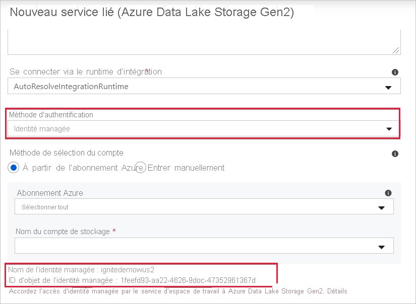

# Identité managée de l’espace de travail Azure Synapse

Dans cet article, vous allez découvrir ce qu’est une identité managée dans l’espace de travail Azure Synapse.

## Identités managées

L’identité managée pour ressources Azure est une fonctionnalité Azure Active Directory. Elle fournit aux services Azure une identité système administrée automatiquement dans Azure AD. Vous pouvez utiliser la fonctionnalité d’identité managée pour vous authentifier auprès de tout service prenant en charge l’authentification Azure AD.

Identités managées pour les ressources Azure est le nouveau nom du service anciennement nommé Managed Service Identity (MSI). Pour plus d’informations, consultez [Identités managées](../../active-directory/managed-identities-azure-resources/overview.md).

## Identité managée de l’espace de travail Azure Synapse

Une identité managée affectée par le système est créée pour votre espace de travail Azure Synapse quand vous créez l’espace de travail.

>[!NOTE]
>Cette identité managée de l’espace de travail sera appelée « identité managée » dans le reste de ce document.

Azure Synapse utilise l’identité managée pour intégrer les pipelines. Le cycle de vie de l’identité managée est directement lié à l’espace de travail Azure Synapse. Si vous supprimez l’espace de travail Azure Synapse, l’identité managée est également nettoyée.

L’identité managée de l’espace de travail a besoin d’autorisations pour effectuer des opérations dans les pipelines. Vous pouvez utiliser l’ID d’objet ou le nom de votre espace de travail Azure Synapse pour rechercher l’identité managée lors de l’octroi d’autorisations.

## Récupérer l’identité managée dans le portail Azure

Vous pouvez récupérer l’identité managée dans le portail Azure. Ouvrez votre espace de travail Azure Synapse dans le portail Azure et sélectionnez **Vue d’ensemble** dans le volet de navigation gauche. L’ID d’objet de l’identité managée s’affiche dans l’écran principal.

Les informations d’identité managées s’affichent également quand vous créez un service lié qui prend en charge l’authentification de l’identité managée à partir d’Azure Synapse Studio.

Lancez **Azure Synapse Studio** et sélectionnez l’onglet **Gérer** dans le volet de navigation gauche. Sélectionnez ensuite **Services liés** et choisissez l’option **+ Nouveau** pour créer un service lié.

Dans la fenêtre **Nouveau service lié**, tapez *Azure Data Lake Storage Gen2*. Sélectionnez le type de ressource **Azure Data Lake Storage Gen2** dans la liste ci-dessous, puis choisissez **Continuer**.

Dans la fenêtre suivante, choisissez **Identité managée** comme **Méthode d’authentification**. Vous verrez le **Nom** et l’**ID d’objet** de l’identité managée.

## Étapes suivantes

En savoir plus sur l’[Octroi d’autorisations à l’identité managée de l’espace de travail Azure Synapse](./how-to-grant-workspace-managed-identity-permissions.md)
