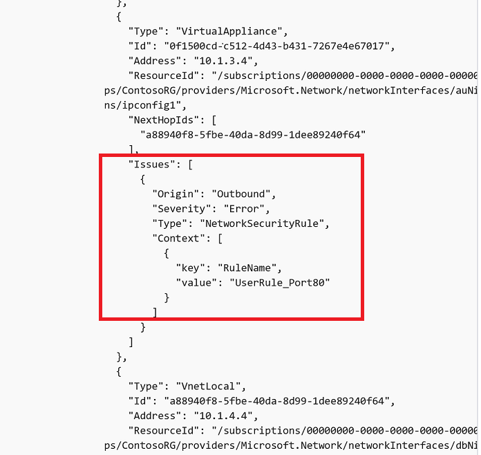
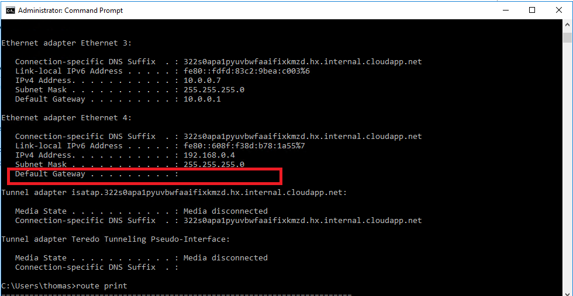
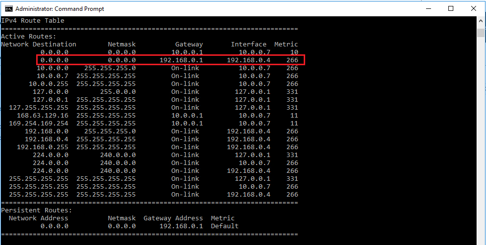

# <a name="troubleshoot-azure-vm-connectivity-problems"></a>Résoudre les problèmes de connectivité des machines virtuelles Azure

Cet article aide les administrateurs à diagnostiquer et résoudre les problèmes de connectivité qui affectent les machines virtuelles Azure.

## <a name="problems"></a>Problèmes

- [Une machine virtuelle Azure déployée à l’aide de Resource Manager ne peut pas se connecter à une autre machine virtuelle Azure dans le même réseau virtuel](#azure-vm-cannot-connect-to-another-azure-vm-in-same-virtual-network).
- [Une machine virtuelle Azure ne peut pas se connecter à la deuxième carte réseau d’une machine virtuelle Azure dans le même réseau virtuel](#azure-vm-cannot-connect-to-the-second-network-adapter-of-an-azure-vm-in-same-virtual-network).
- [Une machine virtuelle Azure ne peut pas se connecter à Internet](#azure-vm-cannot-connect-to-the-internet).

Pour résoudre ces problèmes, effectuez les étapes de la section suivante.

## <a name="resolution"></a>Résolution

### <a name="azure-vm-cannot-connect-to-another-azure-vm-in-same-virtual-network"></a>Une machine virtuelle Azure ne peut pas se connecter à une autre machine virtuelle Azure dans le même réseau virtuel

#### <a name="step-1-verify-that-vms-can-communicate-with-each-other"></a>Étape 1 : Vérifiez que les machines virtuelles peuvent communiquer entre elles.

1. Téléchargez TCping sur votre machine virtuelle source.
2. Ouvrez une fenêtre d’invite de commandes.
3. Accédez au dossier dans lequel vous avez téléchargé TCping.
4. Envoyez une commande ping à la destination à partir de la machine virtuelle source en utilisant la commande suivante :

    

    ```cmd
    tcping64.exe -t <destination VM address> 3389
    ```

> [!TIP]
> Si le test ping réussit, passez à l’étape 3. Sinon, passez à l'étape suivante.

#### <a name="step-2-check-the-network-security-group-settings"></a>Étape 2 : Vérifiez les paramètres du groupe de sécurité réseau.

Pour chaque machine virtuelle, vérifiez les règles de port entrant par défaut (« Autoriser le trafic entrant du réseau virtuel » et « Autoriser le trafic entrant de l’équilibreur de charge »). Veillez également à vérifier qu’il n’existe aucune règle bloquante correspondante répertoriée sous une règle de priorité inférieure.

> [!NOTE]
> Les règles qui ont un nombre inférieur sont mises en correspondance d’abord. Par exemple, si vous avez des règles qui ont les priorités 1000 et 6500, la règle qui a la priorité 1000 sera mise en correspondance en premier.

Ensuite, essayez d’effectuer un test ping sur la destination à partir de la machine virtuelle source :

```cmd
tcping64.exe -t <destination VM address> 3389
```

#### <a name="step-3-check-whether-you-can-connect-to-the-destination-vm-by-using-remote-desktop-or-ssh"></a>Étape 3 : Vérifiez si vous pouvez vous connecter à la machine virtuelle de destination à l’aide de Bureau à distance ou SSH.

Pour vous connecter à l’aide de Bureau à distance, procédez comme suit.

**Windows** :

1. Connectez-vous au portail Azure.
2. Dans le menu de gauche, sélectionnez **Machines virtuelles**.
3. Sélectionnez la machine virtuelle dans la liste.
4. Dans la page de la machine virtuelle, sélectionnez **Connecter**.

Pour plus d’informations, consultez [Connexion à une machine virtuelle Azure exécutant Windows](../virtual-machines/windows/connect-logon.md).

**Linux** :

Pour plus d’informations, consultez [Connexion à une machine virtuelle Linux dans Azure](../virtual-machines/linux/quick-create-portal.md).

Si la connexion Bureau à distance ou SSH réussit, passez à l’étape suivante.

#### <a name="step-4-perform-a-connectivity-check"></a>Étape 4 : Effectuez une vérification de la connectivité.

Exécutez une vérification de la connectivité sur la machine virtuelle source, puis vérifiez la réponse.

**Windows** : [Vérifier la connectivité avec Azure Network Watcher à l’aide de PowerShell](../network-watcher/network-watcher-connectivity-powershell.md)

**Linux** : [Vérifier la connectivité avec Azure Network Watcher à l’aide d’Azure CLI 2.0](../network-watcher/network-watcher-connectivity-cli.md)

Voici un exemple de réponse :

```
ConnectionStatus : Unreachable
AvgLatencyInMs   :
MinLatencyInMs   :
MaxLatencyInMs   :
ProbesSent       : 100
ProbesFailed     : 100
Hops             : [
                     {
                       "Type": "Source",
                       "Id": "c5222ea0-3213-4f85-a642-cee63217c2f3",
                       "Address": "10.1.1.4",
                       "ResourceId": "/subscriptions/00000000-0000-0000-0000-000000000000/resourceGrou
                   ps/ContosoRG/providers/Microsoft.Network/networkInterfaces/appNic0/ipConfigurat
                   ions/ipconfig1",
                       "NextHopIds": [
                         "9283a9f0-cc5e-4239-8f5e-ae0f3c19fbaa"
                       ],
                       "Issues": []
                     },
                     {
                       "Type": "VirtualAppliance",
                       "Id": "9283a9f0-cc5e-4239-8f5e-ae0f3c19fbaa",
                       "Address": "10.1.2.4",
                       "ResourceId": "/subscriptions/00000000-0000-0000-0000-000000000000/resourceGrou
                   ps/ContosoRG/providers/Microsoft.Network/networkInterfaces/fwNic/ipConfiguratio
                   ns/ipconfig1",
                       "NextHopIds": [
                         "0f1500cd-c512-4d43-b431-7267e4e67017"
                       ],
                       "Issues": []
                     },
```

#### <a name="step-5-fix-the-issue-in-the-connectivity-check-result"></a>Étape 5 : Corrigez le problème dans le résultat de la vérification de la connectivité.

1. Dans la section **Tronçons** de la réponse de vérification de la connectivité que vous avez reçue, vérifiez les **problèmes** indiqués.

    

2. Recherchez la résolution correspondante dans le tableau suivant et suivez les étapes indiquées pour résoudre les problèmes.

    |Type de problème  |Valeur  |Action de résolution |
    |---------|---------|---------|
    |NetworkSecurityRule|Nom du groupe de sécurité réseau bloquant|Vous pouvez [Supprimer la règle de groupe de sécurité réseau](./manage-network-security-group.md#delete-a-security-rule) ou modifier la règle comme décrit [ici](./manage-network-security-group.md#change-a-security-rule).|
    |UserDefinedRoute     |   Nom de l’itinéraire défini par l’utilisateur bloquant      | Si vous n’en avez pas besoin, supprimez l’itinéraire défini par l’utilisateur. Si vous ne pouvez pas supprimer l’itinéraire, mettez-le à jour à l’aide du préfixe d’adresse approprié et du tronçon suivant. Vous pouvez également ajuster l’appliance virtuelle réseau pour transférer le trafic de manière appropriée. Pour plus d’informations, consultez : [Routage du trafic de réseau virtuel](./virtual-networks-udr-overview.md) et [Acheminer le trafic réseau avec une table de routage à l’aide de PowerShell](./tutorial-create-route-table-powershell.md).|
    |UC    |    Usage     |     Suivez ces recommandations qui décrivent la [Résolution de problèmes de performances génériques pour une machine virtuelle Azure exécutant Linux ou Windows](https://support.microsoft.com/en-in/help/3150851/generic-performance-troubleshooting-for-azure-virtual-machine-running).|
    |Mémoire    |      Usage   |    Suivez les recommandations décrites dans [Résolution de problèmes de performances génériques pour une machine virtuelle Azure exécutant Linux ou Windows](https://support.microsoft.com/en-in/help/3150851/generic-performance-troubleshooting-for-azure-virtual-machine-running).|
    |Pare-feu invité    |      Nom du pare-feu bloquant   |      Procédez comme suit : [Activer ou désactiver le pare-feu Windows Defender](https://support.microsoft.com/help/4028544/windows-turn-windows-firewall-on-or-off).|
    |Résolution DNS     |    Nom du DNS     |    Procédez comme suit : [Guide de résolution des problèmes d’Azure DNS](../dns/dns-troubleshoot.md) et [Résolution de noms des ressources dans les réseaux virtuels Azure](./virtual-networks-name-resolution-for-vms-and-role-instances.md).     |
    |Erreur de socket    |      Non applicable   |     Le port spécifié est déjà utilisé par une autre application. Essayez d’utiliser un autre port.    |

3. Réexécutez la vérification de la connectivité pour déterminer si le problème est résolu.

### <a name="azure-vm-cannot-connect-to-the-second-network-adapter-of-an-azure-vm-in-same-virtual-network"></a>La machine virtuelle Azure ne peut pas se connecter à la deuxième carte réseau d’une machine virtuelle Azure dans le même réseau virtuel

#### <a name="step-1-make-sure-that-the-second-network-adapter-is-enabled-to-talk-outside-the-subnet"></a>Étape 1 : Assurez-vous que la deuxième carte réseau est autorisée à communiquer à l’extérieur du sous-réseau.

Par défaut, les cartes réseau secondaires (également appelées cartes d’interface réseau ou cartes réseau) ne sont pas configurées pour avoir une passerelle par défaut. Par conséquent, le flux de trafic sur la carte secondaire sera limité au même sous-réseau.



Si les utilisateurs souhaitent autoriser les cartes réseau secondaires à communiquer en dehors de leur propre sous-réseau, ils doivent ajouter une entrée à la table de routage pour configurer la passerelle. Pour cela, procédez comme suit :

1. Sur la machine virtuelle sur laquelle la deuxième carte réseau est configurée, ouvrez une fenêtre d’invite de commandes en tant qu’administrateur.
2. Exécutez la commande suivante pour ajouter l’entrée dans la table de routage :

    ```cmd
    Route add 0.0.0.0 mask 0.0.0.0 -p <Gateway IP>
    ```

    Par exemple, si la deuxième adresse IP est 192.168.0.4, l’adresse IP de la passerelle doit être 192.168.0.1. Vous devez exécuter la commande suivante :

    ```cmd
    Route add 0.0.0.0 mask 0.0.0.0 -p 192.168.0.1
    ```

3. Exécutez Route Print. Si l’entrée est correctement ajoutée, une entrée semblable à la suivante s’affiche :

    

À présent, essayez de vous connecter à la carte réseau secondaire. Si la connexion échoue, passez à l’étape suivante.

#### <a name="step-2-check-nsg-settings-for-the-network-adapters"></a>Étape 2 : Vérifiez les paramètres du groupe de sécurité réseau pour les cartes réseau.

Pour les cartes réseau principale et secondaire, vérifiez les règles de port entrant par défaut (autoriser le trafic entrant du réseau virtuel, autoriser l’équilibreur de charge) pour qu’ils acceptent le trafic entrant sur les deux cartes réseau. Vous devez également vous assurer qu’il n’existe pas de règles bloquantes correspondantes avec une priorité inférieure.


#### <a name="step-3-run-a-connectivity-check-to-the-secondary-network-adapter"></a>Étape 3 : Exécutez une vérification de la connectivité à la carte réseau secondaire.

1. Exécutez une vérification de la connectivité à la carte réseau secondaire.
2. Exécutez une vérification de la connectivité dans l’environnement pour vous assurer que le processus fonctionne de bout en bout.

Pour plus d’informations sur l’exécution de la vérification de la connectivité, consultez les articles suivants :

**Windows** : [Vérifier la connectivité avec Azure Network Watcher à l’aide de PowerShell](../network-watcher/network-watcher-connectivity-powershell.md)

**Linux** : [Vérifier la connectivité avec Azure Network Watcher à l’aide d’Azure CLI 2.0](../network-watcher/network-watcher-connectivity-cli.md).

Voici un exemple de réponse :

```
ConnectionStatus : Unreachable
AvgLatencyInMs   : 
MinLatencyInMs   : 
MaxLatencyInMs   : 
ProbesSent       : 100
ProbesFailed     : 100
Hops             : [
                     {
                       "Type": "Source",
                       "Id": "c5222ea0-3213-4f85-a642-cee63217c2f3",
                       "Address": "10.1.1.4",
                       "ResourceId": "/subscriptions/00000000-0000-0000-0000-000000000000/resourceGrou
                   ps/ContosoRG/providers/Microsoft.Network/networkInterfaces/appNic0/ipConfigurat
                   ions/ipconfig1",
                       "NextHopIds": [
                         "9283a9f0-cc5e-4239-8f5e-ae0f3c19fbaa"
                       ],
                       "Issues": []
                     },
                     {
                       "Type": "VirtualAppliance",
                       "Id": "9283a9f0-cc5e-4239-8f5e-ae0f3c19fbaa",
                       "Address": "10.1.2.4",
                       "ResourceId": "/subscriptions/00000000-0000-0000-0000-000000000000/resourceGrou
                   ps/ContosoRG/providers/Microsoft.Network/networkInterfaces/fwNic/ipConfiguratio
                   ns/ipconfig1",
                       "NextHopIds": [
                         "0f1500cd-c512-4d43-b431-7267e4e67017"
                       ],
                       "Issues": []
                     },
```

#### <a name="step-4-refer-the-table-under-step-5-and-follow-these-steps-to-resolve-the-issues"></a>Étape 4 : Reportez-vous au tableau de l’[étape 5](#step-5-fix-the-issue-in-the-connectivity-check-result) et suivez ces étapes pour résoudre les problèmes.

### <a name="azure-vm-cannot-connect-to-the-internet"></a>La machine virtuelle Azure ne peut pas se connecter à Internet

#### <a name="step-1-check-whether-the-network-adapter-is-in-a-failed-state"></a>Étape 1 : Vérifiez si la carte réseau est dans un état d’échec.

Pour vérifier l’état de la carte réseau, procédez comme suit :

1. Connectez-vous au portail Explorateur de ressources.
2. Sélectionnez **Abonnements** dans le volet gauche.
3. Dans le volet gauche, sélectionnez le groupe de ressources auquel la carte réseau ou la machine virtuelle en question appartient.
4. Accédez à **Réseau Microsoft**.
5. Sélectionnez l’option **Interfaces réseau**.
6. Sélectionnez l’interface réseau affectée.
7. Sélectionnez l’option **Lecture/écriture** en haut du portail.
8. Sélectionnez l’option **Modifier**.

    

    > [!NOTE]
    > Une fois que vous avez sélectionné l’option **Modifier**, l’option « Get » devient une option **Put**.

    

9. Sélectionnez l’interface réseau affectée, puis sélectionnez l’option **Put**.

    > [!NOTE]
    > Une fois cette sélection effectuée, **ProvisioningState** s’affiche en tant que **Mise à jour**. Le même résultat s’affiche sur le portail Azure Resource Manager standard. Si l’opération s’est terminée avec succès, la valeur de **ProvisioningState** devient **Réussi**, comme indiqué.
10. Actualisez votre portail. La carte réseau doit être dans un état de réussite.

#### <a name="step-2-follow-step-4-to-run-a-connectivity-check"></a>Étape 2 : Suivez l’[étape 4](#step-4-perform-a-connectivity-check) pour exécuter une vérification de la connectivité.

#### <a name="step-3-refer-the-table-under-step-5-and-follow-the-steps-to-resolve-the-issues"></a>Étape 3 : Reportez-vous au tableau de l’[étape 5](#step-5-fix-the-issue-in-the-connectivity-check-result) et suivez les étapes pour résoudre les problèmes.

## <a name="next-steps"></a>Étapes suivantes

[Résolution des problèmes de connectivité entre machines virtuelles Azure](./virtual-network-troubleshoot-connectivity-problem-between-vms.md)
