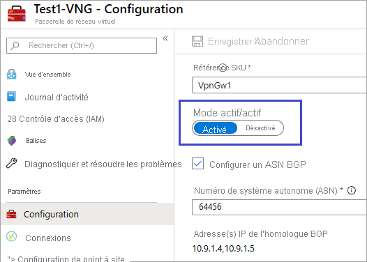
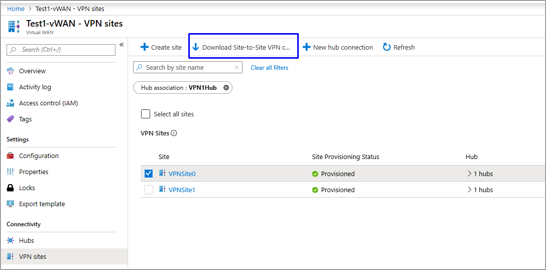
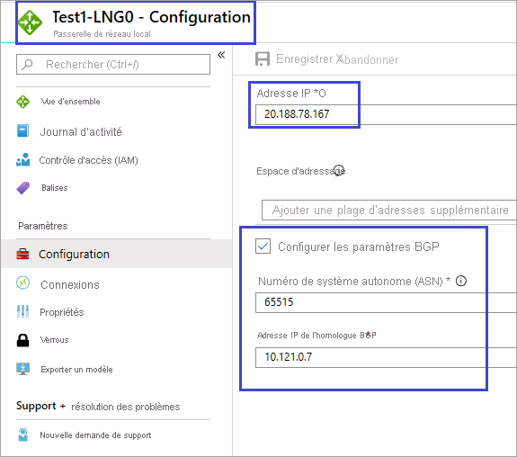

# Connecter une passerelle VPN (passerelle de réseau virtuel) à Virtual WAN

Cet article vous aide à configurer la connectivité depuis une passerelle VPN Azure (passerelle de réseau virtuel) à une passerelle VPN Azure Virtual WAN. La création d’une connexion à partir d’une passerelle VPN (passerelle de réseau virtuel) à un WAN virtuel (passerelle VPN) est similaire à la configuration de la connectivité à un réseau étendu virtuel à partir de sites VPN de branche.

Afin de minimiser la confusion possible entre deux fonctionnalités, nous allons faire précéder la passerelle du nom de la fonctionnalité à laquelle nous faisons référence. Par exemple, passerelle de réseau virtuel de passerelle VPN et passerelle VPN Virtual WAN.

## Avant de commencer

Avant de démarrer, créez les ressources suivantes :

WAN virtuel Azure

* [Créez un WAN virtuel](virtual-wan-site-to-site-portal.md#openvwan).
* [Créez un hub](virtual-wan-site-to-site-portal.md#hub). Le hub virtuel contient la passerelle VPN Virtual WAN.

Réseau virtuel Azure

* Créez un réseau virtuel sans aucune passerelle de réseau virtuel. Vérifiez qu’aucun des sous-réseaux de votre réseau local ne chevauche les réseaux virtuels auxquels vous souhaitez vous connecter. Pour créer un réseau virtuel dans le portail Azure, consultez le [guide de démarrage rapide](../virtual-network/quick-create-portal.md).

## 1. Créer une passerelle de réseau virtuel VPN

Créez une **passerelle de réseau virtuel VPN** pour votre réseau virtuel en mode actif/actif. Lorsque vous créez la passerelle, vous pouvez utiliser des adresses IP publiques existantes pour les deux instances de la passerelle ou vous pouvez créer de nouvelles adresses IP publiques. Vous utiliserez ces adresses IP publiques lors de la configuration des sites Virtual WAN. Pour plus d’informations sur les passerelles VPN en mode actif/actif et les étapes de configuration, consultez [Configuration de passerelles VPN en mode actif/actif](../vpn-gateway/vpn-gateway-activeactive-rm-powershell.md#aagateway).

### Configuration du mode actif/actif

Sur la page **Configuration** de la passerelle de réseau virtuel, activez le mode actif/actif.

### Paramètre BGP

Sur la page **Configuration** de la passerelle de réseau virtuel, vous pouvez (si vous le souhaitez) sélectionner **Configurer l’ASN BGP**. Si vous configurez le protocole BGP, remplacez la valeur par défaut de l’ASN indiquée dans le portail. Pour cette configuration, l’ASN BGP ne peut pas être 65515. 65515 sera utilisé par Azure Virtual WAN.

### Adresses IP publiques

Une fois la passerelle créée, accédez à la page **Propriétés**. Les propriétés et les paramètres de configuration sont similaires à l’exemple suivant. Notez les deux adresses IP publiques qui sont utilisées pour la passerelle.

## 2. Créer des sites VPN Virtual WAN

Pour créer des sites VPN Virtual WAN, accédez à votre réseau étendu virtuel et, sous **Connectivité**, sélectionnez **Sites VPN**. Dans cette section, vous allez créer deux sites VPN Virtual WAN qui correspondent aux passerelles de réseau virtuel que vous avez créées dans la section précédente.

1. Sélectionnez **+Créer un site**.
2. Sur la page **Créer des sites VPN**, entrez les valeurs suivantes :

   * **Région** : même région que la passerelle de réseau virtuel de la passerelle VPN Azure.
   * **Fournisseur de l’appareil** : entrez le fournisseur de l’appareil (n’importe quel nom).
   * **Espace d’adressage privé** : entrez une valeur ou laissez vide lorsque le protocole BGP est activé.
   * **Border Gateway Protocol** : définissez sur **Activer** si BGP est activé sur la passerelle de réseau virtuel de la passerelle VPN Azure.
   * **Se connecter aux hubs** : sélectionnez le hub que vous avez créé dans les conditions préalables de la liste déroulante. Si vous ne voyez aucun hub, vérifiez que vous avez créé une passerelle VPN site à site pour votre hub.
3. Sous **Liens**, entrez les valeurs suivantes :

   * **Nom du fournisseur** : entrez un nom de lien et un nom de fournisseur (n’importe quel nom).
   * **Vitesse** : vitesse (n’importe quel nombre).
   * **Adresse IP** : entrez l’adresse IP (identique à la première IP publique indiquée sous les propriétés de la passerelle de réseau virtuel [de la passerelle VPN]).
   * **Adresse BGP** et **ASN** : adresse BGP et ASN. Ces derniers doivent être identiques à l’une des adresses IP homologues BGP et à l’ASN de la passerelle de réseau virtuel de la passerelle VPN que vous avez configurée à l’[étape 1](#vnetgw).
4. Vérifiez et sélectionnez **Confirmer** pour créer le site.
5. Répétez les étapes précédentes pour créer le deuxième site correspondant à la deuxième instance de la passerelle de réseau virtuel de la passerelle VPN. Vous conservez les mêmes paramètres, à l’exception de la deuxième adresse IP publique et de la deuxième adresse IP homologue BGP de la configuration de la passerelle VPN.
6. Vous disposez maintenant de deux sites correctement configurés et pouvez passer à la section suivante pour télécharger les fichiers de configuration.

## 3. Télécharger les fichiers de configuration VPN

Dans cette section, vous téléchargez le fichier de configuration VPN pour chacun des sites que vous avez créés dans la section précédente.

1. En haut de la page des **sites VPN** de Virtual WAN, sélectionnez le **site**, puis sélectionnez **Télécharger la configuration du VPN de site à site**. Azure crée un fichier de configuration avec les paramètres.

   
2. Téléchargez et ouvrez le fichier de configuration.
3. Répétez ces étapes pour le second site. Une fois que les deux fichiers de configuration sont ouverts, vous pouvez passer à la section suivante.

## 4. Créer les passerelles de réseau local

Dans cette section, vous créez deux passerelles de réseau local de passerelle VPN Azure. Les fichiers de configuration de l’étape précédente contiennent les paramètres de configuration de la passerelle. Utilisez ces paramètres pour créer et configurer les passerelles de réseau local de la passerelle VPN Azure.

1. Créez la passerelle de réseau local en utilisant ces paramètres. Pour plus d’informations sur la création d’une passerelle de réseau local de passerelle VPN, consultez l’article sur la passerelle VPN [Créer une passerelle de réseau local](../vpn-gateway/tutorial-site-to-site-portal.md#LocalNetworkGateway).

   * **Adresse IP** : utilisez l’adresse IP Instance0 indiquée pour *gatewayconfiguration* à partir du fichier de configuration.
   * **BGP** : si la connexion est sur BGP, sélectionnez **Configurer les paramètres BGP** et entrez l’ASN « 65515 ». Entrez l’adresse IP homologue BGP Utilisez « Instance0 BgpPeeringAddresses » pour *gatewayconfiguration* à partir du fichier de configuration.
   * **Espace d’adressage** Si la connexion n’est pas sur BGP, vérifiez que la case à cocher **configurer les paramètres BGP** reste désactivée.  Entrez les espaces d’adressage que vous allez publier du côté de la passerelle de réseau virtuel. Vous pouvez ajouter plusieurs plages d’espaces d’adressage. Assurez-vous que les plages que vous spécifiez ici ne se chevauchent pas avec les plages d’autres réseaux auxquels vous souhaitez vous connecter. 
   * **Abonnement, Groupe de ressources et Emplacement** sont les mêmes que pour le hub Virtual WAN.
2. Vérifiez et créez la passerelle de réseau local. Votre passerelle de réseau local doit ressembler à cet exemple.

   
3. Répétez ces étapes pour créer une autre passerelle de réseau local, mais cette fois-ci, utilisez les valeurs « Instance1 » à la place des valeurs « Instance0 » du fichier de configuration.

   

## 5. Créer des connexions

Dans cette section, vous créez une connexion entre les passerelles de réseau local de la passerelle VPN et la passerelle de réseau virtuel. Pour connaître les étapes de création d’une connexion de passerelle VPN, consultez [Configurer une connexion](../vpn-gateway/tutorial-site-to-site-portal.md#CreateConnection).

1. Dans le portail, accédez à votre passerelle de réseau virtuel, puis cliquez sur **Connexions**. En haut du panneau Connexions, cliquez sur **+ Ajouter** pour ouvrir la page **Ajouter une connexion**.
2. Sur la page **Ajouter une connexion**, configurez les valeurs suivantes de votre connexion :

   * **Nom :** Nommez votre connexion.
   * **Type de connexion :** Sélectionnez **Site à site (IPsec)**
   * **Passerelle de réseau virtuel :** La valeur est fixe, car vous vous connectez à partir de cette passerelle.
   * **Passerelle de réseau local :** Cette connexion connectera la passerelle de réseau virtuel à la passerelle de réseau local. Choisissez l’une des passerelles de réseau local que vous avez créées précédemment.
   * **Clé partagée :** Créez une clé partagée.
   * **Protocole IKE :** Choisissez le protocole IKE.
3. Cliquez sur **OK** pour créer votre connexion.
4. Vous pouvez afficher la connexion dans la page **Connexions** de la passerelle de réseau virtuel.

   
5. Répétez la procédure précédente pour créer une seconde connexion. Pour la deuxième connexion, sélectionnez l’autre passerelle de réseau local que vous avez créée.
6. Si les connexions se font via BGP, une fois vos connexions créées, accédez à une connexion et sélectionnez **Configuration**. Dans la page **Configuration**, sélectionnez **Activé** pour **BGP**. Ensuite, cliquez sur **Enregistrer**. Répétez cette opération pour la deuxième connexion.

## 6. Tester les connexions

Vous pouvez tester la connectivité en créant deux machines virtuelles, l’une sur le côté de la passerelle de réseau virtuel de la passerelle VPN et l’autre dans un réseau virtuel pour le WAN virtuel, puis effectuez un test ping sur les deux machines virtuelles.

1. Créez une machine virtuelle dans le réseau virtuel (Test1-VNet) pour la passerelle VPN Azure (Test1-VNG). Ne créez pas la machine virtuelle dans le GatewaySubnet.
2. Créez un autre réseau virtuel pour la connexion au WAN virtuel. Créez une machine virtuelle dans un sous-réseau de ce réseau virtuel. Votre réseau virtuel ne contient pas de passerelle de réseau virtuel. Vous pouvez rapidement créer un réseau virtuel à l’aide des étapes PowerShell de l’article [Connexion de site à site](virtual-wan-site-to-site-portal.md#vnet). Veillez à modifier les valeurs avant d’exécuter les cmdlets.
3. Connectez le réseau virtuel au hub Virtual WAN. Sur la page de votre WAN virtuel, sélectionnez **Connexions de réseau virtuel**, puis **+Ajouter une connexion**. Dans la page **Ajouter une connexion**, renseignez les champs suivants :

    * **Nom de connexion** : nommez votre connexion.
    * **Hubs** : sélectionnez le hub que vous souhaitez associer à cette connexion.
    * **Abonnement** : vérifiez l’abonnement.
    * **Réseau virtuel** : sélectionnez le réseau virtuel que vous souhaitez connecter à ce hub. Le réseau virtuel ne peut pas avoir une passerelle de réseau virtuel déjà existante.
4. Cliquez sur **OK** pour créer la connexion de réseau virtuel.
5. La connectivité est maintenant définie entre les machines virtuelles. Vous devez être en mesure d’effectuer un test ping sur une machine virtuelle à partir de l’autre, sauf si des pare-feu ou d’autres stratégies bloquent la communication.

## Étapes suivantes

Pour connaître les étapes de configuration d’une stratégie IPsec personnalisée, consultez [Configurer une stratégie IPsec personnalisée pour Virtual WAN](virtual-wan-custom-ipsec-portal.md).
Pour en plus sur le réseau WAN virtuel, consultez [À propos du réseau WAN virtuel Azure](virtual-wan-about.md) et la [FAQ sur le réseau WAN virtuel Azure](virtual-wan-faq.md).