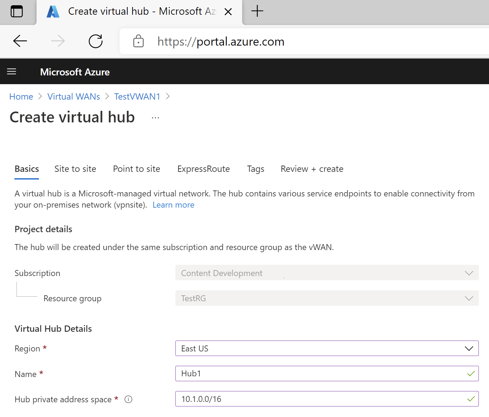

1. Localisez l’instance Virtual WAN que vous avez créée. Dans la page Virtual WAN, sous la section **Connectivité**, sélectionnez **Hubs**.
2. Dans la page **Hubs**, cliquez sur **+Nouveau hub** pour ouvrir la page **Créer un hub virtuel**.

    
3. Dans la page **Créer un hub virtuel**, sous l’onglet **Fonctions de base**, renseignez les champs suivants :

   * **Région** (précédemment appelée Emplacement)
   * **Nom**
   * **Espace d’adressage privé du hub** : pour créer un hub, l’espace d’adressage minimal est /24. Si vous utilisez un espace d’adressage compris entre /25 et /32, vous obtiendrez une erreur lors de la création. Vous n’avez pas besoin de planifier explicitement l’espace d’adressage du sous-réseau pour les services du hub virtuel. Étant donné que le service Azure Virtual WAN est un service managé, il crée les sous-réseaux appropriés dans le hub virtuel pour les divers services ou passerelles (par exemple, les passerelles VPN, les passerelles ExpressRoute, les passerelles VPN utilisateur/point à site, le pare-feu, le routage, etc.).
4. Sélectionnez **Suivant : Site à site**.

    

5. Sous l’onglet **Site à site**, complétez les champs suivants :

   * Sélectionnez **Oui** pour créer un VPN de site à site.
   * Le champ Numéro AS ne peut pas être modifié.
   * Dans la liste déroulante, sélectionnez la valeur **Unités d’échelle de la passerelle**. L’unité d’échelle vous permet de choisir le débit d’agrégats de la passerelle VPN en cours de création dans le hub virtuel auquel connecter les sites. Si vous choisissez 1 unité d’échelle de 500 Mbits/s, cela implique que deux instances sont créées pour la redondance, chacune d’un débit maximal de 500 Mbits/s. Par exemple, si vous avez cinq branches offrant chacune un débit de 10 Mbits/s, vous avez besoin d’un agrégat de 50 Mbits/s à l’extrémité de la tête. La planification de la capacité agrégée de la passerelle VPN Azure doit être effectuée après évaluation de la capacité nécessaire pour prendre en charge le nombre de branches conduisant au hub.
6. Sélectionnez **Vérifier + créer** pour valider.
7. Sélectionnez **Créer** pour créer le hub. Après 30 minutes, **actualisez** pour afficher le hub dans la page **Hubs**. Sélectionnez **Accéder à la ressource** pour accéder à ressource.
